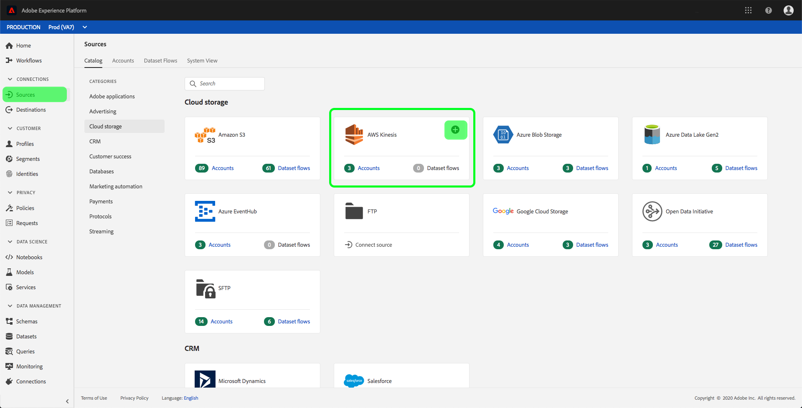
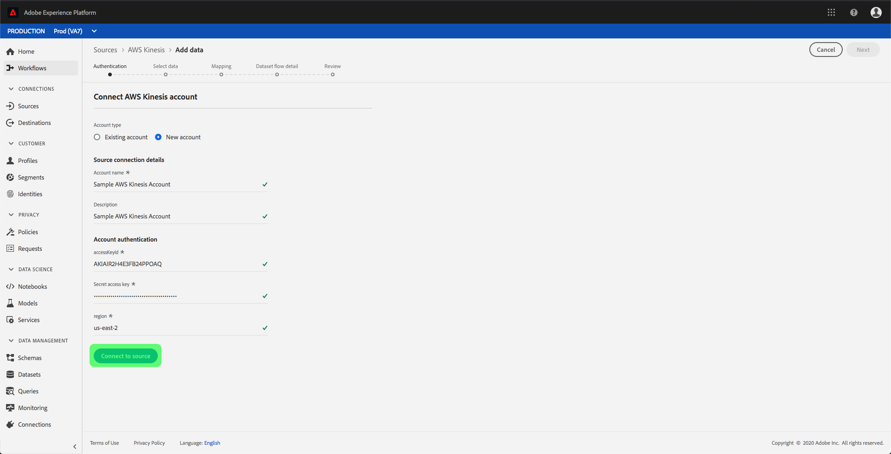
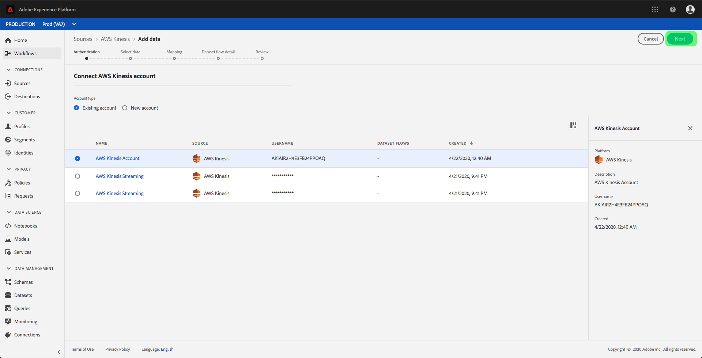

# Create an [!DNL Amazon Kinesis] source connection in the UI

>[!IMPORTANT]
>
>The [!DNL Amazon Kinesis] source is available in the sources catalog to users who have purchased Real-Time Customer Data Platform Ultimate.

Source connectors in Adobe Experience Platform provide the ability to ingest externally sourced data on a scheduled basis. This tutorial provides steps for authenticating an [!DNL Amazon Kinesis] (hereinafter referred to as [!DNL "Kinesis"]) source connector using the [!DNL Platform] user interface.

## Getting started

This tutorial requires a working understanding of the following components of Adobe Experience Platform:

-   [[!DNL Experience Data Model (XDM)] System](../../../../../xdm/home.md): The standardized framework by which [!DNL Experience Platform] organizes customer experience data.
    -   [Basics of schema composition](../../../../../xdm/schema/composition.md): Learn about the basic building blocks of XDM schemas, including key principles and best practices in schema composition.
    -   [Schema Editor tutorial](../../../../../xdm/tutorials/create-schema-ui.md): Learn how to create custom schemas using the Schema Editor UI.
-   [[!DNL Real-Time Customer Profile]](../../../../../profile/home.md): Provides a unified, real-time consumer profile based on aggregated data from multiple sources.

If you already have a valid [!DNL Kinesis] connection, you may skip the remainder of this document and proceed to the tutorial on [configuring a dataflow](../../dataflow/streaming/cloud-storage-streaming.md).

### Gather required credentials

In order to authenticate your [!DNL Kinesis] source connector, you must provide values for the following connection properties:

| Credential | Description |
| ---------- | ----------- |
| `accessKeyId` | The access key ID for your [!DNL Kinesis] account. |
| `Secret access key` | The secret access key for your [!DNL Kinesis] account. |
| `region` | The region of your AWS server. |

For more information about these values, refer to [this [!DNL Kinesis] document](https://docs.aws.amazon.com/streams/latest/dev/getting-started.html).

## Connect your [!DNL Kinesis] account

Once you have gathered your required credentials, you can follow the steps below to link your [!DNL Kinesis] account to [!DNL Platform].

Log in to [Adobe Experience Platform](https://platform.adobe.com) and then select **[!UICONTROL Sources]** from the left navigation bar to access the **[!UICONTROL Sources]** workspace. The **[!UICONTROL Catalog]** screen displays a variety of sources for which you can create an account with.

You can select the appropriate category from the catalog on the left-hand side of your screen. Alternatively, you can find the specific source you wish to work with using the search option.

Under the **[!UICONTROL Cloud Storage]** category, select **[!UICONTROL Amazon Kinesis]**. If this is your first time using this connector, select **[!UICONTROL Configure]**. Otherwise, select **[!UICONTROL Add data]** to create a new [!DNL Kinesis] connector.

The **[!UICONTROL Connect to Amazon Kinesis]** dialog appears. On this page, you can either use new credentials or existing credentials. 

### New account

If you are using new credentials, select **[!UICONTROL New Account]**. On the input form that appears, provide a name, an optional description, and your [!DNL Kinesis] credentials. When finished, select **[!UICONTROL Connect]** and then allow some time for the new connection to establish.

### Existing account

To connect an existing account, select the [!DNL Kinesis] account you want to connect with, then select **[!UICONTROL Next]** to proceed.

## Next steps

By following this tutorial, you have connected to your [!DNL Kinesis] account to [!DNL Platform]. You can now continue on to the next tutorial and [configure a dataflow to bring data from your cloud storage into [!DNL Platform]](../../dataflow/streaming/cloud-storage-streaming.md).
