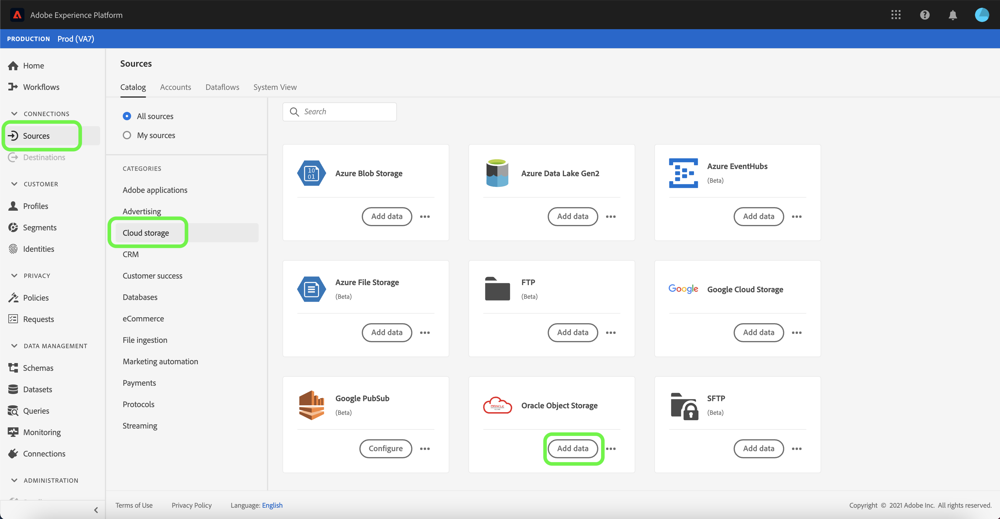
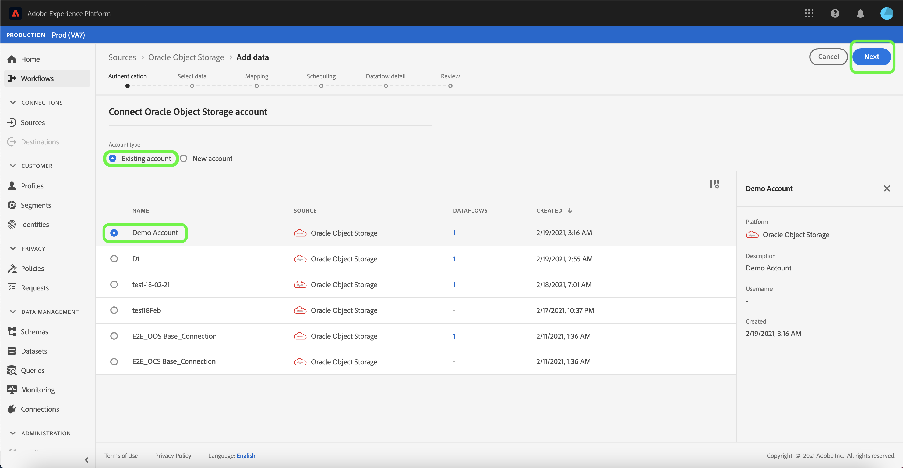
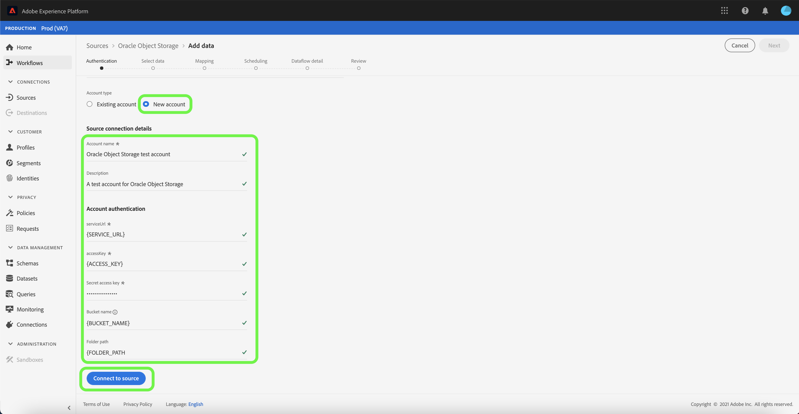

# Create an [!DNL Oracle Object Storage] Source Connection in the UI

This tutorial provides steps for creating an [!DNL Oracle Object Storage] source connection using the Adobe Experience Platform UI.

## Getting started

This tutorial requires a working understanding of the following components of Adobe Experience Platform:

* [Sources](../../../../home.md): Experience Platform allows data to be ingested from various sources while providing you with the ability to structure, label, and enhance incoming data using Platform services.
* [Sandboxes](../../../../../sandboxes/home.md): Experience Platform provides virtual sandboxes which partition a single Platform instance into separate virtual environments to help develop and evolve digital experience applications.

### Gather required credentials

In to connect to [!DNL Oracle Object Storage], you must provide values for the following connection properties:

| Credential | Description |
| ---------- | ----------- |
| `serviceUrl` | The [!DNL Oracle Object Storage] endpoint required for authentication. The endpoint format is: `https://{OBJECT_STORAGE_NAMESPACE}.compat.objectstorage.eu-frankfurt-1.oraclecloud.com` |
| `accessKey` | The [!DNL Oracle Object Storage] access key ID required for authentication. |
| `secretKey` | The [!DNL Oracle Object Storage] password required for authentication. |
| `bucketName` | The allowed bucket name required if the user has restricted access. The bucket name must be between three and 63 characters long, it must begin and end with either a letter or a number, and can only contain lowercase letters, numbers, or hyphens (`-`). The bucket name cannot be formatted like an IP address. |
| `folderPath` | The allowed folder path required if the user has restricted access. |

For more information on how to obtain these values, refer to the [Oracle Object Storage authentication guide](https://docs.oracle.com/en-us/iaas/Content/Identity/Concepts/usercredentials.htm#User_Credentials).

Once you have gathered your required credentials, you can follow the steps below to create a new Oracle Object Storage account to connect to Platform.

## Connect to Oracle Object Storage

In the Platform UI, select **[!UICONTROL Sources]** from the left navigation to access the [!UICONTROL Sources] workspace. The [!UICONTROL Catalog] screen displays a variety of sources that you can create an account with.

You can select the appropriate category from the catalog on the left-hand side of your screen. Alternatively, you can find the specific source you wish to work with using the search bar.

Under the [!UICONTROL Cloud storage] category, select **[!UICONTROL Oracle Object Storage]** and then select **[!UICONTROL Add data]**.

### Existing account

To use an existing account, select the [!DNL Oracle Object Storage] account you want to create a new dataflow with, then select **[!UICONTROL Next]** to proceed.

### New account

If you are creating a new account, select **[!UICONTROL New account]**, and then provide a name, an optional description, and your [!DNL Oracle Object Storage] credentials. When finished, select **[!UICONTROL Connect to source]** and then allow some time for the new connection to establish.

## Next steps

By following this tutorial, you have established a connection to your [!DNL Oracle Object Storage] account. You can now proceed to the next tutorial on [configuring a dataflow to bring data from your cloud storage into Platform](../../dataflow/batch/cloud-storage.md).
