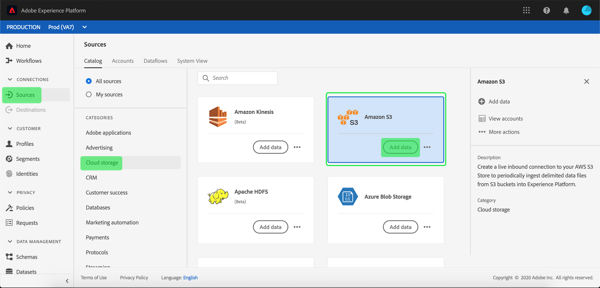
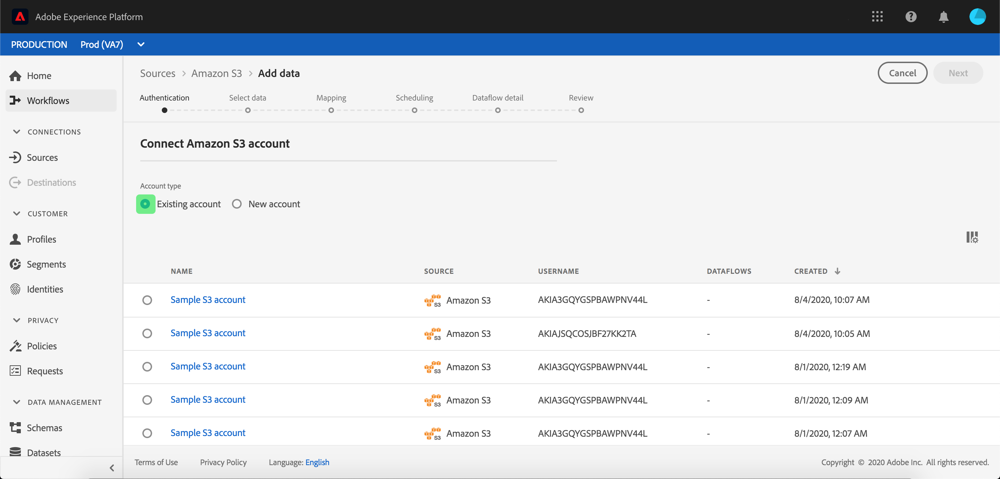

# Create a [!DNL Amazon S3] source connection in the UI

Source connectors in Adobe Experience Platform provide the ability to ingest externally sourced data on a scheduled basis. This tutorial provides steps for creating an [!DNL Amazon S3]  (hereinafter referred to as "[!DNL S3]") source connector using the Platform user interface.

## Getting started

This tutorial requires a working understanding of the following components of Adobe Experience Platform:

- [[!DNL Experience Data Model (XDM)] System](../../../../../xdm/home.md): The standardized framework by which Experience Platform organizes customer experience data.
  - [Basics of schema composition](../../../../../xdm/schema/composition.md): Learn about the basic building blocks of XDM schemas, including key principles and best practices in schema composition.
  - [Schema Editor tutorial](../../../../../xdm/tutorials/create-schema-ui.md): Learn how to create custom schemas using the Schema Editor UI.
- [[!DNL Real-Time Customer Profile]](../../../../../profile/home.md): Provides a unified, real-time consumer profile based on aggregated data from multiple sources.

If you already have a valid [!DNL S3] connection, you may skip the remainder of this document and proceed to the tutorial on [configuring a dataflow](../../dataflow/batch/cloud-storage.md).

### Gather required credentials

In order to access your [!DNL S3] bucket on Platform, you need to provide valid values for the following credentials:

| Credential | Description |
| ---------- | ----------- |
| `s3AccessKey` | The access key ID for your [!DNL S3] bucket. |
| `s3SecretKey` | The secret key ID for your [!DNL S3] bucket. |
| `serviceUrl` | (Optional) The custom [!DNL S3] endpoint to connect to. This field is required when your [!DNL S3] bucket is region-specific. The format for `serviceUrl` is: `https://s3.{REGION}.amazonaws.com/)`. |
| `bucketName` | The [!DNL S3] bucket contains your data and its corresponding descriptive metadata. Your [!DNL S3] bucket name must be between three and 63 characters long and must begin and end with either a letter or a number. The bucket name can only have lowercase letters, numbers, or hyphens (`-`), and cannot be formatted as an IP address. |
| `folderPath` | The path to the folder in your [!DNL S3] bucket where your data is stored. This credential is required when the user has restricted access. |

For more information on getting started, visit [this AWS document](https://aws.amazon.com/blogs/security/wheres-my-secret-access-key/).

## Connect your [!DNL S3] account

In the Platform UI, select **[!UICONTROL Sources]** from the left navigation bar to access the [!UICONTROL Sources] workspace. The [!UICONTROL Catalog] screen displays a variety of sources for which you can create an account with.

You can select the appropriate category from the catalog on the left-hand side of your screen. Alternatively, you can find the specific source you wish to work with using the search option.

Under the **[!UICONTROL Cloud storage]** category, select **[!UICONTROL Amazon S3]** and then select **[!UICONTROL Add data]**.

The **[!UICONTROL Connect to Amazon S3]** page appears. On this page, you can either use new credentials or existing credentials.

### New account

If you are using new credentials, select **[!UICONTROL New account]**. On the input form that appears, provide a name, an optional description, and your [!DNL S3] credentials. When finished, select **[!UICONTROL Connect to source]** and then allow some time for the new connection to establish.

### Existing account

To connect an existing account, select the [!DNL S3] account you want to connect with, then select **[!UICONTROL Next]** to proceed.

## Next steps and additional resources

By following this tutorial, you have established a connection to your [!DNL S3] account. You can now continue on to the next tutorial and [configure a dataflow to bring data from your cloud storage into Platform](../../dataflow/batch/cloud-storage.md).
