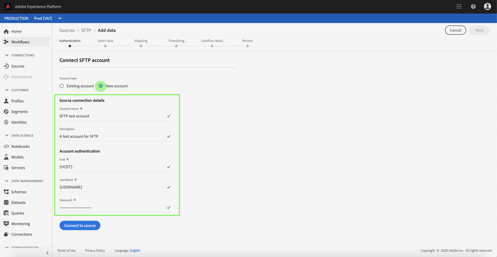

# Create an [!DNL SFTP] source connection in the UI

This tutorial provides steps to create an [!DNL SFTP] source connection using the Adobe Experience Platform UI.

## Get started

This tutorial requires a working understanding of the following components of Experience Platform:

* [[!DNL Experience Data Model (XDM)] System](../../../../../xdm/home.md): The standardized framework by which Experience Platform organizes customer experience data.
  * [Basics of schema composition](../../../../../xdm/schema/composition.md): Learn about the basic building blocks of XDM schemas, including key principles and best practices in schema composition.
  * [Schema Editor tutorial](../../../../../xdm/tutorials/create-schema-ui.md): Learn how to create custom schemas using the Schema Editor UI.
* [[!DNL Real-Time Customer Profile]](../../../../../profile/home.md): Provides a unified, real-time consumer profile based on aggregated data from multiple sources.

>[!IMPORTANT]
>
>It is recommended to avoid newlines or carriage returns when ingesting JSON objects with an [!DNL SFTP] source connection. To work around the limitation, use a single JSON object per line and use multi-lines for ensuing files.

If you already have a valid [!DNL SFTP] connection, you may skip the remainder of this document and proceed to the tutorial on [configuring a dataflow](../../dataflow/batch/cloud-storage.md).

### Gather required credentials

Read the [[!DNL SFTP] authentication guide](../../../../connectors/cloud-storage/sftp.md#gather-required-credentials) for detailed steps on how to retrieve your authentication credentials.

## Connect to your [!DNL SFTP] server

In the Experience Platform UI, select **[!UICONTROL Sources]** from the left navigation bar to access the [!UICONTROL Sources] workspace. The [!UICONTROL Catalog] screen displays a variety of sources with which you can create an account.

You can select the appropriate category from the catalog on the left-hand side of your screen. Alternatively, you can find the specific source you wish to work with using the search option.

Under the [!UICONTROL Cloud storage] category, select **[!UICONTROL SFTP]** and then select **[!UICONTROL Add data]**.

The **[!UICONTROL Connect to SFTP]** page appears. On this page, you can either use new credentials or existing credentials.

### Existing account

To connect an existing account, select the FTP or SFTP account you want to connect with, then select **[!UICONTROL Next]** to proceed.

### New account

>[!TIP]
>
>* Once created, you cannot change the authentication type of an [!DNL SFTP] base connection. To change the authentication type, you must create a new base connection.
>
>* SFTP supports `ed25519`, `RSA` or `DSA` type OpenSSH key. Ensure that your key file content starts with `"-----BEGIN [RSA/DSA] PRIVATE KEY-----"` and ends with `"-----END [RSA/DSA] PRIVATE KEY-----"`. If the private key file is a PPK-format file, use the PuTTY tool to convert from PPK to OpenSSH format.

If you are creating a new account, select **[!UICONTROL New account]**, and then provide a name and an optional description for your new [!DNL SFTP] account.

The [!DNL SFTP] source supports both basic authentication and authentication via SSH public key.

>[!BEGINTABS]

>[!TAB Basic authentication]

To use basic authentication, select **[!UICONTROL Password]** and then provide the appropriate values for the following credentials:

* host
* port
* username
* password

During this step, you can also configure your max concurrent connections, define your folder path, and enable or disable chunking for your [!DNL SFTP] server. When finished, select **[!UICONTROL Connect to source]** and allow for a few moments for the connection to establish.

For more information on authentication, read the guide on [gathering required credentials for [!DNL SFTP]](../../../../connectors/cloud-storage/sftp.md#gather-required-credentials).

>[!TAB SSH public key authentication]

To use SSH public key-based credentials, select **[!UICONTROL SSH public key]**  and then provide the appropriate values for the following credentials:

* host
* port
* username
* private key content
* passphrase

During this step, you can also configure your max concurrent connections, define your folder path, and enable or disable chunking for your [!DNL SFTP] server. When finished, select **[!UICONTROL Connect to source]** and allow for a few moments for the connection to establish.

For more information on authentication, read the guide on [gathering required credentials for [!DNL SFTP]](../../../../connectors/cloud-storage/sftp.md#gather-required-credentials).

>[!ENDTABS]

## Next steps

By following this tutorial, you have established a connection to your SFTP account. You can now continue on to the next tutorial and [configure a dataflow to bring data from your cloud storage into Experience Platform](../../dataflow/batch/cloud-storage.md).
