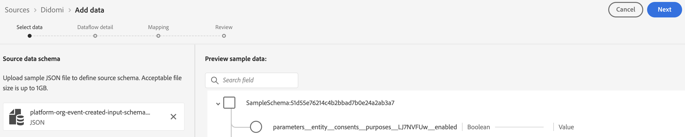
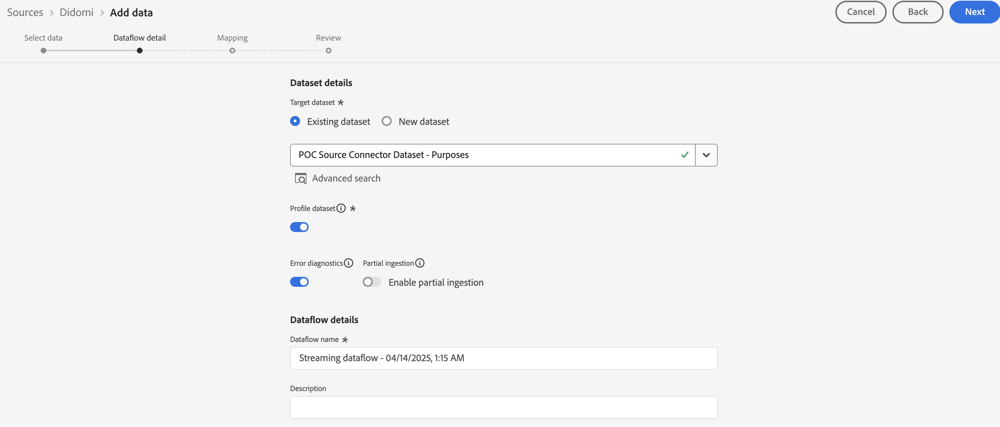
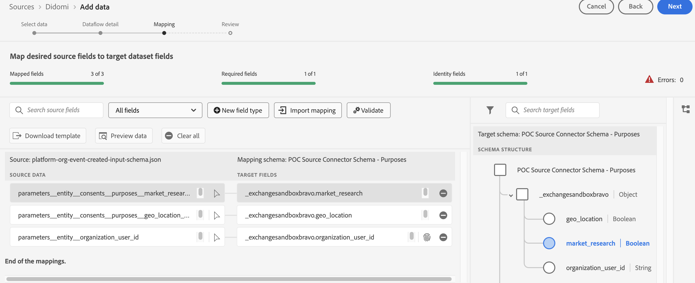

# Connect [!DNL Didomi] to Experience Platform

Read this guide to learn how to connect your [!DNL Didomi] account to Adobe Experience Platform using the sources workspace in the UI.

>[!IMPORTANT]
>
>* This documentation page was created by the *Didomi* team. For any inquiries or update requests, please contact them directly at *support@didomi.io*.
>* For step-by-step instructions on generating the connection, refer to the [Didomi Adobe source connector documentation](https://developers.didomi.io/integrations/third-party-apps/preference-management-platform-integrations/Adobe-source-connector).

## Get started

This tutorial requires a working understanding of the following components of Adobe Experience Platform:

* [[!DNL Experience Data Model (XDM)] System](../../../../../xdm/home.md): The standardized framework by which Experience Platform organizes customer experience data.
  * [Basics of schema composition](../../../../../xdm/schema/composition.md): Learn about the basic building blocks of XDM schemas, including key principles and best practices in schema composition.
  * [Schema Editor tutorial](../../../../../xdm/tutorials/create-schema-ui.md): Learn how to create custom schemas using the Schema Editor UI.
* [[!DNL Real-Time Customer Profile]](../../../../../profile/home.md): Provides a unified, real-time consumer profile based on aggregated data from multiple sources.

### Set up your [!DNL Didomi] account

Before you can proceed, ensure that you read and complete the prerequisite steps outlined in the [[!DNL Didomi] overview](../../../../connectors/consent-and-preferences/didomi.md#prerequisites) to successfully connect your account to Experience Platform.

## Navigate the sources catalog

In the Experience Platform UI, select **[!UICONTROL Sources]** from the left navigation to access the *[!UICONTROL Sources]* workspace. Choose a category or use the search bar to find your source.

To connect to [!DNL Didomi], go to the *[!UICONTROL Databases]* category, select the **[!UICONTROL Didomi]** source card, and then select **[!UICONTROL Set up]**.

>[!TIP]
>
>Sources in the sources catalog display the **[!UICONTROL Set up]** option when a given source does not yet have an authenticated account. Once an authenticated account is created, this option changes to **[!UICONTROL Add data]**.

## Add your source data schema

Next, use the *[!UICONTROL Select data]* interface to upload the JSON file that was [downloaded in the prerequisite steps](../../../../connectors/consent-and-preferences/didomi.md#download-the-sample-payload-file). 

You can use the preview interface to view the file structure of the payload. When finished, select **[!UICONTROL Next]**.

## Provide dataflow details

Next, you must provide information regarding your dataset and your dataflow.

### Dataset details

A dataset is a storage and management construct for a collection of data, typically a table, that contains a schema (columns) and fields (rows). Data that is successfully ingested into Experience Platform is persisted within the data lake as datasets. 

During this step, you can either use an existing dataset or create a new dataset.

>[!NOTE]
>
>Regardless of whether you use an existing dataset or create a new dataset, you must ensure that your dataset is **enabled for Profile** ingestion.

+++Select for steps to enable Profile ingestion, error diagnostics, and partial ingestion.

If your dataset is enabled for Real-Time Customer Profile, then during this step, you can toggle **[!UICONTROL Profile dataset]** to enable your data for Profile-ingestion. You can also use this step to enable **[!UICONTROL Error diagnostics]** and **[!UICONTROL Partial ingestion]**.

* **[!UICONTROL Error diagnostics]**: Select **[!UICONTROL Error diagnostics]** to instruct the source to produce error diagnostics that you can later reference when monitoring your dataset activity and dataflow status.
* **[!UICONTROL Partial ingestion]**: Partial batch ingestion is the ability to ingest data containing errors, up to a certain configurable threshold. This feature allows you to successfully ingest all of your accurate data into Experience Platform, while all of your incorrect data is batched separately with information on why it is invalid.

+++
 
### Dataflow details

Once your dataset is configured, you must then provide details on your dataflow, including a name, an optional description, and alert configurations.

| Dataflow configurations | Description |
| --- | --- |
| Dataflow name | The name of the dataflow.  By default, this will use the name of the file that is being imported. |
| Description | (Optional) A brief description of your dataflow. |
| Alerts | Experience Platform can produce event-based alerts which users can subscribe to, these options all a running dataflow to trigger these.  For more information, read the [alerts overview](../../alerts.md) <ul><li>**Sources Dataflow Run Start**: Select this alert to receive a notification when your dataflow run begins.</li><li>**Sources Dataflow Run Success**: Select this alert to receive a notification if your dataflow ends without any errors.</li><li>**Sources Dataflow Run Failure**: Select this alert to receive a notification if your dataflow run ends with any errors.</li></ul> |

{style="table-layout:auto"}

## Mapping

Use the mapping interface to map your source data to the appropriate schema fields before ingesting data to Experience Platform.  For more information, read the [mapping guide in the UI](../../../../../data-prep/ui/mapping.md)

Mapping is used specifically to transfer **purpose data** from [!DNL Didomi] into the  Experience Platform dataset. These purposes represent the user's consent choices (such as, for analytics, personalization, advertising, etc.) and are the only accepted mapping fields in this integration.

Use the [sample webhook payload downloaded](../../../../connectors/consent-and-preferences/didomi.md#download-the-sample-payload-file) from the [!DNL Didomi] webhook settings to map each [!DNL Didomi] purpose to the appropriate fields in your Adobe dataset.

When finished, select **[!UICONTROL Next]**.

## Review

The *[!UICONTROL Review]* step appears, allowing you to review the details of your dataflow before it is created. Details are group within the following categories:

* **[!UICONTROL Connection]**: Shows the account name, source platform, and the source name.
* **[!UICONTROL Assign dataset and map fields]**: Shows the target dataset and the schema that the dataset adheres to.

After confirming the details are correct, select **[!UICONTROL Finish]**.

## Retrieve the streaming endpoint URL

With the connection created, the sources detail page appears. This page shows details of your newly created connection, including previously run dataflows, ID, and streaming endpoint URL.

## Finish the Configuration on Adobe

Once your dataflow is created, navigate to the *[!UICONTROL Sources]* catalog and then select **[!UICONTROL Dataflows]**. Use the dataflows directory to locate your [!DNL Didomi] dataflow and access the *[!UICONTROL Dataflow activity]* interface. Next, use the *[!UICONTROL Properties]* panel in the right-rail and retrieve values for the following:

* [!UICONTROL Streaming endpoint]
* [!UICONTROL Dataflow ID]

In the Experience Platform UI:

1. After completing the configuration, review the configuration parameters that were missing from the initial webhook setup.
2. Once these values are available, return to Didomi and update the webhook configuration.

## Update the Webhook Configuration

Once your configuration is complete, navigate back to the [!DNL Didomi] console and update your webhook configuration with your **streaming endpoint URL** and **dataflow ID**.

Once this is complete, [!DNL Didomi]  will begin sending consent management and preference management events through the integration, and the data will be stored in your Adobe dataset.

## Next steps

By following this tutorial, you have successfully created a dataflow to bring batch data from your [!DNL Didomi] source to Experience Platform. For additional resources, visit the documentation outlined below.

### Monitor your dataflow

Once your dataflow has been created, you can monitor the data that is being ingested through it to view information on ingestion rates, success, and errors. For more information on how to monitor dataflow, visit the tutorial on [monitoring accounts and dataflows in the UI](../../../../../dataflows/ui/monitor-sources.md).

### Update your dataflow

To update configurations for your dataflows scheduling, mapping, and general information, visit the tutorial on [updating sources dataflows in the UI](../../update-dataflows.md).

### Delete your dataflow

You can delete dataflows that are no longer necessary or were incorrectly created using the **[!UICONTROL Delete]** function available in the **[!UICONTROL Dataflows]** workspace. For more information on how to delete dataflows, visit the tutorial on [deleting dataflows in the UI](../../delete.md).