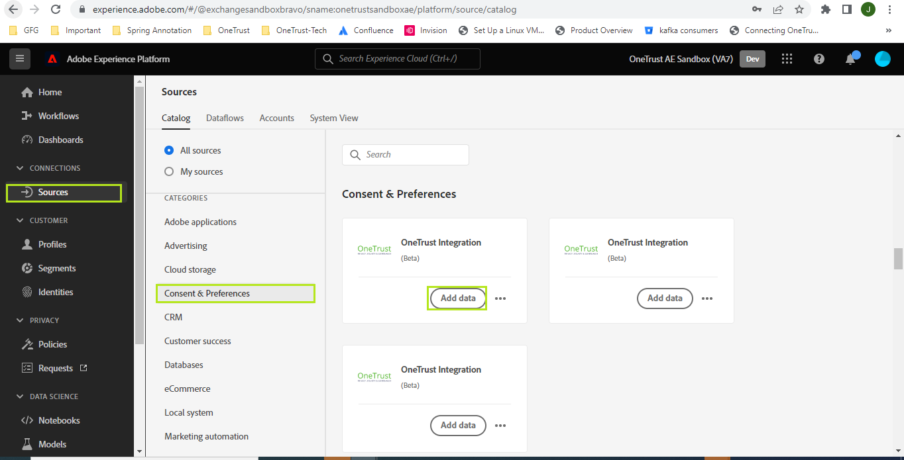
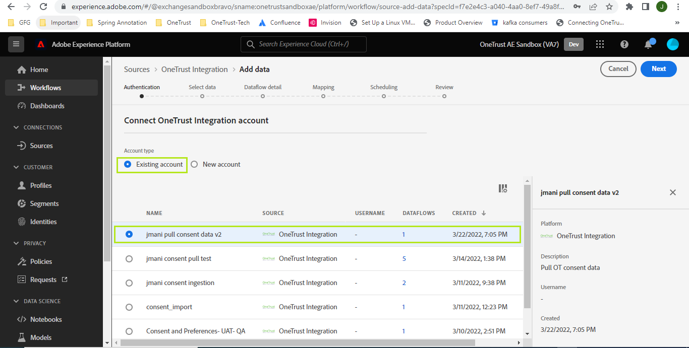
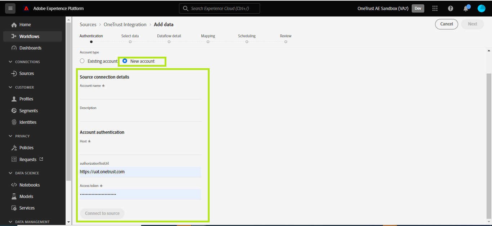

# Create a [!DNL OneTrust] source connection in the UI

This tutorial provides steps for creating a [[!DNL OneTrust]](https://my.onetrust.com/s/contactsupport?language=en_US) source connector to ingest both historic and scheduled consent data into Adobe Experience Platform through the user interface.

>[!IMPORTANT]
>
>This documentation page was created by the [!DNL OneTrust] team. For any inquiries or update requests, [please contact them directly](https://my.onetrust.com/s/contactsupport?language=en_US).

## Prerequisites

Before you can connect [!DNL OneTrust] to Platform, you must first retrieve your access token. For detailed instructions on finding your access token, see the [[!DNL OneTrust] OAuth 2 guide](https://developer.onetrust.com/docs/api-docs-v3/b3A6MjI4OTUyOTc-generate-access-token).

Furthermore, it is important to note that the [!DNL OneTrust] API specifications are being shared with Adobe for data ingestion.

The access token does not refresh automatically when after it expires because system-to-system refresh tokens are not supported by [!DNL OneTrust]. Therefore it is necessary to make sure that the access tokens are updated in the connection before it expires. The maximum life of an access token that can be configured is 1 Year.

### Gather required credentials

In order to connect [!DNL OneTrust] to Platform, you must provide values for either one of the following connection properties:

| Credential | Description | Example |
| --- | --- | --- |
| Host | | |
| Authorization Test URL | | |
| Access Token | |

For more information on these credentials, see the [!DNL OneTrust] authentication documentation. *[[!DNL OneTrust] OAuth 2 guide](https://developer.onetrust.com/docs/api-docs-v3/b3A6MjI4OTUyOTc-generate-access-token)*.

## Connect your [!DNL OneTrust] account

In the Platform UI, select **[!UICONTROL Sources]** from the left navigation bar to access the [!UICONTROL Sources] workspace. The [!UICONTROL Catalog] screen displays a variety of sources with which you can create an account.

You can select the appropriate category from the catalog on the left-hand side of your screen. Alternatively, you can find the specific source you wish to work with using the search option.

Under the *[!UICONTROL Consent & Preferences]* category, select [!DNL OneTrust Integration], and then select **[!UICONTROL Add data]**.

The **[!UICONTROL Connect OneTrust Integration account]** page appears. On this page, you can either use new credentials or existing credentials.

### Existing account

To use an existing account, select the [!DNL OneTrust] account you want to create a new dataflow with, then select **[!UICONTROL Next]** to proceed.

### New account

If you are creating a new account, select **[!UICONTROL New account]**, and then provide a name, an optional description, and your credentials. When finished, select **[!UICONTROL Connect to source]** and then allow some time for the new connection to establish.

## Next steps

By following this tutorial, you have established a connection to your [!DNL OneTrust] account. You can now continue on to the next tutorial and [configure a dataflow to bring data into Platform](../../dataflow/crm.md).

## Additional information

>[!TIP]
>
>In the Mapping screen after selecting the target schema, we have a limitation of not being able to map any dynamic key-pair values as Object from OneTrust to the Experince platform.
>Here, we must specify those keys in the target schema to be able to map data during ingestion.
