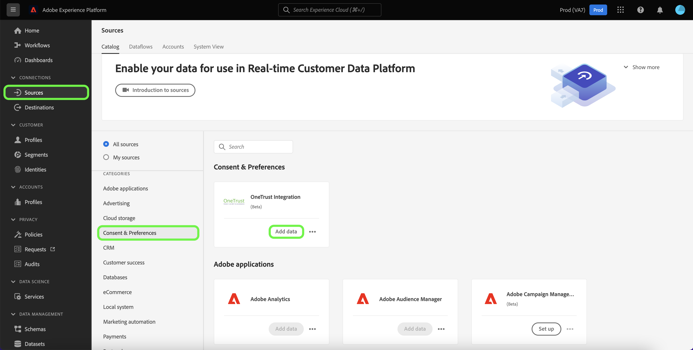
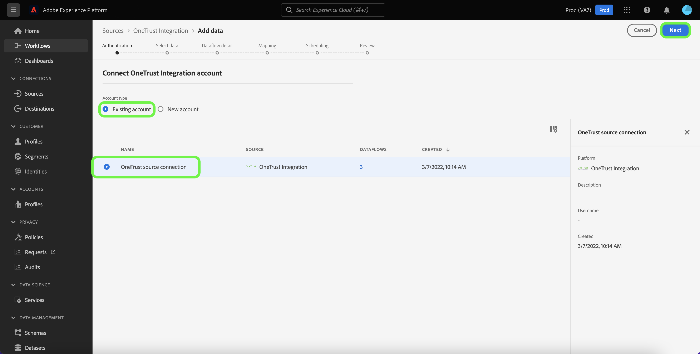
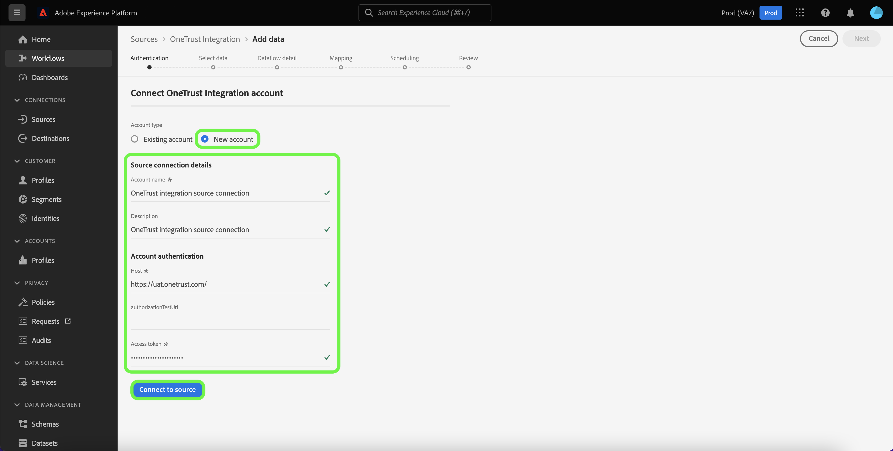

# Create a [!DNL OneTrust Integration] source connection in the UI

This tutorial provides steps for creating a [[!DNL OneTrust Integration]](https://my.onetrust.com/s/contactsupport?language=en_US) source connection to ingest both historic and scheduled consent data into Adobe Experience Platform using the Platform user interface.

## Prerequisites

>[!IMPORTANT]
>
>The [!DNL OneTrust Integration] source connector and documentation were created by the [!DNL OneTrust Integration] team. For any inquiries or update requests, please contact the [[!DNL OneTrust] team](https://my.onetrust.com/s/contactsupport?language=en_US) directly.

Before you can connect [!DNL OneTrust Integration] to Platform, you must first retrieve your access token. For detailed instructions on finding your access token, see the [[!DNL OneTrust Integration] OAuth 2 guide](https://developer.onetrust.com/docs/api-docs-v3/b3A6MjI4OTUyOTc-generate-access-token).

The access token does not refresh automatically after it expires because system-to-system refresh tokens are not supported by [!DNL OneTrust]. Therefore, it is necessary to make sure that your access token is updated in the connection before it expires. The maximum configurable lifespan for an access token is one year. To learn more about updating your access token, see the [[!DNL OneTrust] document on managing your OAuth 2.0 client credentials](https://developer.onetrust.com/docs/documentation/ZG9jOjIyODk1MTUw-managing-o-auth-2-0-client-credentials).

### Gather required credentials

In order to connect [!DNL OneTrust Integration] to Platform, you must provide values for the following authentication credentials:

| Credential | Description | Example |
| --- | --- | --- |
| Host name | The environment from which the [!DNL OneTrust Integration] data needs to be pulled from. | `https://uat.onetrust.com/` |
| Authorization Test URL | (Optional) The authorization test URL is used to validate credentials when creating a base connection. If unprovided, credentials are automatically checked during the source connection creation step instead. | |
| Access Token | The access token that corresponds with your [!DNL OneTrust Integration] account. | `ZGFkZDMyMjFhMmEyNDQ2ZGFhNTdkZjNkZjFmM2IyOWE6QjlUSERVUTNjOFVsRmpEZTJ6Vk9oRnF3Sk8xNlNtcm4=` |

For more information on these credentials, see the [[!DNL OneTrust Integration] authentication documentation](https://developer.onetrust.com/docs/api-docs-v3/b3A6MjI4OTUyOTc-generate-access-token).

## Connect your [!DNL OneTrust Integration] account

>[!NOTE]
>
>The [!DNL OneTrust Integration] API specifications are being shared with Adobe for data ingestion.

In the Platform UI, select **[!UICONTROL Sources]** from the left navigation to access the [!UICONTROL Sources] workspace. The [!UICONTROL Catalog] screen displays a variety of sources with which you can create an account.

You can select the appropriate category from the catalog on the left-hand side of your screen. Alternatively, you can find the specific source you wish to work with using the search option.

Under the *[!UICONTROL Consent & Preferences]* category, select [!DNL OneTrust Integration], and then select **[!UICONTROL Add data]**.

The **[!UICONTROL Connect OneTrust Integration account]** page appears. On this page, you can either use new credentials or existing credentials.

### Existing account

To use an existing account, select the [!DNL OneTrust Integration] account you want to create a new dataflow with, then select **[!UICONTROL Next]** to proceed.

### New account

If you are creating a new account, select **[!UICONTROL New account]**, and then provide a name, an optional description, and your credentials. When finished, select **[!UICONTROL Connect to source]** and then allow some time for the new connection to establish.

## Next steps

By following this tutorial, you have established a connection to your [!DNL OneTrust Integration] account. You can now continue on to the next tutorial and [configure a dataflow to bring consent data into Platform](../../dataflow/consent-and-preferences.md).
