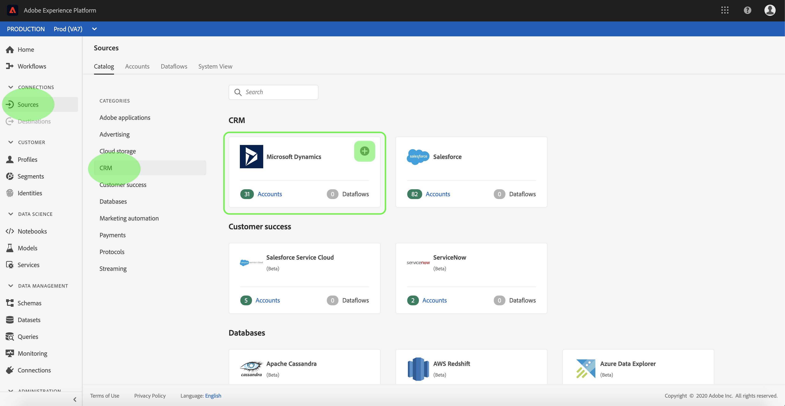
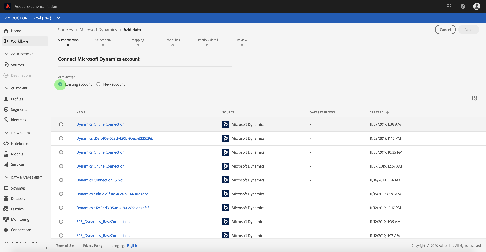
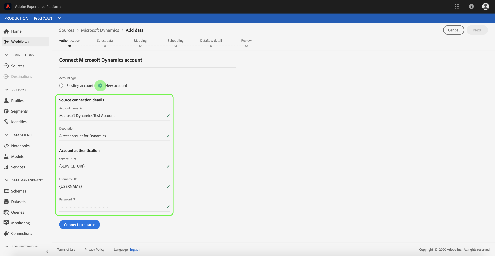
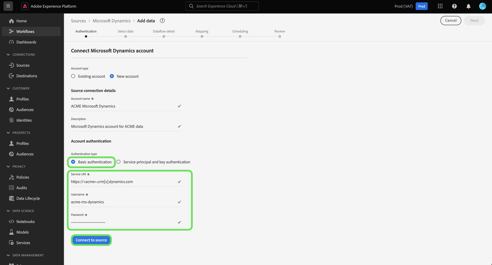
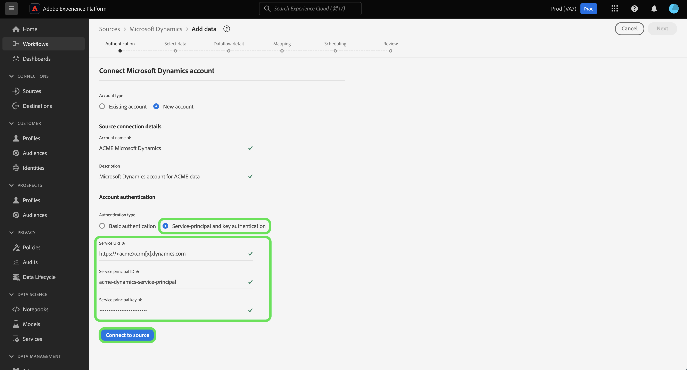

# Create a [!DNL Microsoft Dynamics] source connection in the UI

This tutorial provides steps to create a [!DNL Microsoft Dynamics] (hereinafter referred to as "[!DNL Dynamics]") source connection using the Adobe Experience Platform UI.

## Getting started

This tutorial requires a working understanding of the following components of Adobe Experience Platform:

* [[!DNL Experience Data Model (XDM)] System](../../../../../xdm/home.md): The standardized framework by which Experience Platform organizes customer experience data.
  * [Basics of schema composition](../../../../../xdm/schema/composition.md): Learn about the basic building blocks of XDM schemas, including key principles and best practices in schema composition.
  * [Schema Editor tutorial](../../../../../xdm/tutorials/create-schema-ui.md): Learn how to create custom schemas using the Schema Editor UI.
* [[!DNL Real-Time Customer Profile]](../../../../../profile/home.md): Provides a unified, real-time consumer profile based on aggregated data from multiple sources.

If you already have a valid [!DNL Dynamics] account, you may skip the remainder of this document and proceed to the tutorial on [configuring a dataflow for a CRM source](../../dataflow/crm.md).

### Gather required credentials

In order to authenticate your [!DNL Dynamics] source, you must provide values for the following connection properties:

>[!BEGINTABS]

>[!TAB Basic authentication]

| Credential | Description |
| --- | --- |
| `serviceUri` | The service URL of your [!DNL Dynamics] instance. |
| `username` | The user name for your [!DNL Dynamics] user account. |
| `password` | The password for your [!DNL Dynamics] account. |

>[!TAB Service-principal and key authentication]

| Credential | Description |
| --- | --- |
| `servicePrincipalId` | The client ID of your [!DNL Dynamics] account. This ID is required when using service principal and key-based authentication. |
| `servicePrincipalKey` | The service principal secret key. This credential is required when using service principal and key-based authentication. |

>[!ENDTABS]

For more information on getting started, refer to [this [!DNL Dynamics] document](https://docs.microsoft.com/en-us/powerapps/developer/common-data-service/authenticate-oauth).

## Connect your [!DNL Dynamics] account

In the Platform UI, select **[!UICONTROL Sources]** from the left navigation to access the [!UICONTROL Sources] workspace. The [!UICONTROL Catalog] screen displays a variety of sources you can create an account with.

You can select the appropriate category from the catalog on the left-hand side of your screen. Alternatively, you can find the specific source you wish to work with using the search option.

Under the [!UICONTROL CRM] category, select **[!UICONTROL Microsoft Dynamics]**, and then select **[!UICONTROL Add data]**.

The **[!UICONTROL Connect Microsoft Dynamics account]** page appears. On this page, you can either use new credentials or existing credentials.

### Existing account

To use an existing account, select the [!DNL Dynamics] account you want to use, then select **[!UICONTROL Next]** in the top-right corner to proceed.

### New account

>[!TIP]
>
>Once created, you cannot change the authentication type of an [!DNL Dynamics] base connection. To change the authentication type, you must create a new base connection.

To create a new account, select **[!UICONTROL New account]**, and then provide a name and an optional description for your new [!DNL Dynamics] account.

You can use either basic authentication or service-principal and key authentication when creating a [!DNL Dynamics] account.

>[!BEGINTABS]

>[!TAB Basic authentication]

To create a [!DNL Dynamics] account with basic authentication, select [!UICONTROL Basic authentication] and then provide values for your [!UICONTROL Service URI], [!UICONTROL Username], and [!UICONTROL Password]. **Note**: Basic authentication in [!DNL Dynamics] may be blocked by two-factor authentication, which is currently not supported by Platform. In this case, it is recommended to use key-based authentication to create a source connector using [!DNL Dynamics].

When finished, select **[!UICONTROL Connect to source]** and then allow some time for the new account to establish.

 
>[!TAB Service-principal and key authentication]

To create a [!DNL Dynamics] account with service-principal and key authentication, select **[!UICONTROL Service-principal and key authentication]** and then provide values for your [!UICONTROL Service principal ID] and [!UICONTROL Service principal key].

When finished, select **[!UICONTROL Connect to source]** and then allow some time for the new account to establish.

>[!ENDTABS]

## Next steps

By following this tutorial, you have established a connection to your [!DNL Dynamics] account. You can now continue on to the next tutorial and [configure a dataflow to bring data into Platform](../../dataflow/crm.md).
