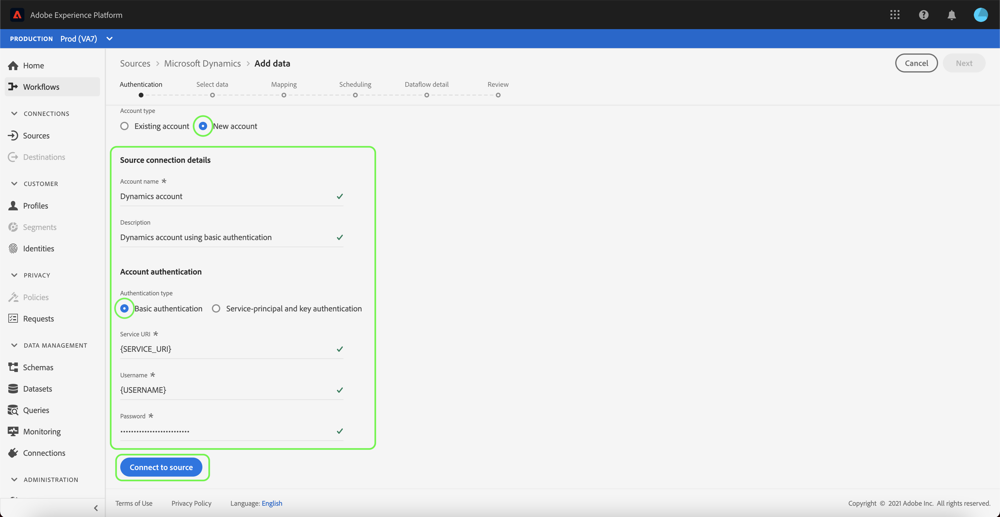
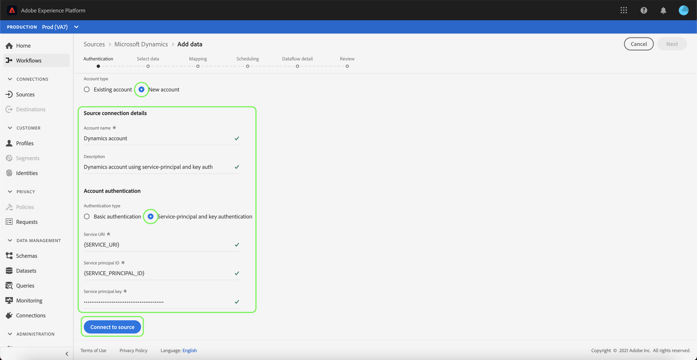

# Create a [!DNL Microsoft Dynamics] source connection in the UI

This tutorial provides steps for creating a [!DNL Microsoft Dynamics] (hereinafter referred to as "[!DNL Dynamics]") source connection using the Adobe Experience Platform UI.

## Getting started

This tutorial requires a working understanding of the following components of Adobe Experience Platform:

* [[!DNL Experience Data Model (XDM)] System](../../../../../xdm/home.md): The standardized framework by which Experience Platform organizes customer experience data.
  * [Basics of schema composition](../../../../../xdm/schema/composition.md): Learn about the basic building blocks of XDM schemas, including key principles and best practices in schema composition.
  * [Schema Editor tutorial](../../../../../xdm/tutorials/create-schema-ui.md): Learn how to create custom schemas using the Schema Editor UI.
* [[!DNL Real-Time Customer Profile]](../../../../../profile/home.md): Provides a unified, real-time consumer profile based on aggregated data from multiple sources.

If you already have a valid [!DNL Dynamics] account, you may skip the remainder of this document and proceed to the tutorial on [configuring a dataflow for a CRM source](../../dataflow/crm.md).

### Gather required credentials

| Credential | Description |
| ---------- | ----------- |
| `serviceUri` | The service URL of your [!DNL Dynamics] instance. |
| `username` | The user name for your [!DNL Dynamics] user account. |
| `password` | The password for your [!DNL Dynamics] account. |
| `servicePrincipalId` | The client ID of your [!DNL Dynamics] account. This ID is required when using service principal and key-based authentication. |
| `servicePrincipalKey` | The service principal secret key. This credential is required when using service principal and key-based authentication. |

For more information on getting started, refer to [this [!DNL Dynamics] document](https://docs.microsoft.com/en-us/powerapps/developer/common-data-service/authenticate-oauth).

## Connect your [!DNL Dynamics] account

Once you have gathered your required credentials, you can follow the steps below to link your [!DNL Dynamics] account to Platform.

Log in to [Adobe Experience Platform](https://platform.adobe.com) and then select **[!UICONTROL Sources]** from the left navigation bar to access the [!UICONTROL Sources] workspace. The **[!UICONTROL Catalog]** screen displays a variety of sources for which you can create an account with.

You can select the appropriate category from the catalog on the left-hand side of your screen. Alternatively, you can find the specific source you wish to work with using the search option.

Under the **[!UICONTROL CRM]** category, select **[!UICONTROL Microsoft Dynamics]**. If this is your first time using this connector, select **[!UICONTROL Configure]**. Otherwise, select **[!UICONTROL Add data]** to create a new [!DNL Dynamics] connector.

The **[!UICONTROL Connect to Dynamics]** page appears. On this page, you can either use new credentials or existing credentials.

### New account

If you are using new credentials, select **[!UICONTROL New account]**. On the input form that appears, provide a name and an optional description for your new [!DNL Dynamics] account.

The [!DNL Dynamics] connector provides you different authentication types for access. Under [!UICONTROL Account authentication] select **[!UICONTROL Basic authentication]** to use password-based credentials.

When finished, select **[!UICONTROL Connect to source]** and then allow some time for the new account to establish.

Alternatively, you can select **[!UICONTROL Service-principal and key authentication]** and connect your [!DNL Dynamics] account using a combination of [!UICONTROL Service principal ID] and [!UICONTROL Service principal key].

>[!IMPORTANT]
>
> Basic authentication in [!DNL Dynamics] may be blocked by two-factor authentication, which is currently not supported by Platform. In this case, it is recommended to use key-based authentication to create a source connector using [!DNL Dynamics].

| Credential | Description |
| ---------- | ----------- |
| [!UICONTROL Service principal ID] | The client ID of your [!DNL Dynamics] account. This ID is required when using service principal and key-based authentication. |
| [!UICONTROL Service principal key] | The service principal secret key. This credential is required when using service principal and key-based authentication. |

### Existing account

To connect an existing account, select the [!DNL Dynamics] account you want to connect with, then select **[!UICONTROL Next]** in the top-right corner to proceed.

## Next steps

By following this tutorial, you have established a connection to your [!DNL Dynamics] account. You can now continue on to the next tutorial and [configure a dataflow to bring data into Platform](../../dataflow/crm.md).
