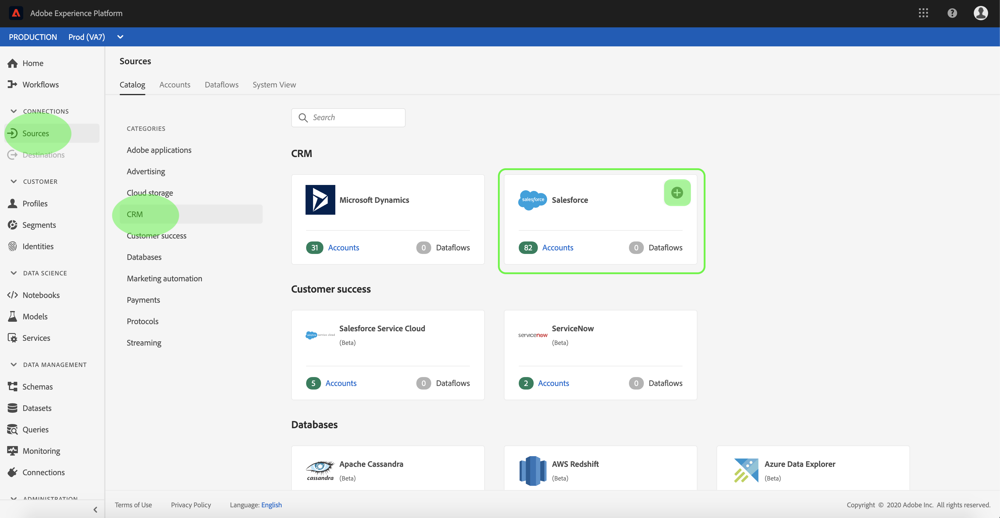
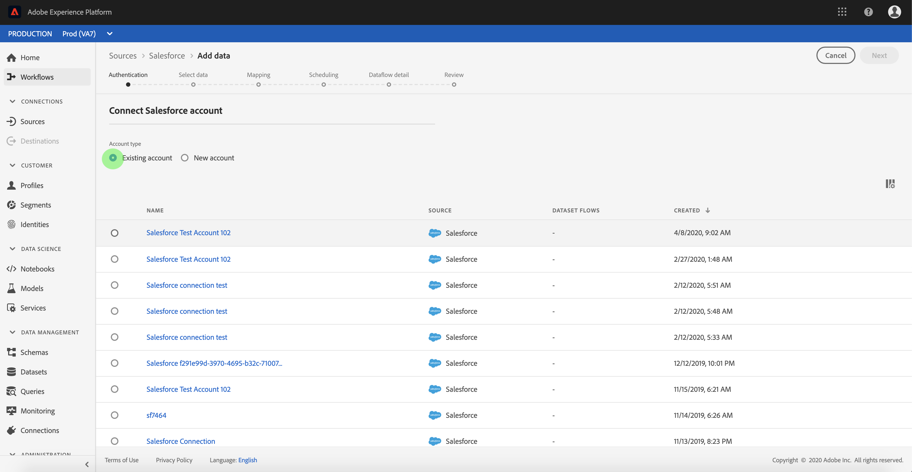
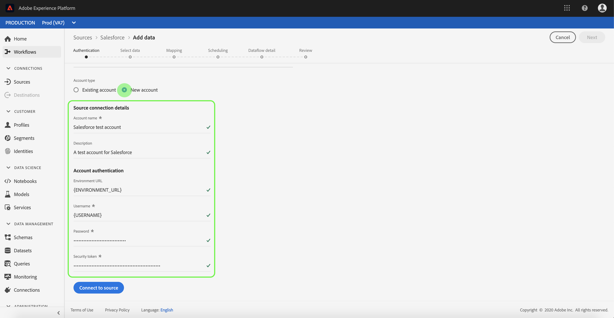

# Connect your [!DNL Salesforce] account to Experience Platform using the UI

This tutorial provides steps on how to connect your [!DNL Salesforce] account and bring your CRM data to Adobe Experience Platform using the Experience Platform user interface.

## Getting started

This tutorial requires a working understanding of the following components of Experience Platform:

* [[!DNL Experience Data Model (XDM)] System](../../../../../xdm/home.md): The standardized framework by which Experience Platform organizes customer experience data.
    * [Basics of schema composition](../../../../../xdm/schema/composition.md): Learn about the basic building blocks of XDM schemas, including key principles and best practices in schema composition.
    * [Schema Editor tutorial](../../../../../xdm/tutorials/create-schema-ui.md): Learn how to create custom schemas using the Schema Editor UI.
* [[!DNL Real-Time Customer Profile]](../../../../../profile/home.md): Provides a unified, real-time consumer profile based on aggregated data from multiple sources.

If you already have an authenticated [!DNL Salesforce] account, you may skip the remainder of this document and proceed to the tutorial on [configuring a dataflow for CRM data](../../dataflow/crm.md).

### Gather required credentials {#gather-required-credentials}

In order to authenticate your [!DNL Salesforce] account against Experience Platform, you must provide values that correspond to the following [!DNL Salesforce] credentials:

| Credential | Description |
| --- | --- |
| `environmentUrl` | The URL of the [!DNL Salesforce] source instance. |
| `username` | The username for the [!DNL Salesforce] user account. |
| `password` | The password for the [!DNL Salesforce] user account. |
| `securityToken` | The security token for the [!DNL Salesforce] user account. |
| `apiVersion` | (Optional) The REST API version of the [!DNL Salesforce] instance that you are using. If this field is left blank, then Experience Platform will automatically use the latest available version. |

For more information on authentication, refer to [this [!DNL Salesforce] authentication guide](https://developer.salesforce.com/docs/atlas.en-us.api_rest.meta/api_rest/quickstart_oauth.htm).

Once you have gathered your required credentials, you can follow the steps below to connect your [!DNL Salesforce] account to Experience Platform.

## Connect your [!DNL Salesforce] account

In the Platform UI, select **[!UICONTROL Sources]** from the left navigation to access the sources workspace. The *[!UICONTROL Catalog]* screen displays a variety of sources available in the Experience Platform sources catalog.

You can select the appropriate category from the catalog on the left-hand side of your screen. Alternatively, you can find a specific source using the search option.

Select **[!UICONTROL CRM]** from the list of sources categories and then select **[!UICONTROL Add data]** from the [!DNL Salesforce] card.

The **[!UICONTROL Connect to Salesforce]** page appears. On this page, you can either use new credentials or existing credentials.

>[!BEGINTABS]

>[!TAB Use an existing Salesforce account]

To use an existing account, select **[!UICONTROL Existing account]** and then select the account that you want to use from the list that appears. When finished, select **[!UICONTROL Next]** to proceed.

>[!TAB Create a new Salesforce account]

To use a new account, select **[!UICONTROL New account]** and provide a name, description, and your [!DNL Salesforce] authentication credentials. When finished, select **[!UICONTROL Connect to source]** and allow for a few seconds for the new connection to establish.

>[!ENDTABS]

## Next steps

By following this tutorial, you have established a connection to your [!DNL Salesforce] account. You can now continue on to the next tutorial and [configure a dataflow to bring data into [!DNL Platform]](../../dataflow/crm.md).
