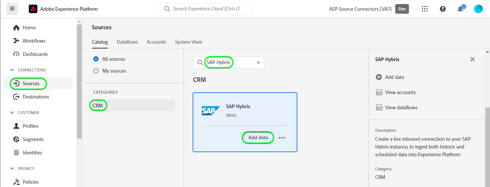
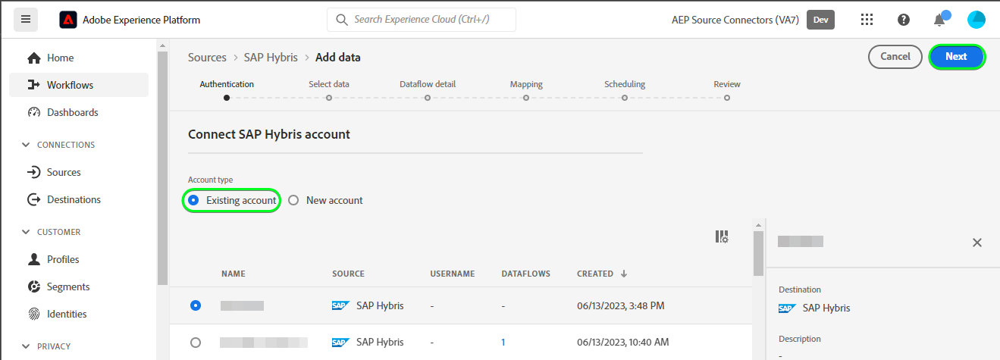
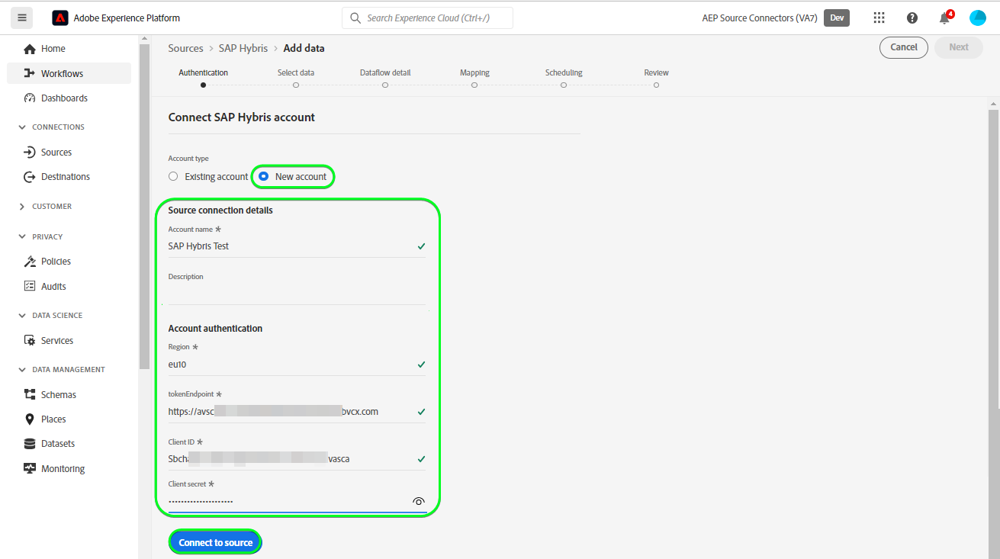
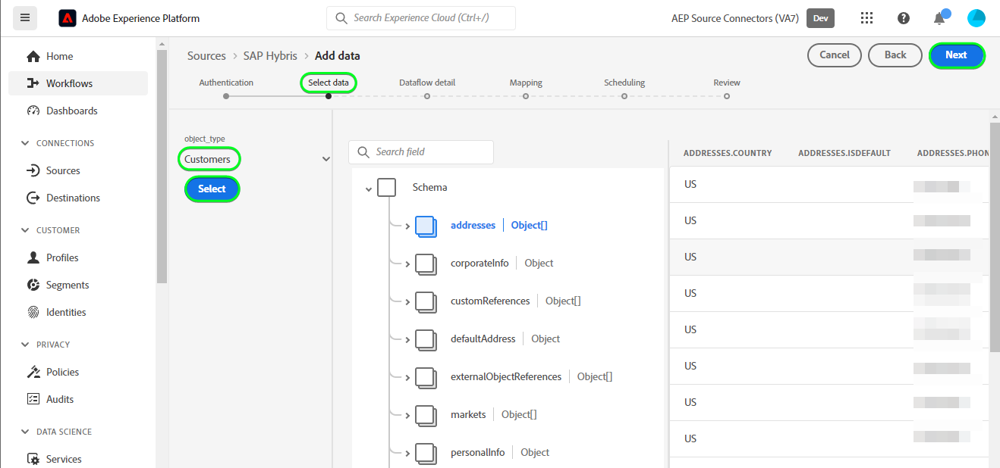
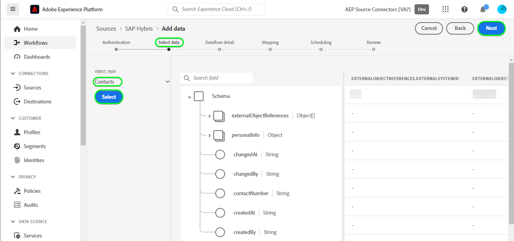
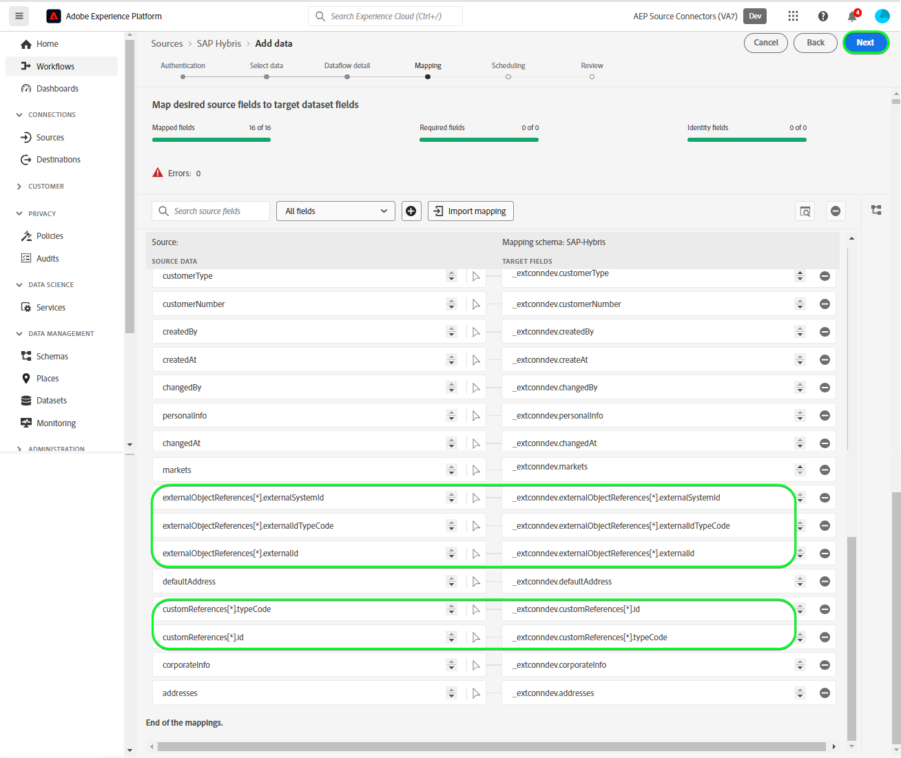
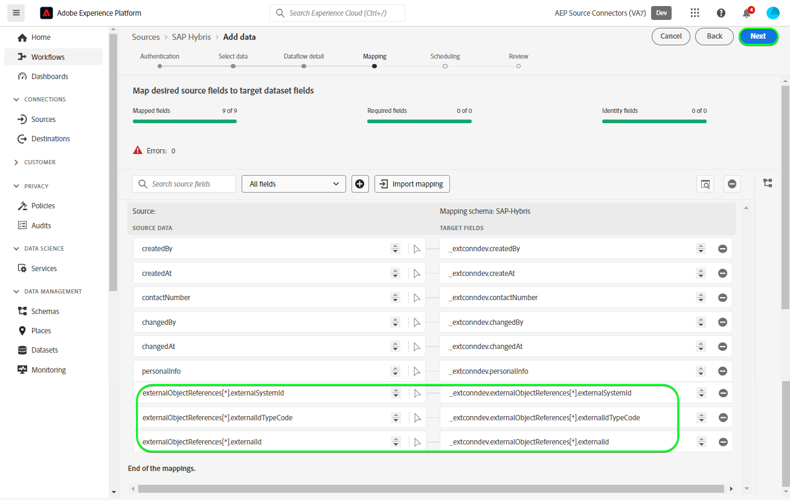

# Create a [!DNL SAP Hybris] source connection in the UI

>[!NOTE]
>
>The [!DNL SAP Hybris] source is in beta. See the [sources overview](../../../../home.md#terms-and-conditions) for more information on using beta-labeled sources.

The following tutorial walks you through the steps to create a [!DNL SAP Hybris] source connection to bring [[!DNL SAP] Subscription Billing](https://www.sap.com/products/financial-management/subscription-billing.html) contacts and customer data using the Adobe Experience Platform user interface.

## Getting started {#getting-started}

This tutorial requires a working understanding of the following components of Experience Platform:

* [[!DNL Experience Data Model (XDM)] System](../../../../../xdm/home.md): The standardized framework by which [!DNL Experience Platform] organizes customer experience data.
  * [Basics of schema composition](../../../../../xdm/schema/composition.md): Learn about the basic building blocks of XDM schemas, including key principles and best practices in schema composition.
  * [Schema Editor tutorial](../../../../../xdm/tutorials/create-schema-ui.md): Learn how to create custom schemas using the Schema Editor UI.
* [[!DNL Real-Time Customer Profile]](../../../../../profile/home.md): Provides a unified, real-time consumer profile based on aggregated data from multiple sources.

If you already have a valid [!DNL SAP Hybris] account, you may skip the remainder of this document and proceed to the tutorial on [configuring a dataflow](../../dataflow/crm.md).

### Gather required credentials {#gather-credentials}

In order to connect [!DNL SAP Hybris] to Experience Platform, you must provide values for the following connection properties:

| Credential | Description |
| --- | --- |
| Client ID | The value of `clientId` from the service key. |
| Client secret | The value of `clientSecret` from the service key. |
| Token endpoint | The value of `url` from the service key, it will be similar to `https://subscriptionbilling.authentication.eu10.hana.ondemand.com`. |
| Region | Your data center location. The region is present in the `url` and has a value similar to `eu10` or `us10`. For example if the `url` is `https://eu10.revenue.cloud.sap/api` you will need `eu10`. |
  
For more information, please refer to the [[!DNL SAP Hybris] documentation](https://help.sap.com/docs/CLOUD_TO_CASH_OD/987aec876092428f88162e438acf80d6/c5fcaf96daff4c7a8520188e4d8a1843.html).

### Create a Platform schema {#create-platform-schema}

Before creating a [!DNL SAP Hybris] source connection, you must also ensure that you first create an Experience Platform schema to use for your source. See the tutorial on [creating a Platform schema](../../../../../xdm/schema/composition.md) for comprehensive steps on how to create a schema.

Expand the following section to view an example schema.

+++ View schema example

```
{
  "_extconndev": {
    "addresses": [
      {
        "addressUUID": "{ADDRESS_UUID}",
        "city": "Burnaby",
        "country": "Canada",
        "email": "chandni@acme.com",
        "houseNumber": "27",
        "isDefault": false,
        "phone": "123-456-7890",
        "postalCode": "V3J 1X9",
        "state": "British Columbia",
        "street": "Beresford"
      }
    ],
    "changedAt": "1687204041",
    "changedBy": "vero@acme.com",
    "contactNumber": "123-456-7980",
    "corporateInfo": {
      "company": "acme"
    },
    "createAt": "1687204041",
    "createdBy": "vero@acme.com",
    "customReferences": [
      {
        "id": "Sample value",
        "typeCode": "Sample value"
      }
    ],
    "customerNumber": "Sample value",
    "customerType": "Sample value",
    "defaultAddress": {
      "addressUUID": "Sample value",
      "city": "North Vancouver",
      "country": "Canada",
      "email": "chandni@acme.come",
      "houseNumber": "34",
      "isDefault": false,
      "phone": "123-456-7890",
      "postalCode": "V7H 2P1",
      "state": "British Columbia",
      "street": "Maple"
    },
    "externalObjectReferences": [
      {
        "externalId": "{EXTERNAL_ID}",
        "externalIdTypeCode": "{EXTERNAL_ID_TYPE_CODE}",
        "externalSystemId": "{EXTERNAL_SYSTEM_ID}"
      }
    ],
    "markets": [
      {
        "active": false,
        "country": "USA",
        "currency": "USD",
        "marketId": "Sample value",
        "priceinfo": {
          "incoterms": "{INCO_TERMS}",
          "incotermsLocation": "{INCO_TERMS_LOCATION}",
          "priceGroup": "{PRICE_GROUP}",
          "priceListType": "{PRICE_LIST_TYPE}"
        },
        "salesArea": {
          "distributionChannel": "{DISTRIBUTION_CHANNEL}",
          "division": "{DIVISION}",
          "salesOrganization": "{SALES_ORGANIZATION}"
        }
      }
    ],
    "personalInfo": {
      "firstName": "Chandni",
      "lastName": "Kaur"
    }
  },
  "_id": "/uri-reference",
  "_repo": {
    "createDate": "2004-10-23T12:00:00-06:00",
    "modifyDate": "2004-10-23T12:00:00-06:00"
  },
  "createdByBatchID": "/uri-reference",
  "modifiedByBatchID": "/uri-reference",
  "personID": "{PERSON_ID}",
  "repositoryCreatedBy": "kevin@acme.com",
  "repositoryLastModifiedBy": "kevin@acme.com"
}
```

+++

## Connect your [!DNL SAP Hybris] account {#connect-account}

In the Platform UI, select **[!UICONTROL Sources]** from the left navigation bar to access the [!UICONTROL Sources] workspace. The [!UICONTROL Catalog] screen displays a variety of sources with which you can create an account.

You can select the appropriate category from the catalog on the left-hand side of your screen. Alternatively, you can find the specific source you wish to work with using the search option.

Under the *CRM* category, select **[!UICONTROL SAP Hybris]**, and then select **[!UICONTROL Add data]**.



The **[!UICONTROL Connect SAP Hybris account]** page appears. On this page, you can either use new credentials or existing credentials.

### Existing account {#existing-account}

To use an existing account, select the [!DNL SAP Hybris] account you want to create a new dataflow with, then select **[!UICONTROL Next]** to proceed.



### New account {#new-account}

If you are creating a new account, select **[!UICONTROL New account]**, and then provide a name, an optional description, and your credentials. When finished, select **[!UICONTROL Connect to source]** and then allow some time for the new connection to establish.



### Select data {#select-data}

Finally, you must select the object type that you want to ingest to Platform.

| Object type | Description |
| --- | --- |
| `Customers` | The entities who have subscriptions. |
| `Contacts` | The contact details for customers. |

>[!BEGINTABS]

>[!TAB Customers]

To ingest customer data, select **[!UICONTROL Customers]** as your object type and then select **[!UICONTROL Next]**.



>[!TAB Contacts]

To ingest contact data, select **[!UICONTROL Contacts]** as your object type and then select **[!UICONTROL Next]**.



>[!ENDTABS]

## Next steps {#next-steps}

By following this tutorial, you have established a connection to your [!DNL SAP Hybris] account. You can now continue on to the next tutorial and [configure a dataflow to bring CRM data into Platform](../../dataflow/crm.md).

## Additional resources {#additional-resources}

The sections below provide additional resources that you can refer to when using the [!DNL SAP Hybris] source.

### Mapping {#mapping}

Platform provides intelligent recommendations for auto-mapped fields based on the target schema or dataset that you selected. You can manually adjust mapping rules to suit your use cases. Based on your needs, you can choose to map fields directly, or use data prep functions to transform source data to derive computed or calculated values. For comprehensive steps on using the mapper interface and calculated fields, see the [Data Prep UI guide](../../../../../data-prep/ui/mapping.md).

Mapping configurations for your dataflow will differ depending on your schema and the object type that you select to ingest.

>[!NOTE]
>
>The [!DNL SAP Hybris] source supports [[!DNL Iterative array operation]](../../../../../mapping-set.md?lang=en#iterative-array-operation), map the array elements accordingly.

>[!BEGINTABS]

>[!TAB Customers]

For customer data, [!DNL SAP Hybris] uses the [customers](https://api.sap.com/api/BusinessPartner_APIs/path/GET_customers) and the [customer-contacts relationships](https://api.sap.com/api/BusinessPartner_APIs/path/GET_relationships-customer-contacts) endpoints of the [!DNL SAP Business Partners] API to retrieve the data

The following is an example of mapping configurations for [!DNL SAP Hybris] dataflow for customer data:

| Target Field | Description |
| --- | --- |
| `customerNumber` | The customer's number. |
| `corporateInfo` | The customer's number. |
| `customerType` | The customer type. |
| `createdAt` | A timestamp indicating when the customer was created. |
| `changedAt` | A timestamp indicating when the customer was last updated. |
| `markets[*].country` | The customers markets, retrieved as an array object. |
| `addresses[*].email` | Emails associated with the customer's multiple addresses, retrieved as an array object. |
| `addresses[*].city` | Cities associated with the customer's multiple addresses, retrieved as an array object. |
| `addresses[*].addressUUID` | ID's associated with the customer's multiple addresses, retrieved as an array object. |
| `externalObjectReferences[*].externalSystemId` | Additional data, retrieved as an array object. |
| `externalObjectReferences[*].externalId` | Additional data, retrieved as an array object. |
| `customReferences[*].id` | Additional data, retrieved as an array object. |
| `customReferences[*].typeCode` | Additional data, retrieved as an array object. |



>[!TAB Contacts]

For contact data, [!DNL SAP Hybris] uses the [contacts](https://api.sap.com/api/BusinessPartner_APIs/path/GET_contacts) endpoint of the [!DNL SAP Business Partners] API to retrieve the data.

The following is an example of mapping configurations for [!DNL SAP Hybris] dataflow for contact data:

| Target Field | Description |
| --- | --- |
| `contactNumber` | The contact's number. |
| `createdAt` | A timestamp indicating when the contact was created. |
| `changedAt` | A timestamp indicating when the contact was last updated. |
| `personalInfo.lastName` | The contact's Last Name. |
| `personalInfo.firstName` | The contact's First Name. |
| `externalObjectReferences[*].externalSystemId` | Additional data, retrieved as an array object. |
| `externalObjectReferences[*].externalId` | Additional data, retrieved as an array object. |
| `externalObjectReferences[*].externalIdTypeCode` | Additional data, retrieved as an array object. |



>[!ENDTABS]

