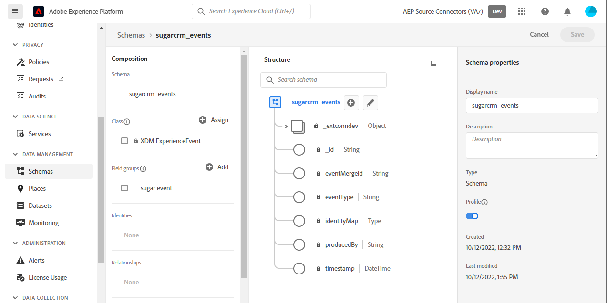
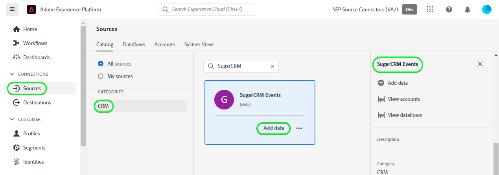
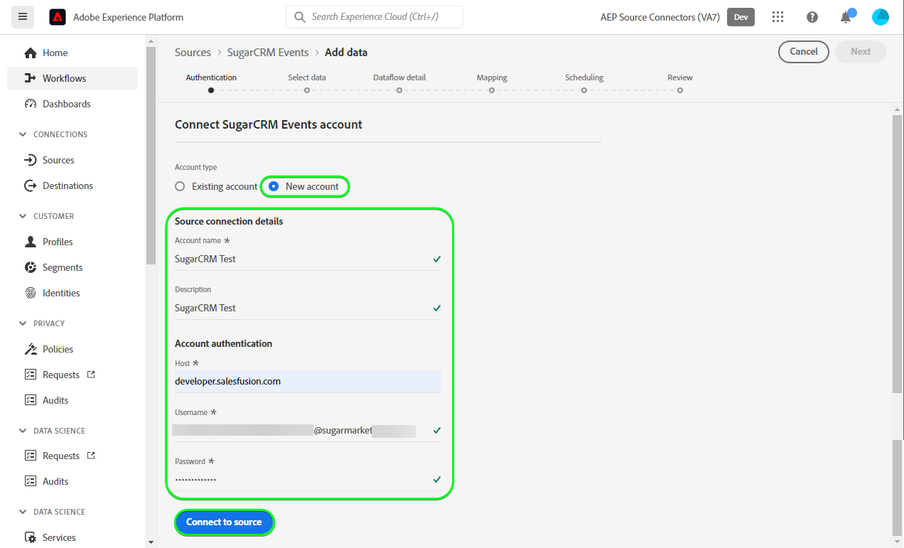
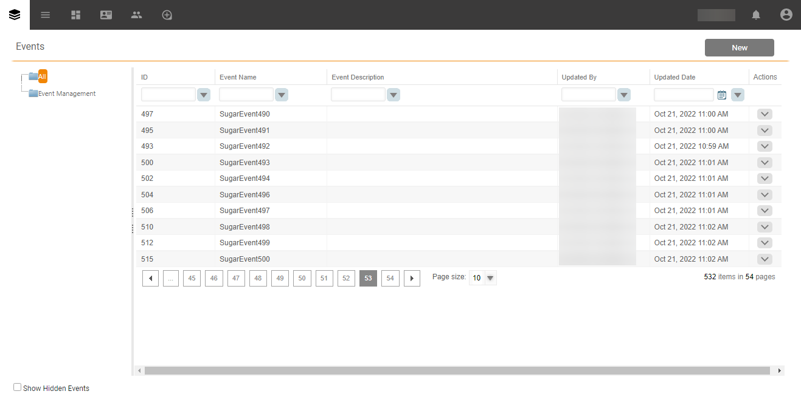

# (Beta) Create a [!DNL SugarCRM Events] source connection in the UI

>[!NOTE]
>
>The [!DNL SugarCRM Events] source is in beta. See the [sources overview](../../../../home.md#terms-and-conditions) for more information on using beta-labelled sources.

This tutorial provides steps for creating a [!DNL SugarCRM Events] source connection using the Adobe Experience Platform user interface.

## Getting started

This tutorial requires a working understanding of the following components of Experience Platform:

* [[!DNL Experience Data Model (XDM)] System](../../../../../xdm/home.md): The standardized framework by which [!DNL Experience Platform] organizes customer experience data.
  * [Basics of schema composition](../../../../../xdm/schema/composition.md): Learn about the basic building blocks of XDM schemas, including key principles and best practices in schema composition.
  * [Schema Editor tutorial](../../../../../xdm/tutorials/create-schema-ui.md): Learn how to create custom schemas using the Schema Editor UI.
* [[!DNL Real-Time Customer Profile]](../../../../../profile/home.md): Provides a unified, real-time consumer profile based on aggregated data from multiple sources.

If you already have a valid [!DNL SugarCRM] account, you may skip the remainder of this document and proceed to the tutorial on [configuring a dataflow](../../dataflow/crm.md).

### Gather required credentials

In order to connect [!DNL SugarCRM Events] to Platform, you must provide values for the following connection properties:

| Credential | Description | Example |
| --- | --- | --- |
| `Host` | The SugarCRM API endpoint the source connects to. | `developer.salesfusion.com` |
| `Username` | Your SugarCRM developer account username. | `abc.def@example.com@sugarmarketdemo000.com` |
| `Password` | Your SugarCRM developer account password. | `123456789` |

### Create a Platform schema for [!DNL SugarCRM]

Before creating a [!DNL SugarCRM] source connection, you must also ensure that you first create a Platform schema to use for your source. See the tutorial on [creating a Platform schema](../../../../../xdm/schema/composition.md) for comprehensive steps on how to create a schema.

>[!WARNING]
>
>When mapping the schema ensure you also map the mandatory `event_id` and `timestamp` fields required by Platform.

## Connect your [!DNL SugarCRM Events] account

In the Platform UI, select **[!UICONTROL Sources]** from the left navigation bar to access the [!UICONTROL Sources] workspace. The [!UICONTROL Catalog] screen displays a variety of sources with which you can create an account.

You can select the appropriate category from the catalog on the left-hand side of your screen. Alternatively, you can find the specific source you wish to work with using the search option.

Under the *CRM* category, select **[!UICONTROL SugarCRM Events]**, and then select **[!UICONTROL Add data]**.

The **[!UICONTROL Connect SugarCRM Events account]** page appears. On this page, you can either use new credentials or existing credentials.

### Existing account

To use an existing account, select the [!DNL SugarCRM Events] account you want to create a new dataflow with, then select **[!UICONTROL Next]** to proceed.

### New account

If you are creating a new account, select **[!UICONTROL New account]**, and then provide a name, an optional description, and your credentials. When finished, select **[!UICONTROL Connect to source]** and then allow some time for the new connection to establish.

## Next steps

By following this tutorial, you have established a connection to your [!DNL SugarCRM Events] account. You can now continue on to the next tutorial and [configure a dataflow to bring data into Platform](../../dataflow/crm.md).

## Additional resources

The sections below provide additional resources that you can refer to when using the [!DNL SugarCRM] source.

### Guardrails {#guardrails}

The [!DNL SugarCRM] API throttle rates are 90 calls per minute or 2000 calls per day, whichever happens first. However, this restriction has been circumvented by adding a parameter into the connection spec that will delay request time so that the rate limit is never reached.

### Validation {#validation}

To validate that you have correctly set up the source and [!DNL SugarCRM Events] data is being ingested, follow the steps below:

* In the Platform UI, select **[!UICONTROL View Dataflows]** beside the [!DNL SugarCRM Events] card menu on the sources catalog. Next, select **[!UICONTROL Preview dataset]** to verify the data that was ingested.

* Depending on the object type you are working with, you can verify the aggregated data against the counts visible on the [!DNL SugarMarket] Events page below: 

>[!NOTE]
>
>The [!DNL SugarMarket] pages do not include the deleted object counts. However, data retrieved through this source will also include the deleted count, these would be marked with a deleted flag.
