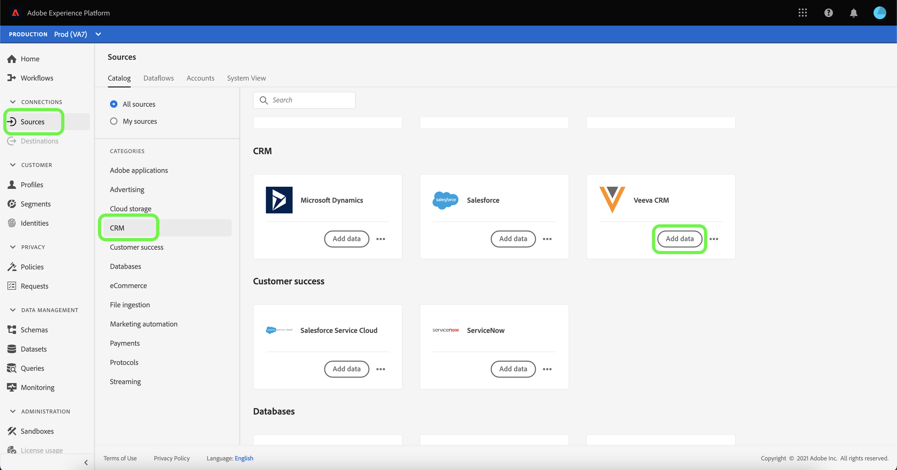
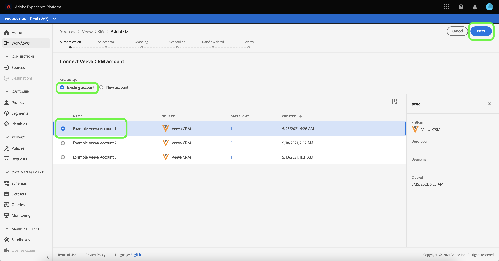
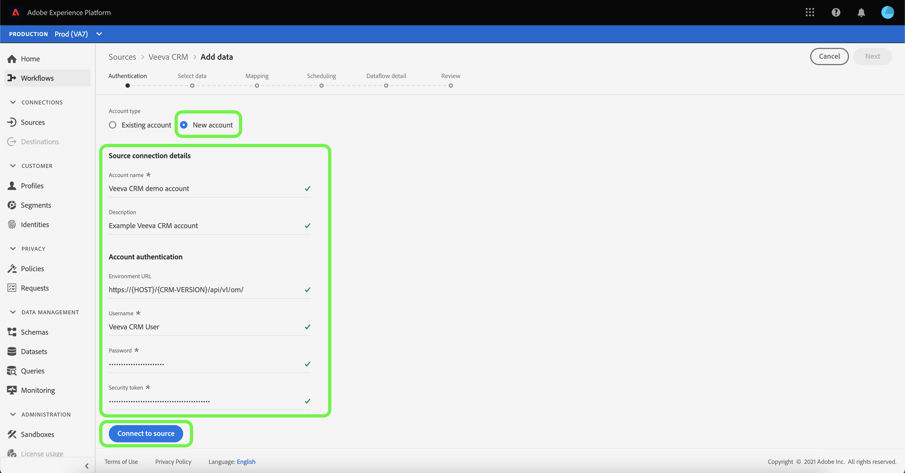

# Create a [!DNL Veeva CRM] source connection in the UI

Source connectors in Adobe Experience Platform provide the ability to ingest externally sourced CRM data on a scheduled basis. This tutorial provides steps for creating a [!DNL Veeva CRM] source connector using the [!DNL Platform] user interface.

## Getting started

This tutorial requires a working understanding of the following components of Adobe Experience Platform:

* [[!DNL Experience Data Model (XDM)] System](../../../../../xdm/home.md): The standardized framework by which [!DNL Experience Platform] organizes customer experience data.
  * [Basics of schema composition](../../../../../xdm/schema/composition.md): Learn about the basic building blocks of XDM schemas, including key principles and best practices in schema composition.
  * [Schema Editor tutorial](../../../../../xdm/tutorials/create-schema-ui.md): Learn how to create custom schemas using the Schema Editor UI.
* [[!DNL Real-Time Customer Profile]](../../../../../profile/home.md): Provides a unified, real-time consumer profile based on aggregated data from multiple sources.

If you already have a valid [!DNL Veeva CRM] account, you may skip the remainder of this document and proceed to the tutorial on [configuring a dataflow](../../dataflow/crm.md).

### Gather required credentials

| Credential | Description |
| ---------- | ----------- |
| `environmentUrl` | The URL of the [!DNL Veeva CRM] source instance. |
| `username` | The username for the [!DNL Veeva CRM] user account. |
| `password` | The password for the [!DNL Veeva CRM] user account. |
| `securityToken` | The security token for the [!DNL Veeva CRM] user account. |

For more information on getting started, refer to this [[!DNL Veeva CRM] document](https://developer.veevacrm.com/doc/Content/rest-api.htm).

## Connect your [!DNL Veeva CRM] account

Once you have gathered your required credentials, you can follow the steps below to link your [!DNL Veeva CRM] account to [!DNL Platform].

In the Platform UI, select **[!UICONTROL Sources]** from the left navigation bar to access the [!UICONTROL Sources] workspace. The [!UICONTROL Catalog] screen displays a variety of sources for which you can create an account with.

You can select the appropriate category from the catalog on the left-hand side of your screen. Alternatively, you can find the specific source you wish to work with using the search option.

Under the [!UICONTROL CRM] category, select **[!UICONTROL Veeva CRM]**, and then select **[!UICONTROL Add data]**.

The **[!UICONTROL Connect Veeva CRM account]** page appears. On this page, you can either use new credentials or existing credentials.

### Existing account

To use an existing account, select the [!DNL Veeva CRM] account you want to create a new dataflow with, then select **[!UICONTROL Next]** to proceed.

### New account

If you are creating a new account, select **[!UICONTROL New account]**, and then provide a name, an optional description, and your [!DNL Veeva CRM] credentials. When finished, select **[!UICONTROL Connect to source]** and then allow some time for the new connection to establish.

## Next steps

By following this tutorial, you have established a connection to your [!DNL Veeva CRM] account. You can now continue on to the next tutorial and [configure a dataflow to bring data into Platform](../../dataflow/crm.md).
