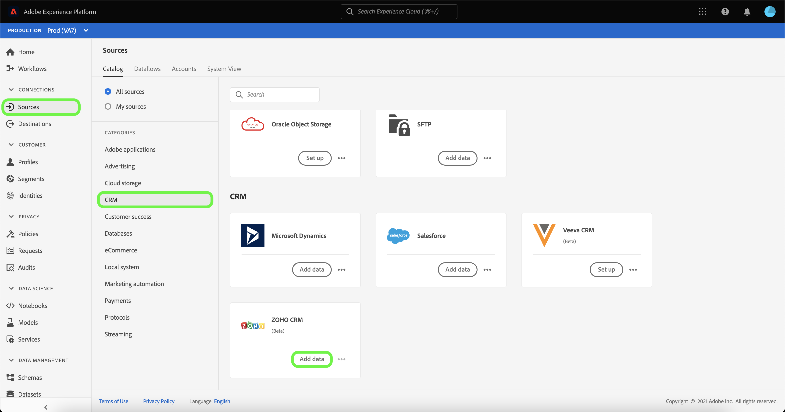
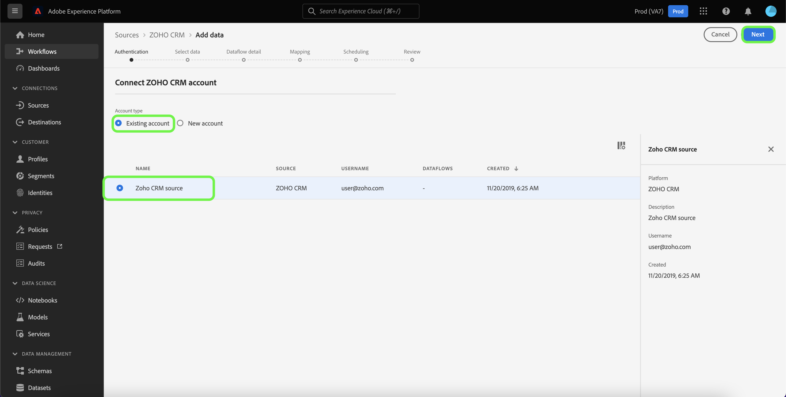
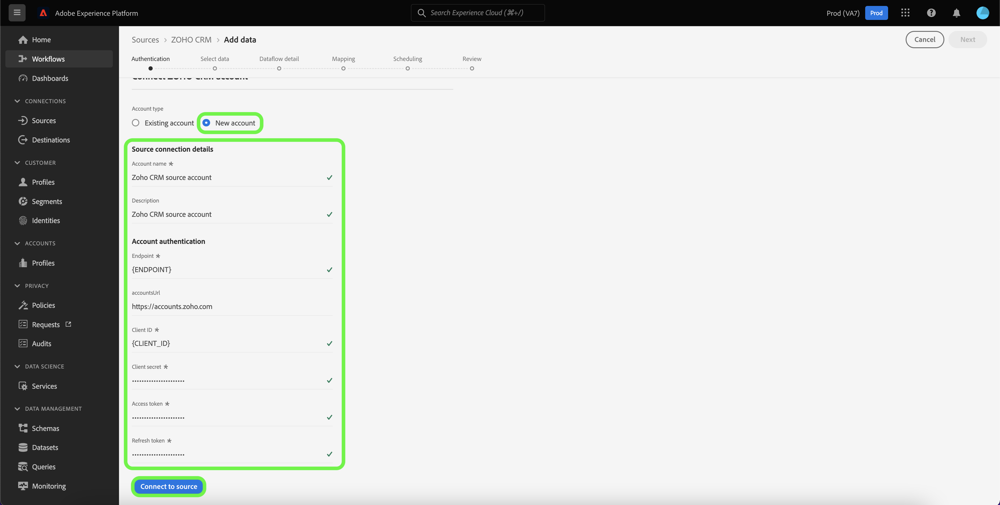

# Create a [!DNL Zoho CRM] source connection in the UI

Source connectors in Adobe Experience Platform provide the ability to ingest externally sourced CRM data on a scheduled basis. This tutorial provides steps for creating a [!DNL Zoho CRM] source connector using the [!DNL Platform] user interface.

## Getting started

This tutorial requires a working understanding of the following components of Adobe Experience Platform:

* [[!DNL Experience Data Model (XDM)] System](../../../../../xdm/home.md): The standardized framework by which [!DNL Experience Platform] organizes customer experience data.
  * [Basics of schema composition](../../../../../xdm/schema/composition.md): Learn about the basic building blocks of XDM schemas, including key principles and best practices in schema composition.
  * [Schema Editor tutorial](../../../../../xdm/tutorials/create-schema-ui.md): Learn how to create custom schemas using the Schema Editor UI.
* [[!DNL Real-Time Customer Profile]](../../../../../profile/home.md): Provides a unified, real-time consumer profile based on aggregated data from multiple sources.

If you already have a valid [!DNL Zoho CRM] account, you may skip the remainder of this document and proceed to the tutorial on [configuring a dataflow](../../dataflow/crm.md).

### Gather required credentials

In order to connect [!DNL Zoho CRM] to Platform, you must provide values for the following connection properties:

| Credential | Description |
| --- | --- |
| Endpoint | The endpoint of the [!DNL Zoho CRM] server you are making your request to. |
| Accounts URL | The accounts URL is used to generate your access and refresh tokens. The URL must be domain-specific. |
| Client ID | The client ID that corresponds with your [!DNL Zoho CRM] user account. |
| Client Secret | The client secret that corresponds with your [!DNL Zoho CRM] user account. |
| Access Token | The access token authorizes your secure and temporary access to your [!DNL Zoho CRM] account. |
| Refresh Token | A refresh token is a token used to generate a new access token, once your access token has expired. |

For more information on these credentials, see the documentation on [[!DNL Zoho CRM] authentication](https://www.zoho.com/crm/developer/docs/api/v2/oauth-overview.html).

## Connect your [!DNL Zoho CRM] account

Once you have gathered your required credentials, you can follow the steps below to link your [!DNL Zoho CRM] account to [!DNL Platform].

In the Platform UI, select **[!UICONTROL Sources]** from the left navigation bar to access the [!UICONTROL Sources] workspace. The [!UICONTROL Catalog] screen displays a variety of sources with which you can create an account.

You can select the appropriate category from the catalog on the left-hand side of your screen. Alternatively, you can find the specific source you wish to work with using the search option.

Under the [!UICONTROL CRM] category, select **[!UICONTROL Zoho CRM]**, and then select **[!UICONTROL Add data]**.

The **[!UICONTROL Connect Zoho CRM account]** page appears. On this page, you can either use new credentials or existing credentials.

### Existing account

To use an existing account, select the [!DNL Zoho CRM] account you want to create a new dataflow with, then select **[!UICONTROL Next]** to proceed.

### New account

If you are creating a new account, select **[!UICONTROL New account]**, and then provide a name, an optional description, and your [!DNL Zoho CRM] credentials. When finished, select **[!UICONTROL Connect to source]** and then allow some time for the new connection to establish.

>[!TIP]
>
>Your Accounts URL domain must correspond with your appropriate domain location. The following are the various domains and their corresponding accounts URLs:<ul><li>United States: https://accounts.zoho.com</li><li>Australia: https://accounts.zoho.com.au</li><li>Europe: https://accounts.zoho.eu</li><li>India: https://accounts.zoho.in</li><li>China: https://accounts.zoho.com.cn</li></ul>

## Next steps

By following this tutorial, you have established a connection to your [!DNL Zoho CRM] account. You can now continue on to the next tutorial and [configure a dataflow to bring data into Platform](../../dataflow/crm.md).
