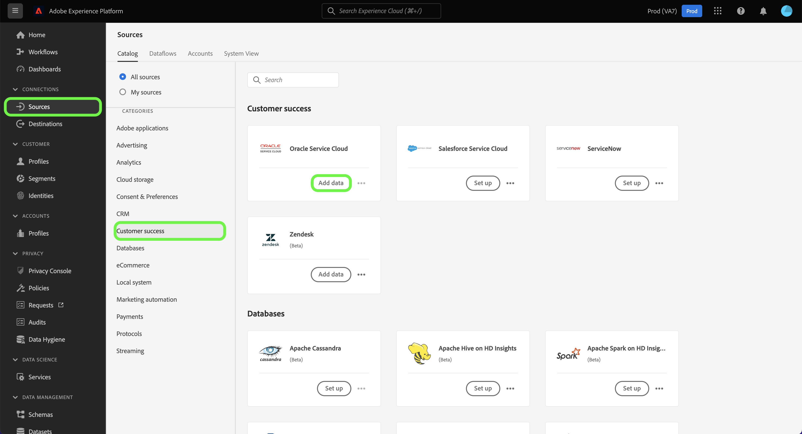
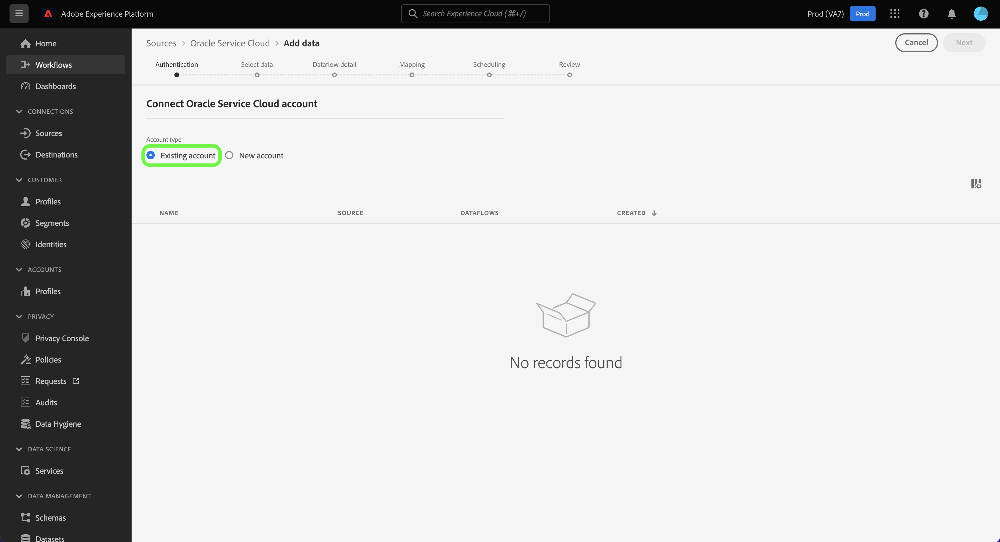
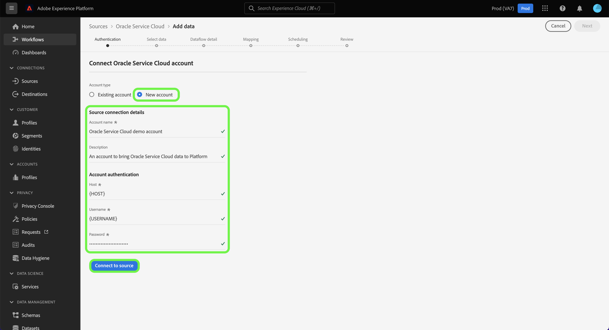

# (Beta) Create an Oracle Service Cloud source connection in the UI

>[!NOTE]
>
>The Oracle Service Cloud source is in beta. See the [sources overview](../../../../home.md#terms-and-conditions) for more information on using beta-labelled sources.

This tutorial provides steps for creating an Oracle Service Cloud source connection using the Adobe Experience Platform user interface.

## Getting started

This tutorial requires a working understanding of the following components of Experience Platform:

* [[!DNL Experience Data Model (XDM)] System](../../../../../xdm/home.md): The standardized framework by which Experience Platform organizes customer experience data.
  * [Basics of schema composition](../../../../../xdm/schema/composition.md): Learn about the basic building blocks of XDM schemas, including key principles and best practices in schema composition.
  * [Schema Editor tutorial](../../../../../xdm/tutorials/create-schema-ui.md): Learn how to create custom schemas using the Schema Editor UI.
*   [[!DNL Real-time Customer Profile]](../../../../../profile/home.md): Provides a unified, real-time consumer profile based on aggregated data from multiple sources.

If you already have a valid Oracle Service Cloud source connection, you may skip the remainder of this document and proceed to the tutorial on [configuring a dataflow](../../dataflow/customer-success.md)

### Gather required credentials

In order to access your Oracle Service Cloud account on [!DNL Platform], you must provide the following values:

| Credential | Description |
| ---------- | ----------- |
| Host | The host URL of your Oracle Service Cloud instance. |
| Username | The username for your Oracle Service Cloud user account. |
| Password | The password for your Oracle Service Cloud account. |

For more information on authenticating your Oracle Service Cloud account, refer to the [[!DNL Oracle] guide on authentication](https://docs.oracle.com/en/cloud/saas/b2c-service/20c/cxska/OKCS_Authenticate_and_Authorize.html).

## Connect your Oracle Service Cloud account

In the Platform UI, select **[!UICONTROL Sources]** from the left navigation to access the [!UICONTROL Sources] workspace. The [!UICONTROL Catalog] screen displays a variety of sources that can be used to create an account.

You can select the appropriate category from the catalog on the left-hand side of your screen. Alternatively, you can find the specific source you wish to work with using the search bar.

Under the [!UICONTROL Customer success] category, select **[!UICONTROL Oracle Service Cloud]** and then select **[!UICONTROL Add data]**.

The **[!UICONTROL Connect to Oracle Service Cloud]** page appears. On this page, you can either use new credentials or existing credentials.

### Existing account

To connect an existing account, select the Oracle Service Cloud account you want to connect with, then select **[!UICONTROL Next]** to proceed.

### New account

If you are using new credentials, select **[!UICONTROL New account]**. On the input form that appears, provide a name, an optional description, and your Oracle Service Cloud credentials. When finished, select **[!UICONTROL Connect to source]** and then allow some time for the new connection to establish.

## Next steps

By following this tutorial, you have established a connection to your Oracle Service Cloud account. You can now continue on to the next tutorial and [configure a dataflow to bring customer success data into Platform](../../dataflow/crm.md).
