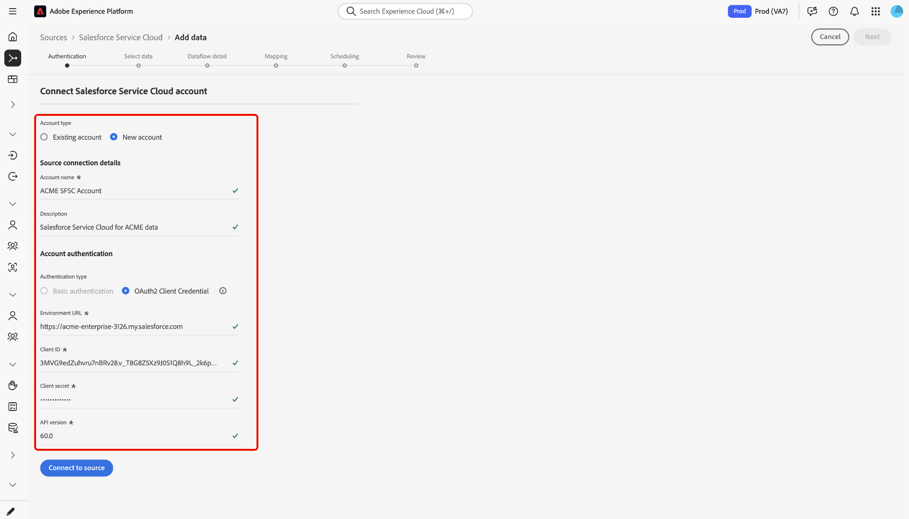

# Connect your [!DNL Salesforce Service Cloud] account to Experience Platform using the UI

Follow this step-by-step guide to seamlessly connect your [!DNL Salesforce Service Cloud] account and import your customer success data into Adobe Experience Platform.

## Getting started

This tutorial requires a working understanding of the following components of Experience Platform:

* [[!DNL Experience Data Model (XDM)] System](../../../../../xdm/home.md): The standardized framework by which Experience Platform organizes customer experience data.
    * [Basics of schema composition](../../../../../xdm/schema/composition.md): Learn about the basic building blocks of XDM schemas, including key principles and best practices in schema composition.
    * [Schema Editor tutorial](../../../../../xdm/tutorials/create-schema-ui.md): Learn how to create custom schemas using the Schema Editor UI.
* [[!DNL Real-Time Customer Profile]](../../../../../profile/home.md): Provides a unified, real-time consumer profile based on aggregated data from multiple sources.

If you already have a valid [!DNL Salesforce Service Cloud] connection, you may skip the remainder of this document and proceed to the tutorial on [configuring a dataflow for a customer success](../../dataflow/customer-success.md)

### Gather required credentials

Read the [authentication guide](../../../../connectors/customer-success/salesforce-service-cloud.md#credentials) for more information on retrieving your credentials.

## Connect your [!DNL Salesforce Service Cloud] account

In the Experience Platform UI, select **[!UICONTROL Sources]** from the left navigation to access the [!UICONTROL Sources] workspace. You can select the appropriate category from the catalog on the left-hand side of your screen. Alternatively, you can find the specific source you wish to work with using the search option.

Select **[!DNL Salesforce Service Cloud]** under the *[!UICONTROL Customer success]* category, and then select **[!UICONTROL Add data]**.

>[!TIP]
>
>Sources in the sources catalog display the **[!UICONTROL Set up]** option when a given source does not yet have an authenticated account. Once an authenticated account exists, this option changes to **[!UICONTROL Add data]**.

The **[!UICONTROL Connect to Salesforce Service Cloud]** page appears. On this page, you can either use new credentials or existing credentials.

### Use an existing account

To use an existing account, select **[!UICONTROL Existing account]**, and then select the desired account from the list that appears. When finished, select **[!UICONTROL Next]** to proceed.

### Create a new account

To create a new account, select **[!UICONTROL New account]** and provide a name and a description for your new [!DNL Salesforce Service Cloud] account. Next, select **[!UICONTROL OAuth2 Client Credential]** and then provide values for the following credentials:

* Environment URL
* Client ID
* Client secret
* API version

When finished, select **[!UICONTROL Connect to source]**.

## Next steps

By following this tutorial, you have established a connection to your [!DNL Salesforce Service Cloud] account. You can now continue on to the next tutorial and [configure a dataflow to bring Customer Success data into Experience Platform](../../dataflow/customer-success.md).
