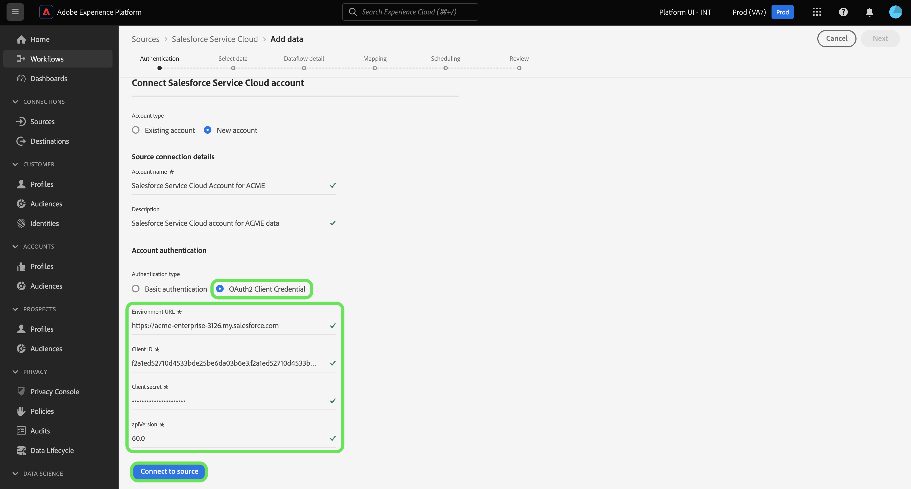

# Connect your [!DNL Salesforce Service Cloud] account to Experience Platform using the UI

This tutorial provides steps on how to connect your [!DNL Salesforce Service Cloud] account and bring your customer success data to Adobe Experience Platform using the Experience Platform user interface.

## Getting started

This tutorial requires a working understanding of the following components of Experience Platform:

* [[!DNL Experience Data Model (XDM)] System](../../../../../xdm/home.md): The standardized framework by which Experience Platform organizes customer experience data.
    * [Basics of schema composition](../../../../../xdm/schema/composition.md): Learn about the basic building blocks of XDM schemas, including key principles and best practices in schema composition.
    * [Schema Editor tutorial](../../../../../xdm/tutorials/create-schema-ui.md): Learn how to create custom schemas using the Schema Editor UI.
* [[!DNL Real-Time Customer Profile]](../../../../../profile/home.md): Provides a unified, real-time consumer profile based on aggregated data from multiple sources.

If you already have a valid [!DNL Salesforce Service Cloud] connection, you may skip the remainder of this document and proceed to the tutorial on [configuring a dataflow for a customer success](../../dataflow/customer-success.md)

### Gather required credentials

>[!WARNING]
>
>Basic authentication for the [!DNL Salesforce Service Cloud] source will be deprecated in January 2026. You must move to OAuth 2 Client Credential authentication in order to continue using the source and ingesting data from your [!DNL Salesforce Service Cloud] account to Experience Platform.

The [!DNL Salesforce Service Cloud] source supports basic authentication and OAuth2 Client Credential.

>[!BEGINTABS]

>[!TAB Basic authentication]

You must provide values for the following credentials to connect your [!DNL Salesforce Service Cloud] account using basic authentication.

| Credential | Description |
| --- | --- |
| Environment URL | The URL of the [!DNL Salesforce Service Cloud] source instance. |
| Username | The username for the [!DNL Salesforce Service Cloud] user account. |
| Password | The password for the [!DNL Salesforce Service Cloud] user account. |
| Security Token | The security token for the [!DNL Salesforce Service Cloud] user account. |
| API version | (Optional) The REST API version of the [!DNL Salesforce Service Cloud] instance that you are using. The value for the API version must be formatted with a decimal. For example, if you are using API version `52`, then you must input the value as `52.0`. If this field is left blank, Experience Platform will automatically use the latest available version. |

For more information on authentication, refer to [this [!DNL Salesforce Service Cloud] authentication guide](https://developer.salesforce.com/docs/atlas.en-us.api_rest.meta/api_rest/quickstart_oauth.htm).

>[!TAB OAuth2 Client Credential]

You must provide values for the following credentials to connect your [!DNL Salesforce Service Cloud] account using OAuth2 Client Credential.

| Credential | Description |
| --- | --- |
| Environment URL |  The URL of the [!DNL Salesforce Service Cloud] source instance. |
| Client ID | The client ID is used in tandem with the client secret as part of OAuth2 authentication. Together, the client ID and client secret enable your application to operate on behalf of your account by identifying your application to [!DNL Salesforce Service Cloud]. |
| Client secret | The client secret is used in tandem with the client ID as part of OAuth2 authentication. Together, the client ID and client secret enable your application to operate on behalf of your account by identifying your application to [!DNL Salesforce Service Cloud]. |
| API version | The REST API version of the [!DNL Salesforce Service Cloud] instance that you are using. The value for the API version must be formatted with a decimal. For example, if you are using API version `52`, then you must input the value as `52.0`. If this field is left blank, Experience Platform will automatically use the latest available version. |

For more information on using OAuth for [!DNL Salesforce Service Cloud], read the [[!DNL Salesforce Service Cloud] guide on OAuth Authorization Flows](https://help.salesforce.com/s/articleView?id=sf.remoteaccess_oauth_flows.htm&type=5).

>[!ENDTABS]

Once you have gathered your required credentials, you can follow the steps below to connect your [!DNL Salesforce Service Cloud] account to Experience Platform.

## Connect your [!DNL Salesforce Service Cloud] account

In the Experience Platform UI, select **[!UICONTROL Sources]** from the left navigation to access the [!UICONTROL Sources] workspace. You can select the appropriate category from the catalog on the left-hand side of your screen. Alternatively, you can find the specific source you wish to work with using the search option.

Select **[!DNL Salesforce Service Cloud]** under the *[!UICONTROL Customer success]* category, and then select **[!UICONTROL Add data]**.

>[!TIP]
>
>Sources in the sources catalog display the **[!UICONTROL Set up]** option when a given source does not yet have an authenticated account. Once an authenticated account exists, this option changes to **[!UICONTROL Add data]**.

The **[!UICONTROL Connect to Salesforce Service Cloud]** page appears. On this page, you can either use new credentials or existing credentials.

### Use an existing account

To use an existing account, select **[!UICONTROL Existing account]**, and then select the desired account from the list that appears. When finished, select **[!UICONTROL Next]** to proceed.

### Create a new account

To create a new account, select **[!UICONTROL New account]** and provide a name and a description for your new [!DNL Salesforce Service Cloud] account.

Next, select the authentication type that you would like to use for your new account.

>[!BEGINTABS]

>[!TAB Basic authentication]

For basic authentication, select **[!UICONTROL Basic authentication]** and then provide values for the following credentials:

* Environment URL
* Username
* Password
* API version (optional)

When finished, select **[!UICONTROL Connect to source]**.

>[!TAB OAuth2 Client Credential]

For OAuth 2 Client Credential, select **[!UICONTROL OAuth2 Client Credential]** and then provide values for the following credentials:

* Environment URL
* Client ID
* Client secret
* API version

When finished, select **[!UICONTROL Connect to source]**.

>[!ENDTABS]

## Next steps

By following this tutorial, you have established a connection to your [!DNL Salesforce Service Cloud] account. You can now continue on to the next tutorial and [configure a dataflow to bring Customer Success data into Experience Platform](../../dataflow/customer-success.md).
