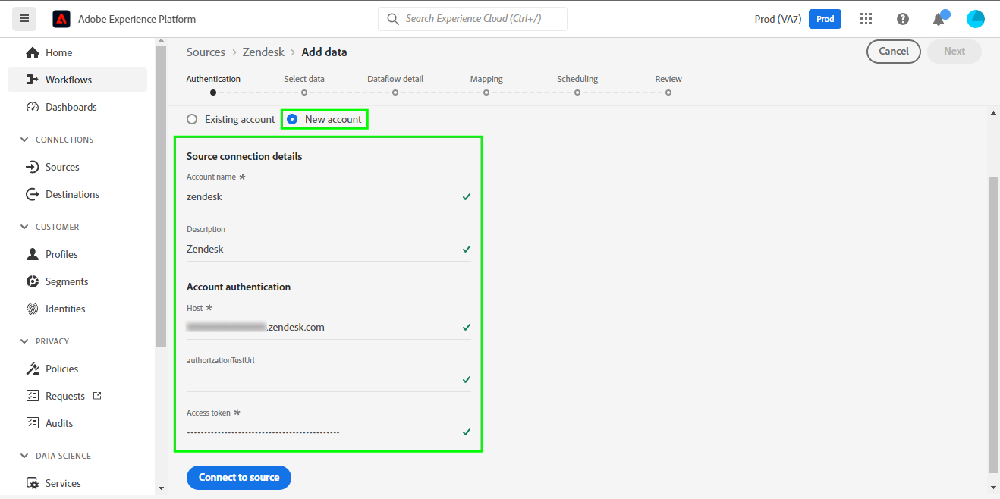

# (Beta) Create a [!DNL Zendesk] source connection in the UI

>[!NOTE]
>
>The [!DNL Zendesk] source is in beta. See the [sources overview](../../../../home.md#terms-and-conditions) for more information on using beta-labelled sources.

This tutorial provides steps for creating a [!DNL Zendesk] source connection using the Adobe Experience Platform user interface.

## Getting started

This tutorial requires a working understanding of the following components of Adobe Experience Platform:

* [[!DNL Experience Data Model (XDM)] System](../../../../../xdm/home.md): The standardized framework by which [!DNL Experience Platform] organizes customer experience data.
  * [Basics of schema composition](../../../../../xdm/schema/composition.md): Learn about the basic building blocks of XDM schemas, including key principles and best practices in schema composition.
  * [Schema Editor tutorial](../../../../../xdm/tutorials/create-schema-ui.md): Learn how to create custom schemas using the Schema Editor UI.
* [[!DNL Real-time Customer Profile]](../../../../../profile/home.md): Provides a unified, real-time consumer profile based on aggregated data from multiple sources.

### Gather required credentials

In order to access your [!DNL Zendesk] account on Platform, you must provide values for the following credentials:

| Credential | Description | Example |
| --- | --- | --- |
| Host | The unique domain specific to your account created during the registration process. | `https://yoursubdomain.zendesk.com`|
| Access token | Zendesk API token. |`0lZnClEvkJSTQ7olGLl7PMhVq99gu26GTbJtf` |

For more information on authenticating your [!DNL Zendesk] source, see the [[!DNL Zendesk] source overview](../../../../connectors/customer-success/zendesk.md).

### Create a Platform schema for [!DNL Zendesk]

Before creating a [!DNL Zendesk] source connection, you must also ensure that you first create a Platform schema to use for your source. See the tutorial on [creating a Platform schema](../../../../../xdm/schema/composition.md) for comprehensive steps on how to create a schema.

For additional guidance on your [!DNL Zendesk] schema required for the [!DNL Zendesk Search API], refer to the [limits](#limits) section below.

## Connect your [!DNL Zendesk] account

In the Platform UI, select **[!UICONTROL Sources]** from the left navigation bar to access the [!UICONTROL Sources] workspace. The [!UICONTROL Catalog] screen displays a variety of sources with which you can create an account.

You can select the appropriate category from the catalog on the left-hand side of your screen. Alternatively, you can find the specific source you wish to work with using the search option.

Under the *Customer Success* category, select **[!UICONTROL Zendesk]**, and then select **[!UICONTROL Add data]**.

The **[!UICONTROL Connect Zendesk account]** page appears. On this page, you can either use new credentials or existing credentials.

### Existing account

To use an existing account, select the *Zendesk* account you want to create a new dataflow with, then select **[!UICONTROL Next]** to proceed.

### New account

If you are creating a new account, select **[!UICONTROL New account]**, and then provide a name, an optional description, and your credentials. When finished, select **[!UICONTROL Connect to source]** and then allow some time for the new connection to establish.

## Next steps

By following this tutorial, you have authenticated and created a source connection between your [!DNL Zendesk] account and Platform. You can now continue on to the next tutorial and [create a dataflow to bring customer success data into Platform](../../dataflow/customer success.md).

## Additional resources

The sections below provides additional resources that you can refer to when using the [!DNL Zendesk] source.

### Validation {#validation}

The following outlines steps to validate that you have successfully connected your [!DNL Zendesk] source and that [!DNL Zendesk] profiles are being ingested to Platform.

In the Platform UI, select **[!UICONTROL Datasets]** from the left navigation to access the [!UICONTROL Datasets] workspace. The [!UICONTROL Dataset Activity] screen displays the details of executions.

Next, select the dataflow run ID of the dataflow that you want to view to see specific details about that dataflow run.

To see details around your schema, select **[!UICONTROL Data governance]**.

Finally, select **[!UICONTROL Preview dataset]** to display the data that was ingested.

### Zendesk schema

The table below lists the supported mappings that must be set up for Zendesk. 

>[!TIP]
>
>See [Zendesk Search API > Export Search Results](https://developer.zendesk.com/api-reference/ticketing/ticket-management/search/#export-search-results) for more information on the API.

| Source | Schema Target | Type |
|---|---|---|
|results.active|_extconndev.active|Boolean|
|results.alias|_extconndev.alias||
|results.created_at|_extconndev.created_at|String|
|results.custom_role_id|_extconndev.custom_role_id||
|results.default_group_id|_extconndev.default_group_id||
|results.details|_extconndev.details||
|results.email|_extconndev.email|String|
|results.external_id|_extconndev.external_id||
|results.iana_time_zone|_extconndev.iana_time_zone|String|
|results.id|_extconndev.id|Integer|
|results.last_login_at|_extconndev.last_login_at||
|results.locale|_extconndev.locale|String|
|results.locale_id|_extconndev.locale_id|Integer|
|results.moderator|_extconndev.moderator|Boolean|
|results.name|_extconndev.name|String|
|results.notes|_extconndev.notes||
|results.only_private_comments|_extconndev.only_private_comments|Boolean|
|results.organization_id|_extconndev.organization_id||
|results.phone|_extconndev.phone||
|results.photo|_extconndev.photo||
|results.report_csv|_extconndev.report_csv|Boolean|
|results.restricted_agent|_extconndev.restricted_agent|Boolean|
|results.result_type|_extconndev.result_type|String|
|results.role|_extconndev.role|String|
|results.role_type|_extconndev.role_type||
|results.shared|_extconndev.shared|Boolean|
|results.shared_agent|_extconndev.shared_agent|Boolean|
|results.shared_phone_number|_extconndev.shared_phone_number||
|results.signature|_extconndev.signature||
|results.suspended|_extconndev.suspended|Boolean|
|results.ticket_restriction|_extconndev.ticket_restriction|String|
|results.time_zone|_extconndev.time_zone|String|
|results.two_factor_auth_enabled|_extconndev.two_factor_auth_enabled|Boolean|
|results.updated_at|_extconndev.updated_at|String|
|results.url|_extconndev.url|String|
|results.verified|_extconndev.verified|Boolean|

{style="table-layout:auto"}

### Limits {#limits}

* The [Zendesk Search API > Export Search Results](https://developer.zendesk.com/api-reference/ticketing/ticket-management/search/#export-search-results) returns a maximum of 1000 records per page. 
  * The value for the ``filter[type]`` parameter is set to ``user`` and hence the Zendesk connection only returns users.
  * The number of results per page is managed by the ``page[size]`` parameter. The value is set to ``100``. This is done to reduce the impact of speed reduction constraints set by Zendesk.
  * See [Limits](https://developer.zendesk.com/api-reference/ticketing/ticket-management/search/#limits) and [Pagination](https://developer.zendesk.com/api-reference/ticketing/ticket-management/search/#pagination-1). 
  * You can also refer to [Paginating through lists using cursor pagination](https://developer.zendesk.com/documentation/developer-tools/pagination/paginating-through-lists-using-cursor-pagination/).