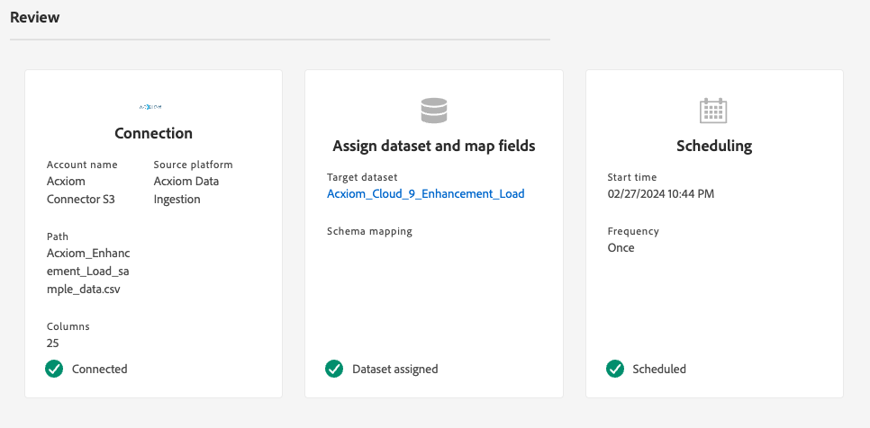

# Create an [!DNL Acxiom Data Ingestion] source connection and dataflow in the UI

>[!NOTE]
>
>The [!DNL Acxiom Data Ingestion] source is in beta. Read the [terms and conditions](../../../../home.md#terms-and-conditions) in the sources overview for more information on using beta-labeled sources.

Use the [!DNL Acxiom Data Ingestion] source to ingest [!DNL Acxiom] data into Real-Time Customer Data Platform and enrich first-party profiles. Then, you can use your [!DNL Acxiom]-enriched first-party profiles to improve audiences and activate across marketing channels.

Read this tutorial to learn how to create an [!DNL Acxiom Data Ingestion] source connection and dataflow using the Adobe Experience Platform user interface. The [!DNL Acxiom Data Ingestion] source is used to retrieve and map response from [!DNL Acxiom] enhancement service using Amazon S3 as a drop point.

## Prerequisites {#prerequisites}

This tutorial requires a working understanding of the following components of Experience Platform:

* [[!DNL Experience Data Model (XDM)] System](../../../../../xdm/home.md): The standardized framework by which Experience Platform organizes customer experience data.
    * [Basics of schema composition](../../../../../xdm/schema/composition.md): Learn about the basic building blocks of XDM schemas, including key principles and best practices in schema composition.
    * [Schema Editor tutorial](../../../../../xdm/tutorials/create-schema-ui.md): Learn how to create custom schemas using the Schema Editor UI.
* [[!DNL Real-Time Customer Profile]](../../../../../profile/home.md): Provides a unified, real-time consumer profile based on aggregated data from multiple sources.

### Gather required credentials

In order to access your bucket on Experience Platform, you need to provide valid values for the following credentials:

| Credential | Description |
| --- | --- |
| [!DNL Acxiom] authentication key | The authentication key. You can retrieve this value from the [!DNL Acxiom] team. |
| [!DNL Amazon S3] access key | The access key ID for your bucket. You can retrieve this value from the [!DNL Acxiom] team. |
| [!DNL Amazon S3] secret key | The secret key ID for your bucket. You can retrieve this value from the [!DNL Acxiom] team. |
| Bucket name | This is your bucket where files will be shared. You can retrieve this value from the [!DNL Acxiom] team. |

>[!IMPORTANT]
>
>You must have both **[!UICONTROL View Sources]** and **[!UICONTROL Manage Sources]** permissions enabled for your account in order to connect your [!DNL Acxiom] account to Experience Platform. Contact your product administrator to obtain the necessary permissions. For more information, read the [access control UI guide](../../../../../access-control/ui/overview.md).

## Connect your [!DNL Acxiom] account

In the Platform UI, select **[!UICONTROL Sources]** from the left navigation bar to access the [!UICONTROL Sources] workspace. The [!UICONTROL Catalog] screen displays a variety of sources for which you can create an account with.

You can select the appropriate category from the catalog on the left-hand side of your screen. Alternatively, you can find the specific source you wish to work with using the search option.

Under the **[!UICONTROL Data & Identity Partners]** category, select **[!UICONTROL Acxiom Data Ingestion]** and then select **[!UICONTROL Set up]**.

>[!TIP]
>
>A source card that displays **[!UICONTROL Add data]** means that the source already has an authenticated account. On the other hand, a source card that displays **[!UICONTROL Set up]** means that you must provide credentials and create a new account in order to use that source.

### Create a new account

If you are using new credentials, select **[!UICONTROL New account]**. On the input form that appears, provide a name, an optional description, and your [!DNL Acxiom] credentials. When finished, select **[!UICONTROL Connect to source]** and then allow some time for the new connection to establish.

| Credentials | Description |
| --- | --- |
| Account Name | The name of the account. |
| Description | (Optional) A brief explanation of the purpose of the account. |
| [!DNL Acxiom] authentication key | The [!DNL Acxiom]-provided key required for account approval. This must match the proper value before a connection to the database can be made.  This key must be 24 characters and can only include: A-Z, a-z, and 0-9. |
| S3 access key | The S3 access key references the Amazon S3 location. This is provided by your administrator when S3 role permissions are defined. |
| S3 secret key | The S3 secret key references the Amazon S3 location. This is provided by your administrator when S3 role permissions are defined. |
| s3SessionToken | (Optional) The authentication token value when connection to S3. |
| serviceUrl | (Optional) The URL location to be used when connecting to S3 in a non-standard location. |
| Bucket name | (Optional) The name of the S3 bucket set up on S3 that serves as a starting path in data selection. |
| Folder path | If subdirectories in a bucket are used, then you can also specify a path as a starting path in data selection. |

### Use an existing account

To use an existing account, select **[!UICONTROL Existing account]**.

Select an account from the list to view details on that account. Once you have selected an account, select **[!UICONTROL Next]** to proceed.

## Select Data

Select the file that you want to ingest from the desired bucket and sub-directory. A preview of the data can be provided once delimiter and compression type is defined. Once you have selected your file, select **[!UICONTROL Next]** to proceed.

>[!NOTE]
>
>While JSON and Parquet file types are listed, you are not required or expected to use them during the [!DNL Acxiom] source workflow.

## Provide dataset and dataflow details

Next, you must provide information regarding your dataset and your dataflow.

### Dataset details

>[!BEGINTABS]

>[!TAB Use a new dataset]

A dataset is a storage and management construct for a collection of data, typically a table, that contains a schema (columns) and fields (rows). Data that is successfully ingested into Experience Platform is persisted within the data lake as datasets. To use a new dataset, select **[!UICONTROL New dataset]**.

| New dataset details | Description |
| --- | --- |
| Output dataset name | The name of the new dataset. |
| Description | (Optional) A brief explanation of the purpose of the dataset. |
| Schema | A dropdown list of schemas that exist in your organization. You can also create your own schema prior to the source configuration process. For more information, read the guide on [creating schema in the UI](../../../../../xdm/tutorials/create-schema-ui.md). |

>[!TAB Use an existing dataset]

To use an existing dataset, select **[!UICONTROL Existing dataset]**.

You can select **[!UICONTROL Advanced search]** to view a window of all datasets your organization, including their respective details such as whether they are enabled for ingestion to Real-Time Customer Profile.

>[!ENDTABS]

+++Select for steps to enable Profile ingestion, error diagnostics, and partial ingestion.

If your dataset is enabled for Real-Time Customer Profile, then during this step, you can toggle **[!UICONTROL Profile dataset]** to enable your data for Profile-ingestion. You can also use this step to enable **[!UICONTROL Error diagnostics]** and **[!UICONTROL Partial ingestion]**.

* **[!UICONTROL Error diagnostics]**: Select **[!UICONTROL Error diagnostics]** to instruct the source to produce error diagnostics that you can later reference when monitoring your dataset activity and dataflow status.
* **[!UICONTROL Partial ingestion]**: Partial batch ingestion is the ability to ingest data containing errors, up to a certain configurable threshold. This feature allows you to successfully ingest all of your accurate data into Experience Platform, while all of your incorrect data is batched separately with information on why it is invalid.

+++

### Dataflow details

Once your dataset is configured, you must then provide details on your dataflow, including a name, an optional description, and alert configurations.

| Dataflow configurations | Description |
| --- | --- |
| Dataflow name | The name of the dataflow.  By default, this will use the name of the file that is being imported. |
| Description | (Optional) A brief description of your dataflow. |
| Alerts | Experience Platform can produce event-based alerts which users can subscribe to, these options all a running dataflow to trigger these.  For more information, read the [alerts overview](../../alerts.md) <ul><li>**Sources Dataflow Run Start**: Select this alert to receive a notification when your dataflow run begins.</li><li>**Sources Dataflow Run Success**: Select this alert to receive a notification if your dataflow ends without any errors.</li><li>**Sources Dataflow Run Failure**: Select this alert to receive a notification if your dataflow run ends with any errors.</li></ul> |

## Mapping

Use the mapping interface to map your source data to the appropriate schema fields before ingesting data to Experience Platform.  For more information, read the [mapping guide in the UI](../../../../../data-prep/ui/mapping.md)

## Schedule your dataflow ingestion

Next, use the scheduling interface to define the ingestion schedule of your dataflow.

| Scheduling configuration | Description |
| --- | --- |
| Frequency | Configure frequency to indicate how often the dataflow should run. You can set your frequency to: <ul><li>**Once**: Set your frequency to `once` to create a one-time ingestion. Configurations for interval and backfill are unavailable when creating a one-time ingestion dataflow. By default, the scheduling frequency is set to once.</li><li>**Minute**: Set your frequency to `minute` to schedule your dataflow to ingest data on a per-minute basis.</li><li>**Hour**:Set your frequency to `hour` to schedule your dataflow to ingest data on a per-hour basis.</li><li>**Day**: Set your frequency to `day` to schedule your dataflow to ingest data on a per-day basis.</li><li>**Week**: Set your frequency to `week` to schedule your dataflow to ingest data on a per-week basis.</li></ul> |
| Interval |  Once you select a frequency, you can then configure the interval setting to establish the time frame between every ingestion. For example, if you set your frequency to day and configure the interval to 15, then your dataflow will run every 15 days. **Note**: You cannot set interval to zero. |
| Start Time | The timestamp for the projected run, presented in UTC time zone. |
| Backfill | Backfill determines what data is initially ingested. If backfill is enabled, all current files in the specified path will be ingested during the first scheduled ingestion. If backfill is disabled, only the files that are loaded in between the first run of ingestion and the start time will be ingested. Files loaded prior to start time will not be ingested. |

## Review your dataflow

Use the review page for a summary of your dataflow prior to ingestion. Details are grouped in the following categories:

* **Connection** - Shows the source type, the relevant path of the chosen source file, and the number of columns within that source file.
* **Assign dataset & map fields** - Shows which dataset the source data is being ingested into, including the schema that the dataset adheres to.
* **Scheduling** - Shows that active period, frequency, and interval of the ingestion schedule.
  Once you have reviewed your dataflow, click Finish and allow some time for the dataflow to be created.

## Next steps

By following this tutorial, you have successfully created a dataflow to bring batch data from your [!DNL Acxiom] source to Experience Platform. For additional resources, visit the documentation outlined below.

### Monitor your dataflow

Once your dataflow has been created, you can monitor the data that is being ingested through it to view information on ingestion rates, success, and errors. For more information on how to monitor dataflow, visit the tutorial on [monitoring accounts and dataflows in the UI](../../../../../dataflows/ui/monitor-sources.md).

### Update your dataflow

To update configurations for your dataflows scheduling, mapping, and general information, visit the tutorial on [updating sources dataflows in the UI](../../update-dataflows.md).

### Delete your dataflow

You can delete dataflows that are no longer necessary or were incorrectly created using the **[!UICONTROL Delete]** function available in the **[!UICONTROL Dataflows]** workspace. For more information on how to delete dataflows, visit the tutorial on [deleting dataflows in the UI](../../delete.md).

## Additional resources {#additional-resources}

For more information, read the [[!DNL Acxiom] InfoBase](https://www.acxiom.com/wp-content/uploads/2022/02/fs-acxiom-infobase_AC-0268-22.pdf).
