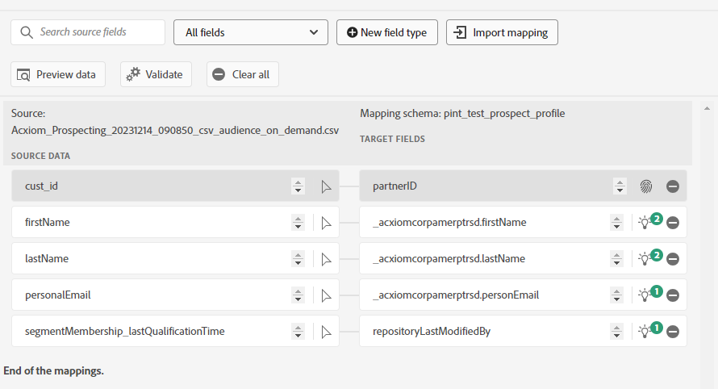

# Create an [!DNL Acxiom Infobase Data Import] source connection and dataflow in the UI. {#overview}
>[!NOTE]
>
>The [!DNL Acxiom Infobase Data Import] source is in beta. Please read the [sources overview](../../../../home.md#terms-and-conditions) for more information on using beta-labeled sources.

Acxiom’s Infobase Data Import for Adobe Real-Time Customer Data Platform is a process for delivering the most productive prospect audiences possible. [ACXIOM] takes Adobe CDP first-party data via a secure export and runs that data through an award-winning hygiene and identity resolution system/process. This produces a data file to be used as a suppression list. Then, that data file is matched against the Acxiom Global database which enables the prospect lists to be tailored for import.

Read this tutorial to learn how to create an [!DNL Acxiom Infobase Data Import] source connection and dataflow using the Adobe Experience Platform user interface.  This Connector is used to retrieve and map response from Acxiom prospect service using S3 as a drop point.

## Prerequisites {#prerequisites}

>This tutorial requires a working understanding of the following components of Experience Platform:

* [[!DNL Experience Data Model (XDM)] System](../../../../../xdm/home.md): The standardized framework by which Experience Platform organizes customer experience data.
    * [Basics of schema composition](../../../../../xdm/schema/composition.md): Learn about the basic building blocks of XDM schemas, including key principles and best practices in schema composition.
    * [Schema Editor tutorial](../../../../../xdm/tutorials/create-schema-ui.md): Learn how to create custom schemas using the Schema Editor UI.
* [[!DNL Real-Time Customer Profile]](../../../../../profile/home.md): Provides a unified, real-time consumer profile based on aggregated data from multiple sources.
* [[!DNL Prospect Profile]](../../../../../profile/ui/prospect-profile.md): Learn how to create and use prospect profile to gather information about unknown customers using third-party information.

### Gather required credentials

In order to access your bucket on Experience Platform, you need to provide valid values for the following credentials:

| Credential | Description |
| --- | --- |
| Acxiom authentication key | The authentication key. You can retrieve this value from the [!DNL Acxiom] team. |
| S3 Access key | The access key ID for your bucket. You can retrieve this value from the [!DNL Acxiom] team. |
| S3 Secret key | The secret key ID for your bucket. You can retrieve this value from the [!DNL Acxiom] team. |
| Bucket name | This is your bucket where files will be shared. You can retrieve this value from the [!DNL Acxiom] team. |

>[!IMPORTANT]
>
>To connect to the source, you need the **[!UICONTROL View Sources]** and **[!UICONTROL Manage Sources]** [access control permissions](/help/access-control/home.md#permissions). Read the [access control overview](/help/access-control/ui/overview.md) or contact your product administrator to obtain the required permissions.

## Connect your [!DNL Acxiom] Account

You can find the [!DNL Acxiom] source in the sources catalog under the "Data Partners" header.  Sources cards are initially labeled with "Set up". Once you have created an account, this label changes to "Add data", which you can use to access existing accounts or create more new accounts.  Select the ellipses (...) for options to view existing accounts and dataflows, as well as the documentation.
 

Source Configuration and Authentication - Defined S3 account associated with [!DNL Acxiom] prospect response.

## Existing Account
A list of existing accounts for Infobase data appears. Select an account from the list to view details on that account.
 
## New Account
If you are creating a new account, select a new [!DNL Acxiom] Managed S3 location, and then provide a name, an optional description, and your credentials.  Once you have provided your credentials, select Connect to source and allow for a few moments for the connection to establish.
 
* **Account Name (Required)** - The name of the account.
* **Description (Optional)** - A brief explanation of the purpose of the account.
* **Account Authentication**
    * **Enter [!DNL Acxiom] authentication key (Required)** - The [!DNL Acxiom]-provided key required for account approval. This must match the proper value before a connection to the database can be made.  This key must be 24 characters and can only include: A-Z, a-z, and 0-9.
    * **S3 access key (Required)** - The S3 access key references the Amazon S3 location. This is provided by your administrator when S3 role permissions are defined.
    * **S3 secret key (Required)** - The S3 secret key references the Amazon S3 location. This is provided by your administrator when S3 role permissions are defined.
    * **s3SessionToken (Optional)** - The authentication token value when connection to S3.
    * **serviceUrl (Optional)** - The URL location to be used when connecting to S3 in a non-standard location.
    * **Bucket name (Optional)** - The name of the S3 bucket set up on S3 that serves as a starting path in data selection.
    * **Folder path** - If subdirectories in a bucket are used, then you can also specify a path as a starting path in data selection.

## Select Data
Select the file that you want to ingest from the desired bucket and sub-directory.  A preview of the data can be provided once delimiter and compression type is defined.
     
>[!NOTE]
>
>While JSON and Parquet file types are listed, you are not required or expected to use them during the [!DNL Acxiom] source worfklow.
## Provide dataset and dataflow details

* **Dataset Details**
    * **Target Dataset (Required)** - A dataset is a storage and management construct for a collection of data, typically a table, that contains a schema (columns) and fields (rows). Data that is successfully ingested into Adobe Experience Platform is persisted within the Data Lake as datasets.
        * **New Dataset** - Select **New dataset** to create a new dataset and define a schema structure.
            * **Output dataset name (Required)** - The name of the new dataset.
            * **Description (Optional)** - A brief explanation of the purpose of the dataset.
            * **Schema (Required)** - A dropdown list of schemas that exist in your organization. You can also create your own schema prior to the source configuration process. For more information, read the guide on [creating schema in the UI](../../../../../xdm/tutorials/create-schema-ui.md)
                     
    * **Existing Dataset** - Select **Existing dataset** to use an existing dataset.
        * **Advanced Search** - This option is an expansion of the existing dataset dropdown, presenting additional details on the datasets before selection, including details such as if they are profile enabled, the date they were created or the selected behavior of the dataset.
                 
    * **Profile Dataset** - Toggle to enable your dataset for ingestion to Real-Time Customer Profile.
    * **Error Diagnostics** - Select **Error diagnostics** to instruct the source to produce error diagnostics that you can later reference using APIs. For more information, read the [error diagnostics overview](../../../../../ingestion/quality/error-diagnostics.md)
    * **Enable Partial Ingestion** - Partial batch ingestion is the ability to ingest data containing errors, up to a certain threshold. With this capability, users can successfully ingest all their correct data into Adobe Experience Platform while all their incorrect data is batched separately, along with details as to why it is invalid.  For more information, read the [Partial ingestion overview](../../../../../ingestion/batch-ingestion/partial.md)
* **Dataflow Details**
    * **Dataflow Name** - The name of the dataflow.  By default, this will use the name of the file that is being imported.
    * **Description (Optional)** - A brief description of your dataflow.
* **Alerts** - Adobe Experience Platform can produce event-based alerts which users can subscribe to, these options all a running dataflow to trigger these.  For more information, read the [alerts overview](../../alerts.md)
    * **Sources Dataflow Run Start** - Issues an alert when the dataflow starts.
    * **Sources Dataflow Run Success** - Issues an alert when the dataflow ends without error.
    * **Sources Dataflow Run Failure** - Issues an alert when the dataflow ends with a failure status.
           

## Mapping

Use the mapping interface to map your source data to the appropriate schema fields before ingesting data to Experience Platform.  For more information, read the [mapping guide in the UI](../../../../../data-prep/ui/mapping.md)

 

## Schedule your dataflow ingestion
Use the scheduling interface to define the ingestion schedule of your dataflow.

* **Frequency** - Indicates how often the flow should be run, once a week, day, hour, minute.  Or simply to only run once.
* **Interval** - When a Frequency is selected other than once, interval to establish a set time frame between every ingestion. For example, an ingestion frequency set to Day and an interval set to 15 means that your dataflow is scheduled to ingest data every 15 days.
* **Start Time** - The timestamp for the projected run, presented in UTC time zone.
* **Backfill** - A boolean value that determines what data is initially ingested. If backfill is enabled, all current files in the specified path will be ingested during the first scheduled ingestion. If backfill is disabled, only the files that are loaded in between the first run of ingestion and the start time will be ingested. Files loaded prior to start time will not be ingested.
   

## Review your dataflow
Use the review page for a summary of your dataflow prior to ingestion. Details are grouped in the following categories:

* **Connection** - Shows the source type, the relevant path of the chosen source file, and the amount of columns within that source file.
* **Assign dataset & map fields** - Shows which dataset the source data is being ingested into, including the schema that the dataset adheres to.
* **Scheduling** - Shows that active period, frequency, and interval of the ingestion schedule.
  Once you have reviewed your dataflow, click Finish and allow some time for the dataflow to be created.
   

## Next steps

By following this tutorial, you have successfully created a dataflow to bring batch data from your [!DNL Acxiom] source to Experience Platform. For additional resources, visit the documentation outlined below.

### Monitor your dataflow

Once your dataflow has been created, you can monitor the data that is being ingested through it to view information on ingestion rates, success, and errors. For more information on how to monitor dataflow, visit the tutorial on [monitoring accounts and dataflows in the UI](../../monitor.md).

### Update your dataflow

To update configurations for your dataflows scheduling, mapping, and general information, visit the tutorial on [updating sources dataflows in the UI](../../update-dataflows.md)

### Delete your dataflow

You can delete dataflows that are no longer necessary or were incorrectly created using the **[!UICONTROL Delete]** function available in the **[!UICONTROL Dataflows]** workspace. For more information on how to delete dataflows, visit the tutorial on [deleting dataflows in the UI](../../delete.md).

## Additional resources {#additional-resources}
*Acxiom Audience Data and Distribution:* https://www.acxiom.com/customer-data/audience-data-distribution/
