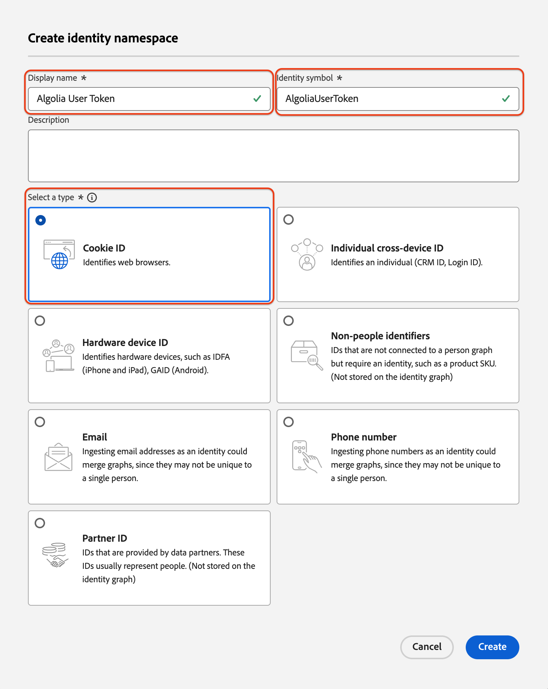
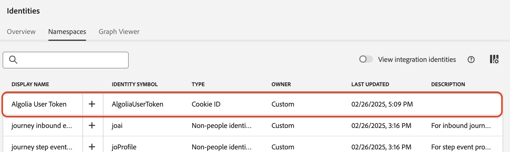

# Ingest [!DNL Algolia User Profiles] data into Experience Platform using the UI

This tutorial guides you through ingesting data from your [!DNL Algolia User Profiles] account into Adobe Experience Platform using the user interface.

## Get started

>[!IMPORTANT]
>
>Before you begin, make sure you've completed the prerequisites outlined in the [[!DNL Algolia User Profiles] overview](../../../../connectors/data-partners/algolia-user-profiles.md#prerequisites).

This tutorial assumes familiarity with the following Experience Platform components:

* [[!DNL Experience Data Model (XDM)] System](../../../../../xdm/home.md): The standardized framework Experience Platform uses to organize customer experience data.

  * [Basics of schema composition](../../../../../xdm/schema/composition.md): Learn about schema composition, including key principles and best practices.
  * [Schema Editor tutorial](../../../../../xdm/tutorials/create-schema-ui.md): Learn how to create custom schemas using the Schema Editor UI.
* [[!DNL Real-Time Customer Profile]](../../../../../profile/home.md): A unified, real-time customer profile based on aggregated data from multiple sources.
* [Sources](../../../../home.md): Ingest data from various sources and use Experience Platform services to structure, label, and enhance the data.

### Gather required credentials

To connect [!DNL Algolia] to Adobe Experience Platform, provide the following credentials:

| Credential     | Description                                                                               |
| -------------- | ----------------------------------------------------------------------------------------- |
| Application ID | The unique identifier assigned to your [!DNL Algolia] account.                               |
| API Key        | The credential for authenticating and authorizing API requests to [!DNL Algolia]'s services. |

For more information, refer to the [!DNL Algolia] [authentication documentation](https://www.algolia.com/doc/tools/cli/get-started/authentication/).

## Connect your [!DNL Algolia] account

In the Experience Platform UI, select **[!UICONTROL Sources]** from the left navigation to open the *[!UICONTROL Sources]* workspace. Use the *[!UICONTROL Categories]* panel or search bar to find your desired source.

To connect [!DNL Algolia], choose the **[!UICONTROL Algolia]** source card under *[!UICONTROL Data & Identity Partners]* and select **[!UICONTROL Set up]**.

>[!TIP]
>
> If a source does not yet have an authenticated account, it shows the **[!UICONTROL Set up]** option. Once authenticated, this changes to **[!UICONTROL Add data]**.

## Authentication

### Use an existing account

To use an existing account, choose **[!UICONTROL Existing account]** and select the [!DNL Algolia User Profiles] account you want to use. Then select **[!UICONTROL Next]**.

### Create a new account

To create a new account, select **[!UICONTROL New account]**, then enter a name, an optional description, and your [!DNL Algolia] credentials. Select **[!UICONTROL Connect to source]** and wait for the connection to establish.

## Add data

After your [!DNL Algolia User Profiles] account is created, the **[!UICONTROL Add data]** step appears. Use it to select and preview user profile data for ingestion.

* On the left, enter optional **[!UICONTROL Indices]** and **[!UICONTROL Affinity(s)]**.
* On the right, preview up to 100 rows of user profiles.

Once done, select **[!UICONTROL Next]**.

## Provide dataflow details

If using an existing dataset, choose one associated with a schema that includes the [!DNL Algolia Profile] field group. Make sure the [!DNL Algolia User Token] field is using the [!DNL Algolia User Token] identity namespace.  If the [!DNL Algolia User Token] is not currently created or assigned, instructions are provided below.

If creating a new dataset, select a schema using the [!DNL Algolia Profile] field group.

### Create [!DNL Algolia User Token] identity namespace

You will need to create the [!DNL Algolia User Token] identity namespace if it doesn't already exist in your organization.

Use the left navigation and select **[!UICONTROL Identities]** to access the [Identity Service](../../../../../identity-service/home.md) UI workspace and then select **[!UICONTROL Create identity namespace]**.

Next, provide a **[!UICONTROL Display Name]** and an **[!UICONTROL Identity Symbol]** for your custom namespace. During this step, you must also configure the type of your namespace. When finished, select **[!UICONTROL Create]**.

| Custom namespace config | Value |
| --- | --- |
| **[!UICONTROL Display Name]** | [!DNL Algolia User Token] |
| **[!UICONTROL Identity Symbol]** | [!DNL AlgoliaUserToken] |
| **[!UICONTROL Select a type]** | [!DNL Cookie ID] |

Once added, the namespace appears in the list. You can now apply it in your schema.

### Apply your namespace to your schema

Use the left navigation and select **[!UICONTROL Schemas]** to access the [Schemas](../../../../../xdm/ui/overview.md) UI workspace. Use the schemas workspace to create or update a schema with the [!DNL Algolia Profile Details] field group. Next, navigate to the **[!UICONTROL User Token]** field and use the right-rail to select the **[!UICONTROL Identity]** box. Additionally, use the input box to define the [!DNL Algolia User Token] identity namespace. When finished, select **[!UICONTROL Save]**.

After the **[!UICONTROL User Token]** field is assigned the [!DNL Algolia User Token] identity namespace, the identity appears in the user profile for any profile.

## Map data fields to an XDM schema

Use the mapping interface to map your source data to schema fields. For more information, refer to the [mapping guide](../../../../../data-prep/ui/mapping.md).

## Schedule ingestion runs

Next, use the scheduling interface to define the ingestion schedule of your dataflow.

| Scheduling configuration | Description |
| --- | --- |
| Frequency | Configure frequency to indicate how often the dataflow should run. You can set your frequency to: <ul><li>**Once**: Set your frequency to `once` to create a one-time ingestion. Configurations for interval and backfill are unavailable when creating a one-time ingestion dataflow. By default, the scheduling frequency is set to once.</li><li>**Minute**: Set your frequency to `minute` to schedule your dataflow to ingest data on a per-minute basis.</li><li>**Hour**: Set your frequency to `hour` to schedule your dataflow to ingest data on a per-hour basis.</li><li>**Day**: Set your frequency to `day` to schedule your dataflow to ingest data on a per-day basis.</li><li>**Week**: Set your frequency to `week` to schedule your dataflow to ingest data on a per-week basis.</li></ul> |
| Interval |  Once you select a frequency, you can then configure the interval setting to establish the time frame between every ingestion. For example, if you set your frequency to day and configure the interval to 15, then your dataflow will run every 15 days. You cannot set the interval to zero. The minimum accepted interval value for each frequency is as follows:<ul><li>**Once**: n/a</li><li>**Minute**: 15</li><li>**Hour**: 1</li><li>**Day**: 1</li><li>**Week**: 1</li></ul> |
| Start Time | The timestamp for the projected run, presented in UTC time zone. |
| Backfill | Backfill determines what data is initially ingested. If backfill is enabled, all current files in the specified path will be ingested during the first scheduled ingestion. If backfill is disabled, only the files that are loaded in between the first run of ingestion and the start time will be ingested. Files loaded prior to the start time will not be ingested. |

## Review your dataflow

Use the review page for a summary of your dataflow prior to ingestion. Details are grouped in the following categories:

* **Connection** - Shows the source type, the relevant path of the chosen source file, and the number of columns within that source file.
* **Assign dataset & map fields** - Shows which dataset the source data is being ingested into, including the schema that the dataset adheres to.
* **Scheduling** - Shows that active period, frequency, and interval of the ingestion schedule.

Once you have reviewed your dataflow, select **[!UICONTROL Finish]** and allow some time for the dataflow to be created.

## Next steps

By following this tutorial, you have successfully created a dataflow to bring intent data from your [!DNL Algolia] source to Experience Platform. For additional resources, visit the documentation outlined below.

### Monitor your dataflow

Once your dataflow has been created, you can monitor the data that is being ingested through it to view information on ingestion rates, success, and errors. For more information on how to monitor dataflow, visit the tutorial on [monitoring accounts and dataflows in the UI](../../../../../dataflows/ui/monitor-sources.md).

### Update your dataflow

To update configurations for your dataflows scheduling, mapping, and general information, visit the tutorial on [updating sources dataflows in the UI](../../update-dataflows.md).

### Delete your dataflow

You can delete dataflows that are no longer necessary or were incorrectly created using the **[!UICONTROL Delete]** function available in the **[!UICONTROL Dataflows]** workspace. For more information on how to delete dataflows, visit the tutorial on [deleting dataflows in the UI](../../delete.md).
