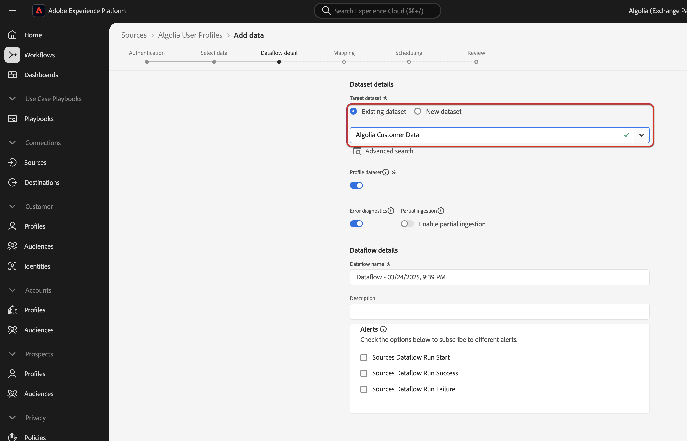

# Connect a [!DNL Algolia User Profiles] source connection and dataflow to Experience Platform using the UI

This tutorial provides steps to create a [!DNL Algolia User Profiles] source connection and dataflow using the Adobe Experience Platform user interface.

>[!IMPORTANT]
>
>Before walking through this tutorial, please make sure all prerequisites are met.  Refer to [[!DNL Algolia User Profiles]](- [[!DNL Algolia] User Profiles Source Connector](../../../../connectors/data-partners/algolia-user-profiles.md).

## Get started

This tutorial requires a working understanding of the following components of Experience Platform:

* [[!DNL Experience Data Model (XDM)] System](../../../../../xdm/home.md): The standardized framework by which Experience Platform organizes customer experience data.
    * [Basics of schema composition](../../../../../xdm/schema/composition.md): Learn about the basic building blocks of XDM schemas, including key principles and best practices in schema composition.
    * [Schema Editor tutorial](../../../../../xdm/tutorials/create-schema-ui.md): Learn how to create custom schemas using the Schema Editor UI.
* [[!DNL Real-Time Customer Profile]](../../../../../profile/home.md): Provides a unified, real-time consumer profile based on aggregated data from multiple sources.
* [Sources](../../../../home.md): Experience Platform allows data to be ingested from various sources while providing you with the ability to structure, label, and enhance incoming data using Experience Platform services.

## Overview

[!DNL Algolia] is a powerful search and discovery API platform that enables businesses to deliver fast, relevant, and customizable search experiences. It provides real-time search capabilities with features like typo tolerance, filtering, faceting, and AI-powered relevance tuning. [!DNL Algolia] helps companies improve user engagement, conversion rates, and overall customer experience by providing high-performance search solutions for websites, e-commerce platforms, and applications.

Key benefits of [!DNL Algolia] include:
* Lightning-fast search with instant results
* Highly relevant recommendations powered by AI
* Customizable ranking to prioritize business needs
* Scalability to handle high traffic loads effortlessly

For further reading, visit the [Algolia Product Documentation](https://resources.algolia.com/).

### Gather required credentials

In order to connect [!DNL Algolia] to Experience Platform, you must provide values for the following credentials:

| Credential     | Description                                                                                   |
|----------------|-----------------------------------------------------------------------------------------------|
| Application ID | The [!DNL Algolia] Application ID is a unique identifier assigned to your [!DNL Algolia] account.   |
| API Key        | An [!DNL Algolia] API Key is a credential used to authenticate and authorize API requests to [!DNL Algolia]'s search and indexing services. |

For more information on these credentials, see the [!DNL Algolia] [authentication documentation](https://www.algolia.com/doc/tools/cli/get-started/authentication/).

## Connect your [!DNL Algolia] account

In the Platform UI, select **[!UICONTROL Sources]** from the left navigation bar to access the [!UICONTROL Sources] workspace. The [!UICONTROL Catalog] screen displays a variety of sources for which you can create an account with.

You can select the appropriate category from the catalog on the left-hand side of your screen. Alternatively, you can find the specific source you wish to work with using the search option.

Under the **[!UICONTROL Data partners]** category, select **[!UICONTROL Algolia User Profiles]** and then select **[!UICONTROL Set up]**.

The **[!UICONTROL Connect Algolia account]** page appears. On this page, you can either use new credentials or existing credentials.

### Existing account

To use an existing account, select the [!DNL Algolia User Profiles] account you want to create a new dataflow with, then select **[!UICONTROL Next]** to proceed.

### New account

If you are creating a new account, select **[!UICONTROL New account]**, and then provide a name, an optional description, and [!DNL Algolia] credentials. When finished, select **[!UICONTROL Connect to source]** and then allow some time for the new connection to establish.

## Add data

After creating your [!DNL Algolia User Profiles] account, the **[!UICONTROL Add data]** step appears, providing an interface for you to explore your [!DNL Algolia] user profiles that you want to bring to Experience Platform.

* The left part of the interface is for you to enter optional **[!UICONTROL Indices]** and **[!UICONTROL Affinity(s)]** fields.
* The right part of the interface lets you preview up to 100 rows of user profiles.

### Provide dataflow details
If using an existing dataset,then select a dataset that is associate with a schema that is using the [!Algolia Profile] Field Group

If creating a new data set, then select a schema that is using the [!Algolia Profile] Field Group which is required in the Mapping step.

### Map data fields to an XDM schema
The Mapping step is how the source data from [!DNL Algolia] is mapped to the Experience Platform schema associated with the DataSet. If you’re using the [!DNL Algolia Profile] Field Group, mapping will be 1:1 with the source.

### Schedule ingestion runs
The Scheduling step allows for configuration of the data/time to execute the [!DNL Algolia Uer Profiles] Source connector. There is configuration to backfill the data from [!DNL Algolia] which will pull all the profiles from the source system.  If the source is scheduled, then it will retrieve modified profiles from the [!DNL Algolia] based on the configured time interval.

### Review your dataflow
After all the steps, the review step allows to view the configuration of the data flow before executing it.

### Monitor/Update/Delete your dataflow
The details screen is a view of the specific data flow and [!DNL Algolia Uer Profiles] account that is configured. The data flow can be monitored and managed in this view.

