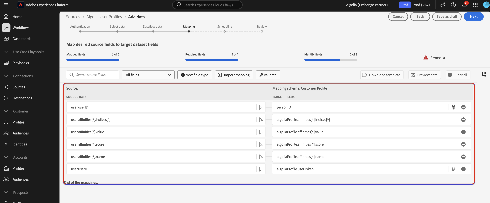

# Ingest [!DNL Algolia User Profiles] data to Experience Platform using the UI

Read this tutorial to learn how to ingest data from your [!DNL Algolia User Profiles] account to Adobe Experience Platform using the user interface.

## Get started

>[!IMPORTANT]
>
>Before getting started, ensure that you complete the prerequisite steps outlined in the [[!DNL Algolia User Profiles] overview](../../../../connectors/data-partners/algolia-user-profiles.md#prerequisites).

This tutorial requires a working understanding of the following components of Experience Platform:

* [[!DNL Experience Data Model (XDM)] System](../../../../../xdm/home.md): The standardized framework by which Experience Platform organizes customer experience data.
    * [Basics of schema composition](../../../../../xdm/schema/composition.md): Learn about the basic building blocks of XDM schemas, including key principles and best practices in schema composition.
    * [Schema Editor tutorial](../../../../../xdm/tutorials/create-schema-ui.md): Learn how to create custom schemas using the Schema Editor UI.
* [[!DNL Real-Time Customer Profile]](../../../../../profile/home.md): Provides a unified, real-time consumer profile based on aggregated data from multiple sources.
* [Sources](../../../../home.md): Experience Platform allows data to be ingested from various sources while providing you with the ability to structure, label, and enhance incoming data using Experience Platform services.

### Gather required credentials

In order to connect [!DNL Algolia] to Experience Platform, you must provide values for the following credentials:

| Credential | Description |
| --- | --- |
| Application ID | The [!DNL Algolia] application ID is a unique identifier assigned to your [!DNL Algolia] account.   |
| API Key | The [!DNL Algolia] API Key is a credential used to authenticate and authorize API requests to [!DNL Algolia]'s search and indexing services. |

For more information on these credentials, see the [!DNL Algolia] [authentication documentation](https://www.algolia.com/doc/tools/cli/get-started/authentication/).

## Connect your [!DNL Algolia] account

In the Experience Platform UI, select **[!UICONTROL Sources]** from the left navigation to access the *[!UICONTROL Sources]* workspace. You can select the appropriate category in the *[!UICONTROL Categories]* panel. Alternatively, you can use the search bar to navigate to the specific source that you want to use.

To use [!DNL Algolia], select the **[!UICONTROL Algolia]** source card under *[!UICONTROL Data & Identity Partners]* and then select **[!UICONTROL Set up]**.

>[!TIP]
>
>Sources in the sources catalog display the **[!UICONTROL Set up]** option when a given source does not yet have an authenticated account. Once an authenticated account exists, this option changes to **[!UICONTROL Add data]**.

## Authentication

### Use an existing account

To use an existing account, select **[!UICONTROL Existing account]** and then select the [!DNL Algolia User Profiles] account that you want to use. To proceed, select **[!UICONTROL Next]**.

### Create a new account

If you are creating a new account, select **[!UICONTROL New account]**, and then provide a name, an optional description, and [!DNL Algolia] credentials. When finished, select **[!UICONTROL Connect to source]** and then allow some time for the new connection to establish.

## Add data

After creating your [!DNL Algolia User Profiles] account, the **[!UICONTROL Add data]** step appears, providing an interface for you to explore your [!DNL Algolia] user profiles that you want to bring to Experience Platform.

* The left part of the interface is for you to enter optional **[!UICONTROL Indices]** and **[!UICONTROL Affinity(s)]** fields.
* The right part of the interface lets you preview up to 100 rows of user profiles.

Once you finish selecting and previewing your data for ingestion, select **[!UICONTROL Next]**.

## Provide dataflow details

If you are using an existing dataset, select a dataset that is associated with a schema that is using the [!DNL Algolia Profile] Field Group.

If you are creating a new dataset, select a schema that is using the [!DNL Algolia Profile] field group which is required in the mapping step.

## Map data fields to an XDM schema

Use the mapping interface to map your source data to the appropriate schema fields before ingesting data to Experience Platform.  For more information, read the [mapping guide in the UI](../../../../../data-prep/ui/mapping.md).

## Schedule ingestion runs

Next, use the scheduling interface to define the ingestion schedule of your dataflow.

<!-- The Scheduling step allows for configuration of the data/time to execute the [!DNL Algolia Uer Profiles] Source connector. There is configuration to backfill the data from [!DNL Algolia] which will pull all the profiles from the source system.  If the source is scheduled, then it will retrieve modified profiles from the [!DNL Algolia] based on the configured time interval. -->

| Scheduling configuration | Description |
| --- | --- |
| Frequency | Configure frequency to indicate how often the dataflow should run. You can set your frequency to: <ul><li>**Once**: Set your frequency to `once` to create a one-time ingestion. Configurations for interval and backfill are unavailable when creating a one-time ingestion dataflow. By default, the scheduling frequency is set to once.</li><li>**Minute**: Set your frequency to `minute` to schedule your dataflow to ingest data on a per-minute basis.</li><li>**Hour**: Set your frequency to `hour` to schedule your dataflow to ingest data on a per-hour basis.</li><li>**Day**: Set your frequency to `day` to schedule your dataflow to ingest data on a per-day basis.</li><li>**Week**: Set your frequency to `week` to schedule your dataflow to ingest data on a per-week basis.</li></ul> |
| Interval |  Once you select a frequency, you can then configure the interval setting to establish the time frame between every ingestion. For example, if you set your frequency to day and configure the interval to 15, then your dataflow will run every 15 days. You cannot set the interval to zero. The minimum accepted interval value for each frequency is as follows:<ul><li>**Once**: n/a</li><li>**Minute**: 15</li><li>**Hour**: 1</li><li>**Day**: 1</li><li>**Week**: 1</li></ul> |
| Start Time | The timestamp for the projected run, presented in UTC time zone. |
| Backfill | Backfill determines what data is initially ingested. If backfill is enabled, all current files in the specified path will be ingested during the first scheduled ingestion. If backfill is disabled, only the files that are loaded in between the first run of ingestion and the start time will be ingested. Files loaded prior to the start time will not be ingested. |

## Review your dataflow

Use the review page for a summary of your dataflow prior to ingestion. Details are grouped in the following categories:

* **Connection** - Shows the source type, the relevant path of the chosen source file, and the number of columns within that source file.
* **Assign dataset & map fields** - Shows which dataset the source data is being ingested into, including the schema that the dataset adheres to.
* **Scheduling** - Shows that active period, frequency, and interval of the ingestion schedule.

Once you have reviewed your dataflow, select **[!UICONTROL Finish]** and allow some time for the dataflow to be created.

## Next steps

By following this tutorial, you have successfully created a dataflow to bring intent data from your [!DNL Algolia] source to Experience Platform. For additional resources, visit the documentation outlined below.

### Monitor your dataflow

Once your dataflow has been created, you can monitor the data that is being ingested through it to view information on ingestion rates, success, and errors. For more information on how to monitor dataflow, visit the tutorial on [monitoring accounts and dataflows in the UI](../../../../../dataflows/ui/monitor-sources.md).

### Update your dataflow

To update configurations for your dataflows scheduling, mapping, and general information, visit the tutorial on [updating sources dataflows in the UI](../../update-dataflows.md).

### Delete your dataflow

You can delete dataflows that are no longer necessary or were incorrectly created using the **[!UICONTROL Delete]** function available in the **[!UICONTROL Dataflows]** workspace. For more information on how to delete dataflows, visit the tutorial on [deleting dataflows in the UI](../../delete.md).
