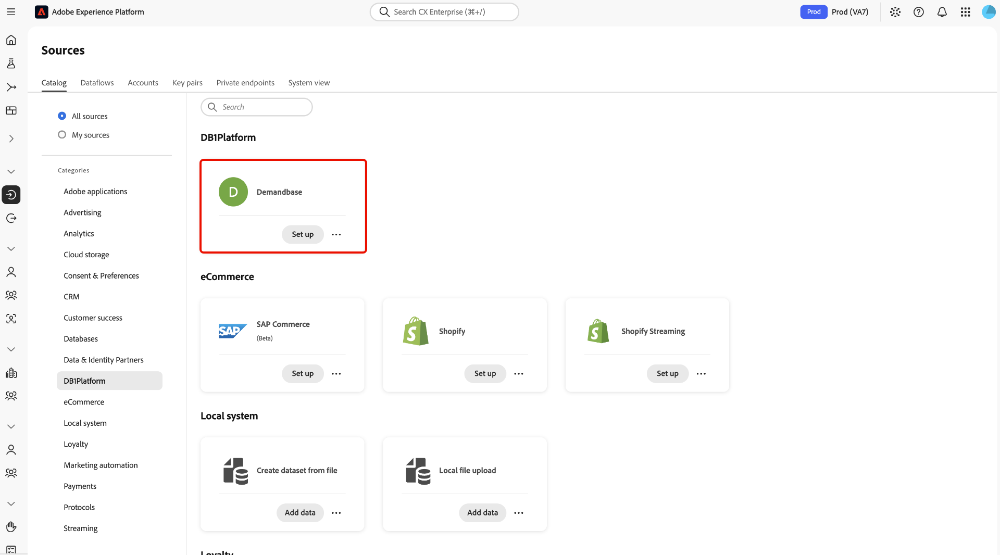
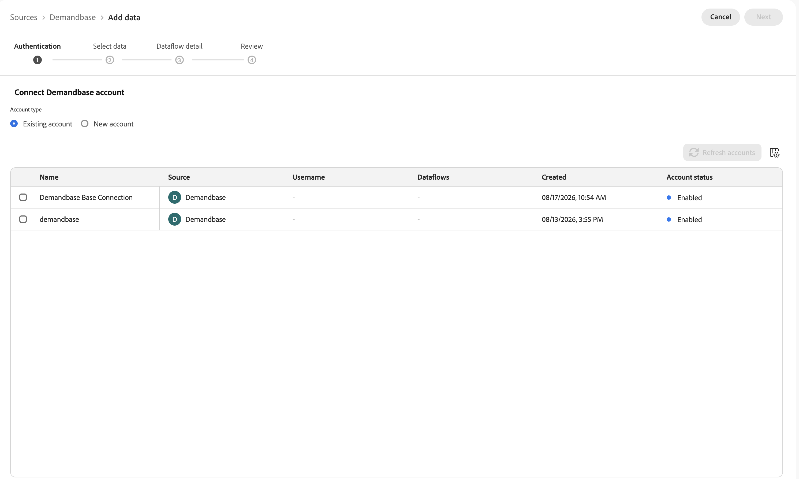
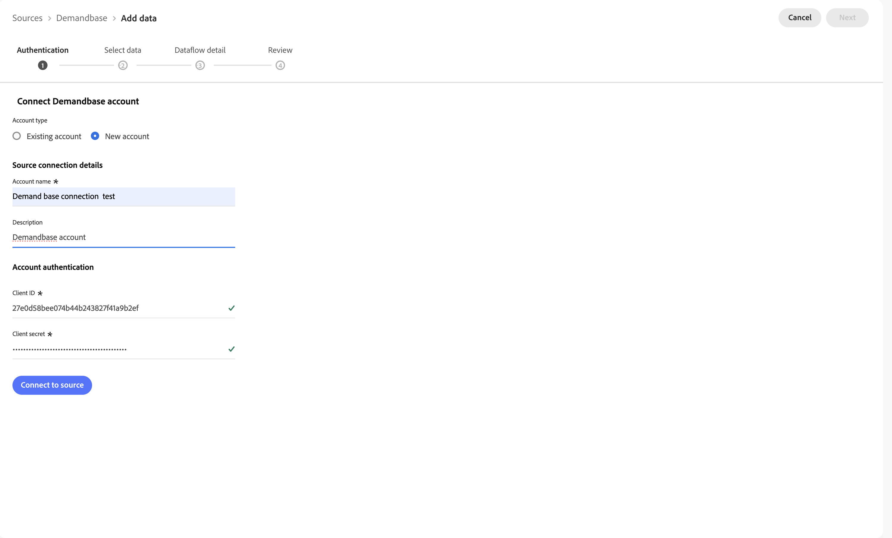
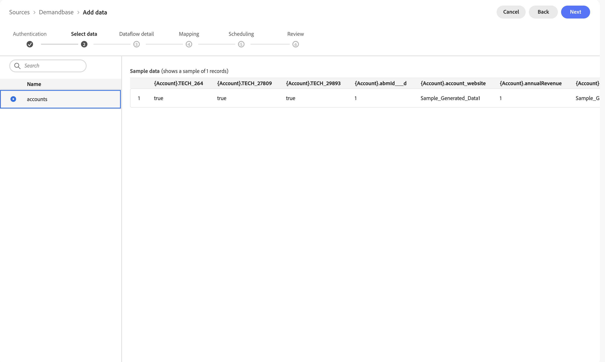
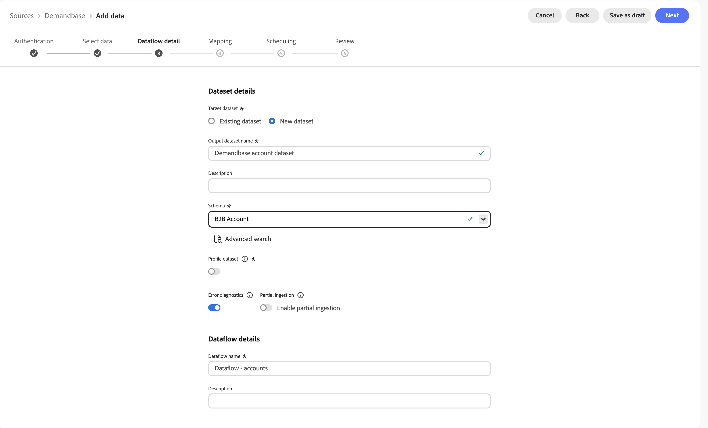
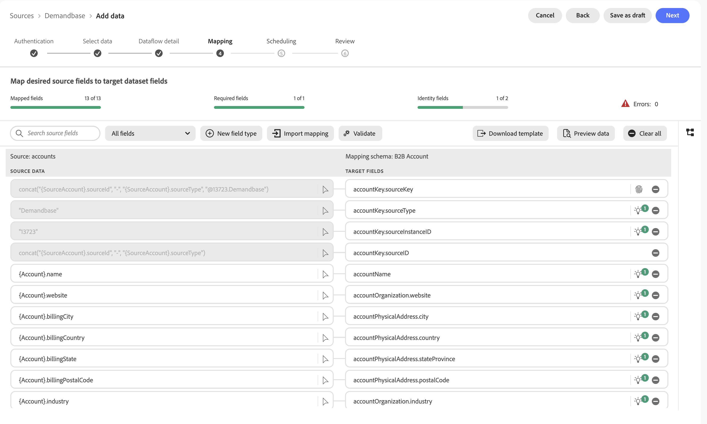
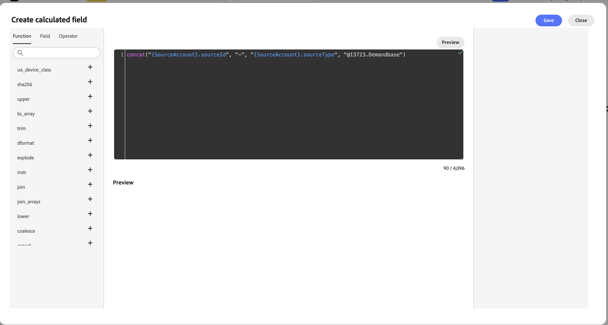
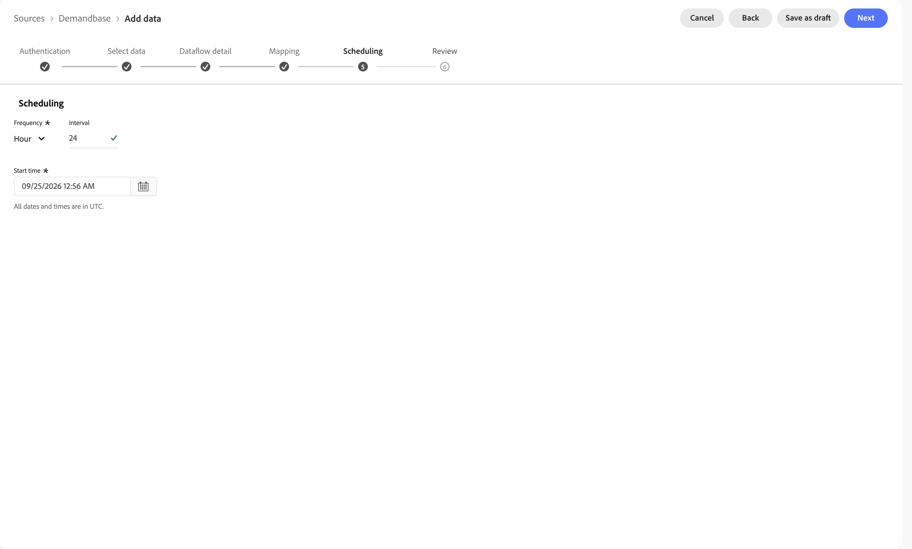
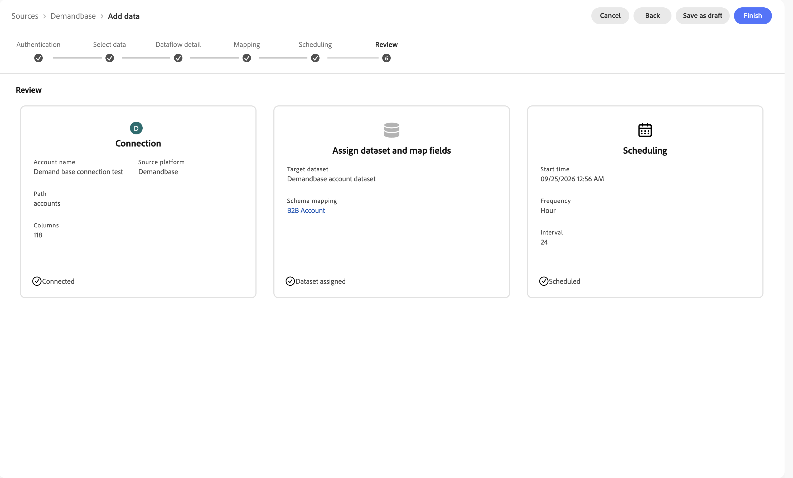

# Connect [!DNL Demandbase] to Experience Platform using the UI

Read this guide to learn how to connect your [!DNL Demandbase] account to Adobe Experience Platform using the *[!UICONTROL Sources]* workspace in the Experience Platform UI.

## Get started {#get-started}

This tutorial requires a working understanding of the following components of Experience Platform:

* [Experience Data Model (XDM) System](../../../../../xdm/home.md): The standardized framework by which Experience Platform organizes customer experience data. Read the guides on the [basics of schema composition](../../../../../xdm/schema/composition.md) and the [Schema Editor tutorial](../../../../../xdm/ui/resources/schemas.md) for more information.
* [Real-Time Customer Profile](../../../../../profile/home.md): Provides a unified, real-time consumer profile based on aggregated data from multiple sources.

### Gather required credentials {#gather-credentials}

Before you begin, obtain the following from your [!DNL Demandbase] administrator:

* **[!UICONTROL Client ID]**
* **[!UICONTROL Client secret]**

These credentials are used under **[!UICONTROL Account authentication]** when creating a new source connection.

## Navigate the sources catalog {#navigate}

In the Experience Platform UI, select **[!UICONTROL Sources]** from the left navigation to access the *[!UICONTROL Sources]* workspace, then select the **[!UICONTROL Catalog]** tab. Use the search bar to find **[!DNL Demandbase]**.

>[!NOTE]
>
>[!DNL Demandbase] appears under multiple categories in the catalog, including [!UICONTROL B2B], [!UICONTROL Data & Identity Partners], and [!UICONTROL DB1Platform].

Select the **[!DNL Demandbase]** source card and then select **[!UICONTROL Add data]**.

<!--
TODO: Add catalog.png once the source card name is confirmed by PM and a new screenshot is captured.

-->

## Authenticate your account {#authentication}

### Use an existing account {#existing}

To reuse a connection that has already been authenticated, select **[!UICONTROL Existing account]**. A table of previously created [!DNL Demandbase] accounts is displayed, showing the account **[!UICONTROL Name]**, **[!UICONTROL Source]**, **[!UICONTROL Username]**, associated **[!UICONTROL Dataflows]**, when it was **[!UICONTROL Created]**, and its **[!UICONTROL Account status]**.

Select the checkbox next to the account you want to reuse and select **[!UICONTROL Next]**.



### Create a new account {#create}

To create a new connection, select **[!UICONTROL New account]** and provide the following under **[!UICONTROL Source connection details]**:

* **[!UICONTROL Account name]**
* **[!UICONTROL Description]**

Next, under **[!UICONTROL Account authentication]**, provide your **[!UICONTROL Client ID]** and **[!UICONTROL Client secret]**. When finished, select **[!UICONTROL Connect to source]** and allow a few seconds for the connection to establish.



## Select your data {#select-data}

Use the **[!UICONTROL Select data]** interface to choose the [!DNL Demandbase] entity that you want to ingest to Experience Platform. Select **[!UICONTROL Accounts]** from the list on the left to preview a sample of the source data on the right before continuing.



## Provide dataflow details {#provide-dataflow-details}

Next, provide information about your target dataset and dataflow.

Under **[!UICONTROL Target dataset]**, choose **[!UICONTROL Existing dataset]** or **[!UICONTROL New dataset]**. If you are creating a new dataset, provide an **[!UICONTROL Output dataset name]** (for example, `Demandbase account dataset`) and select a schema. For [!DNL Demandbase], use the **[!UICONTROL B2B Account]** schema.

You can optionally enable the dataset for profile dataset ingestion so the data is available in [!DNL Real-Time Customer Profile]. Leave **[!UICONTROL Error diagnostics]** enabled and configure **[!UICONTROL Partial ingestion]** if you want the dataflow to continue even when some records fail.

Under **[!UICONTROL Dataflow details]**, provide a **[!UICONTROL Dataflow name]** (for example, `Dataflow - accounts`) and an optional description.



## Map fields {#mapping}

Use the **[!UICONTROL Mapping]** step to map the [!DNL Demandbase] source fields to the target **[!UICONTROL B2B Account]** schema fields. The mapping summary at the top of the page tracks your progress across **[!UICONTROL Mapped fields]**, **[!UICONTROL Required fields]**, and **[!UICONTROL Identity fields]**, along with any validation errors.

[!DNL Demandbase] account data commonly maps to fields such as the following:

* `accountKey.sourceKey`, `accountKey.sourceType`, `accountKey.sourceInstanceID`, `accountKey.sourceID`
* `accountName`
* `accountOrganization.website`, `accountOrganization.industry`
* `accountPhysicalAddress.city`, `accountPhysicalAddress.country`, `accountPhysicalAddress.stateProvince`, `accountPhysicalAddress.postalCode`



### Build a composite identity key {#composite-key}

The `accountKey.sourceKey` identity field must uniquely represent each [!DNL Demandbase] account. Rather than mapping it to a single raw field, use [Data Prep's calculated field editor](../../../../../data-prep/ui/mapping.md#calculated-fields) to build a composite key that concatenates the source account ID, the source type, and your [!DNL Demandbase] instance ID.

Select the source field next to `accountKey.sourceKey` to open the calculated field editor, then use the `concat` function to combine the values:

```text
concat("{SourceAccount}.sourceId", "-", "{SourceAccount}.sourceType", "@13723.Demandbase")
```

>[!IMPORTANT]
>
>Replace `13723` with your own [!DNL Demandbase] instance ID so the identity namespace correctly reflects your organization's instance.

Select the checkmark to preview the result, and then select **[!UICONTROL Save]**.



Once your calculated fields and remaining mappings are complete, select **[!UICONTROL Next]** to continue.

## Schedule your dataflow {#schedule-dataflow}

With your mapping complete, configure an ingestion schedule for your dataflow:

* **[!UICONTROL Frequency]**: Set to **[!UICONTROL Hour]** for incremental ingestion. A per-minute frequency is not available for [!DNL Demandbase].
* **[!UICONTROL Interval]**: Defines how many hours occur between ingestion runs. For example, a frequency of **[!UICONTROL Hour]** and an interval of `24` means the dataflow ingests data once every 24 hours.
* **[!UICONTROL Start time]**: The date and time the schedule should begin.

>[!NOTE]
>
>All dates and times are in UTC.

Select a schedule that matches your data freshness needs. Keep in mind that a more frequent schedule increases compute costs.



## Review your dataflow {#review-dataflow}

With the ingestion schedule configured, use the **[!UICONTROL Review]** page to confirm the details of your dataflow across three summary cards:

* **[!UICONTROL Connection]**: Shows the account name, source platform, path, and number of columns.
* **[!UICONTROL Assign dataset and map fields]**: Shows the target dataset and schema mapping used.
* **[!UICONTROL Scheduling]**: Shows the start time, frequency, and interval.

Select **[!UICONTROL Finish]** to complete the setup and allow a few moments for your dataflow to initiate.



## Next steps {#next-steps}

Once the dataflow is created, it runs a one-time backfill of data followed by incremental syncs on the schedule you specified. You can monitor sync status by navigating to the dataflow. For more information, read the guide on [monitoring sources dataflows in the UI](../../../../../dataflows/ui/monitor-sources.md).

By following this tutorial, you have completed the setup and configuration of your [!DNL Demandbase] source in Experience Platform. Your [!DNL Demandbase] account data is ingested according to your chosen schedule and mapped to the standard **[!UICONTROL B2B Account]** XDM schema.

For additional information, read the following documentation:

* [Sources overview](../../../../home.md)
* [Real-Time CDP B2B Edition](../../../../../rtcdp/b2b-overview.md)
