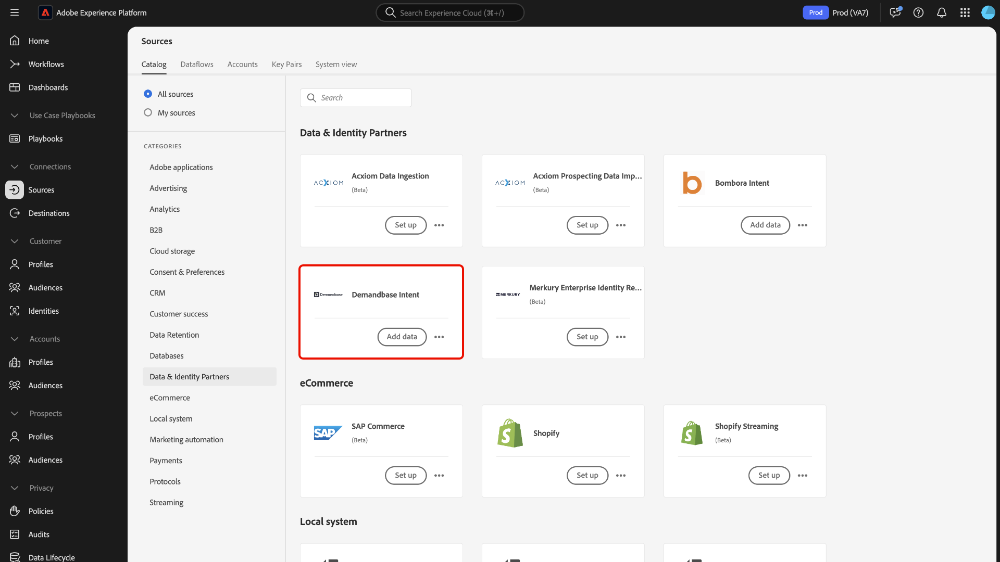
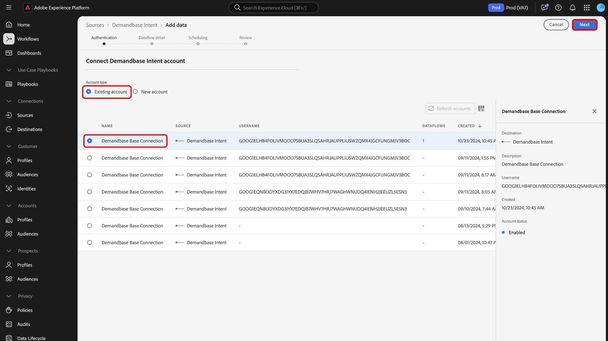
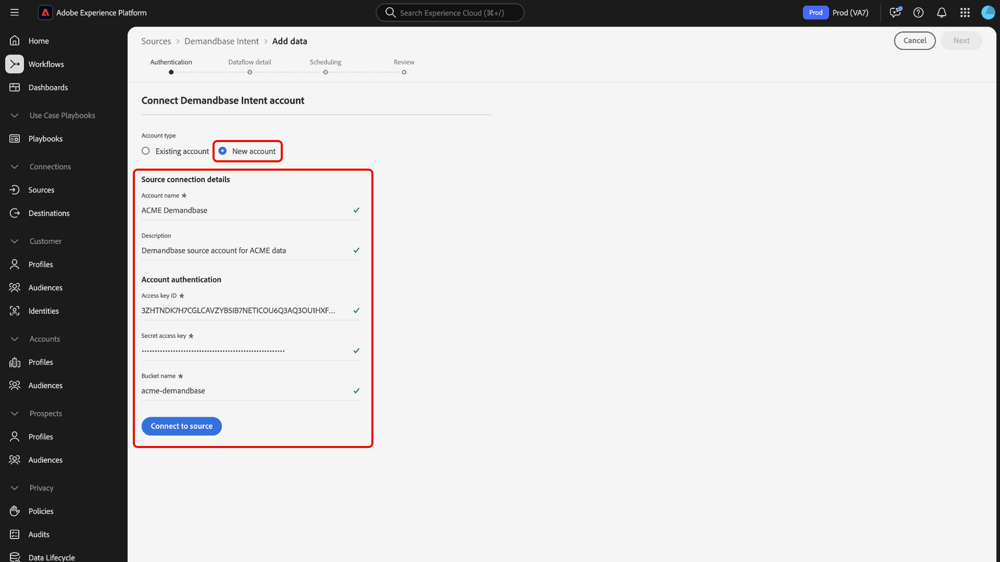
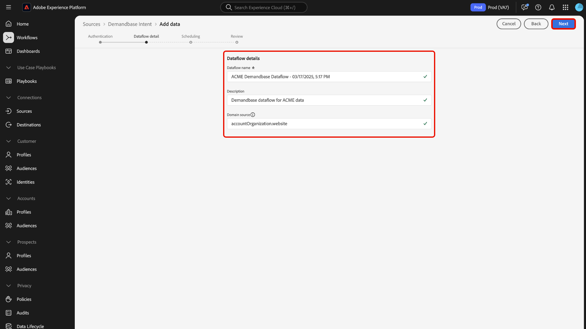
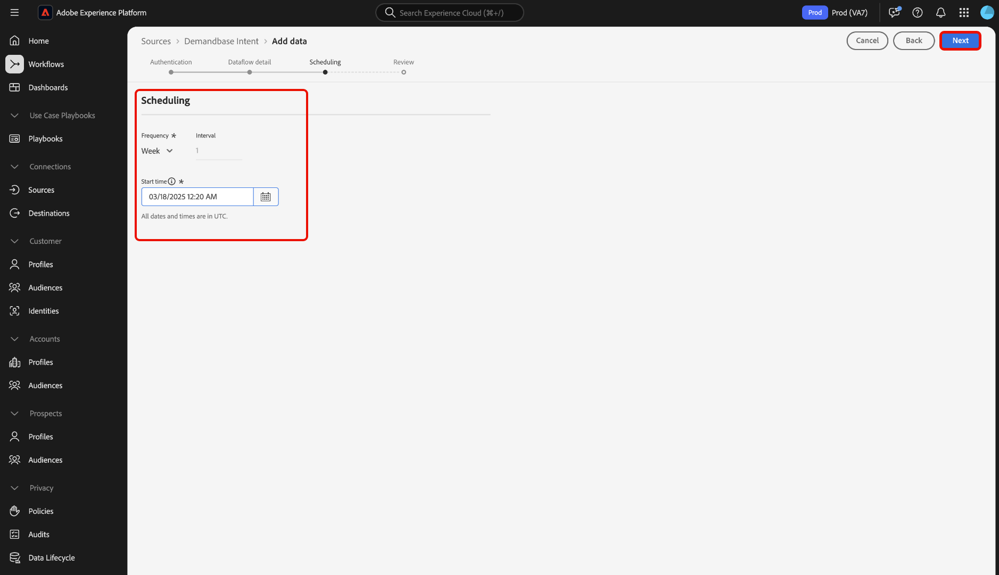
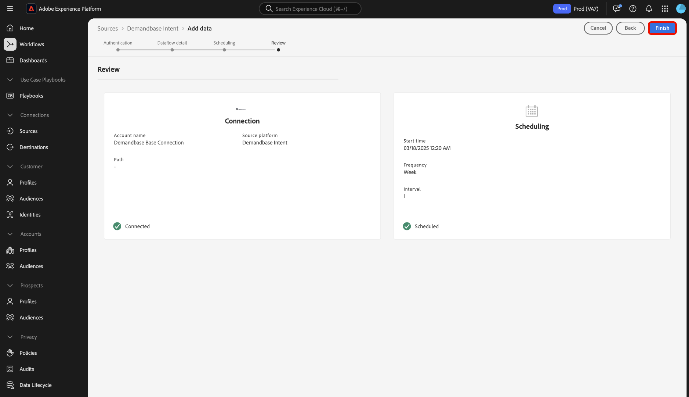

# Connect [!DNL Demandbase Intent] to Experience Platform using the UI

Read this guide to learn how to connect your [!DNL Demandbase Intent] account to Adobe Experience Platform using the user interface.

## Get started

This tutorial requires a working understanding of the following components of Experience Platform:

* [Real-Time CDP B2B Edition](../../../../../rtcdp/b2b-overview.md): Real-Time CDP B2B Edition is purpose-built for marketers operating in a business-to-business service model. It brings together data from multiple sources and combines it into a single view of people and account profiles. This unified data allows marketers to precisely target specific audiences and engage those audiences across all available channels. 
* [Sources](../../../../home.md): Experience Platform allows data to be ingested from various sources while providing you with the ability to structure, label, and enhance incoming data using Experience Platform services.
* [Sandboxes](../../../../../sandboxes/home.md): Experience Platform provides virtual sandboxes which partition a single Experience Platform instance into separate virtual environments to help develop and evolve digital experience applications.

### Prerequisites

Read the [[!DNL Demandbase Intent] overview](../../../../connectors/data-partners/demandbase.md) for information on how to retrieve your authentication credentials.

## Navigate the sources catalog {#navigate}

In the Experience Platform UI, select **[!UICONTROL Sources]** from the left navigation to access the *[!UICONTROL Sources]* workspace. You can select the appropriate category in the *[!UICONTROL Categories]* panel. Alternatively, you can use the search bar to navigate to the specific source that you want to use.

To use [!DNL Demandbase], select the **[!UICONTROL Demandbase Intent]** source card under [!UICONTROL Data & Identity Partners] and then select **[!UICONTROL Add data]**.

>[!TIP]
>
>Sources in the sources catalog display the **[!UICONTROL Set up]** option when a given source does not yet have an authenticated account. Once an authenticated account exists, this option changes to **[!UICONTROL Add data]**.

## Authentication {#authentication}

### Use an existing account {#existing}

To use an existing account, select **[!UICONTROL Existing account]** and then select the account that you want to use from the list of accounts on the interface. 

Once you have selected your account, select **[!UICONTROL Next]** to proceed to the next step.

### Create a new account {#create}

If you do not have an existing account, then you must create a new account by providing the necessary authentication credentials that correspond with your source. 

To create a new account, select **[!UICONTROL New account]** and then provide an account name and optionally, a description for your account details. Next, provide the appropriate authentication values to authenticate your source against Experience Platform. To connect your [!DNL Demandbase Intent] account, you must have the following credentials:

* **Access key ID**: Your [!DNL Demandbase] access key ID. This is a 61-character alphanumeric string that is required to authenticate your account to Experience Platform.
* **Secret access key**: Your [!DNL Demandbase] secret access key. This is a 40-character, base-64-encoded string that is required to authenticate your account to Experience Platform.
* **Bucket name**: Your [!DNL Demandbase] bucket from which data will be pulled from.

## Provide dataflow details {#provide-dataflow-details}

Once your account is authenticated and connected, you must now provide the following details for your dataflow:

* **Dataflow name**: The name of your dataflow. You can use this name to search for your dataflow in the UI, once it has been created and processed.
* **Description**: (Optional) A brief explanation or additional information for your dataflow.
* **Domain source**: The domain or website field that matches your source account records against Experience Platform accounts. This value can depend on your configurations. If unprovided, the domain defaults to `accountOrganization.website`.

## Schedule dataflow {#schedule-dataflow}

Next, use the scheduling interface to configure an ingestion schedule for your dataflow.

* **Frequency**: Configure frequency to indicate how often the dataflow should run. You can schedule your [!DNL Demandbase] dataflow to ingest data at a weekly rate. 
* **Interval**: Interval represents the amount of time between each ingestion cycle. The only supported interval for a [!DNL Demandbase] dataflow is `1`. This means that your dataflow will ingest data once a week, every week.
* **Start time**: The start time dictates when the first run iteration of your dataflow will occur. [!DNL Demandbase] drops data to Adobe once a week, on Mondays, at 12:00 PM UTC. Therefore, you must set your ingestion start time after 12:00 PM UTC. Additionally, you must confirm the ingestion time with [!DNL Demandbase] as they may alter their schedule, when dropping files to Adobe.
* **Backfill**: Backfill determines what data is initially ingested. If backfill is enabled, all current files in the specified path will be ingested during the first scheduled ingestion. If backfill is disabled, only the files that are loaded in between the first run of ingestion and the start time will be ingested. Files loaded prior to the start time will not be ingested.

Once you have configured your dataflow's ingestion schedule, select **[!UICONTROL Next]**.

## Review dataflow {#review-dataflow}

The final step in the dataflow creation process is to review your dataflow before executing it. Use the *[!UICONTROL Review]* step to review the details of your new dataflow before it runs. Details are grouped in the following categories:

* **Connection**: Shows the source type, the relevant path of the chosen source file, and the number of columns within that source file.
* **Scheduling**: Shows the active period, frequency, and interval of the ingestion schedule.

## Next steps

By following this tutorial, you have successfully created a dataflow to bring intent data from your [!DNL Demandbase] source to Experience Platform. For additional resources, visit the documentation outlined below.

### Monitor your dataflow

Once your dataflow has been created, you can monitor the data that is being ingested through it to view information on ingestion rates, success, and errors. For more information on how to monitor dataflow, visit the tutorial on [monitoring accounts and dataflows in the UI](../../../../../dataflows/ui/monitor-sources.md).

### Update your dataflow

To update configurations for your dataflows scheduling, mapping, and general information, visit the tutorial on [updating sources dataflows in the UI](../../update-dataflows.md).

### Delete your dataflow

You can delete dataflows that are no longer necessary or were incorrectly created using the **[!UICONTROL Delete]** function available in the **[!UICONTROL Dataflows]** workspace. For more information on how to delete dataflows, visit the tutorial on [deleting dataflows in the UI](../../delete.md).
