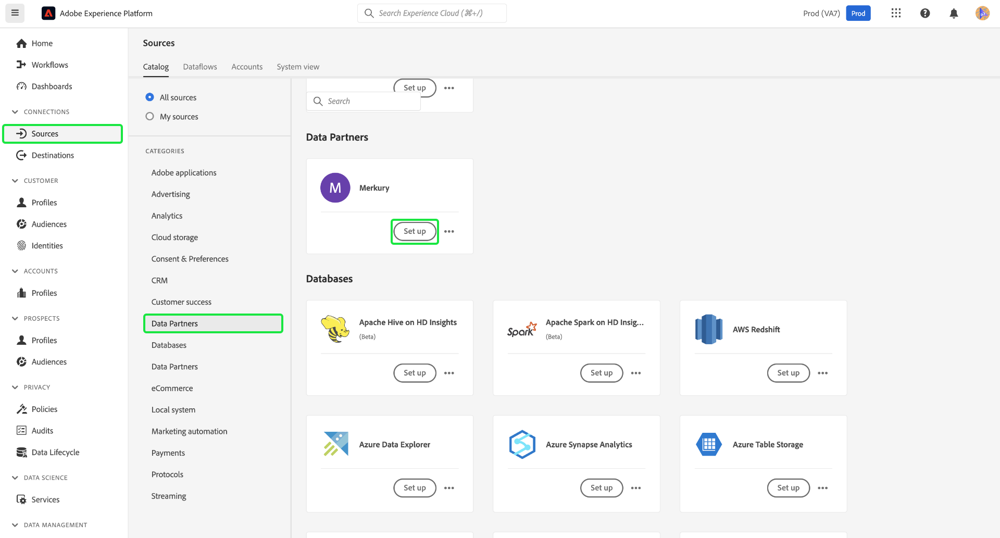
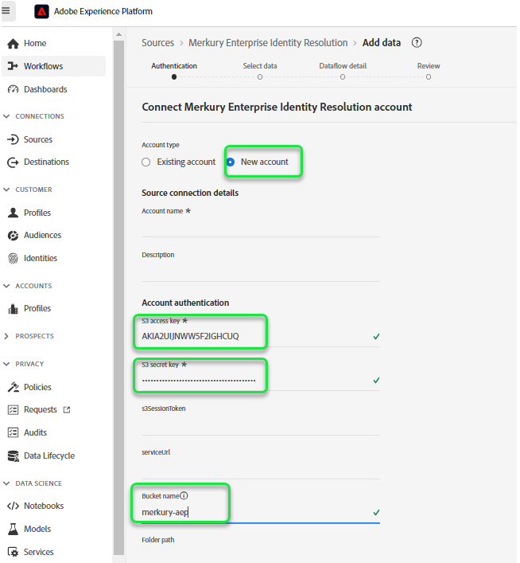
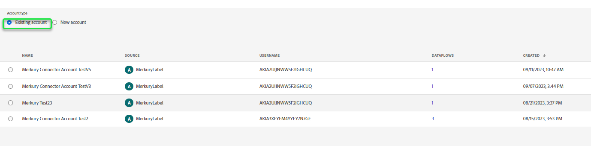
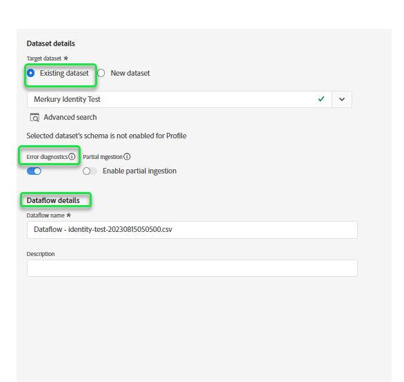
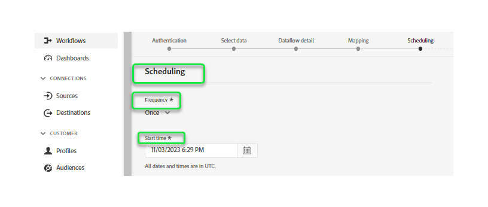
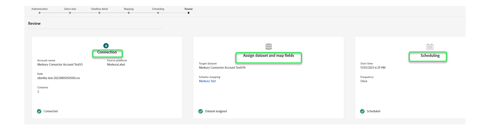

# Create a [!DNL Merkury Enterprise Identity Resolution] source connection and dataflow in the UI

>[!NOTE]
>
>The [!DNL Merkury Enterprise Identity Resolution] source is in beta. Please read the [sources overview](../../../../home.md#terms-and-conditions) for more information on using beta-labeled sources.

This tutorial provides steps to create a [!DNL Merkury Enterprise Identity Resolution] source connection and dataflow using the Adobe Experience Platform user interface.

## Get started

This tutorial requires a working understanding of the following components of Experience Platform:

* [[!DNL Experience Data Model (XDM)] System](../../../../../xdm/home.md): The standardized framework by which Experience Platform organizes customer experience data.
  * [Basics of schema composition](../../../../../xdm/schema/composition.md): Learn about the basic building blocks of XDM schemas, including key principles and best practices in schema composition.
  * [Schema Editor tutorial](../../../../../xdm/tutorials/create-schema-ui.md): Learn how to create custom schemas using the Schema Editor UI.
* [[!DNL Real-Time Customer Profile]](../../../../../profile/home.md): Provides a unified, real-time consumer profile based on aggregated data from multiple sources.

### Gather required credentials

In order to access your bucket on Experience Platform, you need to provide valid values for the following credentials:

| Credential | Description |
| --- | --- |
| Access key | The access key ID for your bucket. You can retrieve this value from your [!DNL Merkury] team. |
| Secret key | The secret key ID for your bucket. You can retrieve this value from your [!DNL Merkury] team. |
| Bucket name | This is your Merkury bucket where files will be shared. You can retrieve this value from your [!DNL Merkury] team. |

For more information on set up for [!DNL Merkury] and other prerequisites, read the [[!DNL Merkury] source overview](../../../../connectors/data-partners/merkury.md).

## Connect your Merkury Account

In the Platform UI, select **[!UICONTROL Sources]** from the left navigation bar to access the [!UICONTROL Sources] workspace. The [!UICONTROL Catalog] screen displays a variety of sources for which you can create an account with.

You can select the appropriate category from the catalog on the left-hand side of your screen. Alternatively, you can find the specific source you wish to work with using the search option.

Under the **[!UICONTROL Data partners]** category, select **[!UICONTROL Merkury]** and then select **[!UICONTROL Set up]**.

The **[!UICONTROL Connect to Merkury]** page appears. On this page, you can either use new credentials or existing credentials.

### Create a new account

If you are using new credentials, select **[!UICONTROL New account]**. On the input form that appears, provide a name, an optional description, and your [!DNL Merkury] credentials. When finished, select **[!UICONTROL Connect to source]** and then allow some time for the new connection to establish.

### Use an existing account

To use an existing account, select **[!UICONTROL Existing account]** and then select the [!DNL Merkury] account that you would like to use. Select **[!UICONTROL Next]** to proceed.

>[!BEGINSHADEBOX]

**Supported file formats**

You can ingest the following file formats with the [!DNL Merkury] source:

* Delimiter-separated values (DSV): Any single-character value can be used as a delimiter for DSV-formatted data files.
* [!DNL JavaScript Object Notation] (JSON): JSON-formatted data files must be XDM-compliant.
* [!DNL Apache Parquet]: Parquet-formatted data files must be XDM-compliant.
* Compressed files: JSON and delimited files can be compressed as: `bzip2`, `gzip`, `deflate`, `zipDeflate`, `tarGzip`, and `tar`.

>[!ENDSHADEBOX]

## Add data

After creating your [!DNL Merkury] account, the **[!UICONTROL Add data]** step appears, providing an interface for you to explore your [!DNL Merkury] file hierarchy and select the folder or specific file that you want to bring to Experience Platform.

* The left part of the interface is a directory browser, displaying your [!DNL Merkury] file hierarchy.
* The right part of the interface lets you preview up to 100 rows of data from a compatible folder or file.

Select the root folder to access your folder hierarchy. From here, you can select a single folder to ingest all files in the folder recursively. When ingesting an entire folder, you must ensure that all files in that folder share the same data format and schema.

Once you have selected a folder, the right interface updates to a preview of the contents and structure of the first file in the selected folder.

During this step, you can make several configurations to your data, before proceeding. First, select **[!UICONTROL Data format]** and then select the appropriate data format for your file in the dropdown panel that appears.

The following table displays the appropriate data formats for the supported file types:

| File type | Data format |
| --- | --- |
| CSV | [!UICONTROL Delimited]|
| JSON | [!UICONTROL JSON] |
| Parquet | [!UICONTROL XDM Parquet] |

### Select a column delimiter

+++Select to view steps on how to set a delimiter

After configuring your data format, you can set a column delimiter when ingesting delimited files. Select the **[!UICONTROL Delimiter]** option and then select a delimiter from the dropdown menu. The menu displays the most frequently used options for delimiters, including a comma (`,`), a tab (`\t`), and a pipe (`|`). 

If you prefer to use a custom delimiter, select **[!UICONTROL Custom]** and enter a single-character delimiter of your choice in the pop up input bar.

+++

### Ingest compressed files

+++ Select to view steps on how to ingest compressed files

You can also ingest compressed JSON or delimited files by specifying their compression type.

In the [!UICONTROL Select data] step, select a compressed file for ingestion and then select its appropriate file type and whether it's XDM-compliant or not. Next, select **[!UICONTROL Compression type]** and then select the appropriate compressed file type for your source data.

To bring a specific file to Platform, select a folder, and then select the file that you want to ingest. During this step, you can also preview file contents of other files within a given folder by using the preview icon beside a file name. 

When finished, select **[!UICONTROL Next]**.

+++

## Provide dataflow details

The [!UICONTROL Dataflow detail] page allows you to select whether you want to use an existing dataset or a new dataset. During this process, you can also configure your data to be ingested to Profile, and enable settings like [!UICONTROL Error diagnostics], [!UICONTROL Partial ingestion], and [!UICONTROL Alerts].

### Use an existing dataset

To ingest data into an existing dataset, select **[!UICONTROL Existing dataset]**. You can either retrieve an existing dataset using the [!UICONTROL Advanced search] option or by scrolling through the list of existing datasets in the dropdown menu. Once you have selected a dataset, provide a name and a description for your dataflow.

### Use a new dataset

To ingest into a new dataset, select **[!UICONTROL New dataset]** and then provide an output dataset name and an optional description. Next, select a schema to map to using the [!UICONTROL Advanced search] option or by scrolling through the list of existing schemas in the dropdown menu. Once you have selected a schema, provide a name and a description for your dataflow.

### Enable Profile and error diagnostics

+++Select to view steps to enable error diagnostics and Profile ingestion

Next, select the **[!UICONTROL Profile dataset]** toggle to enable your dataset for Real-Time Customer Profile. This allows you to create a holistic view of an entity's attributes and behaviors. Data from all Profile-enabled datasets will be included in Profile and changes are applied when you save your dataflow.

[!UICONTROL Error diagnostics] enables detailed error message generation for any erroneous records that occur in your dataflow, while [!UICONTROL Partial ingestion] allows you to ingest data containing errors, up to a certain threshold that you manually define. See the [partial batch ingestion overview](../../../../../ingestion/batch-ingestion/partial.md) for more information.

+++

### Enable alerts

+++Select to view steps to enable alerts

You can enable alerts to receive notifications on the status of your dataflow. Select an alert from the list to subscribe to receive notifications on the status of your dataflow. For more information on alerts, see the guide on [subscribing to sources alerts using the UI](../../alerts.md).

When you are finished providing details to your dataflow, select **[!UICONTROL Next]**.

+++

## Map data fields to an XDM schema

The [!UICONTROL Mapping] step appears, providing you with an interface to map the source fields from your source schema to their appropriate target XDM fields in the target schema.

Platform provides intelligent recommendations for auto-mapped fields based on the target schema or dataset that you selected. You can manually adjust mapping rules to suit your use cases. Based on your needs, you can choose to map fields directly, or use data prep functions to transform source data to derive computed or calculated values. For comprehensive steps on using the mapper interface and calculated fields, see the [Data Prep UI guide](../../../../../data-prep/ui/mapping.md).

Once your source data is successfully mapped, select **[!UICONTROL Next]**.

## Schedule ingestion runs

The [!UICONTROL Scheduling] step appears, allowing you to configure an ingestion schedule to automatically ingest the selected source data using the configured mappings. By default, scheduling is set to `Once`. To adjust your ingestion frequency, select **[!UICONTROL Frequency]** and then select an option from the dropdown menu.

>[!TIP]
>
>Interval and backfill are not visible during a one-time ingestion.

If you set your ingestion frequency to `Minute`, `Hour`, `Day`, or `Week`, then you must set an interval to establish a set time frame between every ingestion. For example, an ingestion frequency set to `Day` and  an interval set to `15` means that your dataflow is scheduled to ingest data every 15 days.

During this step, you can also enable **backfill** and define a column for the incremental ingestion of data. Backfill is used to ingest historical data, while the column you define for incremental ingestion allows new data to be differentiated from existing data.

See the table below for more information on scheduling configurations.

| Field | Description |
| --- | --- |
| Frequency | The frequency in which an ingestion happens. Selectable frequencies include `Once`, `Minute`, `Hour`, `Day`, and `Week`. |
| Interval | An integer that sets the interval for the selected frequency. The interval's value should be a non-zero integer and should be set to greater than or equal to 15. |
| Start time | A UTC timestamp indicating when the very first ingestion is set to occur. Start time must be greater than or equal to your current UTC time. |
| Backfill | A boolean value that determines what data is initially ingested. If backfill is enabled, all current files in the specified path will be ingested during the first scheduled ingestion. If backfill is disabled, only the files that are loaded in between the first run of ingestion and the start time will be ingested. Files loaded prior to start time will not be ingested. |

>[!NOTE]
>
>For batch ingestion, every ensuing dataflow selects files to be ingested from your source based on their **last modified** timestamp. This means that batch dataflows select files from the source that are either new or have been modified since the last flow run. Furthermore, you must ensure that there's a sufficient time span between file upload and a scheduled flow run because files that are not entirely uploaded to your cloud storage account before the scheduled flow run time may not be picked up for ingestion.

When finished configuring your ingestion schedule, select **[!UICONTROL Next]**.

## Review your dataflow

The **[!UICONTROL Review]** step appears, allowing you to review your new dataflow before it is created. Details are grouped within the following categories:

* **[!UICONTROL Connection]**: Shows the source type, the relevant path of the chosen source file, and the amount of columns within that source file.
* **[!UICONTROL Assign dataset & map fields]**: Shows which dataset the source data is being ingested into, including the schema that the dataset adheres to.
* **[!UICONTROL Scheduling]**: Shows the active period, frequency, and interval of the ingestion schedule.

Once you have reviewed your dataflow, click **[!UICONTROL Finish]** and allow some time for the dataflow to be created.

## Next steps

By following this tutorial, you have successfully created a dataflow to bring batch data from your [!DNL Merkury] source to Experience Platform. For additional resources, visit the documentation outlined below.

### Monitor your dataflow

Once your dataflow has been created, you can monitor the data that is being ingested through it to view information on ingestion rates, success, and errors. For more information on how to monitor dataflow, visit the tutorial on [monitoring accounts and dataflows in the UI](../../monitor.md).

### Update your dataflow

To update configurations for your dataflows scheduling, mapping, and general information, visit the tutorial on [updating sources dataflows in the UI](../../update-dataflows.md)

### Delete your dataflow

You can delete dataflows that are no longer necessary or were incorrectly created using the **[!UICONTROL Delete]** function available in the **[!UICONTROL Dataflows]** workspace. For more information on how to delete dataflows, visit the tutorial on [deleting dataflows in the UI](../../delete.md).