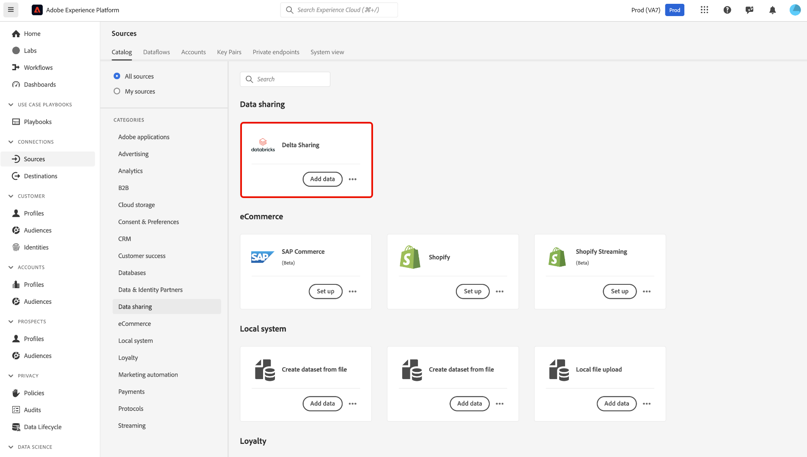
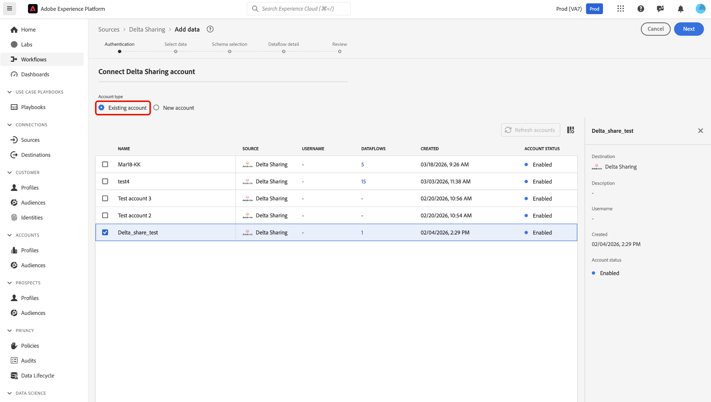
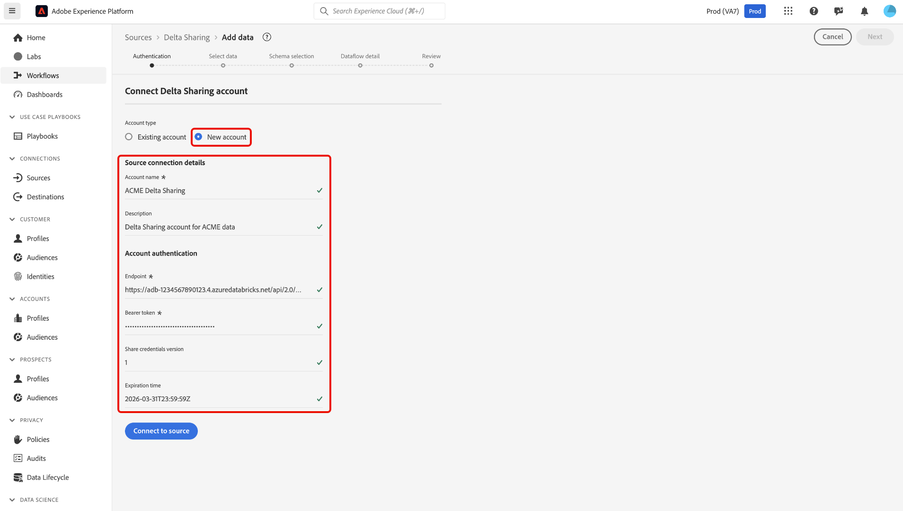
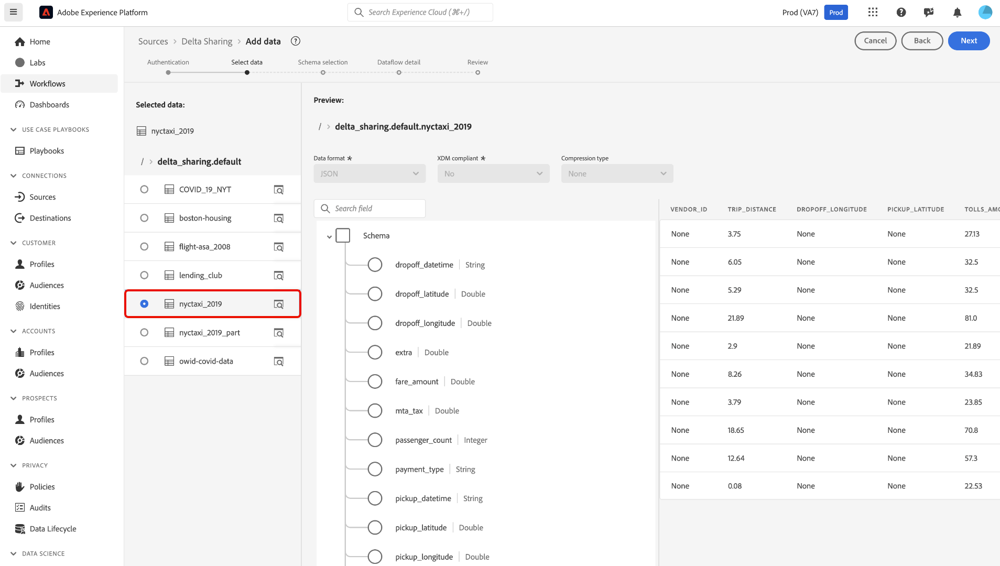
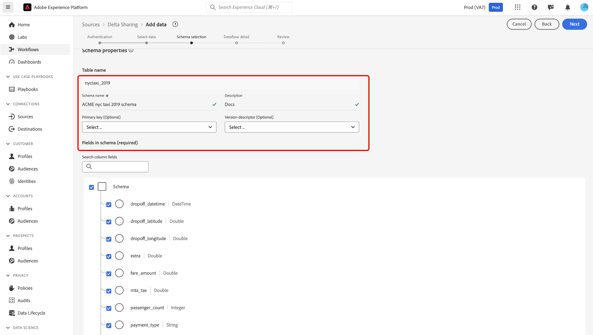
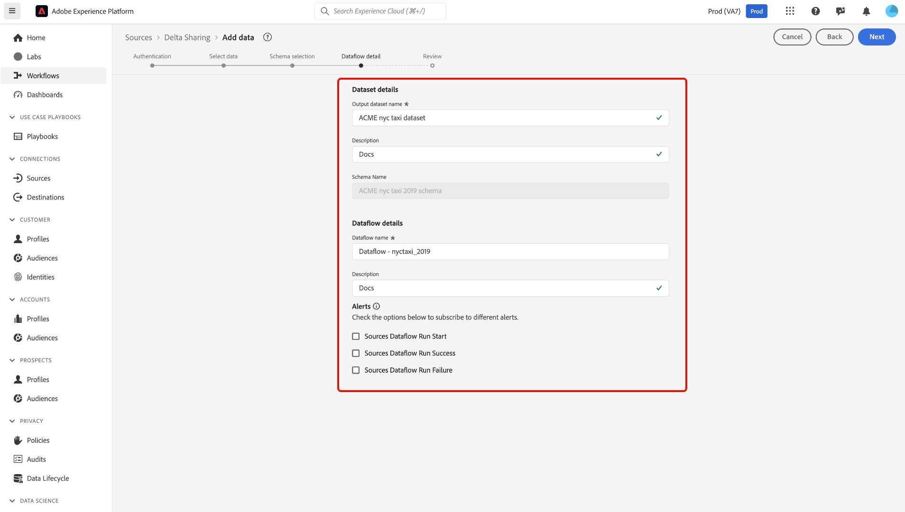
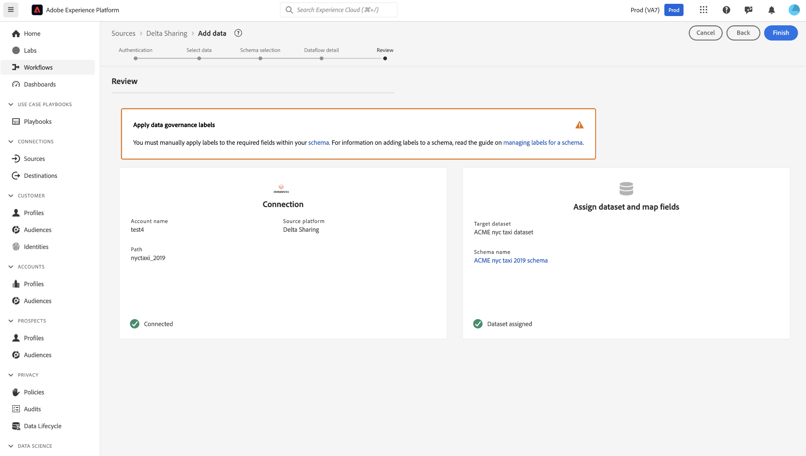

# Use the [!DNL Delta Sharing] source connector in the UI {#use-deltashare-in-the-ui}

>[!CONTEXTUALHELP]
>id="platform_sources_deltashare_schema"
>title="Schema structure"
>abstract="Ensure that you review your schema structure because once you proceed, you will no longer be able to make changes to your schema."

>[!AVAILABILITY]
>
>This feature is currently in a closed beta and is not available to all users. Contact your Adobe account team to request access to the beta.

Read this guide to learn how to use the [!DNL Delta Sharing] source connector in the Adobe Experience Platform user interface.

## Get started

This tutorial requires a working understanding of the following components of Experience Platform:

- [[!DNL Experience Data Model (XDM)] System](../../../../../xdm/home.md): The standardized framework by which Experience Platform organizes customer experience data.
  - [Basics of schema composition](../../../../../xdm/schema/composition.md): Learn about the basic building blocks of XDM schemas, including key principles and best practices in schema composition.
  - [Schema Editor tutorial](../../../../../xdm/tutorials/create-schema-ui.md): Learn how to create custom schemas using the Schema Editor UI.
- [[!DNL Real-Time Customer Profile]](../../../../../profile/home.md): Provides a unified, real-time consumer profile based on aggregated data from multiple sources.

>[!IMPORTANT]
>
>Read the [[!DNL Delta Sharing] overview](../../../../connectors/data-sharing/delta-sharing.md) to learn about prerequisite steps that you need to complete before connecting your account to Experience Platform.

## Navigate the sources catalog

In the Experience Platform UI, select **[!UICONTROL Sources]** from the left navigation to access the *[!UICONTROL Sources]* workspace. Select the appropriate category in the *[!UICONTROL Categories]* panel. Alternatively, use the search bar to navigate to the specific source that you want to use.

To use [!DNL Delta Sharing], select the **[!UICONTROL Delta Sharing]** source card under the *[!UICONTROL Data sharing]* and then select **[!UICONTROL Add data]**.

>[!TIP]
>
>Sources in the sources catalog display the **[!UICONTROL Set up]** option when a given source does not yet have an authenticated account. Once an authenticated account is created, this option changes to **[!UICONTROL Add data]**.

### Use an existing account

To use an existing account, select **[!UICONTROL Existing account]** and select the [!DNL Delta Sharing] account that you want to use from the accounts interface.

### Create a new account

To create a new account, select **[!UICONTROL New account]** and provide a name and an optional description for your account. Provide values for the following authentication credentials:

- Endpoint
- Bearer token
- Share credentials version
- Expiration time

>[!TIP]
>
>Read the [[!DNL Delta Sharing] authentication guide](../../../../connectors/data-sharing/delta-sharing.md) for more information on these credentials.

When finished, select **[!UICONTROL Connect to source]** and allow for a few moments for your connection to establish.

## Select your data

Next, select the data that you want to ingest to Experience Platform. Use the table directory to navigate to the data that you want to ingest and use the preview interface to view the contents and structure of your data. When finished, select **[!UICONTROL Next]**.

## Select your schema

>[!IMPORTANT]
>
>Once you select **[!UICONTROL Next]**, you will not be able to change the selected schema structure. If you have already selected **[!UICONTROL Next]** and moved past the schema selection step, you can no longer update your selected schema if you return to a previous step. To modify your schema, you must restart the dataflow configuration process and begin from the initial step.

After selecting a table from your [!DNL Delta Sharing] source, Experience Platform automatically infers the relational schema. At this stage, you are required to provide a schema name before proceeding. Optionally, you may also specify a **primary key** and a **version descriptor** to further define your schema.

**Primary key**: Set a primary key if your table has one. Consider the following factors when selecting a primary key:

- Select a key that is unique per row for the logical entity you care about (e.g., one row per order, per customer, per transaction).
- Select a key that is stable over time (doesn't change once written).
- Select a key that is not a high‑cardinality, non‑business surrogate that is meaningless for governance (e.g., a random "row_id" that the upstream regenerates).

**Version descriptor**: The version descriptor marks a column that tells you which row is the "latest" record for a given key. Use this as a reference in the case that your table keeps multiple versions of the same entity, and you want a well‑defined way to choose the current or latest one. Consider the following factors when selecting a version descriptor:

- A timestamp such as `last_updated_at` or `modified_ts`.
- An increasing numeric version such as `version_num` or `sequence_number`.

You can leave the version descriptor empty if you fall into the following scenarios:

- The table is purely transactional / event‑level (This means that each row is a one‑time event and doesn't represent a mutable "entity" with versions).
- There's no reliable "latest" indicator column.
- You haven't validated what the timestamp/version column really means.

>[!TIP]
>
>If you are unsure, you can elect to leave the version descriptor blank. You can still query the virtual dataset and implement "latest" logic directly in SQL.

## Provide dataset and dataflow details

A dataset is a storage and management construct for a collection of data, typically a table, that contains a schema (columns/fields) and records (rows). Data that is successfully ingested into Experience Platform is persisted within the data lake as datasets. 

Once your dataset is configured, you must then provide details on your dataflow, including a name, an optional description, and alert configurations.

| Dataflow configurations | Description |
| --- | --- |
| Dataflow name | The name of the dataflow. By default, this will use the name of the file that is being imported. |
| Description | (Optional) A brief description of your dataflow. |
| Alerts | Experience Platform can produce event-based alerts which users can subscribe to, these options allow a running dataflow to trigger these.  For more information, read the [alerts overview](../../alerts.md) <ul><li>**Sources Dataflow Run Start**: Select this alert to receive a notification when your dataflow run begins.</li><li>**Sources Dataflow Run Success**: Select this alert to receive a notification if your dataflow ends without any errors.</li><li>**Sources Dataflow Run Failure**: Select this alert to receive a notification if your dataflow run ends with any errors.</li></ul> |

{style="table-layout:auto"}

## Review your dataflow

The *[!UICONTROL Review]* step appears, allowing you to review the details of your dataflow before it is created. Details are grouped within the following categories:

- **[!UICONTROL Connection]**: Shows the account name, source platform, and the source name.
- **[!UICONTROL Assign dataset and map fields]**: Shows the target dataset and the schema that the dataset adheres to.

After confirming the details are correct, select **[!UICONTROL Finish]**.

## Monitor your dataflow

Once your dataflow has been created, you can monitor the data that is being ingested through it to see information on ingestion rates, success, and errors. For more information on how to monitor dataflow, see the tutorial on [monitoring accounts and dataflows in the UI](../../../../../dataflows/ui/monitor-sources.md).