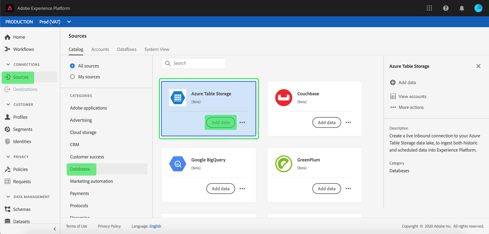
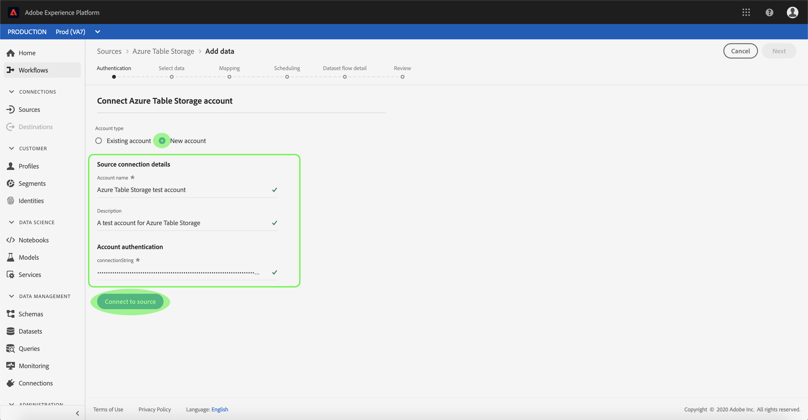
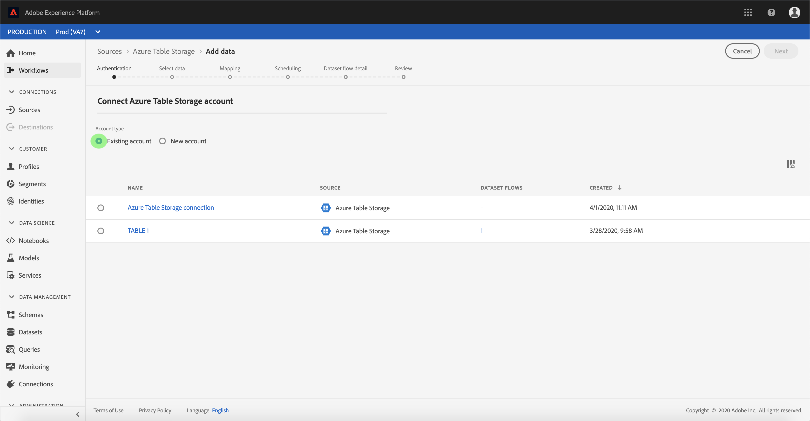

# Create an [!DNL Azure Table Storage] source connector in the UI

>[!NOTE]
>The [!DNL Azure Table Storage] connector is in beta. See the [Sources overview](../../../../home.md#terms-and-conditions) for more information on using beta-labelled connectors.

Source connectors in Adobe Experience Platform provide the ability to ingest externally sourced data on a scheduled basis. This tutorial provides steps for creating a [!DNL Azure Table Storage] (hereinafter referred to as "ATS") source connector using the [!DNL Platform] user interface.

## Getting started

This tutorial requires a working understanding of the following components of Adobe Experience Platform:

*   [Experience Data Model (XDM) System](../../../../../xdm/home.md): The standardized framework by which [!DNL Experience Platform] organizes customer experience data.
    *   [Basics of schema composition](../../../../../xdm/schema/composition.md): Learn about the basic building blocks of XDM schemas, including key principles and best practices in schema composition.
    *   [Schema Editor tutorial](../../../../../xdm/tutorials/create-schema-ui.md): Learn how to create custom schemas using the Schema Editor UI.
*   [Real-time Customer Profile](../../../../../profile/home.md): Provides a unified, real-time consumer profile based on aggregated data from multiple sources.

If you already have a valid ATS connection, you may skip the remainder of this document and proceed to the tutorial on [configuring a dataflow](../../dataflow/databases.md).

### Gather required credentials

In order to access your ATS account on [!DNL Platform], you must provide the following values:

| Credential | Description |
| ---------- | ----------- |
| `connectionString` | A connection string to connect to your [!DNL Azure Table Storage] instance. The connection string to connect to ATS instance. The connection string pattern for ATS is `DefaultEndpointsProtocol=https;AccountName={ACCOUNT_NAME};AccountKey={ACCOUNT_KEY}`. |

For more information about getting started refer to [this Azure Table Storage document](https://docs.microsoft.com/en-us/azure/storage/common/storage-introduction).

## Connect your [!DNL Azure Table Storage] account

Once you have gathered your required credentials, you can follow the steps below to create a new ATS account to connect to [!DNL Platform].

Log in to [Adobe Experience Platform](https://platform.adobe.com) and then select **[!UICONTROL Sources]** from the left navigation bar to access the *[!UICONTROL Sources]* workspace. The *[!UICONTROL Catalog]* screen displays a variety of sources for which you can create inbound account, and each source shows the number of existing accounts and dataset flows associated to them.

You can select the appropriate category from the catalog on the left-hand side of your screen. Alternatively, you can find the specific source you wish to work with using the search option.

Under the *[!UICONTROL Databases]* category, select **[!UICONTROL Azure Table Storage]** to expose an information bar on the right-hand side of your screen. The information bar provides a brief description for the selected source as well as options to connect with the source or view its documentation. To create a new inbound connection, select **[!UICONTROL Add data]**.

The *[!UICONTROL Connect to Azure Table Storage]* page appears. On this page, you can either use new credentials or existing credentials.

### New account

If you are using new credentials, select **[!UICONTROL New account]**. On the input form that appears, provide the connection with a name, an optional description, and your ATS credentials. When finished, select **[!UICONTROL Connect]** and then allow some time for the new account to establish.

### Existing account

To connect an existing account, select the ATS account you want to connect with, then select **[!UICONTROL Next]** to proceed.

## Next steps

By following this tutorial, you have established a connection to your ATS account. You can now continue on to the next tutorial and [configure a dataflow to bring data into Platform](../../dataflow/databases.md).