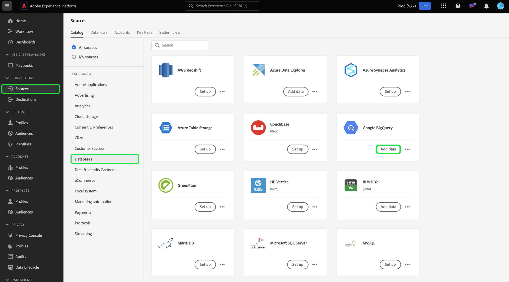
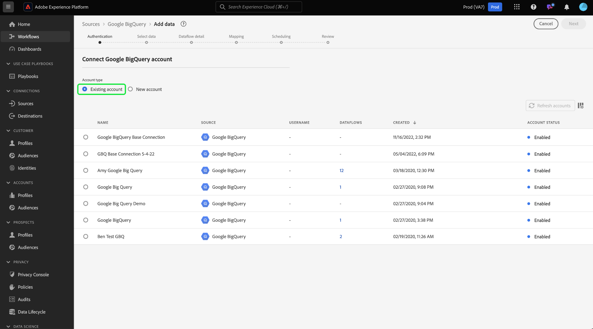
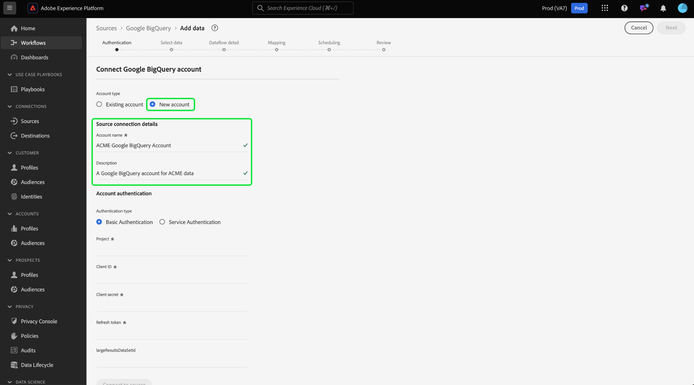

# Create a [!DNL Google Big Query] source connection in the UI

Source connectors in Adobe Experience Platform provide the ability to ingest externally sourced data on a scheduled basis. This tutorial provides steps for creating a [!DNL Google Big Query] source connection using the Platform user interface.

## Getting started

This tutorial requires a working understanding of the following components of Experience Platform:

* [[!DNL Experience Data Model (XDM)] System](../../../../../xdm/home.md): The standardized framework by which Experience Platform organizes customer experience data.
  * [Basics of schema composition](../../../../../xdm/schema/composition.md): Learn about the basic building blocks of XDM schemas, including key principles and best practices in schema composition.
  * [Schema Editor tutorial](../../../../../xdm/tutorials/create-schema-ui.md): Learn how to create custom schemas using the Schema Editor UI.
* [[!DNL Real-time Customer Profile]](../../../../../profile/home.md): Provides a unified, real-time consumer profile based on aggregated data from multiple sources.

If you already have a valid [!DNL Google BigQuery] connection, you may skip the remainder of this document and proceed to the tutorial on [configuring a dataflow](../../dataflow/databases.md).

### Gather required credentials

In order to access your [!DNL Google BigQuery] account on Platform, you must provide the following OAuth 2.0 authentication values:

| Credential | Description |
| ---------- | ----------- |
| `project` | The project ID of the default [!DNL Google BigQuery] project to query against. |
| `clientID` | The ID value used to generate the refresh token. |
| `clientSecret` | The secret value used to generate the refresh token. |
| `refreshToken` | The refresh token obtained from [!DNL Google] used to authorize access to [!DNL Google BigQuery]. |

For more information about these values, refer to [this [!DNL Google BigQuery] document](https://cloud.google.com/storage/docs/json_api/v1/how-tos/authorizing).

## Connect your Google BigQuery account

In the Platform UI, select **[!UICONTROL Sources]** from the left navigation to access the [!UICONTROL Sources] workspace. The [!UICONTROL Catalog] screen displays a variety of sources that you can create an account with.

You can select the appropriate category from the catalog on the left-hand side of your screen. Alternatively, you can find the specific source you wish to work with using the search bar.

Under the [!UICONTROL Databases] category, select **[!UICONTROL Google BigQuery]** and then select **[!UICONTROL Add data]**.

The **[!UICONTROL Connect to Google Big Query]** page appears. On this page, you can either use new credentials or existing credentials.

### Existing account

To connect an existing account, select the [!DNL Google BigQuery] account you want to connect with, then select **[!UICONTROL Next]** to proceed.

### New account

If you are using new credentials, select **[!UICONTROL New account]**. On the input form that appears, provide a name, an optional description, and your [!DNL Google BigQuery] credentials. When finished, select **[!UICONTROL Connect to source]** and then allow some time for the new connection to establish.

## Next steps

By following this tutorial, you have established a connection to your [!DNL Google BigQuery] account. You can now continue on to the next tutorial and [configure a dataflow to bring data into Platform](../../dataflow/databases.md).
