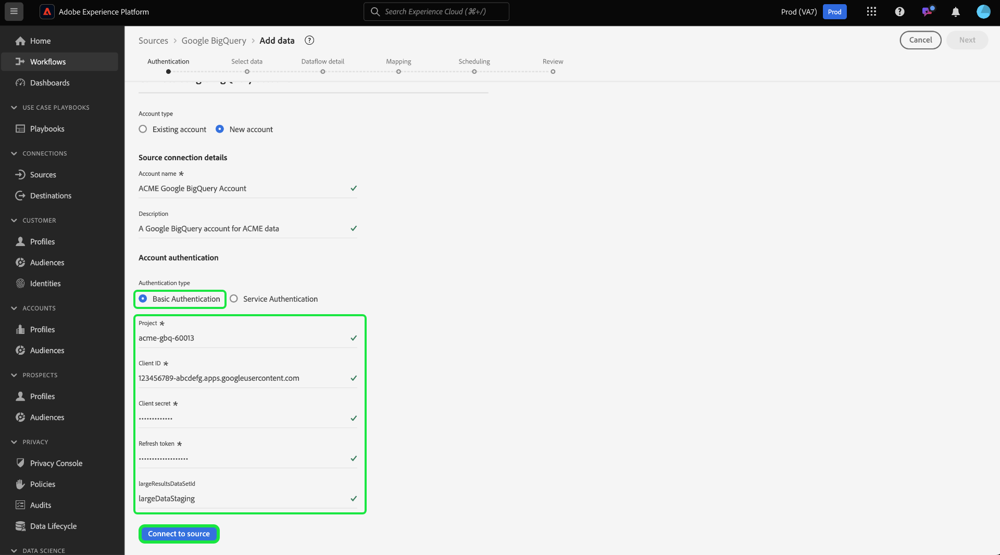

# Connect [!DNL Google BigQuery] to Experience Platform using the UI

>[!IMPORTANT]
>
>The [!DNL Google BigQuery] source is available in the sources catalog to users who have purchased Real-Time Customer Data Platform Ultimate.

Read this tutorial to learn how to connect your [!DNL Google BigQuery] account to Adobe Experience Platform using the user interface.

## Get started

This tutorial requires a working understanding of the following components of Experience Platform:

* [[!DNL Experience Data Model (XDM)] System](../../../../../xdm/home.md): The standardized framework by which Experience Platform organizes customer experience data.
  * [Basics of schema composition](../../../../../xdm/schema/composition.md): Learn about the basic building blocks of XDM schemas, including key principles and best practices in schema composition.
  * [Schema Editor tutorial](../../../../../xdm/tutorials/create-schema-ui.md): Learn how to create custom schemas using the Schema Editor UI.
* [[!DNL Real-Time Customer Profile]](../../../../../profile/home.md): Provides a unified, real-time consumer profile based on aggregated data from multiple sources.

If you already have a valid [!DNL Google BigQuery] connection, you may skip the remainder of this document and proceed to the tutorial on [configuring a dataflow](../../dataflow/databases.md).

### Gather required credentials

Read the [[!DNL Google BigQuery] authentication guide](../../../../connectors/databases/bigquery.md#generate-your-google-bigquery-credentials) for detailed steps on gathering your required credentials.

## Navigate the sources catalog {#navigate}

In the Experience Platform UI, select **[!UICONTROL Sources]** from the left navigation to access the *[!UICONTROL Sources]* workspace. You can select the appropriate category in the *[!UICONTROL Categories]* panel Alternatively, you can use the search bar to navigate to the specific source that you want to use.

To use [!DNL Google BigQuery], select the **[!UICONTROL Google BigQuery]** source card under *[!UICONTROL Databases]* and then select **[!UICONTROL Add data]**.

>[!TIP]
>
>Sources in the sources catalog display the **[!UICONTROL Set up]** option when a given source does not yet have an authenticated account. Once an authenticated account is created, this option changes to **[!UICONTROL Add data]**.

## Use an existing account {#existing}

To use an existing account, select the [!DNL Google BigQuery] account you want to connect with, then select **[!UICONTROL Next]** to proceed.

## Create a new account {#create}

If you do not have an existing account, then you must create a new account by providing the necessary authentication credentials that correspond with your source. 

To create a new account, select **[!UICONTROL New account]** and then provide a name and optionally add a description for your account.

### Connect to Experience Platform on Azure {#azure}

You can connect your [!DNL Google BigQuery] account to Experience Platform on Azure using either basic or service authentication. 

>[!BEGINTABS]

>[!TAB Use basic authentication]

To use basic authentication, select **[!UICONTROL Basic Authentication]** and provide values for your [project, client ID, client secret, refresh token, and (optional) large results dataset ID](../../../../connectors/databases/bigquery.md#generate-your-google-bigquery-credentials). When finished, select **[!UICONTROL Connect to source]** and allow for a few moments for the connection to establish.

>[!TAB Use service authentication]

To use service authentication, select **[!UICONTROL Service Authentication]** and provide values for your [project ID, key file content, and (optional) large results dataset ID](../../../../connectors/databases/bigquery.md#generate-your-google-bigquery-credentials). When finished, select **[!UICONTROL Connect to source]** and allow for a few moments for the connection to establish.

>[!ENDTABS]

### Connect to Experience Platform on Amazon Web Services (AWS) {#aws}

>[!AVAILABILITY]
>
>This section applies to implementations of Experience Platform running on Amazon Web Services (AWS). Experience Platform running on AWS is currently available to a limited number of customers. To learn more about the supported Experience Platform infrastructure, see the [Experience Platform multi-cloud overview](../../../../../landing/multi-cloud.md).

To create a new [!DNL Google BigQuery] account and connect to Experience Platform on AWS, ensure that you are in a VA6 sandbox and then provide the necessary credentials for authentication.

![screenshot of aws connection interface here]

## Skip preview of sample data {#skip-preview-of-sample-data}

During the data selection step, you may encounter a timeout when ingesting large tables or files of data. You can skip data preview to circumvent the timeout and still view your schema, albeit without sample data. To skip data preview, enable the **[!UICONTROL Skip previewing sample data]** toggle.

The rest of the workflow will remain the same. The only caveat is that skipping data preview may prevent calculated and required fields from being auto-validated during the mapping step, and you will then have to manually validate those fields during mapping.

## Next steps

By following this tutorial, you have established a connection to your [!DNL Google BigQuery] account. You can now continue on to the next tutorial and [configure a dataflow to bring data into Platform](../../dataflow/databases.md).
