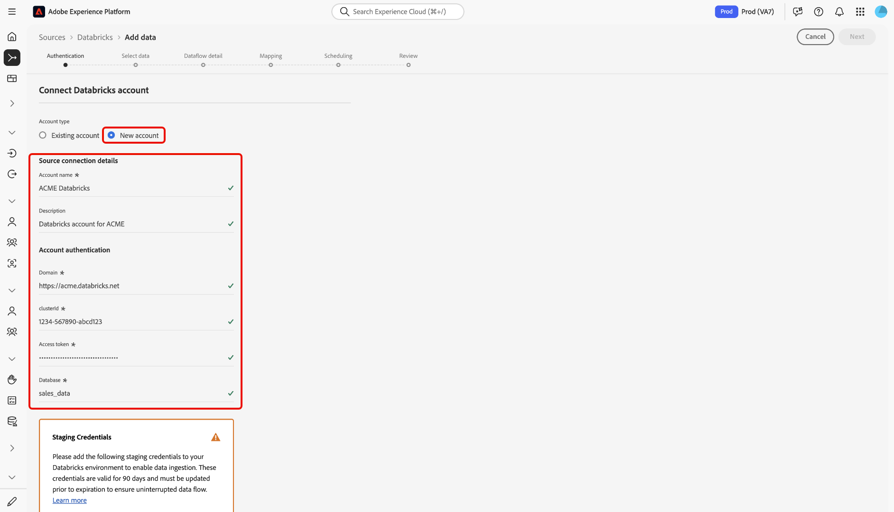

# Connect [!DNL Azure Databricks] to Experience Platform in the UI

>[!AVAILABILITY]
>
>* The [!DNL Azure Databricks] source is available in the sources catalog to users who have purchased Real-Time CDP Ultimate.
>
>* The [!DNL Azure Databricks] source is in beta. Read the [terms and conditions](../../../../home.md#terms-and-conditions) in the sources overview for more information on using beta-labeled sources.

Read this guide to learn how to connect your [!DNL Azure Databricks] account to Adobe Experience Platform using the sources workspace in the UI.

## Get started

This guide requires a working understanding of the following components of Experience Platform:

* [Sources](../../../../home.md): Experience Platform allows data to be ingested from various sources while providing you with the ability to structure, label, and enhance incoming data using Experience Platform services.
* [Sandboxes](../../../../../sandboxes/home.md): Experience Platform provides virtual sandboxes which partition a single Experience Platform instance into separate virtual environments to help develop and evolve digital experience applications.

### Gather required credentials

Provide values for the following credentials to connect [!DNL Azure Databricks] to Experience Platform.

| Credential | Description |
| --- | --- |
| Domain | The URL of your [!DNL Azure Databricks] workspace. For example, `https://adb-1234567890123456.7.azuredatabricks.net`. |
| Cluster ID | The ID of your cluster in [!DNL Azure Databricks]. This cluster must already be an existing cluster and should be an interactive cluster. |
| Access token | The access token that authenticates your [!DNL Azure Databricks] account. You can generate your access token using the [!DNL Azure Databricks] workspace. |
| Database | The name of your database in the delta lake. |

For more information, read the [[!DNL Azure Databricks] overview](../../../../connectors/databases/databricks.md).

## Navigate the sources catalog

In the Experience Platform UI, select **[!UICONTROL Sources]** from the left navigation to access the *[!UICONTROL Sources]* workspace. Choose a category or use the search bar to find your source.

To connect to [!DNL Azure Databricks], go to the *[!UICONTROL Databases]* category, select the **[!UICONTROL Azure Databricks]** source card, and then select **[!UICONTROL Set up]**.

>[!TIP]
>
>Sources in the sources catalog display the **[!UICONTROL Set up]** option when a given source does not yet have an authenticated account. Once an authenticated account is created, this option changes to **[!UICONTROL Add data]**.

### Use an existing account

To use an existing account, select **[!UICONTROL Existing account]** and then select the [!DNL Azure Databricks] account that you want to use.

### Create a new account

To create a new account, select **[!UICONTROL New account]** and provide a name and optionally add a description for your account. Next, provide values for the following authentication credentials:

* Domain
* Cluster ID
* Access token
* Database

Additionally, you must copy and paste your [!UICONTROL Staging SAS URI] credentials to your [!DNL Azure Databricks] environment. When finished, select **[!UICONTROL Connect to source]** and allow for a few moments for the connection to establish.

## Create a dataflow for [!DNL Azure Databricks] data

Now that you have successfully connected your [!DNL Azure Databricks] account, you can now [create a dataflow and ingest data from your database into Experience Platform](../../dataflow/databases.md).
