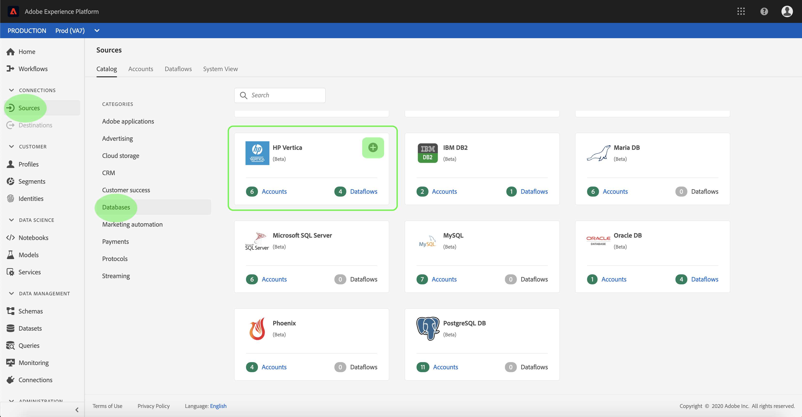
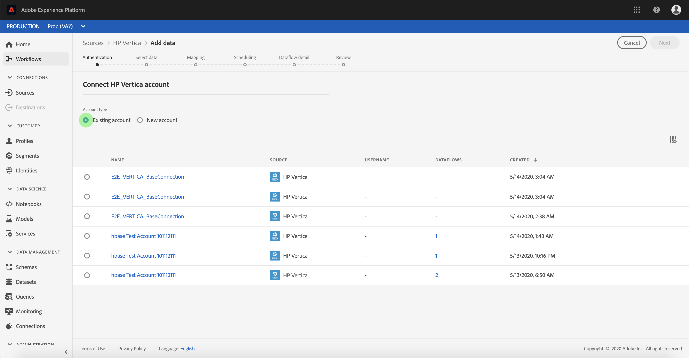

# Create an HP [!DNL Vertica] source connection in the UI

>[!NOTE]
>
> The HP [!DNL Vertica] connector is in beta. See the [Sources overview](../../../../home.md#terms-and-conditions) for more information on using beta-labeled connectors.

Source connectors in Adobe Experience Platform provide the ability to ingest externally sourced data on a scheduled basis. This tutorial provides steps for creating an HP [!DNL Vertica] source connector using the [!DNL Platform] user interface.

## Getting started

This tutorial requires a working understanding of the following components of Adobe Experience Platform:

*   [[!DNL Experience Data Model (XDM)] System](../../../../../xdm/home.md): The standardized framework by which [!DNL Experience Platform] organizes customer experience data.
    *   [Basics of schema composition](../../../../../xdm/schema/composition.md): Learn about the basic building blocks of XDM schemas, including key principles and best practices in schema composition.
    *   [Schema Editor tutorial](../../../../../xdm/tutorials/create-schema-ui.md): Learn how to create custom schemas using the Schema Editor UI.
*   [[!DNL Real-Time Customer Profile]](../../../../../profile/home.md): Provides a unified, real-time consumer profile based on aggregated data from multiple sources.

If you already have a valid HP [!DNL Vertica] connection, you may skip the remainder of this document and proceed to the tutorial on [configuring a dataflow](../../dataflow/databases.md).

### Gather required credentials

The following sections provide additional information that you will need to know in order to successfully connect to HP [!DNL Vertica] using the [!DNL Flow Service] API.

| Credential | Description |
| ---------- | ----------- |
| `connectionString` | The connection string used to connect to your HP [!DNL Vertica] instance. The connection string pattern for HP [!DNL Vertica] is `Server={SERVER};Port={PORT};Database={DATABASE};UID={USERNAME};PWD={PASSWORD}` |

For more information about getting started, refer to [this HP [!DNL Vertica] document](https://www.vertica.com/docs/9.2.x/HTML/Content/Authoring/ConnectingToVertica/ClientJDBC/CreatingAndConfiguringAConnection.htm).

## Connect your HP [!DNL Vertica] account

Once you have gathered your required credentials, you can follow the steps below to link your HP [!DNL Vertica] account to [!DNL Platform].

Log in to [Adobe Experience Platform](https://platform.adobe.com) and then select **[!UICONTROL Sources]** from the left navigation bar to access the **[!UICONTROL Sources]** workspace. The **[!UICONTROL Catalog]** screen displays a variety of sources for which you can create an account with.

You can select the appropriate category from the catalog on the left-hand side of your screen. Alternatively, you can find the specific source you wish to work with using the search option.

Under the **[!UICONTROL Databases]** category, select **[!UICONTROL HP Vertica]**. If this is your first time using this connector, select **[!UICONTROL Configure]**. Otherwise, select **[!UICONTROL Add data]** to create a new HP [!DNL Vertica] connector.

The **[!UICONTROL Connect to HP Vertica]** page appears. On this page, you can either use new credentials or existing credentials.

### New account

If you are using new credentials, select **[!UICONTROL New account]**. On the input form that appears, provide a name, an optional description, and your HP [!DNL Vertica] credentials. When finished, select **[!UICONTROL Connect]** and then allow some time for the new connection to establish.

### Existing account

To connect an existing account, select the HP [!DNL Vertica] account you want to connect with, then select **[!UICONTROL Next]** in the top-right corner to proceed.

## Next steps

By following this tutorial, you have established a connection to your HP [!DNL Vertica] account. You can now continue on to the next tutorial and [configure a dataflow to bring data into [!DNL Platform]](../../dataflow/databases.md).
