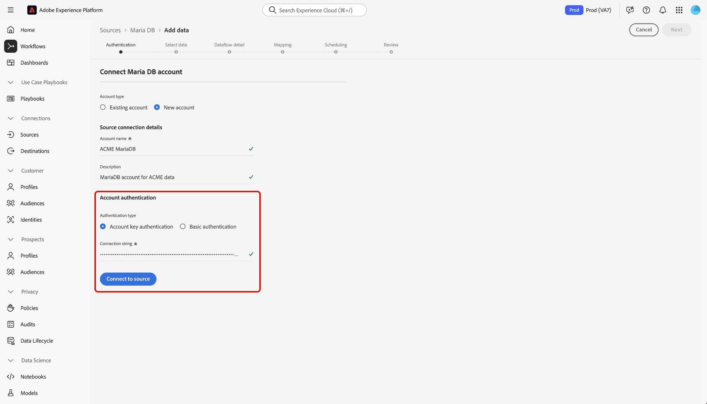
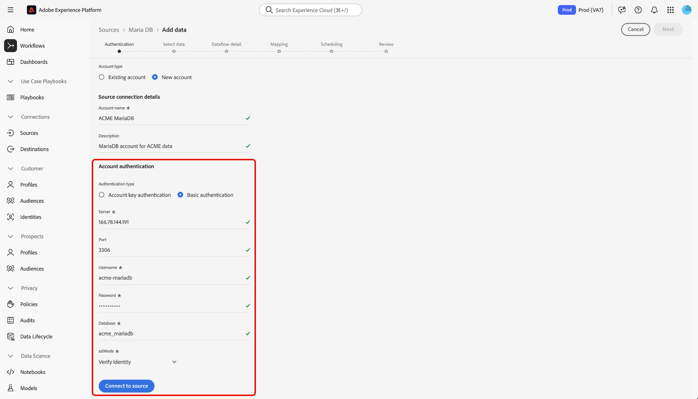

# Connect [!DNL MariaDB] to Experience Platform using the UI

Read this guide to learn how to connect your [!DNL MariaDB] account to Adobe Experience Platform using the sources workspace in the Experience Platform user interface.

## Get started

This tutorial requires a working understanding of the following components of Experience Platform:

* [[!DNL Experience Data Model (XDM)] System](../../../../../xdm/home.md): The standardized framework by which Experience Platform organizes customer experience data.
    * [Basics of schema composition](../../../../../xdm/schema/composition.md): Learn about the basic building blocks of XDM schemas, including key principles and best practices in schema composition.
    * [Schema Editor tutorial](../../../../../xdm/tutorials/create-schema-ui.md): Learn how to create custom schemas using the Schema Editor UI.
*  [Real-Time Customer Profile](../../../../../profile/home.md): Provides a unified, real-time consumer profile based on aggregated data from multiple sources.

If you already have a [!DNL MariaDB] connection, you may skip the remainder of this document and proceed to the tutorial on [configuring a dataflow](../../dataflow/databases.md).

### Gather required credentials

Read the [[!DNL MariaDB] overview](../../../../connectors/databases/mariadb.md#prerequisites) for information on authentication.

## Navigate the sources catalog

In the Experience Platform UI, select **[!UICONTROL Sources]** from the left navigation to access the *[!UICONTROL Sources]* workspace. Select the appropriate category in the *[!UICONTROL Categories]* panel Alternatively, use the search bar to navigate to the specific source that you want to use.

To use [!DNL MariaDB], select the **[!UICONTROL MariaDB]** source card under *[!UICONTROL Databases]* and then select **[!UICONTROL Set up]**.

>[!TIP]
>
>Sources in the sources catalog display the **[!UICONTROL Set up]** option when a given source does not yet have an authenticated account. Once an authenticated account is created, this option changes to **[!UICONTROL Add data]**.

## Use an existing account {#existing}

To use an existing account, select **[!UICONTROL Existing account]** and then select the [!DNL MariaDB] account that you want to use.

## Create a new account {#create}

If you do not have an existing account, then you must create a new account by providing the necessary authentication credentials that correspond with your source. 

To create a new account, select **[!UICONTROL New account]** and then provide a name and optionally add a description for your account.

### Connect to Experience Platform

You can connect your [!DNL MariaDB] account to Experience Platform using either account key or basic authentication.

>[!BEGINTABS]

>[!TAB Account key authentication]

To use account key authentication, select **[!UICONTROL Account key authentication]**, provide your [connection string](../../../../connectors/databases/mariadb.md#azure), and then select **[!UICONTROL Connect to source]**.

>[!TAB Basic authentication]

To use basic authentication, select **[!UICONTROL Basic authentication]**, provide values for your [authentication credentials](../../../../connectors/databases/mariadb.md#azure), and then select **[!UICONTROL Connect to source]**.

>[!ENDTABS]

By following this tutorial, you have established a connection to your [!DNL MariaDB] account. You can now continue on to the next tutorial and [configure a dataflow to bring data into Experience Platform](../../dataflow/databases.md).
