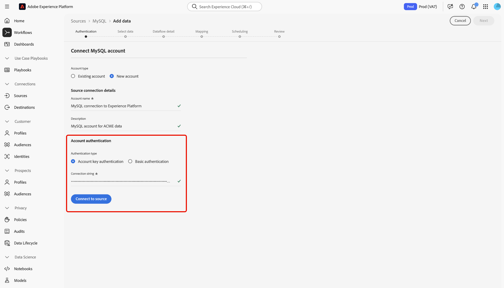
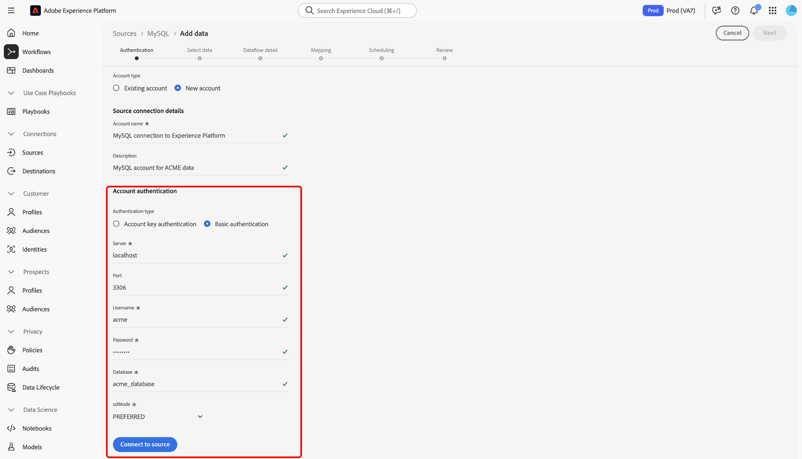
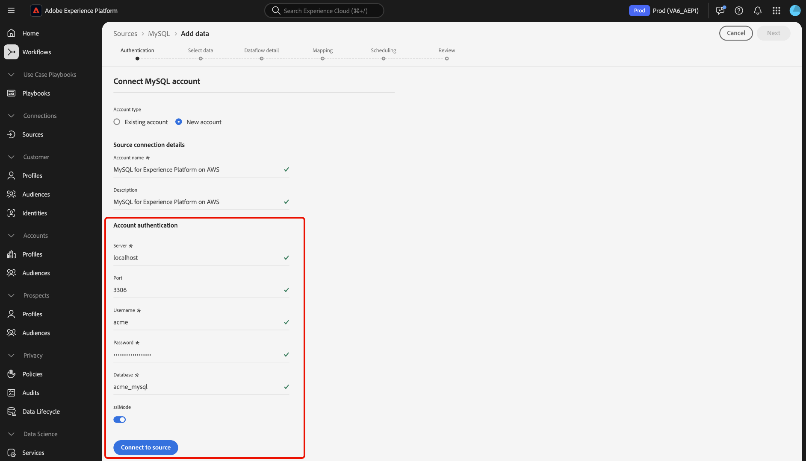

# Connect [!DNL MySQL] to Experience Platform using the UI

Read this guide to learn how to connect your [!DNL MySQL] database to Adobe Experience Platform using the sources workspace in the Experience Platform user interface.

## Getting started

This tutorial requires a working understanding of the following components of Adobe Experience Platform:

* [[!DNL Experience Data Model (XDM)] System](../../../../../xdm/home.md): The standardized framework by which Experience Platform organizes customer experience data.
  * [Basics of schema composition](../../../../../xdm/schema/composition.md): Learn about the basic building blocks of XDM schemas, including key principles and best practices in schema composition.
  * [Schema Editor tutorial](../../../../../xdm/tutorials/create-schema-ui.md): Learn how to create custom schemas using the Schema Editor UI.
*  [[!DNL Real-Time Customer Profile]](../../../../../profile/home.md): Provides a unified, real-time consumer profile based on aggregated data from multiple sources.

If you already have a [!DNL MySQL] connection, you may skip the remainder of this document and proceed to the tutorial on [configuring a dataflow](../../dataflow/databases.md).

### Gather required credentials

Read the [[!DNL MySQL] overview](../../../../connectors/databases/mysql.md#prerequisites) for information on authentication.

## Navigate the sources catalog

In the Experience Platform UI, select **[!UICONTROL Sources]** from the left navigation to access the *[!UICONTROL Sources]* workspace. Choose a category or use the search bar to find your source.

To connect to [!DNL MySQL], go to the *[!UICONTROL Databases]* category, select the **[!UICONTROL MySQL]** source card, and then select **[!UICONTROL Set up]**.

>[!TIP]
>
>Sources in the sources catalog display the **[!UICONTROL Set up]** option when a given source does not yet have an authenticated account. Once an authenticated account is created, this option changes to **[!UICONTROL Add data]**.

## Use an existing account {#existing}

To use an existing account, select **[!UICONTROL Existing account]** and then select the [!DNL MySQL] account that you want to use.

## Create a new account {#new}

To create a new account, select **[!UICONTROL New account]** and then provide a name and optionally add a description for your account.

### Connect to Experience Platform on Azure {#azure}

You can connect your [!DNL MySQL] database to Experience Platform on Azure using either account key or basic authentication.

>[!BEGINTABS]

>[!TAB Account key authentication]

To use account key authentication, select **[!UICONTROL Account key authentication]**, provide your [connection string](../../../../connectors/databases/mysql.md#azure), and then select **[!UICONTROL Connect to source]**.

>[!TAB Basic authentication]

To use basic authentication, select **[!UICONTROL Basic authentication]**, provide values for your [authentication credentials](../../../../connectors/databases/mysql.md#azure), and then select **[!UICONTROL Connect to source]**.

>[!ENDTABS]

### Connect to Experience Platform on Amazon Web Services (AWS) {#aws}

>[!AVAILABILITY]
>
>This section applies to implementations of Experience Platform running on Amazon Web Services (AWS). Experience Platform running on AWS is currently available to a limited number of customers. To learn more about the supported Experience Platform infrastructure, see the [Experience Platform multi-cloud overview](../../../../../landing/multi-cloud.md).

To create a new [!DNL MySQL] account and connect to Experience Platform on AWS, ensure that you are in a VA6 sandbox and then provide the necessary [credentials for authentication](../../../../connectors/databases/mysql.md#aws).

## Create a dataflow for [!DNL MySQL] data

Now that you have successfully connected your [!DNL MySQL] database, you can now [create a dataflow and ingest data from your database into Experience Platform](../../dataflow/databases.md).
