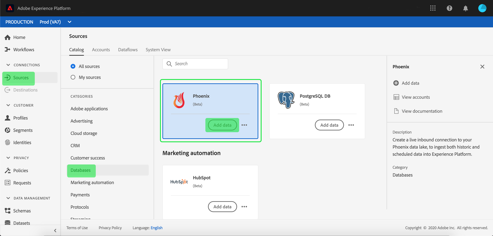
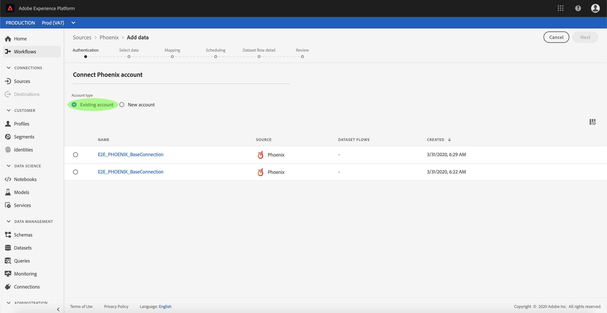
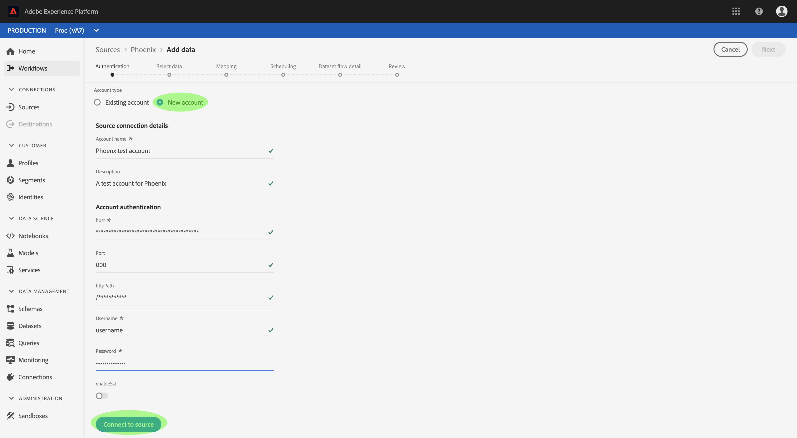

# Connect your [!DNL Phoenix] account to Experience Platform using the UI

This tutorial provides steps on how to connect your [!DNL Phoenix] account and bring data from your [!DNL Phoenix] database to Experience Platform.

## Getting started

This tutorial requires a working understanding of the following components of Adobe Experience Platform:

* [[!DNL Experience Data Model (XDM)] System](../../../../../xdm/home.md): The standardized framework by which Experience Platform organizes customer experience data.
    * [Basics of schema composition](../../../../../xdm/schema/composition.md): Learn about the basic building blocks of XDM schemas, including key principles and best practices in schema composition.
    * [Schema Editor tutorial](../../../../../xdm/tutorials/create-schema-ui.md): Learn how to create custom schemas using the Schema Editor UI.
* [[!DNL Real-Time Customer Profile]](../../../../../profile/home.md): Provides a unified, real-time consumer profile based on aggregated data from multiple sources.

If you already have an authenticated [!DNL Phoenix] account, then you may skip the remainder of this document and proceed to the tutorial on [configuring a dataflow for a database](../../dataflow/databases.md).

### Gather required credentials

In order to access your [!DNL Phoenix] account on Experience Platform, you must provide the following values:

| Credential | Description |
| --- | --- |
| Host | The IP address or hostname of the [!DNL Phoenix] server. |
| Port | The TCP port that the [!DNL Phoenix] server uses to listen for client connections. If you are connecting to [!DNL Azure HDInsights], then specify the port as 443. If this parameter is unprovided, the value defaults to 8765. |
| HTTP Path | The partial URL corresponding to the [!DNL Phoenix] server. Specify /hbasephoenix0 if you are using the [!DNL Azure HDInsights] cluster. |
| Username | The username that you use to access the [!DNL Phoenix] server. |
| Password | The password that corresponds to the user. |
| Enable SSL | A toggle that specifies whether the connections to the server are encrypted using SSL. |

For more information about getting started, refer to [this [!DNL Phoenix] document](https://python-phoenixdb.readthedocs.io/en/latest/api.html).

Once you have gathered your required credentials, you can follow the steps below to connect your [!DNL Phoenix] account to Experience Platform.

## Connect your [!DNL Phoenix] account

In the Platform UI, select **[!UICONTROL Sources]** from the left navigation to access the sources workspace. The *[!UICONTROL Catalog]* screen displays a variety of sources available in the Experience Platform sources catalog.

You can select the appropriate category from the catalog on the left-hand side of your screen. Alternatively, you can find a specific source using the search option.

Select **[!UICONTROL Databases]** from the list of sources categories and then select **[!UICONTROL Add data]** from the [!DNL Phoenix] card.

>[!TIP]
>
>Sources in the sources catalog may display different prompts depending on the status of the source.
> 
>* **[!UICONTROL Add data]** means that there are existing authenticated accounts associated with your selected source. 
>
>* **[!UICONTROL Set up]** means that you must provide credentials and authenticate a new account in order to use your selected source.

The **[!UICONTROL Connect to Phoenix]** page appears. On this page, you can either use new credentials or existing credentials.

>[!BEGINTABS]

>[!TAB Use an existing Phoenix account]

To use an existing account, select [!UICONTROL Existing account] and then select the account that you want to use from the list that appears. When finished, select [!UICONTROL Next] to proceed.

>[!TAB Create a new Phoenix account]

To use a new account, select [!UICONTROL New account] and provide a name, description, and your [!DNL Phoenix] authentication credentials. When finished, select [!UICONTROL Connect to source] and allow for a few seconds for the new connection to establish.

>[!ENDTABS]

## Next steps

By following this tutorial, you have established a connection to your [!DNL Phoenix] account. You can now continue on to the next tutorial and [configure a dataflow to bring data into Experience Platform](../../dataflow/databases.md).
