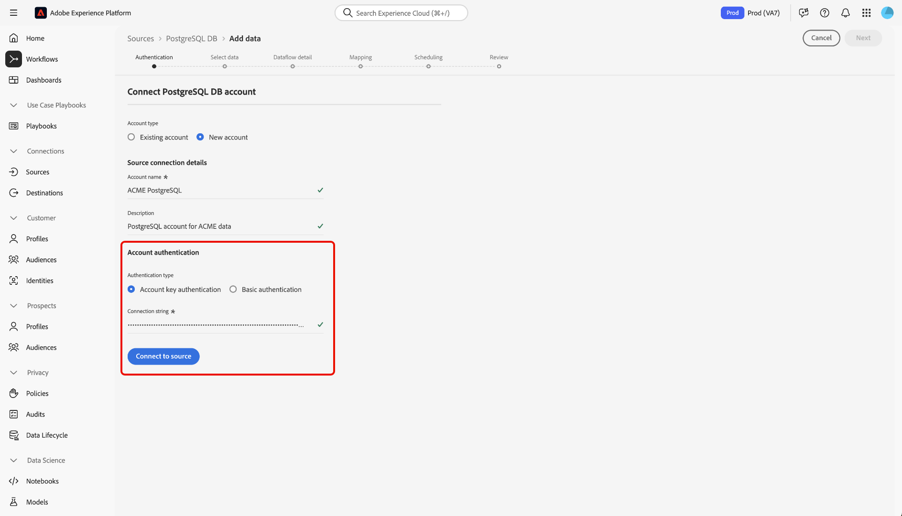
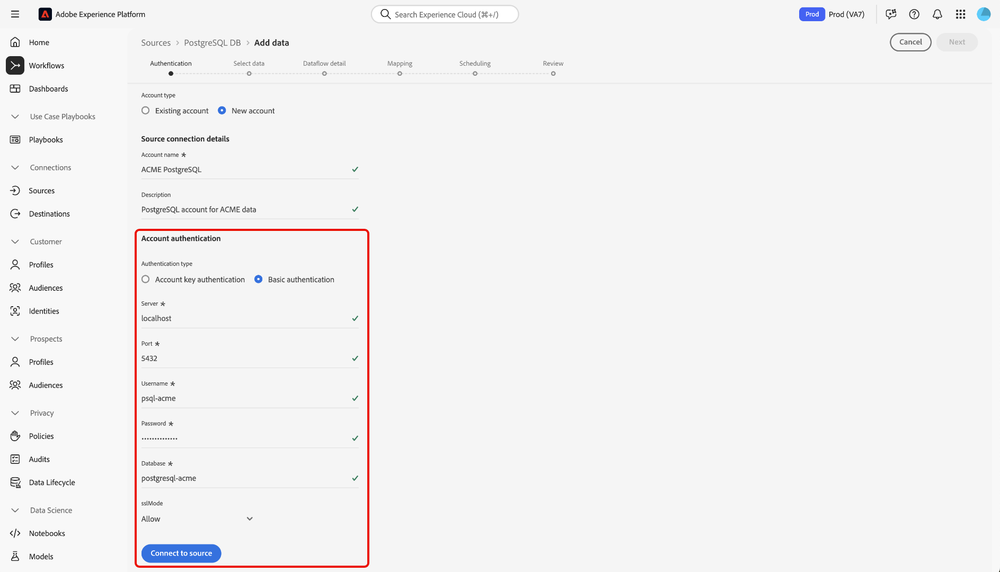

# Connect [!DNL PostgreSQL] to Experience Platform using the UI

Read this guide to learn how to connect your [!DNL PostgreSQL] database to Adobe Experience Platform using the sources workspace in the Experience Platform user interface.

## Getting started

This tutorial requires a working understanding of the following components of Adobe Experience Platform:

* [[!DNL Experience Data Model (XDM)] System](../../../../../xdm/home.md): The standardized framework by which Experience Platform organizes customer experience data.
  * [Basics of schema composition](../../../../../xdm/schema/composition.md): Learn about the basic building blocks of XDM schemas, including key principles and best practices in schema composition.
  * [Schema Editor tutorial](../../../../../xdm/tutorials/create-schema-ui.md): Learn how to create custom schemas using the Schema Editor UI.
* [[!DNL Real-Time Customer Profile]](../../../../../profile/home.md): Provides a unified, real-time consumer profile based on aggregated data from multiple sources.

If you already have a valid [!DNL PostgreSQL] connection, you may skip the remainder of this document and proceed to the tutorial on [configuring a dataflow](../../dataflow/databases.md).

### Gather required credentials

Read the [[!DNL PostgreSQL] overview](../../../../connectors/databases/postgres.md) for more information on authentication.

### Enable SSL encryption for your connection string

You can enable SSL encryption for your [!DNL PostgreSQL] connection string by appending your connection string with the following properties:

| Property | Description | Example |
| --- | --- | --- |
| `EncryptionMethod` | Allows you to enable SSL encryption on your [!DNL PostgreSQL] data. | <uL><li>`EncryptionMethod=0`(Disabled)</li><li>`EncryptionMethod=1`(Enabled)</li><li>`EncryptionMethod=6`(RequestSSL)</li></ul> |
| `ValidateServerCertificate` | Validates certificate sent by your [!DNL PostgreSQL] database when `EncryptionMethod` is applied. | <uL><li>`ValidationServerCertificate=0`(Disabled)</li><li>`ValidationServerCertificate=1`(Enabled)</li></ul> |

The following is an example of a [!DNL PostgreSQL] connection string appended with SSL encryption: `Server={SERVER};Database={DATABASE};Port={PORT};UID={USERNAME};Password={PASSWORD};EncryptionMethod=1;ValidateServerCertificate=1`. 

## Navigate the sources catalog {#navigate}

In the Experience Platform UI, select **[!UICONTROL Sources]** from the left navigation to access the *[!UICONTROL Sources]* workspace. Select the appropriate category in the *[!UICONTROL Categories]* panel Alternatively, use the search bar to navigate to the specific source that you want to use.

To use [!DNL PostgreSQL], select the **[!UICONTROL PostgreSQL]** source card under *[!UICONTROL Databases]* and then select **[!UICONTROL Set up]**.

>[!TIP]
>
>Sources in the sources catalog display the **[!UICONTROL Set up]** option when a given source does not yet have an authenticated account. Once an authenticated account is created, this option changes to **[!UICONTROL Add data]**.

![The sources catalog with the PostgreSQL source card selected.]

## Use an existing account {#existing}

To use an existing account, select **[!UICONTROL Existing account]** and then select the [!DNL PostgreSQL] account that you want to use.

## Create a new account {#create}

If you do not have an existing account, then you must create a new account by providing the necessary authentication credentials that correspond with your source. 

To create a new account, select **[!UICONTROL New account]** and then provide a name and optionally add a description for your account.

### Connect to Experience Platform on Azure {#azure}

You can connect your [!DNL PostgreSQL] account to Experience Platform on Azure using either account key or basic authentication.

>[!BEGINTABS]

>[!TAB Account key authentication]

To use account key authentication, select **[!UICONTROL Account key authentication]**, provide your [connection string](../../../../connectors/databases/postgres.md#azure), and then select **[!UICONTROL Connect to source]**.

>[!TAB Basic authentication]

To use basic authentication, select **[!UICONTROL Basic authentication]**, provide values for your [authentication credentials](../../../../connectors/databases/postgres.md#azure), and then select **[!UICONTROL Connect to source]**.

>[!ENDTABS]

### Connect to Experience Platform on Amazon Web Services (AWS) {#aws}

>[!AVAILABILITY]
>
>This section applies to implementations of Experience Platform running on Amazon Web Services (AWS). Experience Platform running on AWS is currently available to a limited number of customers. To learn more about the supported Experience Platform infrastructure, see the [Experience Platform multi-cloud overview](../../../../../landing/multi-cloud.md).

To create a new [!DNL PostgreSQL] account and connect to Experience Platform on AWS, ensure that you are in a VA6 sandbox and then provide the necessary [credentials for authentication](../../../../connectors/databases/postgres.md#aws).

## Create a dataflow for your [!DNL PostgreSQL] data

By following this tutorial, you have established a connection to your [!DNL MariaDB] account. You can now continue on to the next tutorial and [configure a dataflow to bring data into Experience Platform](../../dataflow/databases.md).
