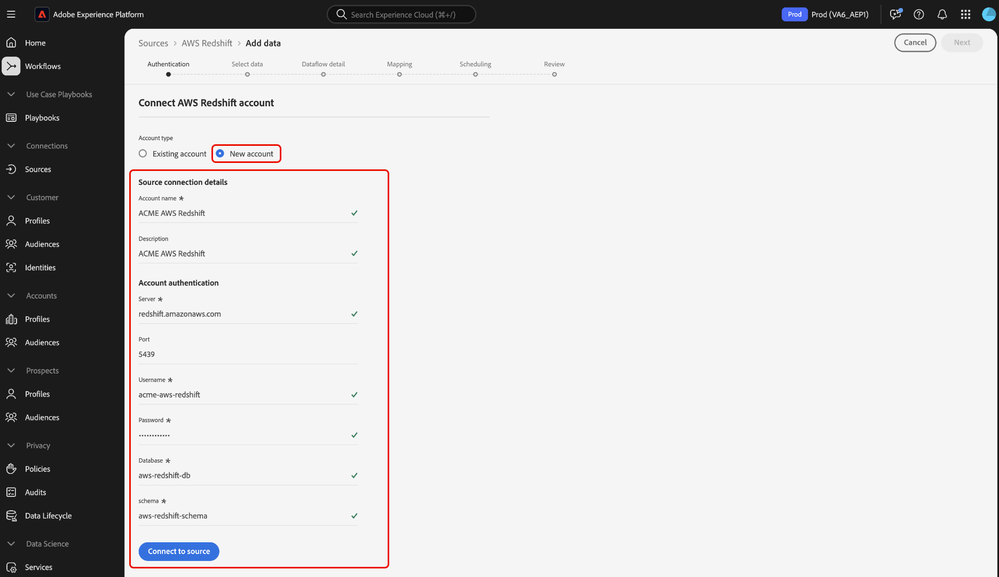

# Connect [!DNL AWS Redshift] to Experience Platform using the UI

>[!IMPORTANT]
>
>The [!DNL AWS Redshift] source is available in the sources catalog to users who have purchased Real-Time Customer Data Platform Ultimate.

Read this guide to learn how to connect your [!DNL AWS Redshift] account to Adobe Experience Platform using the sources workspace in the UI.

## Getting started

This tutorial requires a working understanding of the following components of Experience Platform:

- [[!DNL Experience Data Model (XDM)] System](../../../../../xdm/home.md): The standardized framework by which Experience Platform organizes customer experience data.
    - [Basics of schema composition](../../../../../xdm/schema/composition.md): Learn about the basic building blocks of XDM schemas, including key principles and best practices in schema composition.
    - [Schema Editor tutorial](../../../../../xdm/tutorials/create-schema-ui.md): Learn how to create custom schemas using the Schema Editor UI.
- [[!DNL Real-Time Customer Profile]](../../../../../profile/home.md): Provides a unified, real-time consumer profile based on aggregated data from multiple sources.

If you already have a valid [!DNL AWS Redshift] connection, you may skip the remainder of this document and proceed to the tutorial on [configuring a dataflow](../../dataflow/databases.md).

## Navigate the sources catalog

In the Platform UI, select **[!UICONTROL Sources]** from the left navigation to access the [!UICONTROL Sources] workspace. You can select the appropriate category from the catalog on the left-hand side of your screen. Alternatively, you can find the specific source you wish to work with using the search option.

Select **[!DNL AWS Redshift]** under the *[!UICONTROL Databases]* category, and then select **[!UICONTROL Set up]**.

>[!TIP]
>
>Sources in the sources catalog display the **[!UICONTROL Set up]** option when a given source does not yet have an authenticated account. Once an authenticated account exists, this option changes to **[!UICONTROL Add data]**.

## Use an existing account {#existing}

Next, you are taken to the authentication step of the sources workflow. Here, you can either use an existing account or create a new account.

To use an existing account, select the [!DNL AWS Redshift] account from the accounts directory and then select **[!UICONTROL Next]** to proceed.

## Create a new account {#create}

If you do not have an existing account, then you must create a new account by providing the necessary authentication credentials that correspond with your source.

To create a new account, select **[!UICONTROL New account]** and then provide a name and optionally add a description for your account.

### Connect to Experience Platform on Azure {#azure}

To connect your [!DNL AWS Redshift] account to Experience Platform on Azure, provide your authentication credentials in the input form, and then select **([!UICONTROL Connect to source])**.

| Credential | Description |
| --- | --- |
| Server | The server name of your [!DNL AWS Redshift] instance. |
| Port | The TCP port that a [!DNL AWS Redshift] server uses to listen for client connections. |
| Username | The username of the account that you want to give access to. |
| Password | The password that corresponds with the user account. |
| Database | The [!DNL AWS Redshift] database where data is to be fetched from. |

For more information about getting started, refer to [this [!DNL AWS Redshift] document](https://docs.aws.amazon.com/redshift/latest/gsg/new-user-serverless.html).

### Connect to Experience Platform on AWS {#aws}

>[!AVAILABILITY]
>
>This section applies to implementations of Experience Platform running on AWS Web Services (AWS). Experience Platform running on AWS is currently available to a limited number of customers. To learn more about the supported Experience Platform infrastructure, see the [Experience Platform multi-cloud overview](../../../../../landing/multi-cloud.md).

To create a new [!DNL AWS Redshift] account and connect to Experience Platform on AWS, ensure that you are in a VA6 sandbox, provide the necessary credentials for authentication, and then select **[!UICONTROL Connect to source]**.

| Credential | Description |
| --- | --- |
| Server | The server name of your [!DNL AWS Redshift] instance. |
| Port | The TCP port that a [!DNL AWS Redshift] server uses to listen for client connections. |
| Username | The username of the account that you want to give access to. |
| Password | The password that corresponds with the user account. |
| Database | The [!DNL AWS Redshift] database where data is to be fetched from. |
| Schema | The name of the schema associated with your [!DNL AWS Redshift] database. You must ensure that the user you want to give database access to, also has access to this schema. |

For more information about getting started, refer to [this [!DNL AWS Redshift] document](https://docs.aws.amazon.com/redshift/latest/gsg/new-user-serverless.html).

## Next steps

By following this tutorial, you have established a connection between your [!DNL AWS Redshift] database and Experience Platform. You can now continue on to the next tutorial and [create a dataflow to ingest data from your database to Experience Platform](../../dataflow/databases.md).