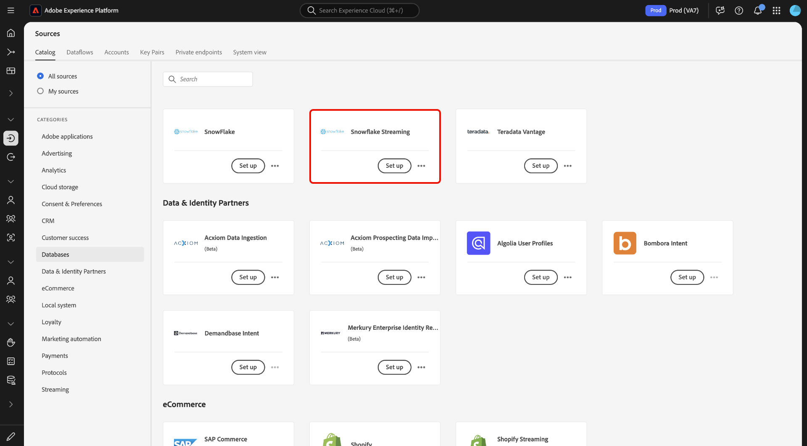
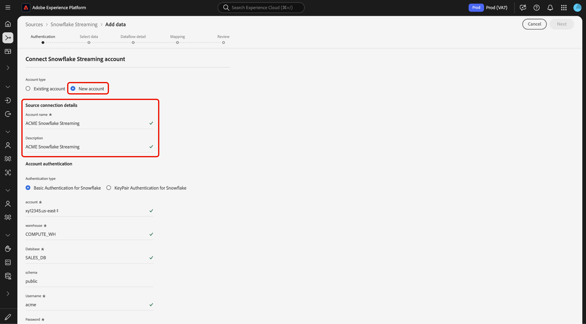
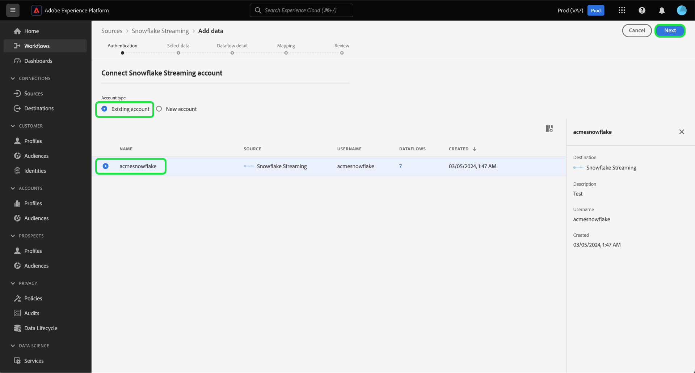
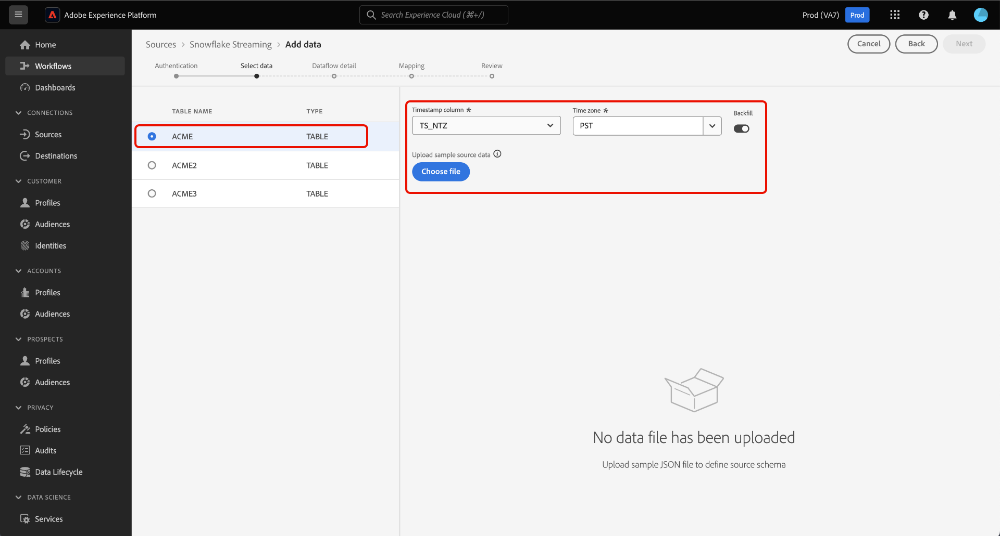
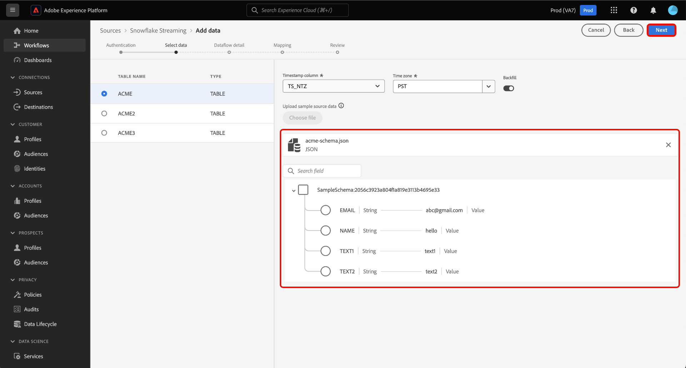
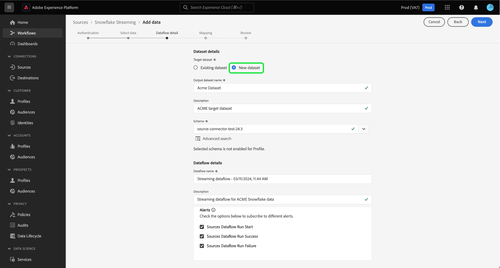
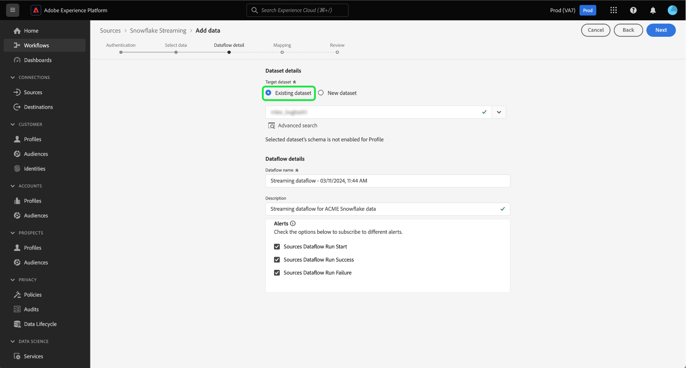
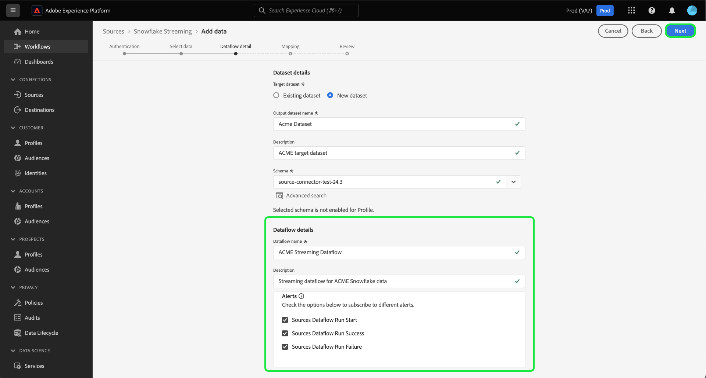
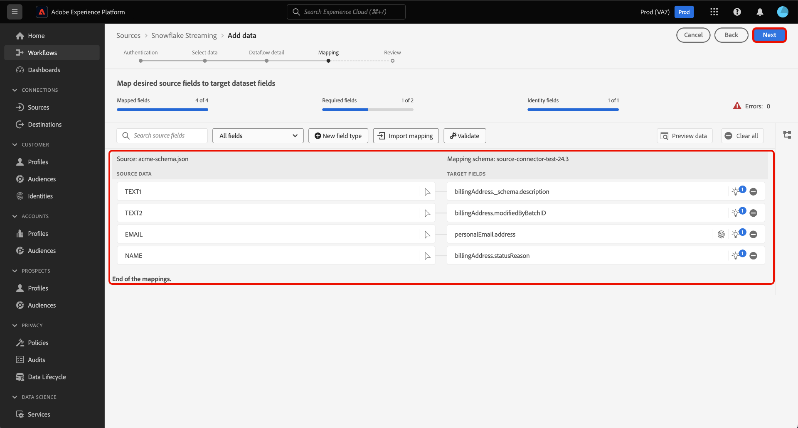
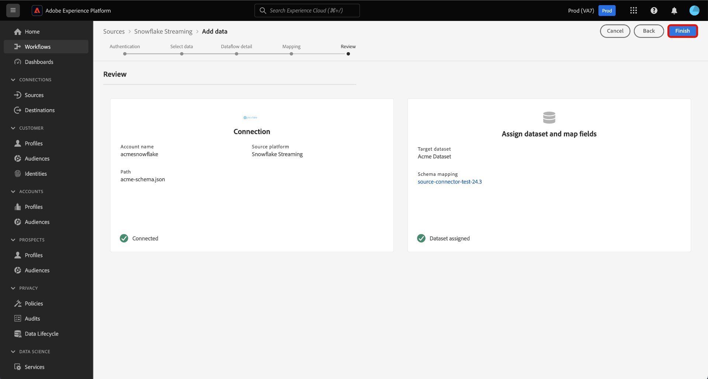

# Stream data from your [!DNL Snowflake] database to Experience Platform using the UI

Learn how to use the user interface to stream data from your [!DNL Snowflake] database to Adobe Experience Platform by following this guide.

## Get started

This tutorial requires a working understanding of the following components of Experience Platform:

* [[!DNL Experience Data Model (XDM)] System](../../../../../xdm/home.md): The standardized framework by which [!DNL Experience Platform] organizes customer experience data.
  * [Basics of schema composition](../../../../../xdm/schema/composition.md): Learn about the basic building blocks of XDM schemas, including key principles and best practices in schema composition.
  * [Schema Editor tutorial](../../../../../xdm/tutorials/create-schema-ui.md): Learn how to create custom schemas using the Schema Editor UI.
* [[!DNL Real-Time Customer Profile]](../../../../../profile/home.md): Provides a unified, real-time consumer profile based on aggregated data from multiple sources.

### Authentication

Read the guide on [prerequisite setup for [!DNL Snowflake] streaming data](../../../../connectors/databases/snowflake-streaming.md) for information on the steps that you need to complete before you can ingest streaming data from [!DNL Snowflake] to Experience Platform.

## Use the [!DNL Snowflake Streaming] source to stream [!DNL Snowflake] data to Experience Platform

In the Platform UI, select **[!UICONTROL Sources]** from the left navigation to access the [!UICONTROL Sources] workspace. You can select the appropriate category from the catalog on the left-hand side of your screen. Alternatively, you can find the specific source you wish to work with using the search option.

Under the *Databases* category, select **[!DNL Snowflake Streaming]**, and then select **[!UICONTROL Add data]**.

>[!TIP]
>
>Sources that do not have an authenticated account in the sources catalog display the **[!UICONTROL Set up]** option. Once an authenticated account exists, this option changes to **[!UICONTROL Add data]**.

The **[!UICONTROL Connect Snowflake Streaming account]** page appears. On this page, you can either use new or existing credentials.

>[!BEGINTABS]

>[!TAB Create a new account]

To create a new account, select **[!UICONTROL New account]** and provide a name, an optional description, and your credentials. 

When finished, select **[!UICONTROL Connect to source]** and then allow some time for the new connection to establish.

| Credential | Description |
| --- | --- |
| Account | The name of your [!DNL Snowflake] account. |
| Warehouse | The name of your [!DNL Snowflake] warehouse. Warehouses manage the execution of queries in [!DNL Snowflake]. Each [!DNL Snowflake] warehouse is independent from one another and must be accessed individually to bring data to Experience Platform. |
| Database | The name of your [!DNL Snowflake] database. The database contains the data that you want to bring to Experience Platform. |
| Schema | (Optional) The database schema associated with your [!DNL Snowflake] account. |
| Username | The username of your [!DNL Snowflake] account. |
| Password | The password to your [!DNL Snowflake] account. |
| Role | (Optional) A custom-defined role that can be provided to a user, for a given connection. If unprovided, this value defaults to `public`. |

For more information on account creation, read the section on [configuring role settings](../../../../connectors/databases/snowflake-streaming.md#configure-role-settings) in the [!DNL Snowflake Streaming] overview.

>[!TAB Use an existing account]

To use an existing account, select **[!UICONTROL Existing account]** and then select the desired account from the existing account catalog.

Select **[!UICONTROL Next]** to proceed.

>[!ENDTABS]

## Select data {#select-data}

>[!IMPORTANT]
>
>A timestamp column must exist in your source table in order for a streaming dataflow to be created. The timestamp is required for Experience Platform to know when data will be ingested and when incremental data will be streamed. You can retroactively add a timestamp column for an existing connection and create a new dataflow.

The [!UICONTROL Select data] step appears. In this step, you must select the data you want to import into Experience Platform, configure timestamps and timezones, and provide a sample source data file for the ingestion of raw data.

Use the database directory on the left of your screen and select the table that you want to import to Experience Platform.

Next, select the timestamp column type of your table. You can select between two types of timestamp columns: `TIMESTAMP_NTZ` or  `TIMESTAMP_LTZ`. If you select a column type of `TIMESTAMP_NTZ`, then you must also provide a timezone. Your columns should have a not null constraint. For more information, read the section on [limitations and frequently asked questions]

You can also configure backfill settings during this step. Backfill determines what data is initially ingested. If backfill is enabled, all current files in the specified path will be ingested during the first scheduled ingestion. If not, then only the files that are loaded in between the first run of ingestion and the start time will be ingested. Files loaded prior to the start time will not be ingested. 

Select the **[!UICONTROL Backfill]** toggle to enable backfill.

Finally, select **[!UICONTROL Choose file]** to upload a sample source data to help create the mapping set, which will be used in a later step to map your original data to Experience Data Model (XDM). 

When finished, select **[!UICONTROL Next]** to proceed.

## Provide dataset and dataflow details {#provide-dataset-and-dataflow-details}

Next, you must provide information on your dataset and your dataflow. 

### Dataset details {#dataset-details}

A dataset is a storage and management construct for a collection of data, typically a table, that contains a schema (columns) and fields (rows). Data that is successfully ingested into Experience Platform is persisted within the data lake as datasets. During this step, you can create a new dataset or use an existing dataset.

>[!BEGINTABS]

>[!TAB Use a new dataset]

To use a new dataset, select **[!UICONTROL New dataset]**, then provide a name, and an optional description for your dataset. You must also select an Experience Data Model (XDM) schema that your dataset adheres to.

| New dataset details | Description |
| --- | --- |
| Output dataset name | The name of your new dataset. |
| Description | (Optional) A brief overview of the new dataset. |
| Schema | A dropdown list of schemas that exist in your organization. You can also create your own schema prior to the source configuration process. For more information, read the guide on [creating an XDM schema in the UI](../../../../../xdm/tutorials/create-schema-ui.md). |

>[!TAB Use an existing dataset]

If you already have an existing dataset, select **[!UICONTROL Existing dataset]** and then use the **[!UICONTROL Advanced search]** option to view a window of all datasets in your organization, including their respective details, such as whether they are enabled for ingestion into Real-Time Customer Profile.

>[!ENDTABS]

+++Select for steps to enable Profile ingestion, error diagnostics, and partial ingestion.

If your dataset is enabled for Real-Time Customer Profile, then during this step, you can toggle **[!UICONTROL Profile dataset]** to enable your data for Profile-ingestion. You can also use this step to enable **[!UICONTROL Error diagnostics]** and **[!UICONTROL Partial ingestion]**.

* **[!UICONTROL Error diagnostics]**: Select **[!UICONTROL Error diagnostics]** to instruct the source to produce error diagnostics that you can later reference when monitoring your dataset activity and dataflow status.
* **[!UICONTROL Partial ingestion]**: Partial batch ingestion is the ability to ingest data containing errors, up to a certain configurable threshold. This feature allows you to successfully ingest all of your accurate data into Experience Platform, while all of your incorrect data is batched separately with information on why it is invalid.

+++

### Dataflow details {#dataflow-details}

Once your dataset is configured, you must then provide details on your dataflow, including a name, an optional description, and alert configurations.

| Dataflow configurations | Description |
| --- | --- |
| Dataflow name | The name of the dataflow.  By default, this will use the name of the file that is being imported. |
| Description | (Optional) A brief description of your dataflow. |
| Alerts | Experience Platform can produce event-based alerts that users can subscribe to. These options require a running dataflow to trigger them. For more information, read the [alerts overview](../../alerts.md) <ul><li>**Sources Dataflow Run Start**: Select this alert to receive a notification when your dataflow run begins.</li><li>**Sources Dataflow Run Success**: Select this alert to receive a notification if your dataflow ends without any errors.</li><li>**Sources Dataflow Run Failure**: Select this alert to receive a notification if your dataflow run ends with any errors.</li></ul> |

When finished, select **[!UICONTROL Next]** to proceed.

## Map fields to an XDM schema {#mapping}

The [!UICONTROL Mapping] step appears. Use the mapping interface to map your source data to the appropriate schema fields before ingesting that data into Experience Platform, then select **[!UICONTROL Next]**. For an extensive guide on how to use the mapping interface, read the [Data Prep UI guide](../../../../../data-prep/ui/mapping.md) for more information.

## Review your dataflow {#review}

The final step in the dataflow creation process is to review your dataflow before executing it. Use the **[!UICONTROL Review]** step to review the details of your new dataflow before it runs. Details are grouped in the following categories:

* **Connection**: Shows the source type, the relevant path of the chosen source file, and the number of columns within that source file.
* **Assign dataset & map fields**: Shows which dataset the source data is being ingested into, including the schema that the dataset adheres to.

Once you have reviewed your dataflow, select **[!UICONTROL Finish]** and allow some time for the dataflow to be created.

## Next steps

By following this tutorial, you have successfully created a streaming dataflow for [!DNL Snowflake] data. For additional resources, read the documentation below.

### Monitor your dataflow

Once your dataflow has been created, you can monitor the data that is being ingested through it to view information on ingestion rates, success, and errors. For more information on how to monitor streaming dataflows, visit the tutorial on [monitoring streaming dataflows in the UI](../../monitor-streaming.md).

### Update your dataflow

To update configurations for your dataflows scheduling, mapping, and general information, visit the tutorial on [updating sources dataflows in the UI](../../update-dataflows.md).

### Delete your dataflow

You can delete dataflows that are no longer necessary or were incorrectly created using the **[!UICONTROL Delete]** function available in the **[!UICONTROL Dataflows]** workspace. For more information on how to delete dataflows, visit the tutorial on [deleting dataflows in the UI](../../delete.md).
