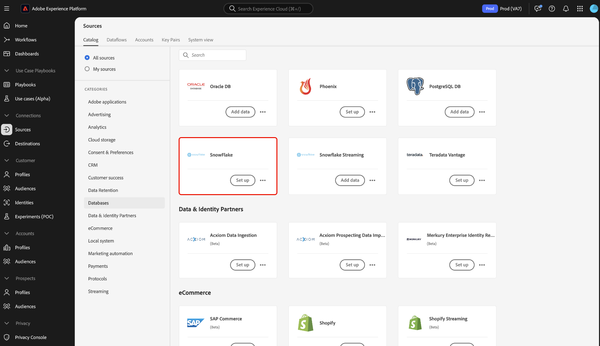
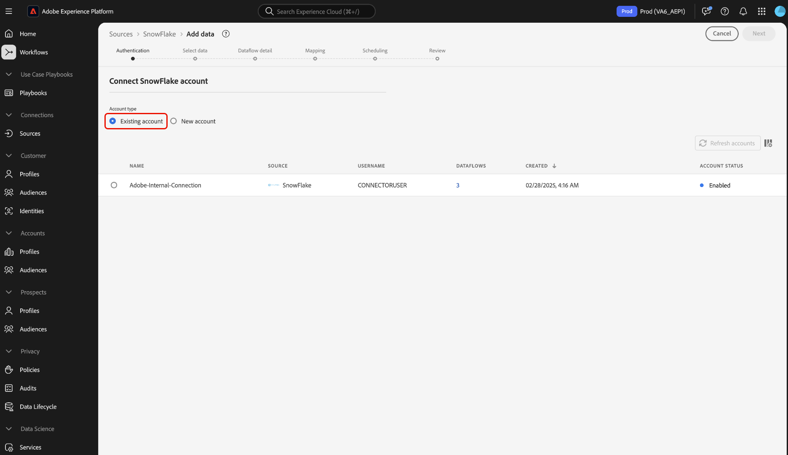
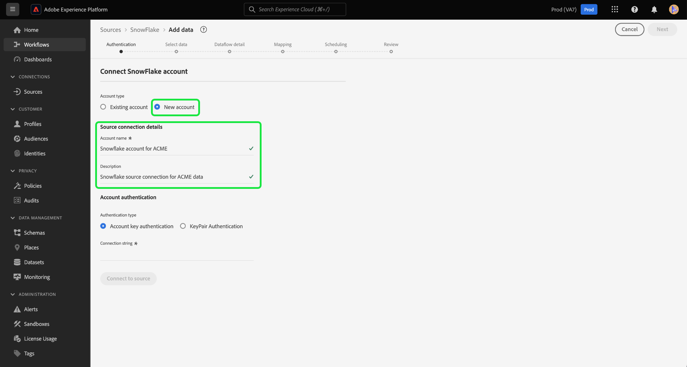

# Create a [!DNL Snowflake] source connection in the UI

>[!IMPORTANT]
>
>The [!DNL Snowflake] source is available in the sources catalog to users who have purchased Real-Time Customer Data Platform Ultimate.

This tutorial provides steps for creating a [!DNL Snowflake] source connector using the Adobe Experience Platform user interface.

## Getting started

This tutorial requires a working understanding of the following components of Platform:

* [Sources](../../../../home.md): [!DNL Experience Platform] allows data to be ingested from various sources while providing you with the ability to structure, label, and enhance incoming data using [!DNL Platform] services.
* [Sandboxes](../../../../../sandboxes/home.md): [!DNL Experience Platform] provides virtual sandboxes which partition a single [!DNL Platform] instance into separate virtual environments to help develop and evolve digital experience applications.

### Gather required credentials

In order to access your Snowflake account on [!DNL Platform], you must provide the following authentication value:

| Credential | Description |
| ---------- | ----------- |
| Account | The full account name associated with your [!DNL Snowflake] account. A fully qualified [!DNL Snowflake] account name includes your account name, region, and cloud platform. For example, `cj12345.east-us-2.azure`. For more information on account names, refer to this [[!DNL Snowflake document on account identifiers]](https://docs.snowflake.com/en/user-guide/admin-account-identifier.html). |
| Warehouse | The [!DNL Snowflake] warehouse manages the query execution process for the application. Each [!DNL Snowflake] warehouse is independent from one another and must be accessed individually when bringing data over to Platform. |
| Database | The [!DNL Snowflake] database contains the data you want to bring the Platform. |
| Username | The username for the [!DNL Snowflake] account. |
| Password | The password for the [!DNL Snowflake] user account. |
| Role | The default access control role to use in the [!DNL Snowflake] session. The role should be an existing one that has already been assigned to the specified user. The default role is `PUBLIC`. |
| Connection string | The connection string used to connect to your [!DNL Snowflake] instance. The connection string pattern for [!DNL Snowflake] is `jdbc:snowflake://{ACCOUNT_NAME}.snowflakecomputing.com/?user={USERNAME}&password={PASSWORD}&db={DATABASE}&warehouse={WAREHOUSE}` |

For more information about these values, refer to [this Snowflake document](https://docs.snowflake.com/en/user-guide/key-pair-auth.html).

>[!NOTE]
>
>You must set the `PREVENT_UNLOAD_TO_INLINE_URL` flag to `FALSE` to allow data unloading from your [!DNL Snowflake] database to Experience Platform.

## Connect your  Snowflake account

In the Platform UI, select **[!UICONTROL Sources]** from the left navigation to access the [!UICONTROL Sources] workspace. The [!UICONTROL Catalog] screen displays a variety of sources that you can create an account with.

You can select the appropriate category from the catalog on the left-hand side of your screen. Alternatively, you can find the specific source you wish to work with using the search bar.

Under the [!UICONTROL Databases] category, select **[!UICONTROL Snowflake]** and then select **[!UICONTROL Add data]**.

The **[!UICONTROL Connect to Snowflake]** page appears. On this page, you can either use new credentials or existing credentials.

### Existing account

To connect an existing account, select the Snowflake account you want to connect with, then select **[!UICONTROL Next]** to proceed.

### New account

If you are using new credentials, select **[!UICONTROL New account]**. On the input form that appears, provide a name, an optional description, and your Snowflake credentials. When finished, select **[!UICONTROL Connect]** and then allow some time for the new connection to establish.

## Next steps

By following this tutorial, you have established a connection to your Snowflake account. You can now continue on to the next tutorial and [configure a dataflow to bring data into [!DNL Platform]](../../dataflow/databases.md).
