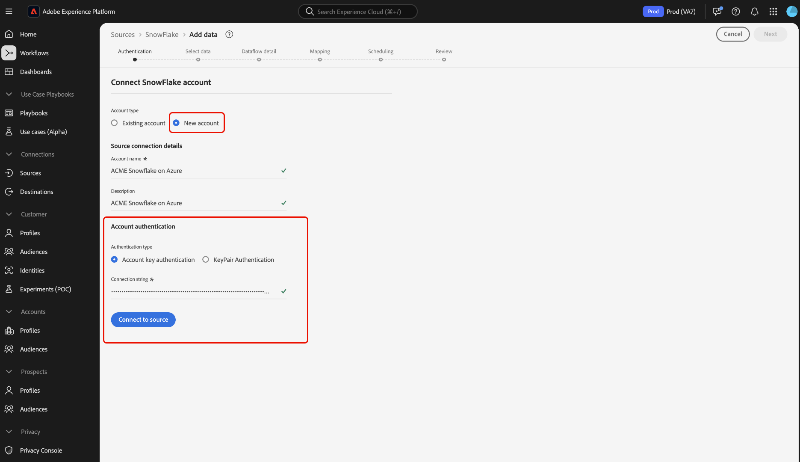
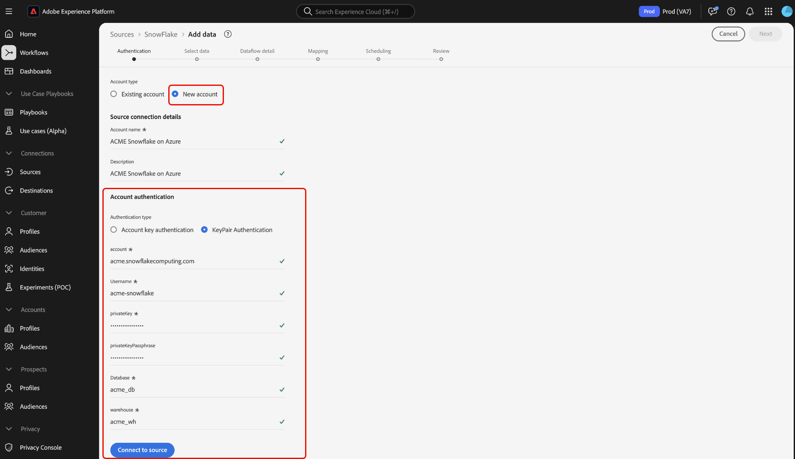
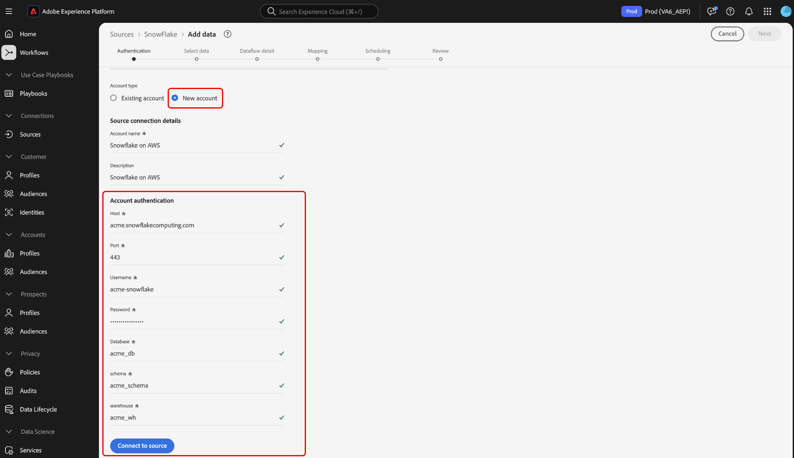

# Connect [!DNL Snowflake] to Experience Platform using the UI

>[!IMPORTANT]
>
>The [!DNL Snowflake] source is available in the sources catalog to users who have purchased Real-Time Customer Data Platform Ultimate.

Read this guide to learn how to connect your [!DNL Snowflake] account to Adobe Experience Platform using the user interface.

## Getting started

This tutorial requires a working understanding of the following components of Experience Platform:

* [Sources](../../../../home.md): Experience Platform allows data to be ingested from various sources while providing you with the ability to structure, label, and enhance incoming data using [!DNL Platform] services.
* [Sandboxes](../../../../../sandboxes/home.md): Experience Platform provides virtual sandboxes which partition a single Experience Platform instance into separate virtual environments to help develop and evolve digital experience applications.

>[!NOTE]
>
>You must set the `PREVENT_UNLOAD_TO_INLINE_URL` flag to `FALSE` to allow data unloading from your [!DNL Snowflake] database to Experience Platform.

## Navigate the sources catalog {#navigate}

In the Platform UI, select **[!UICONTROL Sources]** from the left navigation to access the [!UICONTROL Sources] workspace. You can select the appropriate category from the catalog on the left-hand side of your screen. Alternatively, you can find the specific source you wish to work with using the search option.

Select **[!DNL Snowflake]** under the *[!UICONTROL Databases]* category, and then select **[!UICONTROL Set up]**.

>[!TIP]
>
>Sources in the sources catalog display the **[!UICONTROL Set up]** option when a given source does not yet have an authenticated account. Once an authenticated account exists, this option changes to **[!UICONTROL Add data]**.

## Use an existing account {#existing}

Next, you are taken to the authentication step of the sources workflow. Here, you can either use an existing account or create a new account.

To use an existing account, select the [!DNL Snowflake] account you want to connect with and then select **[!UICONTROL Next]** to proceed.

## Create a new account {#create}

If you do not have an existing account, then you must create a new account by providing the necessary authentication credentials that correspond with your source. 

To create a new account, select **[!UICONTROL New account]** and then provide a name and optionally add a description for your account.

### Connect to Experience Platform on Azure {#azure}

You can connect your [!DNL Snowflake] account to Experience Platform on Azure using either account key authentication or key-pair authentication. 

>[!BEGINTABS]

>[!TAB Account key authentication]

To use account key authentication, select **[!UICONTROL Account key authentication]**, provide your connection string in the input form and then select **[!UICONTROL Connect to source]**.

| Credential | Description |
| --- | --- |
| Account | An account name uniquely identifies an account within your organization. In this case, you must uniquely identify an account across different [!DNL Snowflake] organizations. To do this, you must prepend your organization name to the account name. For example: `orgname-account_name`. Read the guide on [retrieving your [!DNL Snowflake] account identifier](../../../../connectors/databases/snowflake.md#retrieve-your-account-identifier) for additional guidance. For more information, refer to the [[!DNL Snowflake] documentation](https://docs.snowflake.com/en/user-guide/admin-account-identifier#format-1-preferred-account-name-in-your-organization).|
| Warehouse | The [!DNL Snowflake] warehouse manages the query execution process for the application. Each [!DNL Snowflake] warehouse is independent from one another and must be accessed individually when bringing data over to Platform. |
| Database | The [!DNL Snowflake] database contains the data you want to bring the Platform. |
| Username | The username for the [!DNL Snowflake] account. |
| Password | The password for the [!DNL Snowflake] user account. |
| Role | The default access control role to use in the [!DNL Snowflake] session. The role should be an existing one that has already been assigned to the specified user. The default role is `PUBLIC`. |
| Connection string | The connection string used to connect to your [!DNL Snowflake] instance. The connection string pattern for [!DNL Snowflake] is `jdbc:snowflake://{ACCOUNT_NAME}.snowflakecomputing.com/?user={USERNAME}&password={PASSWORD}&db={DATABASE}&warehouse={WAREHOUSE}` |

>[!TAB Key-pair authentication]

To use key-pair authentication, select **[!UICONTROL KeyPair authentication]**, provide values for your account, username, private key, private key passphrase, database, and warehouse, then select **[!UICONTROL Connect to source]**. 

With key-pair authentication, you must generate a 2048-bit RSA key pair and then provide the following values when creating an account for your [!DNL Snowflake] source.

| Credential | Description |
| --- | --- |
| Account | An account name uniquely identifies an account within your organization. In this case, you must uniquely identify an account across different [!DNL Snowflake] organizations. To do this, you must prepend your organization name to the account name. For example: `orgname-account_name`. Read the guide on [retrieving your [!DNL Snowflake] account identifier](../../../../connectors/databases/snowflake.md#retrieve-your-account-identifier) for additional guidance. For more information, refer to the [[!DNL Snowflake] documentation](https://docs.snowflake.com/en/user-guide/admin-account-identifier#format-1-preferred-account-name-in-your-organization).|
| Username | The username of your [!DNL Snowflake] account. |
| Private key | The [!DNL Base64-]encoded private key of your [!DNL Snowflake] account. You can generate either encrypted or unencrypted private keys. If you are using an encrypted private key, then you must also provide a private key passphrase when authenticating against Experience Platform. Read the guide on [retrieving your [!DNL Snowflake] private key](../../../../connectors/databases/snowflake.md) for more information. |
| Private key passphrase | The private key passphrase is an additional layer of security that you must use when authenticating with an encrypted private key. You are not required to provide the passphrase if you are using an unencrypted private key. |
| Database | The [!DNL Snowflake] database that contains the data you want to ingest to Experience Platform. |
| Warehouse | The [!DNL Snowflake] warehouse manages the query execution process for the application. Each [!DNL Snowflake] warehouse is independent from one another and must be accessed individually when bringing data over to Platform. |

For more information about these values, refer to [this Snowflake document](https://docs.snowflake.com/en/user-guide/key-pair-auth.html).

>[!ENDTABS]

### Connect to Experience Platform on AWS {#aws}

>[!AVAILABILITY]
>
>This section applies to implementations of Experience Platform running on Amazon Web Services (AWS). Experience Platform running on AWS is currently available to a limited number of customers. To learn more about the supported Experience Platform infrastructure, see the [Experience Platform multi-cloud overview](../../../../../landing/multi-cloud.md).

To create a new [!DNL Snowflake] account and connect to Experience Platform on AWS, ensure that you are in a VA6 sandbox and then provide the necessary credentials for authentication.

| Credential | Description |
| --- | --- |
| Host | The host URL that your [!DNL Snowflake] account connects to. |
| Port | The port number that is used by [!DNL Snowflake] when connecting to a server over the internet. |
| Username | The username associated with your [!DNL Snowflake] account. | 
| Password | The password associated with your [!DNL Snowflake] account. |
| Database | The [!DNL Snowflake] database from where the data will be pulled from. |
| Schema | The schema associated with your [!DNL Snowflake] database. |
| Warehouse | The [!DNL Snowflake] warehouse that you are using. |

### Skip preview of sample data {#skip-preview-of-sample-data}

During the data selection step, you may encounter a timeout when ingesting large tables or files of data. You can skip data preview to circumvent the timeout and still view your schema, albeit without sample data. To skip data preview, enable the **[!UICONTROL Skip previewing sample data]** toggle.

The rest of the workflow will remain the same. The only caveat is that skipping data preview may prevent calculated and required fields from being auto-validated during the mapping step, and you will then have to manually validate those fields during mapping.

## Next steps

By following this tutorial, you have established a connection to your Snowflake account. You can now continue on to the next tutorial and [configure a dataflow to bring data into [!DNL Platform]](../../dataflow/databases.md).
