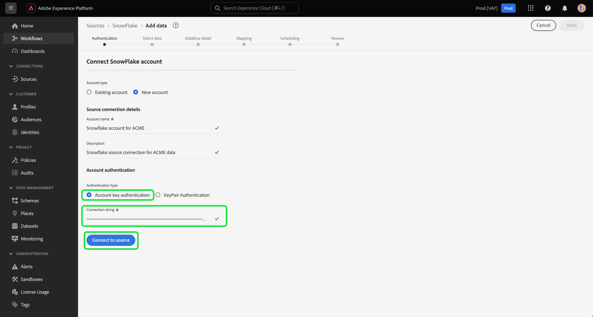

# Create a [!DNL Snowflake] source connection in the UI

>[!IMPORTANT]
>
>The [!DNL Snowflake] source is available in the sources catalog to users who have purchased Real-Time Customer Data Platform Ultimate.

This tutorial provides steps for creating a [!DNL Snowflake] source connector using the Adobe Experience Platform user interface.

## Getting started

This tutorial requires a working understanding of the following components of Experience Platform:

* [Sources](../../../../home.md): [!DNL Experience Platform] allows data to be ingested from various sources while providing you with the ability to structure, label, and enhance incoming data using [!DNL Platform] services.
* [Sandboxes](../../../../../sandboxes/home.md): [!DNL Experience Platform] provides virtual sandboxes which partition a single [!DNL Platform] instance into separate virtual environments to help develop and evolve digital experience applications.

### Gather required credentials

You must provide values for the following credential properties to authenticate your [!DNL Snowflake] source.

>[!BEGINTABS]

>[!TAB Account key authentication]

| Credential | Description |
| ---------- | ----------- |
| Account | An account name uniquely identifies an account within your organization. In this case, you must uniquely identify an account across different [!DNL Snowflake] organizations. To do this, you must prepend your organization name to the account name. For example: `orgname-account_name`. For more information on account names, read the [!DNL Snowflake] documentation on [account identifiers](https://docs.snowflake.com/en/user-guide/admin-account-identifier#format-1-preferred-account-name-in-your-organization).|
| Warehouse | The [!DNL Snowflake] warehouse manages the query execution process for the application. Each [!DNL Snowflake] warehouse is independent from one another and must be accessed individually when bringing data over to Platform. |
| Database | The [!DNL Snowflake] database contains the data you want to bring the Platform. |
| Username | The username for the [!DNL Snowflake] account. |
| Password | The password for the [!DNL Snowflake] user account. |
| Role | The default access control role to use in the [!DNL Snowflake] session. The role should be an existing one that has already been assigned to the specified user. The default role is `PUBLIC`. |
| Connection string | The connection string used to connect to your [!DNL Snowflake] instance. The connection string pattern for [!DNL Snowflake] is `jdbc:snowflake://{ACCOUNT_NAME}.snowflakecomputing.com/?user={USERNAME}&password={PASSWORD}&db={DATABASE}&warehouse={WAREHOUSE}` |

>[!TAB Key-pair authentication]

To use key-pair authentication, you must generate a 2048-bit RSA key pair and then provide the following values when creating an account for your [!DNL Snowflake] source.

| Credential | Description |
| --- | --- |
| Account | An account name uniquely identifies an account within your organization. In this case, you must uniquely identify an account across different [!DNL Snowflake] organizations. To do this, you must prepend your organization name to the account name. For example: `orgname-account_name`. For more information on account names, read the [!DNL Snowflake] documentation on [account identifiers](https://docs.snowflake.com/en/user-guide/admin-account-identifier#format-1-preferred-account-name-in-your-organization). |
| Username | The username of your [!DNL Snowflake] account. |
| Private key | The [!DNL Base64-]encoded private key of your [!DNL Snowflake] account. You can generate either encrypted or unencrypted private keys. If you are using an encrypted private key, then you must also provide a private key passphrase when authenticating against Experience Platform. |
| Private key passphrase | The private key passphrase is an additional layer of security that you must use when authenticating with an encrypted private key. You are not required to provide the passphrase if you are using an unencrypted private key. |
| Database | The [!DNL Snowflake] database that contains the data you want to ingest to Experience Platform. |
| Warehouse | The [!DNL Snowflake] warehouse manages the query execution process for the application. Each [!DNL Snowflake] warehouse is independent from one another and must be accessed individually when bringing data over to Platform. |

For more information about these values, refer to [this Snowflake document](https://docs.snowflake.com/en/user-guide/key-pair-auth.html).

>[!ENDTABS]

In order to access your Snowflake account on Experience Platform, you must provide the following authentication value:

>[!NOTE]
>
>You must set the `PREVENT_UNLOAD_TO_INLINE_URL` flag to `FALSE` to allow data unloading from your [!DNL Snowflake] database to Experience Platform.

## Connect your  Snowflake account

In the Platform UI, select **[!UICONTROL Sources]** from the left navigation to access the [!UICONTROL Sources] workspace.

You can select the appropriate category from the catalog on the left-hand side of your screen. Alternatively, you can find the specific source you wish to work with using the search bar.

Under the [!UICONTROL Databases] category, select **[!UICONTROL Snowflake]** and then select **[!UICONTROL Add data]**.

![The sources catalog with [!DNL Snowflake] highlighted.](../../../../images/tutorials/create/snowflake/catalog.png)

The **[!UICONTROL Connect to Snowflake]** page appears. On this page, you can either use new credentials or existing credentials.

### Existing account

To use an existing account, select the [!DNL Snowflake] account you want to connect with and then select **[!UICONTROL Next]** to proceed.

### New account

To create a new account, select **[!UICONTROL New account]**, and then provide a name and an optional description for your new [!DNL Snowflake] account.

>[!BEGINTABS]

>[!TAB Account key authentication]

To use account key authentication, provide your connection string in the input form and then select **[!UICONTROL Connect to source]**.

>[!TAB Key-pair authentication]

To use key-pair authentication, provide values for your account, username, private key, private key passphrase, database, and warehouse, then select **[!UICONTROL Connect to source]**. 

>[!ENDTABS]

## Next steps

By following this tutorial, you have established a connection to your Snowflake account. You can now continue on to the next tutorial and [configure a dataflow to bring data into [!DNL Platform]](../../dataflow/databases.md).
