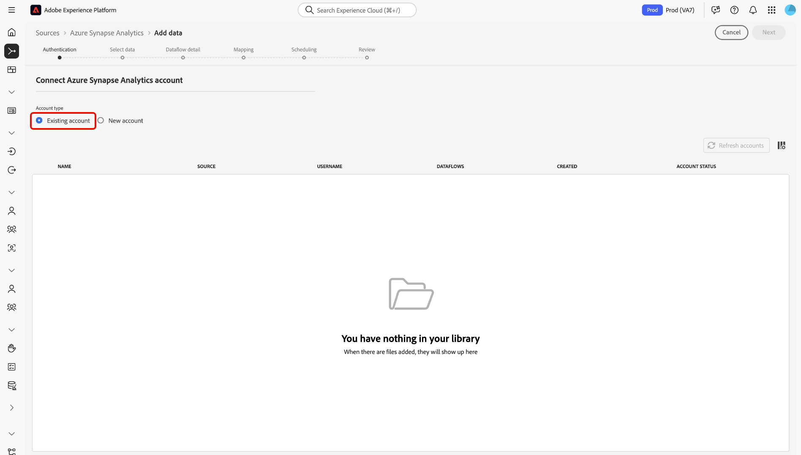

# Create an [!DNL Azure Synapse Analytics] source connection in the UI

>[!IMPORTANT]
>
>The [!DNL Azure Synapse Analytics] source is available in the sources catalog to users who have purchased Real-Time Customer Data Platform Ultimate.

Read this guide to learn how to connect your [!DNL Azure Synapse Analytics] account to Adobe Platform using the sources workspace in the UI.

## Get started

This tutorial requires a working understanding of the following components of Experience Platform:

* [[!DNL Experience Data Model (XDM)] System](../../../../../xdm/home.md): The standardized framework by which [!DNL Experience Platform] organizes customer experience data.
    * [Basics of schema composition](../../../../../xdm/schema/composition.md): Learn about the basic building blocks of XDM schemas, including key principles and best practices in schema composition.
    * [Schema Editor tutorial](../../../../../xdm/tutorials/create-schema-ui.md): Learn how to create custom schemas using the Schema Editor UI.
* [[!DNL Real-Time Customer Profile]](../../../../../profile/home.md): Provides a unified, real-time consumer profile based on aggregated data from multiple sources.

If you already have a valid [!DNL Azure Synapse Analytics] connection, you may skip the remainder of this document and proceed to the tutorial on [configuring a dataflow](../../dataflow/databases.md).

### Gather required credentials

Read the [[!DNL Azure Synapse Analytics] overview](../../../../connectors/databases/synapse-analytics.md#prerequisites) for information on authentication.

## Navigate the sources catalog

In the Experience Platform UI, select **[!UICONTROL Sources]** from the left navigation to access the *[!UICONTROL Sources]* workspace. Choose a category or use the search bar to find your source.

To connect to [!DNL Azure Synapse Analytics], go to the *[!UICONTROL Databases]* category, select the **[!UICONTROL Azure Synapse analytics]** source card, and then select **[!UICONTROL Set up]**.

>[!TIP]
>
>Sources in the sources catalog display the **[!UICONTROL Set up]** option when a given source does not yet have an authenticated account. Once an authenticated account is created, this option changes to **[!UICONTROL Add data]**.

## Use an existing account {#existing}

To use an existing account, select **[!UICONTROL Existing account]** and then select the [!DNL Azure Synapse Analytics] account that you want to use.

## Create a new account {#new}

To create a new account, select **[!UICONTROL New account]** and then provide a name and optionally add a description for your account.

### Connect to Experience Platform

You can connect your [!DNL Azure Synapse Analytics] account to Experience Platform using either account key authentication or service principal and key authentication.

>[!BEGINTABS]

>[!TAB Account key authentication]

To use account key authentication, select **[!UICONTROL Account key authentication]**, provide your [connection string](../../../../connectors/databases/synapse-analytics.md#prerequisites), and then select **[!UICONTROL Connect to source]**.

>[!TAB Service principal and key authentication]

Alternatively, select **[!UICONTROL Service principal and key authentication]**, provide values for your [authentication credentials](../../../../connectors/databases/synapse-analytics.md#prerequisites), and then select **[!UICONTROL Connect to source]**.

>[!ENDTABS]

## Create a dataflow for [!DNL Azure Synapse Analytics] data

Now that you have successfully connected your [!DNL Azure Synapse Analytics] database, you can now [create a dataflow and ingest data from your database into Experience Platform](../../dataflow/databases.md).
