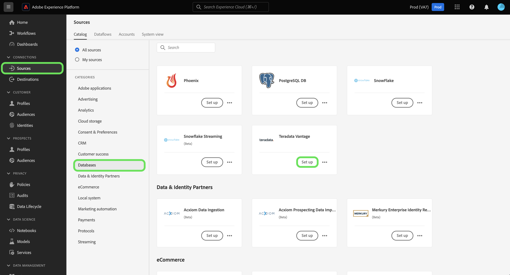
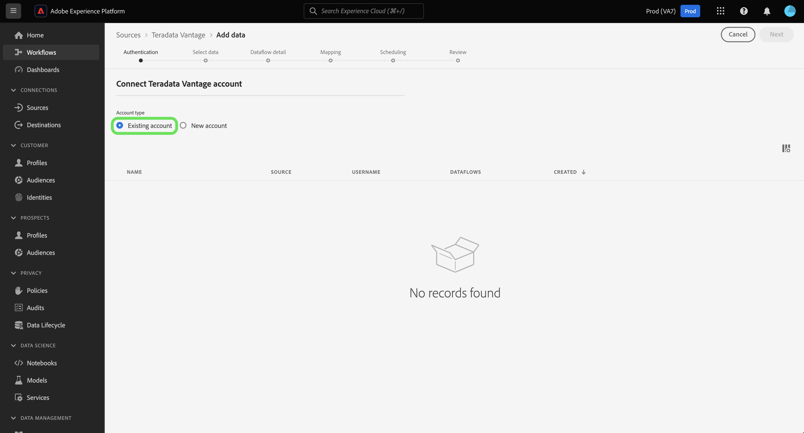
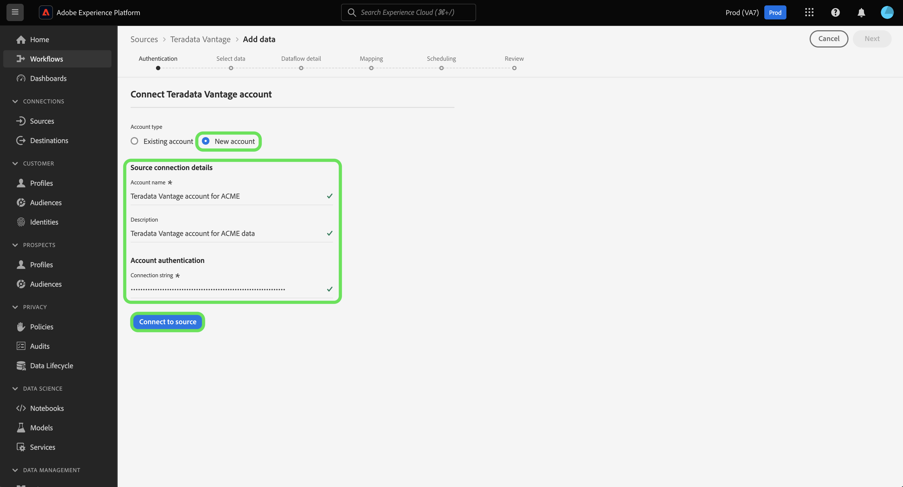

# Create a [!DNL Teradata Vantage] source connection in the UI

This tutorial provides steps for creating a [!DNL Teradata Vantage] source connector using the Adobe Experience Platform user interface.

## Getting started

This tutorial requires a working understanding of the following components of Experience Platform:

* [Sources](../../../../home.md): Experience Platform allows data to be ingested from various sources while providing you with the ability to structure, label, and enhance incoming data using Experience Platform services.
* [Sandboxes](../../../../../sandboxes/home.md): Experience Platform provides virtual sandboxes which partition a single Experience Platform instance into separate virtual environments to help develop and evolve digital experience applications.

### Gather required credentials

In order to access your [!DNL Teradata Vantage] account on Experience Platform, you must provide the following authentication value:

| Credential | Description |
| ---------- | ----------- |
| Connection string | A connection string is a string that provides information about a data source and how you can connect to it. The connection string pattern for [!DNL Teradata Vantage] is `DBCName={SERVER};Uid={USERNAME};Pwd={PASSWORD}`. | 

For more information about getting started, refer to this [[!DNL Teradata Vantage] document](https://docs.teradata.com/r/Teradata-VantageTM-Advanced-SQL-Engine-Security-Administration/July-2021/Setting-Up-the-Administrative-Infrastructure/Controlling-Access-to-the-Operating-System/Working-with-OS-Level-Security-Options).

## Connect your [!DNL Teradata Vantage] account

In the Experience Platform UI, select **[!UICONTROL Sources]** from the left navigation to access the [!UICONTROL Sources] workspace. You can select the appropriate category from the catalog on the left-hand side of your screen. Alternatively, you can find the specific source you wish to work with using the search option.

Under the [!UICONTROL Databases] category, select **[!UICONTROL Teradata Vantage]** and then select **[!UICONTROL Set up]**.

>[!TIP]
>
>Sources in the sources catalog display the **[!UICONTROL Set up]** option when a given source does not yet have an authenticated account. Once an authenticated account exists, this option changes to **[!UICONTROL Add data]**.

The **[!UICONTROL Connect to Teradata Vantage]** page appears. On this page, you can either use new credentials or existing credentials.

### Existing account

To connect an existing account, select the [!DNL Teradata Vantage] account you want to connect with, then select **[!UICONTROL Next]** to proceed.

### New account

If you are using new credentials, select **[!UICONTROL New account]**. On the input form that appears, provide a name, an optional description, and your [!DNL Teradata Vantage] credentials. When finished, select **[!UICONTROL Connect]** and then allow some time for the new connection to establish.

## Next steps

By following this tutorial, you have established a connection to your Teradata Vantage account. You can now continue on to the next tutorial and [configure a dataflow to bring data into Experience Platform](../../dataflow/databases.md).
