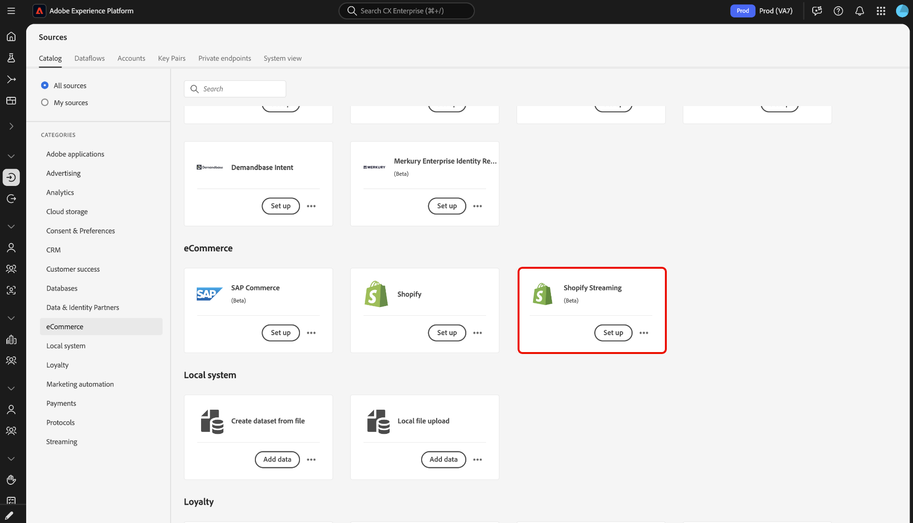
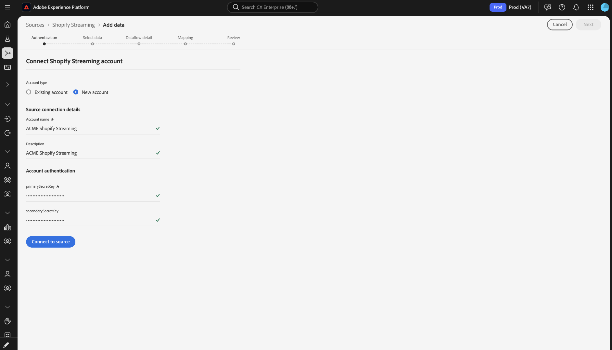
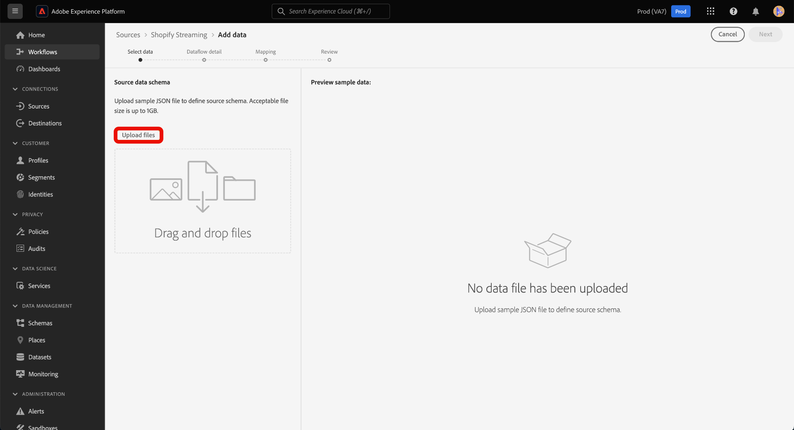
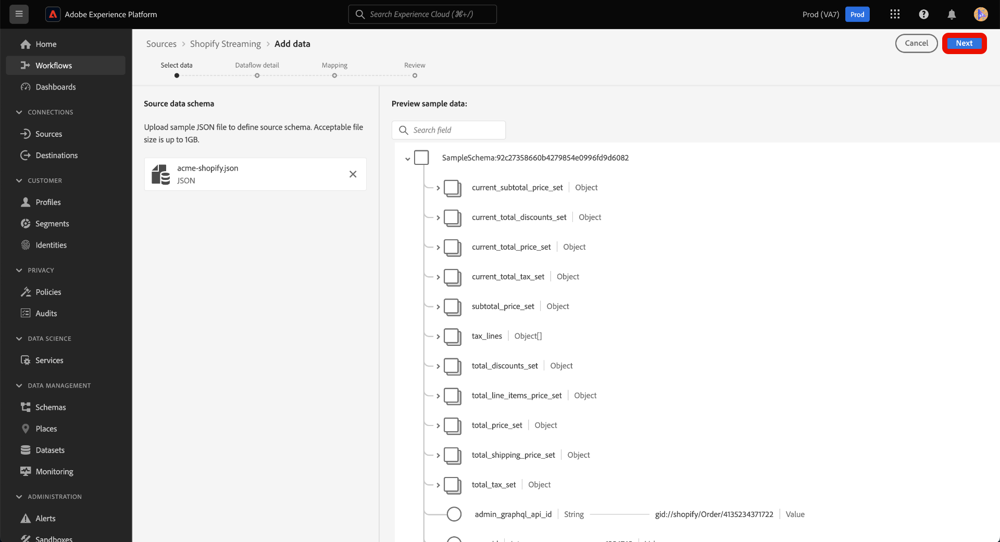
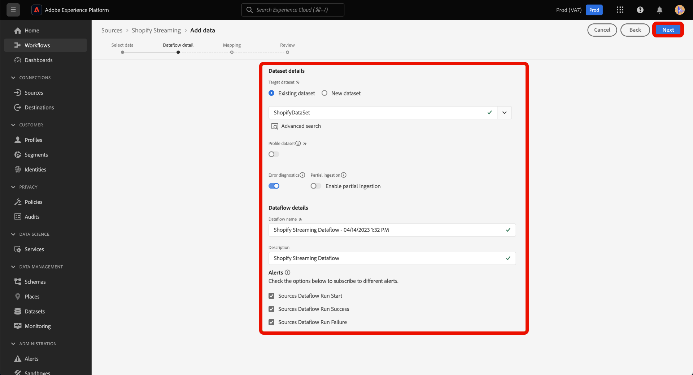
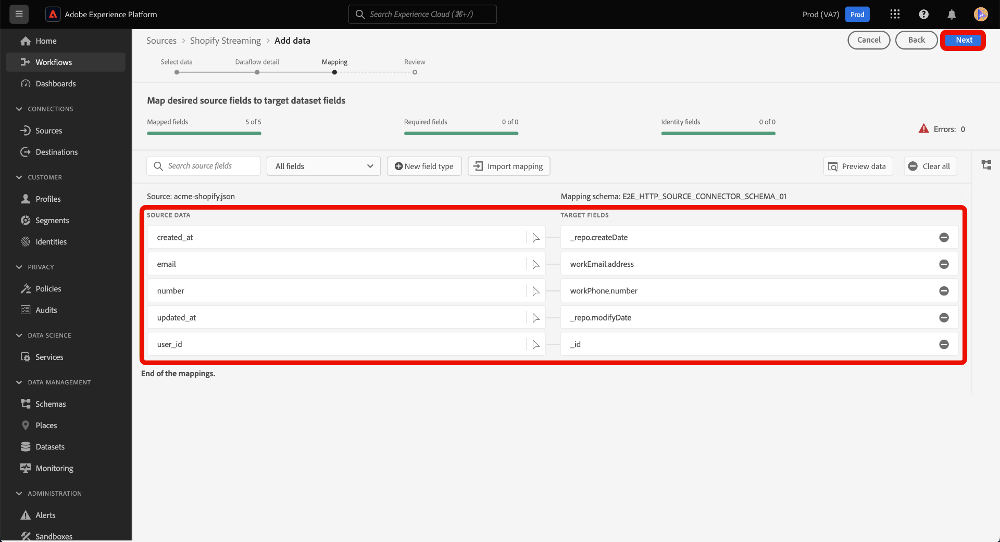
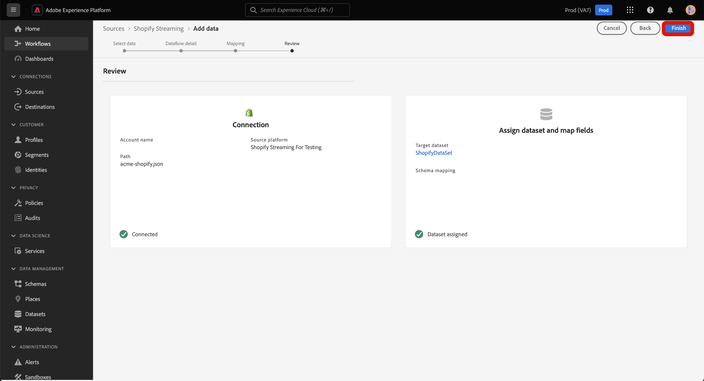
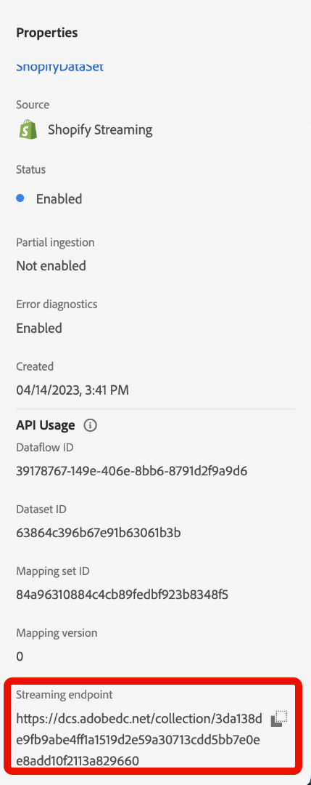

# Create a source connection and dataflow for [!DNL Shopify Streaming] data using the UI

Read this guide to learn how to stream data from a [!DNL Shopify Streaming] source to Adobe Experience Platform through the user interface.

## Getting started {#getting-started}

Before you begin, make sure you're familiar with the following parts of Experience Platform:

* [Experience Data Model (XDM) System](../../../../../xdm/home.md): A standardized framework designed to help you organize and manage your customer experience data in a consistent way across Adobe Experience Platform.
  * [Basics of schema composition](../../../../../xdm/schema/composition.md): An introduction to building your own data schemas, including simple best practices and how to structure your data effectively for your specific needs.
  * [Schema Editor tutorial](../../../../../xdm/tutorials/create-schema-ui.md): Step-by-step instructions to guide you through creating custom data schemas directly in the Platform UI, so you can tailor your data model to your business requirements.
* [Real-Time Customer Profile](../../../../../profile/home.md): Empowers you to create comprehensive, real-time customer profiles that aggregate data from multiple sources, enabling a unified view of each individual customer.

>[!IMPORTANT]
>
>This tutorial requires you to have completed the prerequisite setup for your [!DNL Shopify Streaming] account. For steps on setting up your account, read the [[!DNL Shopify Streaming] overview](../../../../connectors/ecommerce/shopify-streaming.md).

## Connect your [!DNL Shopify Streaming] account

In the Experience Platform UI, select **[!UICONTROL Sources]** from the left navigation to access the *[!UICONTROL Sources]* workspace. Select the appropriate category in the *[!UICONTROL Categories]* panel. Alternatively, use the search bar to navigate to the specific source that you want to use.

To stream data from [!DNL Shopify], select the **[!UICONTROL Shopify Streaming]** source card under *[!UICONTROL ecommerce]* and then select **[!UICONTROL Set up]**.

>[!TIP]
>
>Sources in the sources catalog display the **[!UICONTROL Set up]** option when a given source does not yet have an authenticated account. Once an authenticated account is created, this option changes to **[!UICONTROL Add data]**.

### Create a new account

To create a new account for your [!DNL Shopify Streaming] source, select **[!UICONTROL New account]** and provide a name and an optional description for your account. Next, provide values for your **[!UICONTROL primarySecretKey]** and **[!UICONTROL secondarySecretKey]** and then select **[!UICONTROL Connect to source]**. Allow for a few moments for the connection to establish, and then select **[!UICONTROL Next]** to proceed.

For more information on HMAC key-based authentication, read the [[!DNL Shopify Streaming] authentication overview](../../../../connectors/ecommerce/shopify-streaming.md).

## Select data

The **[!UICONTROL Select data]** step appears, providing an interface for you to select the data that you bring to Experience Platform.

* The left part of the interface is a browser that allows you to view the available data streams within your account;
* The right part of the interface lets you preview up to 100 rows of data from a JSON file.

Select **[!UICONTROL Upload files]** to upload a JSON file from your local system. Alternatively, you can drag and drop the JSON file you want to upload into the [!UICONTROL Drag and drop files] panel.

Once your file uploads, the preview interface updates to display a preview of the schema you uploaded. The preview interface allows you to inspect the contents and structure of a file. You can also use the [!UICONTROL Search field] utility to access specific items from within your schema.

When finished, select **[!UICONTROL Next]**.

## Dataflow detail

The **Dataflow detail** step appears, providing you with options to use an existing dataset or establish a new dataset for your dataflow, as well as an opportunity to provide a name and description for your dataflow. During this step, you can also configure settings for Profile ingestion, error diagnostics, partial ingestion, and alerts.

When finished, select **[!UICONTROL Next]**.

## Mapping

The [!UICONTROL Mapping] step appears, providing you with an interface to map the source fields from your source schema to their appropriate target XDM fields in the target schema.

Experience Platform provides intelligent recommendations for auto-mapped fields based on the target schema or dataset that you select. You can manually adjust mapping rules to suit your use cases. Based on your needs, you can choose to map fields directly, or use data prep functions to transform source data to derive computed or calculated values. For comprehensive steps on using the mapper interface and calculated fields, see the [Data Prep UI guide](https://experienceleague.adobe.com/docs/experience-platform/data-prep/ui/mapping.html).

Once your source data is successfully mapped, select **[!UICONTROL Next]**.

## Review

The **[!UICONTROL Review]** step appears, allowing you to review your new dataflow before it is created. Details are grouped within the following categories:

* **[!UICONTROL Connection]**: Shows the source type, the relevant path of the chosen source file, and the number of columns within that source file.
* **[!UICONTROL Assign dataset & map fields]**: Shows which dataset the source data is being ingested into, including the schema that the dataset adheres to.

Once you have reviewed your dataflow, select **[!UICONTROL Finish]** and allow some time for the dataflow to be created.

## Get your streaming endpoint URL

With your streaming dataflow created, you can now retrieve your streaming endpoint URL. This endpoint will be used to subscribe to your webhook, allowing your streaming source to communicate with Experience Platform. 

To retrieve your streaming endpoint, go to the [!UICONTROL Dataflow activity] page of the dataflow that you just created and copy the endpoint from the bottom of the [!UICONTROL Properties] panel.

## Next steps

By following this tutorial, you have established a source connection and dataflow to your [!DNL Shopify Streaming] account. For instructions on how to connect your [!DNL Shopify Streaming] account using the API, please read the tutorial on [creating a source connection and dataflow to stream [!DNL Shopify] data using the Flow Service API](../../../api/create/ecommerce/shopify-streaming.md).
