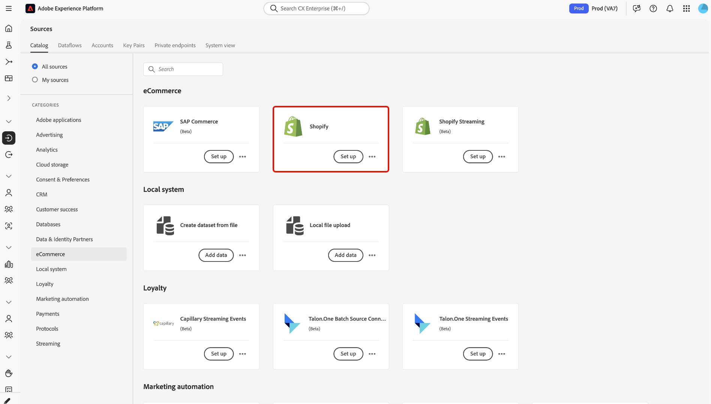
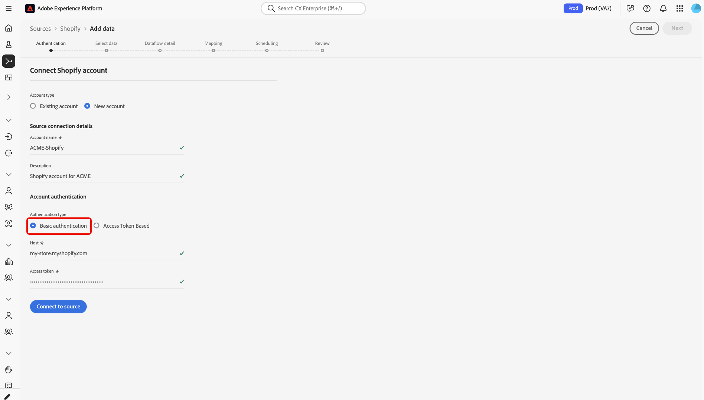
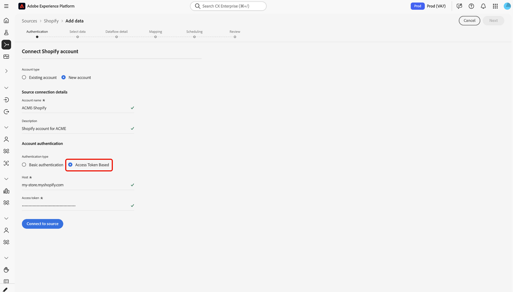

# Create a [!DNL Shopify] source connection in the UI

Use this guide to connect your [!DNL Shopify] account to Adobe Experience Platform through the Sources workspace in the UI.

## Getting started

This tutorial requires a working understanding of the following components of Experience Platform:

* [Experience Data Model (XDM) System](../../../../../xdm/home.md): The standardized framework by which Experience Platform organizes customer experience data.
    * [Basics of schema composition](../../../../../xdm/schema/composition.md): Learn about the basic building blocks of XDM schemas, including key principles and best practices in schema composition.
    * [Schema Editor tutorial](../../../../../xdm/tutorials/create-schema-ui.md): Learn how to create custom schemas using the Schema Editor UI.
* [[!DNL Real-Time Customer Profile]](../../../../../profile/home.md): Provides a unified, real-time consumer profile based on aggregated data from multiple sources.

If you already have a [!DNL Shopify] connection, you may skip the remainder of this document and proceed to the tutorial on [configuring a dataflow for an eCommerce connector](../../dataflow/ecommerce.md).

### Gather required credentials

You must have valid [!DNL Shopify] authentication credentials to create a base connection. For details on the required credentials and how to obtain them, refer to the [[!DNL Shopify] source connector overview](../../../../connectors/ecommerce/shopify.md#prerequisites).

## Navigate the sources catalog

In the Experience Platform UI, select **[!UICONTROL Sources]** from the left navigation to access the *[!UICONTROL Sources]* workspace. Select the appropriate category in the *[!UICONTROL Categories]* panel. Alternatively, use the search bar to navigate to the specific source that you want to use.

To ingest data from [!DNL Shopify], select the **[!UICONTROL Shopify]** source card under *[!UICONTROL eCommerce]* and then select **[!UICONTROL Set up]**.

>[!TIP]
>
>Sources in the sources catalog display the **[!UICONTROL Set up]** option when a given source does not yet have an authenticated account. Once an authenticated account is created, this option changes to **[!UICONTROL Add data]**.

### Existing account

If you already have a [!DNL Shopify] account set up, select it from the list and then select **[!UICONTROL Next]** to continue.

### New account

If you are adding a new account, select **[!UICONTROL New account]**. In the input form, enter a name, an optional description, and your [!DNL Shopify] credentials. [!DNL Shopify] supports two authentication methods:

**Basic authentication**: Enter your store's host and access token in the basic authentication section.

**Access token based authentication**: Enter your store's host and access token in the access token section.

After entering your credentials for the appropriate authentication method, select **[!UICONTROL Connect]** and allow a few moments for the new connection to be established.

## Next steps

By following this tutorial, you have established a connection to your [!DNL Shopify] account. You can now continue on to the next tutorial and [configure a dataflow to bring eCommerce data into Experience Platform](../../dataflow/ecommerce.md).
