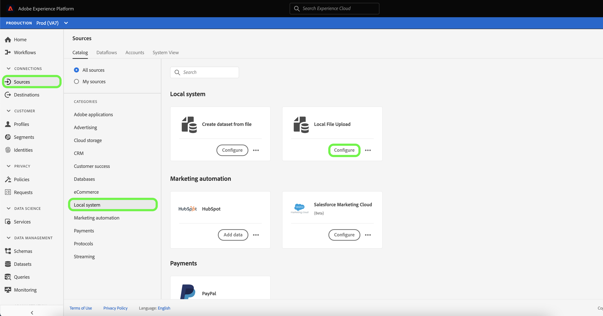
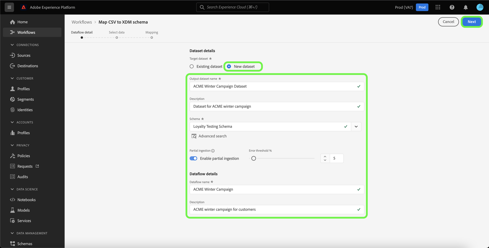
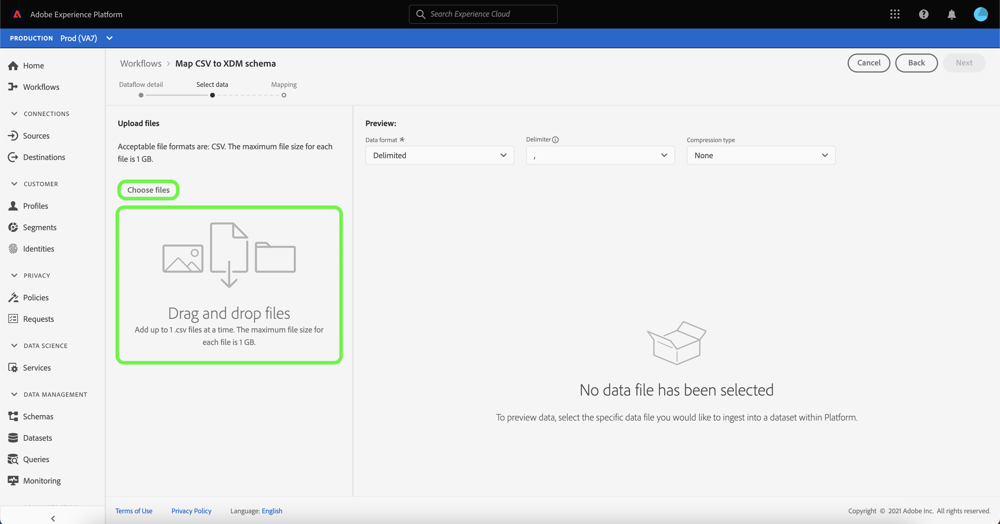
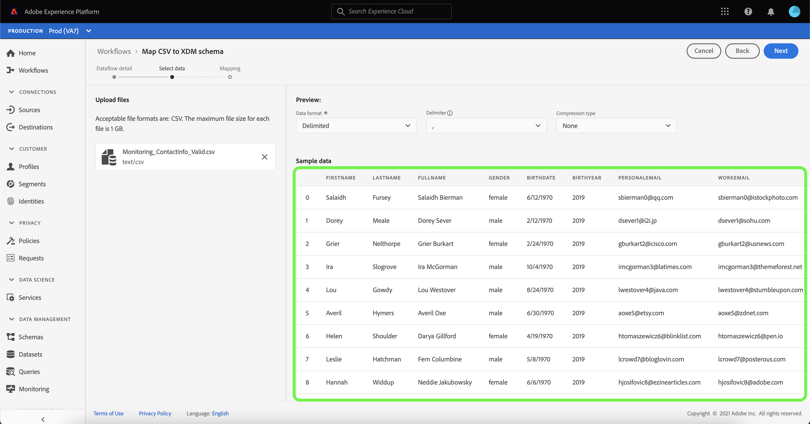
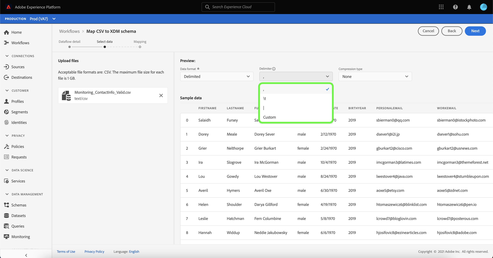
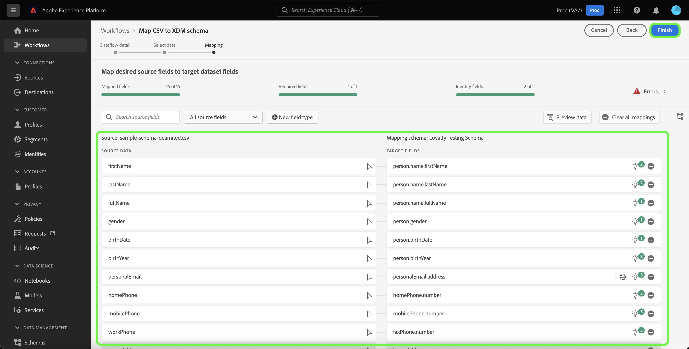

# Create a local file upload source connector in the UI

This tutorial provides steps for creating a local file upload source connector to ingest local files to Platform using the user interface.

## Getting started

This tutorial requires a working understanding of the following components of Platform:

* [[!DNL Experience Data Model (XDM)] System](../../../../../xdm/home.md): The standardized framework by which Platform organizes customer experience data.
  * [Basics of schema composition](../../../../../xdm/schema/composition.md): Learn about the basic building blocks of XDM schemas, including key principles and best practices in schema composition.
  * [Schema Editor tutorial](../../../../../xdm/tutorials/create-schema-ui.md): Learn how to create custom schemas using the Schema Editor UI.
* [[!DNL Real-Time Customer Profile]](../../../../../profile/home.md): Provides a unified, real-time consumer profile based on aggregated data from multiple sources.

## Upload local files to Platform

In the Platform UI, select **[!UICONTROL Sources]** from the left navigation bar to access the [!UICONTROL Sources] workspace. The [!UICONTROL Catalog] screen displays a variety of sources for which you can create an account.

You can select the appropriate category from the catalog on the left-hand side of your screen. Alternatively, you can find the specific source you wish to work with using the search option.

Under the [!UICONTROL Local system] category, select **[!UICONTROL Local file upload]**, and then select **[!UICONTROL Add data]**.

### Use an existing dataset

The [!UICONTROL Dataflow detail] page allows you to select whether you want to ingest your CSV data into an existing dataset or a new dataset.

To ingest your CSV data into an existing dataset, select **[!UICONTROL Existing dataset]**. You can either retrieve an existing dataset using the [!UICONTROL Advanced search] option or by scrolling through the list of existing datasets in the dropdown menu.

With a dataset selected, provide a name for your dataflow and an optional description.

During this process, you can also enable [!UICONTROL Error diagnostics] and [!UICONTROL Partial ingestion]. [!UICONTROL Error diagnostics] enables detailed error message generation for any erroneous records that occur in your dataflow, while [!UICONTROL Partial ingestion] allows you to ingest data containing errors, up to a certain threshold that you manually define. See the [partial batch ingestion overview](../../../../../ingestion/batch-ingestion/partial.md) for more information.

### Use a new dataset

To ingest your CSV data into a new dataset, select **[!UICONTROL New dataset]** and then provide an output dataset name and an optional description. Next, select a schema to map to using the [!UICONTROL Advanced search] option or by scrolling through the list of existing schemas in the dropdown menu.

With a schema selected, provide a name for your dataflow and an optional description, and then apply the [!UICONTROL Error diagnostics] and [!UICONTROL Partial ingestion] settings you want for your dataflow. When finished, select **[!UICONTROL Next]**.

### Select data

The [!UICONTROL Select data] step appears, providing you an interface to upload your local files and preview their structure and contents. Select **[!UICONTROL Choose files]** to upload a CSV file from your local system. Alternatively, you can drag and drop the CSV file you want to upload into the [!UICONTROL Drag and drop files] panel.

>[!TIP]
>
>Only CSV files are currently supported by local file upload. The maximum file size for each file is 1 GB.

Once your file is uploaded, the preview interface updates to display the contents and structure of the file.

Depending on your file, you can select a column delimiter such as tabs, commas, pipes, or a custom column delimiter for your source data. Select the **[!UICONTROL Delimiter]** dropdown arrow and then select the appropriate delimiter from the menu.

When finished, select **[!UICONTROL Next]**.

## Mapping

The [!UICONTROL Mapping] step appears, providing you with an interface to map the source fields from your source schema to their appropriate target XDM fields in the target schema.

Based on your needs, you can choose to map fields directly, or use data prep functions to transform source data to derive computed or calculated values. For comprehensive steps on using the mapping interface, see the [Data Prep UI guide](../../../../../data-prep/ui/mapping.md).

Once your mapping sets are ready, select **[!UICONTROL Finish]** and allow for a few moments for the new dataflow to be created.

## Monitor data ingestion

Once your CSV file is mapped and created, you can monitor the data that is being ingested through it using the monitoring dashboard. For more information, see the tutorial on [monitoring sources dataflows in the UI](../../../../../dataflows/ui/monitor-sources.md).

## Next steps

By following this tutorial, you have successfully mapped a flat CSV file to an XDM schema and ingested it into Platform. This data can now be used by downstream [!DNL Platform] services such as [!DNL Real-Time Customer Profile]. See the overview for [[!DNL Real-Time Customer Profile]](../../../../../profile/home.md) for more information.
