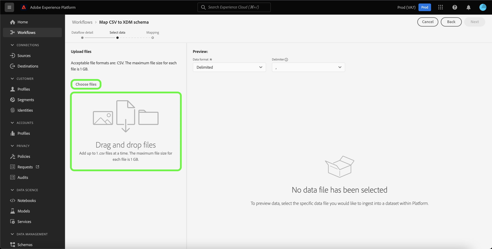
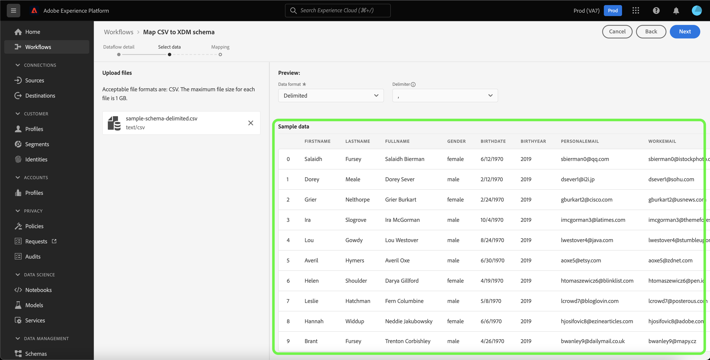
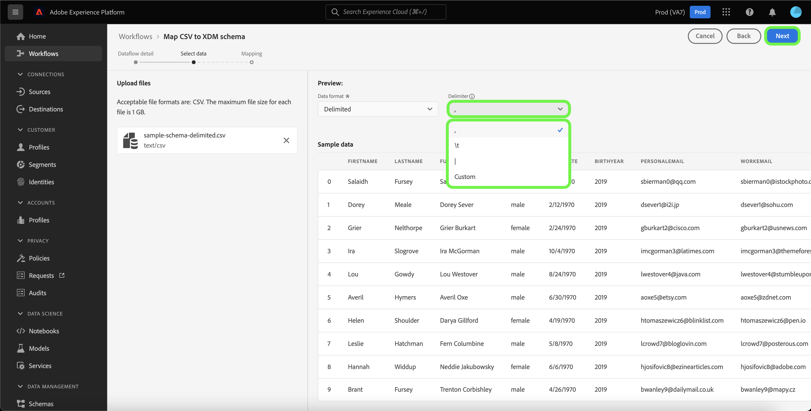

# Create a local file upload source connector in the UI

This tutorial provides steps for creating a local file upload source connector to ingest local files to Platform using the user interface.

## Getting started

This tutorial requires a working understanding of the following components of Platform:

* [[!DNL Experience Data Model (XDM)] System](../../../../../xdm/home.md): The standardized framework by which Platform organizes customer experience data.
  * [Basics of schema composition](../../../../../xdm/schema/composition.md): Learn about the basic building blocks of XDM schemas, including key principles and best practices in schema composition.
  * [Schema Editor tutorial](../../../../../xdm/tutorials/create-schema-ui.md): Learn how to create custom schemas using the Schema Editor UI.
* [[!DNL Real-time Customer Profile]](../../../../../profile/home.md): Provides a unified, real-time consumer profile based on aggregated data from multiple sources.

## Upload local files to Platform

In the Platform UI, select **[!UICONTROL Sources]** from the left navigation bar to access the [!UICONTROL Sources] workspace. The [!UICONTROL Catalog] screen displays a variety of sources for which you can create an account.

You can select the appropriate category from the catalog on the left-hand side of your screen. Alternatively, you can find the specific source you wish to work with using the search option.

Under the [!UICONTROL Local system] category, select **[!UICONTROL Local file upload]**, and then select **[!UICONTROL Add data]**.

### Use an existing dataset

The [!UICONTROL Dataflow detail] page allows you to select whether you want to ingest your CSV data into an existing dataset or a new dataset.

To ingest your CSV data into an existing dataset, select **[!UICONTROL Existing dataset]**. You can either retrieve an existing dataset using the [!UICONTROL Advanced search] option or by scrolling through the list of existing datasets in the dropdown menu.

With a dataset selected, provide a name for your dataflow and an optional description.

During this process, you can also enable [!UICONTROL Error diagnostics] and [!UICONTROL Partial ingestion]. [!UICONTROL Error diagnostics] enables detailed error message generation for any erroneous records that occur in your dataflow, while [!UICONTROL Partial ingestion] allows you to ingest data containing errors, up to a certain threshold that you manually define. See the [partial batch ingestion overview](../../../../../ingestion/batch-ingestion/partial.md) for more information.

### Use a new dataset

To ingest your CSV data into a new dataset, select **[!UICONTROL New dataset]** and then provide an output dataset name and an optional description. Next, select a schema to map to using the [!UICONTROL Advanced search] option or by scrolling through the list of existing schemas in the dropdown menu.

With a schema selected, provide a name for your dataflow and an optional description, and then apply the [!UICONTROL Error diagnostics] and [!UICONTROL Partial ingestion] settings you want for your dataflow. When finished, select **[!UICONTROL Next]**.

### Select data

The [!UICONTROL Select data] step appears, providing you an interface to upload your local files and preview their structure and contents. Select **[!UICONTROL Choose files]** to upload a CSV file from your local system. Alternatively, you can drag and drop the CSV file you want to upload into the [!UICONTROL Drag and drop files] panel.

>[!TIP]
>
>Only CSV files are currently supported by local file upload. The maximum file size for each file is 1 GB.

Once your file is uploaded, the preview interface updates to display the contents and structure of the file.

Depending on your file, you can select a column delimiter such as tabs, commas, pipes, or a custom column delimiter for your source data. Select the **[!UICONTROL Delimiter]** dropdown arrow and then select the appropriate delimiter from the menu.

When finished, select **[!UICONTROL Next]**.

## Mapping

The [!UICONTROL Mapping] step appears, providing you with an interface to map the source fields from your source schema to their appropriate target XDM fields in the target schema.

### Top panel

Select **[!UICONTROL Preview data]** to see mapping results of up to 100 rows of sample data from the selected dataset.

During the preview, the identity column is prioritized as the first field, as it is the key information necessary when validating mapping results. When finished, select **[!UICONTROL Close]**.

#### Add calculated field

Calculated fields allow for values to be created based on the attributes in the input schema. These values can then be assigned to attributes in the target schema and be provided a name and description to allow for easier reference.

Select the **[!UICONTROL Add calculated field]** button to proceed.

The [!UICONTROL Create calculated field] panel appears. The left dialog box contains the fields, functions, and operators supported in calculated fields. Select one of the tabs to start adding functions, fields, or operators to the expression editor.

| Tab | Description |
| --------- | ----------- |
| Function | The functions tab lists the functions available to transform the data. To learn more about the functions you can use within calculated fields, please read the guide on [using Data Prep (Mapper) functions](../../../../../data-prep/functions.md). |
| Field | The fields tab lists fields and attributes available in the source schema. |
| Operator | The operators tab lists the operators that are available to transform the data. |

Select the expression editor to manually add fields, functions, and operators. Once you have created a calculated field, select **[!UICONTROL Save]** to proceed.

#### Filter source schema mapping tree

To filter through your source schema, select **[!UICONTROL All source fields]** and then select the specific field that you want to map from the dropdown menu.

The following table displays the sorting options for your source schema tree:

| Source fields | Description |
| --- | --- |
| [!UICONTROL All source fields] | This option displays all of the source fields of your source  schema. This option is displayed by default. |
| [!UICONTROL Required fields] | This option filters the source schema to only display the fields required to complete the mapping. |
| [!UICONTROL Identity fields] | This option filters the source schema to only display the fields marked for Identity. |
| [!UICONTROL Mapped fields] | This option filters the source schema to only display the fields that have already been mapped. |
| [!UICONTROL Unmapped fields] | This option filters the source schema to only display the fields that have yet to be mapped. |
| [!UICONTROL Fields with recommendation] | This option filters the source schema to only display the fields that contain mapping recommendations. |

#### Intelligent recommendations

Platform automatically provides intelligent recommendations for auto-mapped fields based on the target schema or dataset that you selected. You can manually adjust mapping rules to suit your use cases.

To accept all the auto-generating mapping values, select **[!UICONTROL Accept all target fields]**.

Sometimes, more than one recommendation is available for the source schema. When this happens, the mapping card displays the most prominent recommendation, followed by a blue circle that contains the number of additional recommendations available. Selecting the light bulb icon will show a list of the additional recommendations. You can choose one of the alternate recommendations by selecting the checkbox next to the recommendation you want to map to instead.

Alternatively, you can choose to manually map your source schema to your target schema. To do this, hover over the source schema you want to map, then select the plus (`+`) icon.

The **[!UICONTROL Map source to target field]** popover appears. From here, you can select which field you want to be mapped, followed by **[!UICONTROL Save]** to add your new mapping.

When finished, select **[!UICONTROL Finished]**.

## Monitor data ingestion

Once your CSV file is mapped and created, you can monitor the data that is being ingested through it using the monitoring dashboard. For more information, see the tutorial on [monitoring sources dataflows in the UI](../../../../../dataflows/ui/monitor-sources.md).

## Next steps

By following this tutorial, you have successfully mapped a flat CSV file to an XDM schema and ingested it into Platform. This data can now be used by downstream [!DNL Platform] services such as [!DNL Real-time Customer Profile]. See the overview for [[!DNL Real-time Customer Profile]](../../../../../profile/home.md) for more information.
