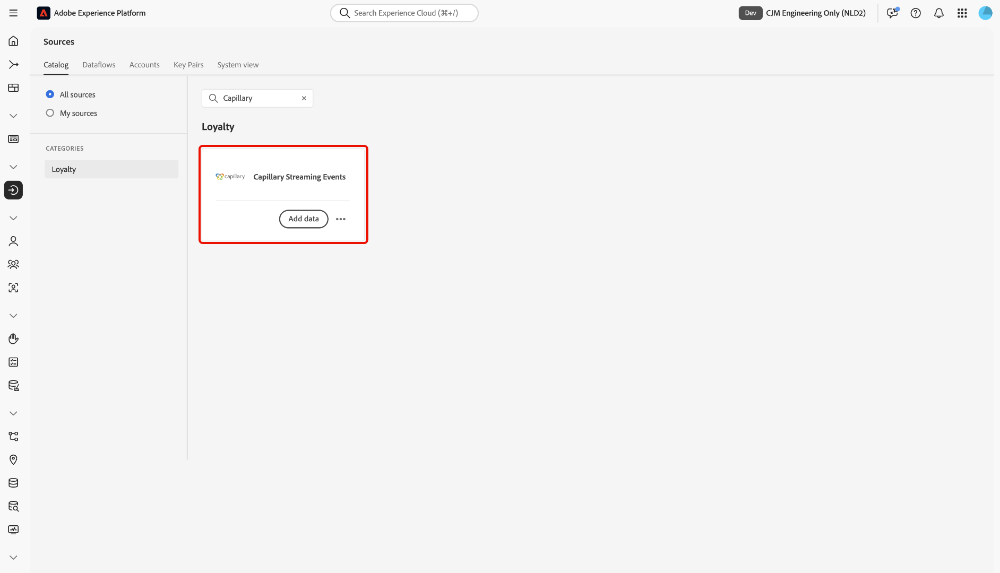
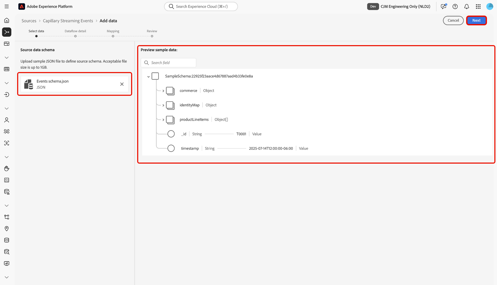
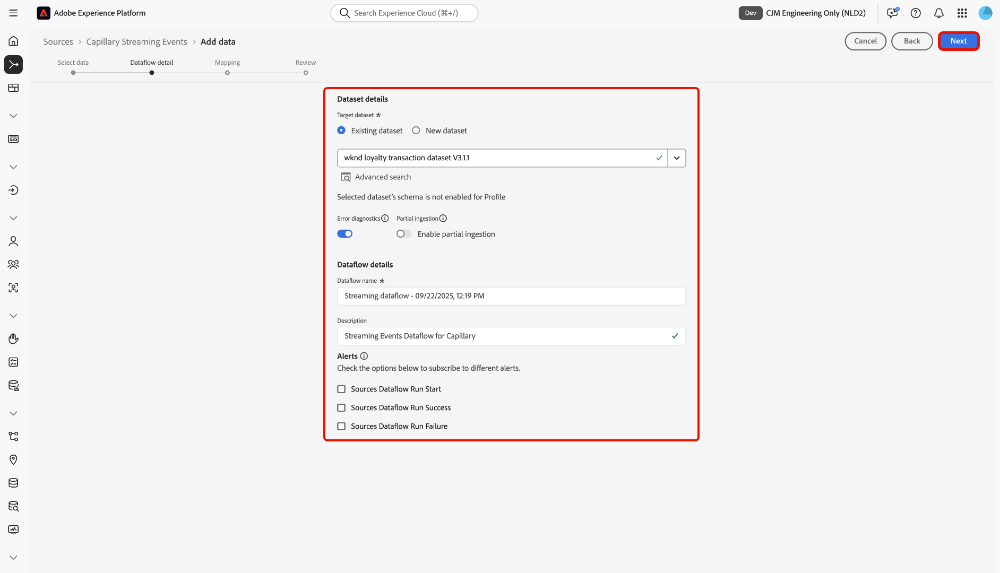
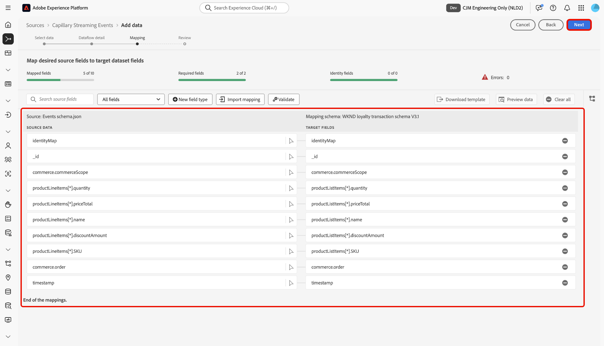
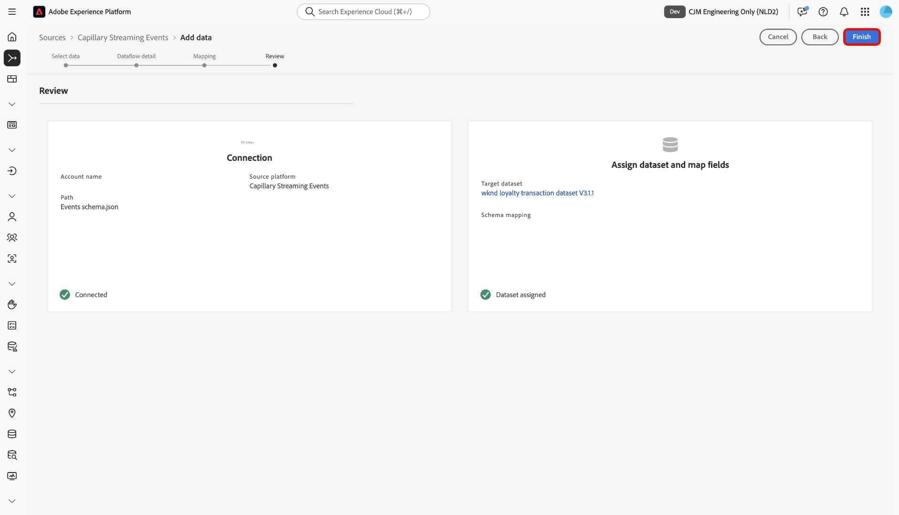
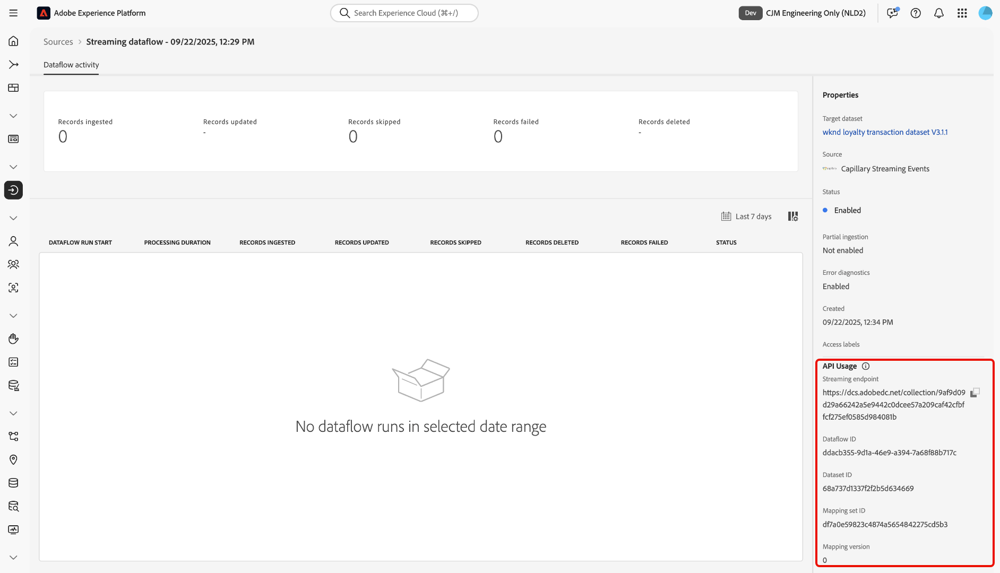

# Connect [!DNL Capillary] to Experience Platform using the UI

Read this guide to learn how to connect your [!DNL Capillary] database to Adobe Experience Platform using the sources workspace in the Experience Platform user interface.

## Getting started

This tutorial requires a working understanding of the following components of Experience Platform:

* [[!DNL Experience Data Model (XDM)] System](../../../../../xdm/home.md): The standardized framework by which Experience Platform organizes customer experience data.
  * [Basics of schema composition](../../../../../xdm/schema/composition.md): Learn about the basic building blocks of XDM schemas, including key principles and best practices in schema composition.
  * [Schema Editor tutorial](../../../../../xdm/tutorials/create-schema-ui.md): Learn how to create custom schemas using the Schema Editor UI.
* [[!DNL Real-Time Customer Profile]](../../../../../profile/home.md): Provides a unified, real-time consumer profile based on aggregated data from multiple sources.

## Navigate the sources catalog

In the Experience Platform UI, select **[!UICONTROL Sources]** from the left navigation to access the *[!UICONTROL Sources]* workspace. Select the appropriate category in the *[!UICONTROL Categories]* panel Alternatively, use the search bar to navigate to the specific source that you want to use.

To use [!DNL Capillary], select the **[!UICONTROL Capillary Streaming Events]** source card under *[!UICONTROL Loyalty]* and then select **[!UICONTROL Add data]**.

>[!TIP]
>
>Sources in the sources catalog display the **[!UICONTROL Set up]** option when a given source does not yet have an authenticated account. Once an authenticated account is created, this option changes to **[!UICONTROL Add data]**.

## Select data

Next, use the *[!UICONTROL Select data]* interface to upload a sample JSON file to define your source schema. During this step, you can use the preview interface to view the file structure of the payload. When finished, select **[!UICONTROL Next]**.

## Dataflow details

Next, you must provide information regarding your dataset and your dataflow.

### Dataset details

A dataset is a storage and management construct for a collection of data, typically a table, that contains a schema (columns) and fields (rows). Data that is successfully ingested into Experience Platform is persisted within the data lake as datasets. 

During this step, you can either use an existing dataset or create a new dataset.

>[!NOTE]
>
>Regardless of whether you use an existing dataset or create a new dataset, you must ensure that your dataset is **enabled for Profile** ingestion.

+++Select for steps to enable Profile ingestion, error diagnostics, and partial ingestion.

If your dataset is enabled for Real-Time Customer Profile, then during this step, you can toggle **[!UICONTROL Profile dataset]** to enable your data for Profile-ingestion. You can also use this step to enable **[!UICONTROL Error diagnostics]** and **[!UICONTROL Partial ingestion]**.

* **[!UICONTROL Error diagnostics]**: Select **[!UICONTROL Error diagnostics]** to instruct the source to produce error diagnostics that you can later reference when monitoring your dataset activity and dataflow status.
* **[!UICONTROL Partial ingestion]**: Partial batch ingestion is the ability to ingest data containing errors, up to a certain configurable threshold. This feature allows you to successfully ingest all of your accurate data into Experience Platform, while all of your incorrect data is batched separately with information on why it is invalid.

+++
 
### Dataflow details

Once your dataset is configured, you must then provide details on your dataflow, including a name, an optional description, and alert configurations.

| Dataflow configurations | Description |
| --- | --- |
| Dataflow name | The name of the dataflow.  By default, this will use the name of the file that is being imported. |
| Description | (Optional) A brief description of your dataflow. |
| Alerts | Experience Platform can produce event-based alerts which users can subscribe to, these options all a running dataflow to trigger these.  For more information, read the [alerts overview](../../alerts.md) <ul><li>**Sources Dataflow Run Start**: Select this alert to receive a notification when your dataflow run begins.</li><li>**Sources Dataflow Run Success**: Select this alert to receive a notification if your dataflow ends without any errors.</li><li>**Sources Dataflow Run Failure**: Select this alert to receive a notification if your dataflow run ends with any errors.</li></ul> |

{style="table-layout:auto"}

## Mapping

Use the mapping interface to map your source data to the appropriate schema fields before ingesting data to Experience Platform.  For more information, read the [mapping guide in the UI](../../../../../data-prep/ui/mapping.md).

## Review

The *[!UICONTROL Review]* step appears, allowing you to review the details of your dataflow before it is created. Details are group within the following categories:

* **[!UICONTROL Connection]**: Shows the account name, source platform, and the source name.
* **[!UICONTROL Assign dataset and map fields]**: Shows the target dataset and the schema that the dataset adheres to.

After confirming the details are correct, select **[!UICONTROL Finish]**.

## Retrieve the streaming endpoint URL

With the connection created, the sources detail page appears. This page shows details of your newly created connection, including previously run dataflows, ID, and streaming endpoint URL.

