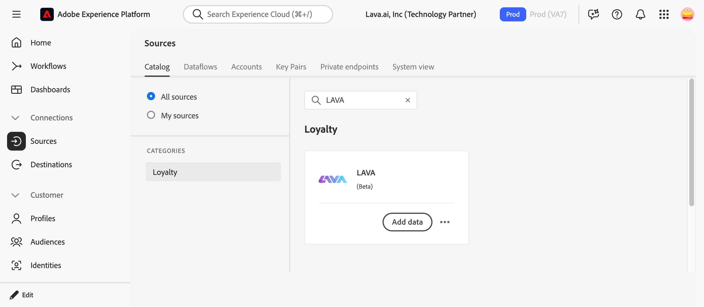
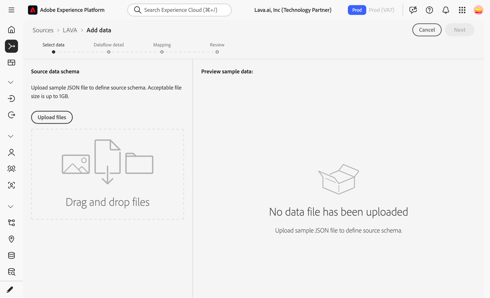
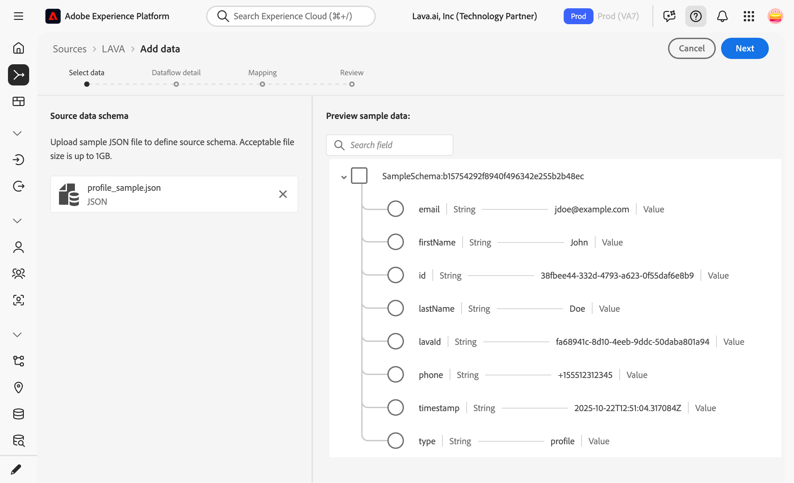
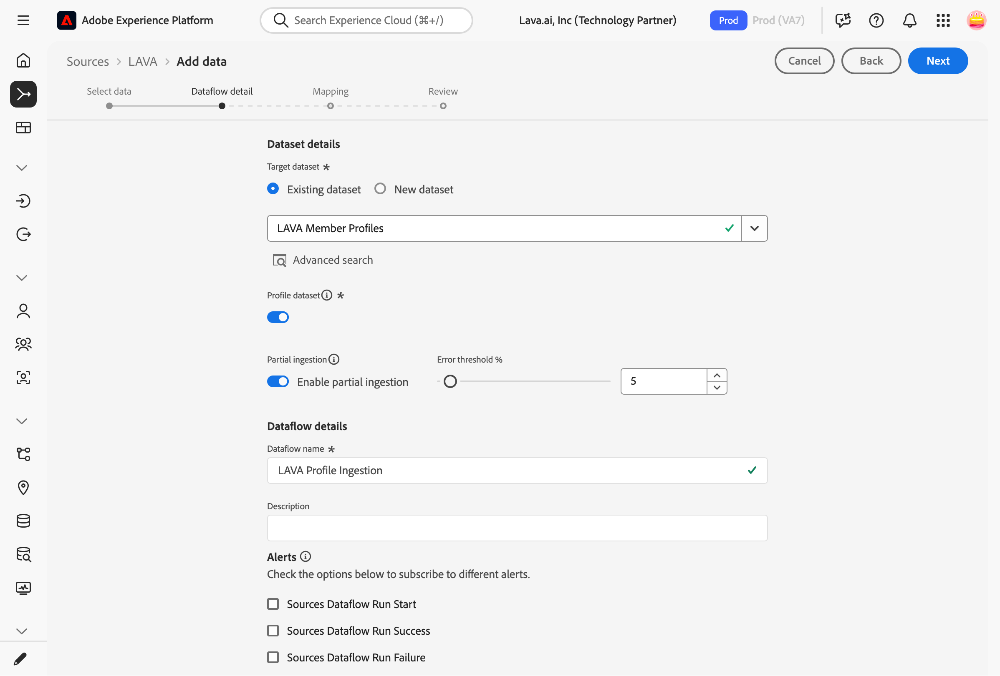
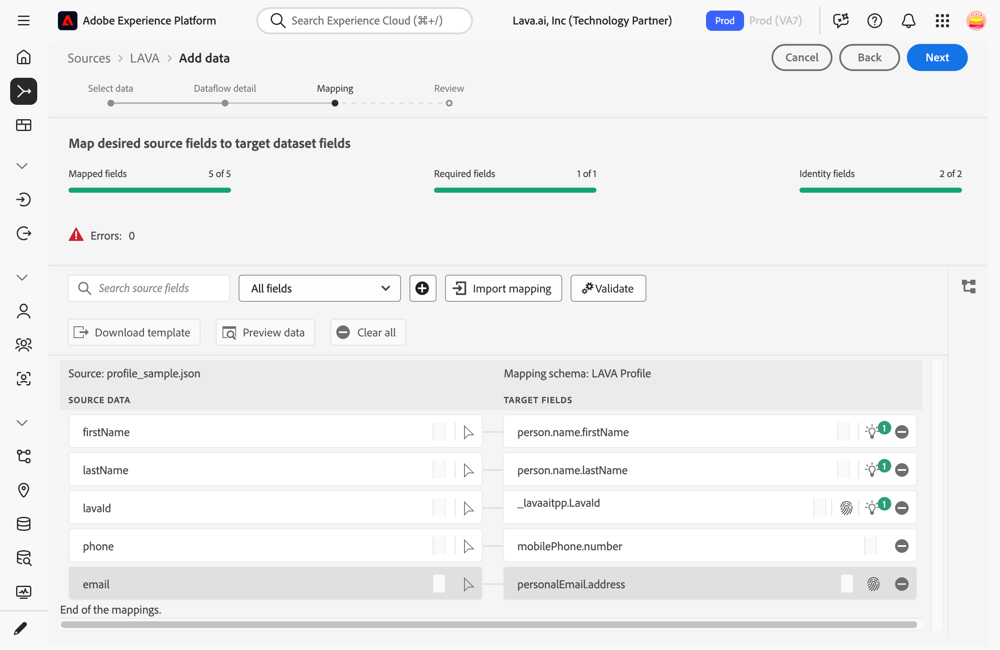
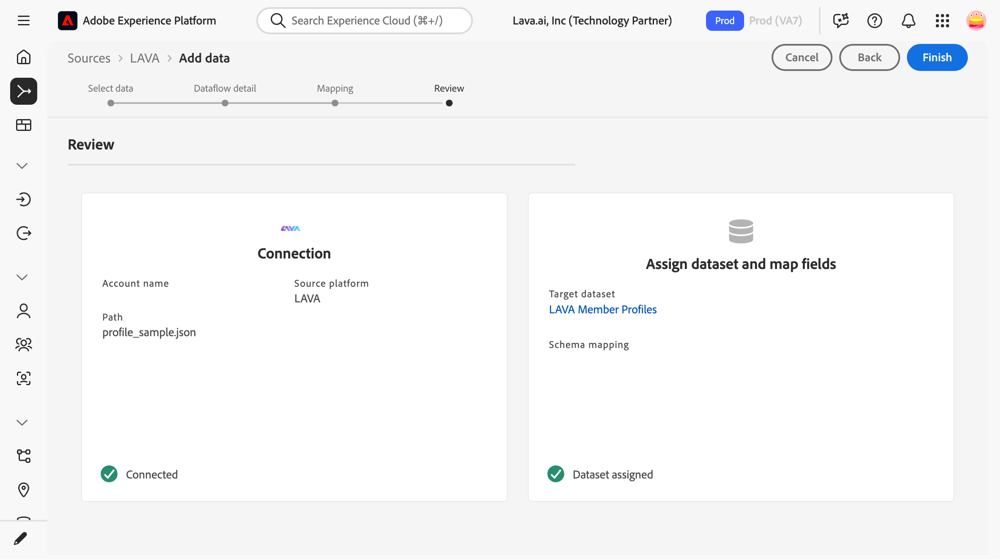
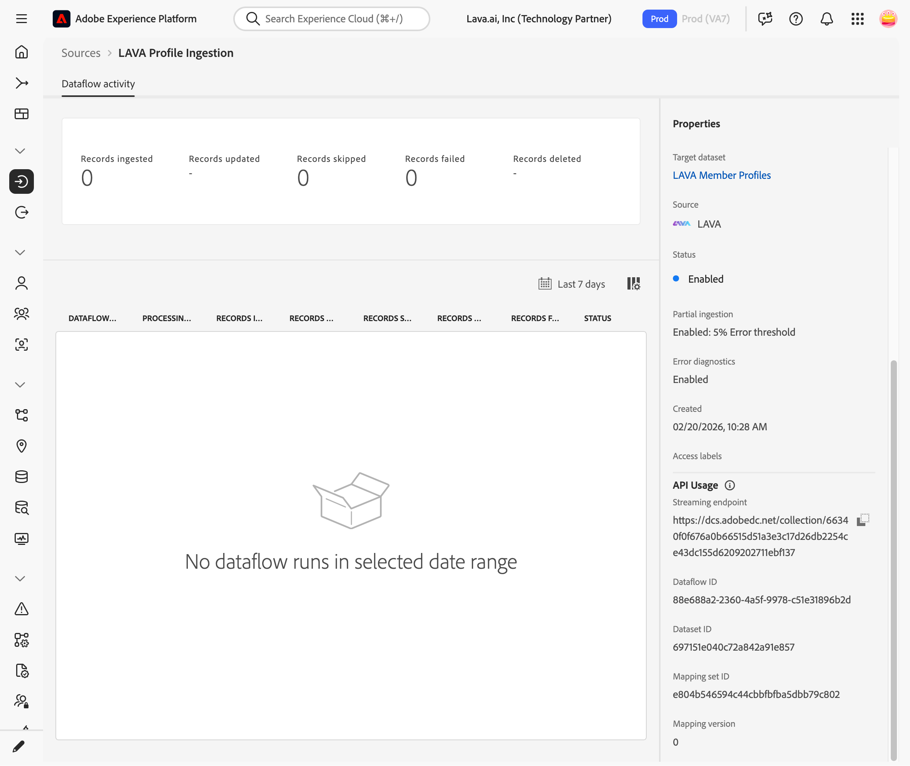
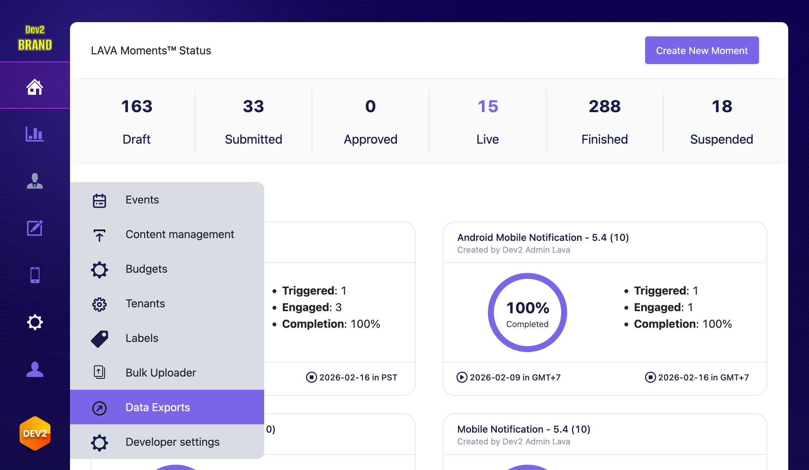
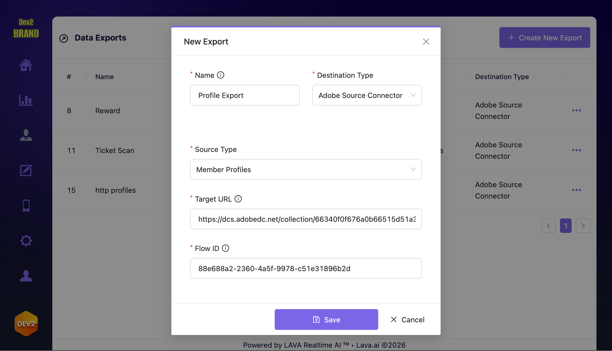

# Create a source connection and dataflow to stream [!DNL LAVA] data using the UI

This tutorial provides steps for creating a [!DNL LAVA.ai] source connector using the Platform user interface.

## Overview

[LAVA](https://lava.ai/) is a customer engagement platform. [!DNL LAVA] integrates with your ticketing, point of sales, mobile app and other touch points and creates moments that matter with our automation, loyalty and mobile pass solutions. 

>[!IMPORTANT]
>
>This documentation page was created by the [!DNL LAVA] team. For any inquiries or update requests, please contact them directly at info@lava.ai.

The [!DNL LAVA] Source Connector can be used for several different sets of profile data and events. You can decide which are relevant for you. For each type of data you would like to stream from [!DNL LAVA] to Adobe repeat the "Connect your LAVA account" steps.


### Member Profiles

The member profile lists key profile attributes LAVA stores on a member. By using `email` as an identity field, [!DNL Adobe Real-time Customer Profiles] can stitch [!DNL LAVA] records with other Adobe profiles.

| [!DNL LAVA] Source Connector Field | Sample Value                         | Description                                     |
| ---------------------------------- | ------------------------------------ | ----------------------------------------------- |
| `lavaId`                           | c448e091-af0f-4eab-98ff-2c758c149051 | The [!DNL LAVA] ID for the user.                |
| `firstName`                        | John                                 | The user's first name.                          |
| `lastName`                         | Doe                                  | The user's last name.                           |
| `email`                            | jdoe@example.com                     | The user's email address.                       |
| `phone`                            | +12223334444                         | The user's phone number.                        |
| `type`                             | profile                              | An indicator for what type of record this is.   |
| `id`                               | c448e091-af0f-4eab-98ff-2c758c149051 | A unique ID for the the record.                 |
| `timestamp`                        | 2025-10-22T12:51:04.317084Z          | When this the profile had these attributes set. |

[Sample data file download](lava_profile_sample.json).

### Member Balances

The member balance source lists balances of rewards your members have. `balances` is an array. When using these in audiences, content personalization, conditions and other such locations, you will often have to either select out one particular entry, repeat something for all entries, or aggregate across several entries.

| [!DNL LAVA] Source Connector Field | Sample Value                         | Description                                                                                                                                                                                                                                                                                            |
| ---------------------------------- | ------------------------------------ | ------------------------------------------------------------------------------------------------------------------------------------------------------------------------------------------------------------------------------------------------------------------------------------------------------ |
| `lavaId`                           | c448e091-af0f-4eab-98ff-2c758c149051 | The [!DNL LAVA] ID for the user.                                                                                                                                                                                                                                                                       |
| `balances[]`                       |                                      | List of reward balances in LAVA. A balance is an instance of a reward with a specific expiration. If a member has some amount of reward expiring on date A and some amount of the same reward expiring on date B, they will be recorded as separate balances. See balanceSummaries for an aggregation. |
| `balances[].amount`                | 500                                  | The amount of reward items in this balance. For stored value, this is in the lowest unit of denomination (cents).                                                                                                                                                                                      |
| `balances[].expiresAt`             | 2025-10-22T12:51:04.317084Z          | When this balance expires.                                                                                                                                                                                                                                                                             |
| `balances[].rewardId`              | 123                                  | The ID for a [!DNL LAVA] reward. This never changes for a given reward.                                                                                                                                                                                                                                |
| `balances[].rewardName`            | F&B Credit                           | The name for the reward configured in the [!DNL LAVA] Moment Activation Console. This can be changed.                                                                                                                                                                                                  |
| `balances[].rewardSlug`            | Credit                               | The primary slug for the reward configured in the [!DNL LAVA] Moment Activation Console. This can be changed.                                                                                                                                                                                          |
| `balances[].rewardType`            | stored                               | The type of reward (access, offer, points, stored or voucher)                                                                                                                                                                                                                                          |
| `type`                             | rewards                              | An indicator for what type of record this is.                                                                                                                                                                                                                                                          |
| `id`                               | 8fefe232-0375-4d56-a24c-d009e9d351e8 | A unique ID for the the record.                                                                                                                                                                                                                                                                        |
| `timestamp`                        | 2025-10-22T12:51:04.317084Z          | When this data was recorded.                                                                                                                                                                                                                                                                           |

[Sample data file download](lava_balance_sample.json).

### Ticket Scan Events

| [!DNL LAVA] Source Connector Field | Sample Value                         | Description                                                     |
| ---------------------------------- | ------------------------------------ | --------------------------------------------------------------- |
| `lavaId`                           | aff0ee5f-da62-4054-8cdb-076f5b60bfc3 | The [!DNL LAVA] ID for the user who scanned the ticket.         |
| `eventId`                          | 1234                                 | Identifier for an event provided by a ticketing service.        |
| `eventName`                        | GRE1234A                             | The event name provided by the ticketing service.               |
| `eventLabel`                       | Green Vs Blue                        | Description of an event as provided by the ticketing provider.  |
| `venue`                            | ABC                                  | Venue code used by the ticketing provider.                      |
| `venueLabel`                       | ABC Stadium                          | Description of the venue as provided by the ticketing provider. |
| `section`                          | GA4                                  | Seating section on the scanned ticket.                          |
| `sectionLabel`                     | General                              | A label for the section provided by the ticketing provider.     |
| `row`                              | GA3                                  | Row on the scanned ticket.                                      |
| `seat`                             | 13                                   | Seat on the scanned ticket.                                     |
| `gate`                             | TEAM ST1                             | gate on the scanned ticket.                                     |
| `gateLabel`                        | General                              | A label for the gate provided by the ticket provider.           |
| `type`                             | event-ticketscan                     | An indicator for what type of record this is.                   |
| `id`                               | 1234567/GRE1234A/GA4/GA3/13/0        | A unique ID for the ticket scan event.                          |
| `timestamp`                        | 2025-11-03T01:41:00Z                 | When the ticket scan occurred.                                  |

[Sample data file download](lava_ticketscan_sample.json).

## Prerequisites

To use this source connector you must:

* Be an existing [!DNL LAVA] customer with Adobe export entitlement.
* Have an account on the [LAVA Console](https://app.lava.ai/) with "[!UICONTROL Administrator]" or "[!UICONTROL Export Manager]" role.
* (Recommended) Have sandbox manager permission in Adobe Experience Cloud.

## (Recommended) Load the [!DNL LAVA] package

[!DNL LAVA] provides a package that includes our recommended field groups, schemas, identity namespace and datasets for using [!DNL LAVA] in Adobe Experience Platform. Using these is not required.

To load these packages, in the Platform UI, select **[!UICONTROL Sandboxes]** from the left navigation bar to access the [!UICONTROL Sandboxes] workspace. The [!UICONTROL Packages] screen displays available packages. Click [!UICONTROL Create package] and [!UICONTROL Paste package payload] and paste in

```json
{
  "imsOrgId": "1EF71E43679AAD1E0A495C77@AdobeOrg",
  "packageId": "416a0c2a32794092aa1a957cbe9a6698"
}
```

Once the package is created, select it and click [!UICONTROL Import Package].

## Connect your [!DNL LAVA] account

In the Platform UI, select **[!UICONTROL Sources]** from the left navigation bar to access the [!UICONTROL Sources] workspace. The [!UICONTROL Catalog] screen displays a variety of sources with which you can create an account.

You can select the appropriate category from the catalog on the left-hand side of your screen. Alternatively, you can find the specific source you wish to work with using the search option.

Under the **Streaming** category, select [!DNL LAVA], and then select **[!UICONTROL Add data]**.

>[!TIP]
>
>The screenshots used below are examples. When creating your documentation, please replace the images with screenshots of your actual source. You can use the same mark up pattern and color, as well as the same file names. Please ensure that your screenshot captures the entire Platform UI screen. For information on how to upload your screenshots, see the guide on [submitting your documentation for review](../documentation/github.md).



## Select data

The **[!UICONTROL Select data]** step appears, providing an interface for you to select the data that you bring to Platform.

* The left part of the interface is a browser that allows you to view the available data streams within your account;
* The right part of the interface lets you preview up to 100 rows of data from a JSON file.

Select **[!UICONTROL Upload files]** to upload a JSON file from your local system, upload the sample file from the Overview section corresponding to the data set you are setting up. Alternatively, you can drag and drop the JSON file you want to upload into the [!UICONTROL Drag and drop files] panel.



Once your file uploads, the preview interface updates to display a preview of the schema you uploaded. The preview interface allows you to inspect the contents and structure of a file. You can also use the [!UICONTROL Search field] utility to access specific items from within your schema.

When finished, select **[!UICONTROL Next]**.



## Dataflow detail

The **Dataflow detail** step appears, providing you with options to use an existing dataset or establish a new dataset for your dataflow, as well as an opportunity to provide a name and description for your dataflow. During this step, you can also configure settings for Profile ingestion, error diagnostics, partial ingestion, and alerts.

When finished, select **[!UICONTROL Next]**.



## Mapping

The [!UICONTROL Mapping] step appears, providing you with an interface to map the source fields from your source schema to their appropriate target XDM fields in the target schema.

If you are using [!DNL LAVA]'s provided schema, we recommended the following mapping:

For member profiles:

| [!DNL LAVA] Source Connector Field | [!DNL LAVA] Profile Schema Field |
| ---------------------------------- | -------------------------------- |
| `lavaId`                           | `_tenant.lavaId`                 |
| `firstName`                        | `person.name.firstName`          |
| `lastName`                         | `person.name.lastName`           |
| `email`                            | `personalEmail.address`          |
| `phone`                            | `mobilePhone.number`             |

For member balances:

| [!DNL LAVA] Source Connector Field | [!DNL LAVA] Profile Schema Field |
| ---------------------------------- | -------------------------------- |
| `lavaId`                           | `_tenant.lavaId`                 |
| `balances[]`                       | `_tenant.balances[]`             |

For ticket scan events:

| [!DNL LAVA] Source Connector Field                                                        | [!DNL LAVA] Event Schema Field    |
| ----------------------------------------------------------------------------------------- | --------------------------------- |
| calculated field `to_map("LavaId",to_array(false,to_object("id",lavaId,"primary",true)))` | `identityMap`                     |
| `eventId`                                                                                 | `_tenant.ticketScan.eventId`      |
| `eventName`                                                                               | `_tenant.ticketScan.eventName`    |
| `eventLabel`                                                                              | `_tenant.ticketScan.eventLabel`   |
| `venue`                                                                                   | `_tenant.ticketScan.venue`        |
| `venueLabel`                                                                              | `_tenant.ticketScan.venueLabel`   |
| `section`                                                                                 | `_tenant.ticketScan.section`      |
| `sectionLabel`                                                                            | `_tenant.ticketScan.sectionLabel` |
| `row`                                                                                     | `_tenant.ticketScan.row`          |
| `seat`                                                                                    | `_tenant.ticketScan.seat`         |
| `gate`                                                                                    | `_tenant.ticketScan.gate`         |
| `gateLabel`                                                                               | `_tenant.ticketScan.gateLabel`    |
| `type`                                                                                    | `eventType`                       |
| `timestamp`                                                                               | `timestamp`                       |


Alternatively, you can manually adjust mapping rules to suit your use cases. Based on your needs, you can choose to map fields directly, or use data prep functions to transform source data to derive computed or calculated values. For comprehensive steps on using the mapper interface and calculated fields, see the [Data Prep UI guide](https://experienceleague.adobe.com/docs/experience-platform/data-prep/ui/mapping.html).

Once your source data is successfully mapped, select **[!UICONTROL Next]**.



## Review

The **[!UICONTROL Review]** step appears, allowing you to review your new dataflow before it is created. Details are grouped within the following categories:

* **[!UICONTROL Connection]**: Shows the source type, the relevant path of the chosen source file, and the amount of columns within that source file.
* **[!UICONTROL Assign dataset & map fields]**: Shows which dataset the source data is being ingested into, including the schema that the dataset adheres to.

Once you have reviewed your dataflow, click **[!UICONTROL Finish]** and allow some time for the dataflow to be created.



## Get your streaming endpoint URL and Dataflow ID

With your streaming dataflow created, you can now retrieve your streaming endpoint URL and Dataflow ID. These will be used to configure [!DNL LAVA], allowing your streaming source to communicate with Experience Platform. 

To retrieve your streaming endpoint, go to the [!UICONTROL Dataflow activity] page of the dataflow that you just created and copy the endpoint from the bottom of the [!UICONTROL Properties] panel.



### Integrate [!DNL LAVA] with your webhook

In the [LAVA Console](https://app.lava.ai/) navigate to **[!UICONTROL Resources > Data Export]**.



Click **[!UICONTROL Create New Export]**. Select **[!UICONTROL Adobe Source Connector]** as the destination type, and the desired source data to send. Use the streaming endpoint URL and dataflow ID.


