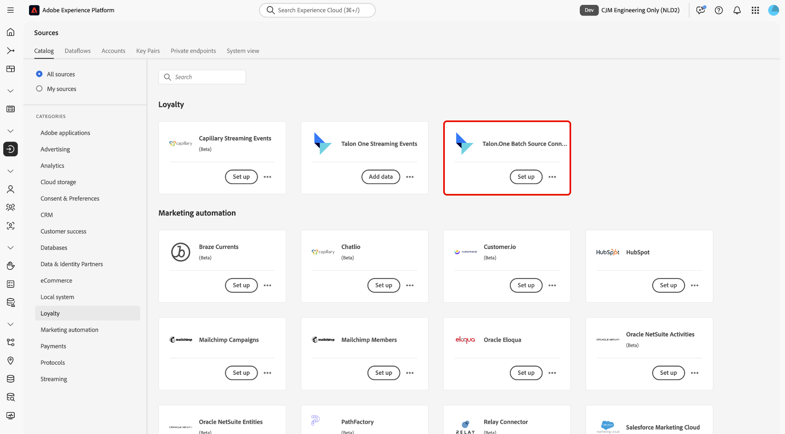
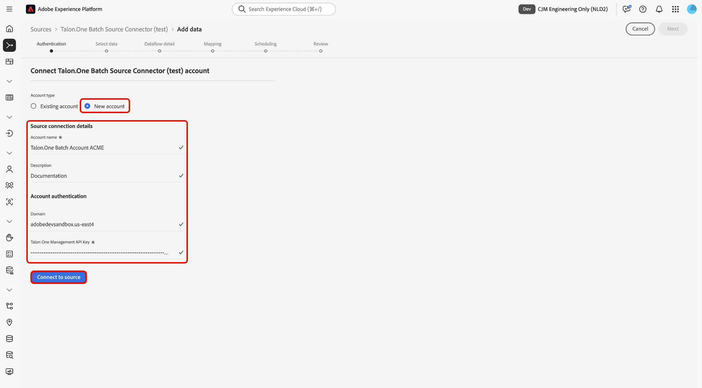
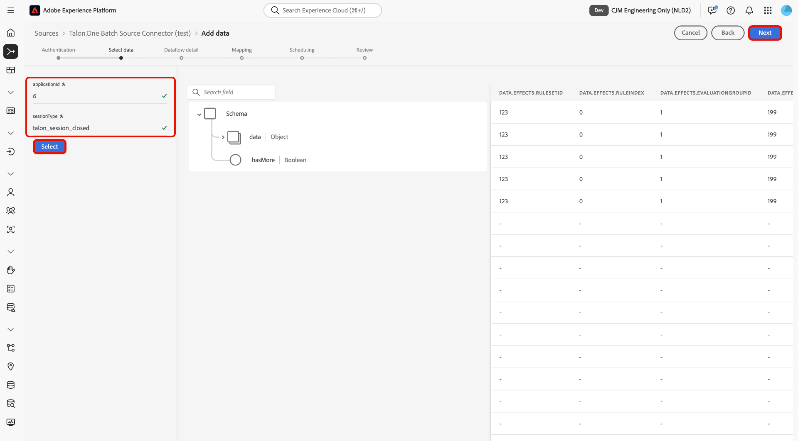
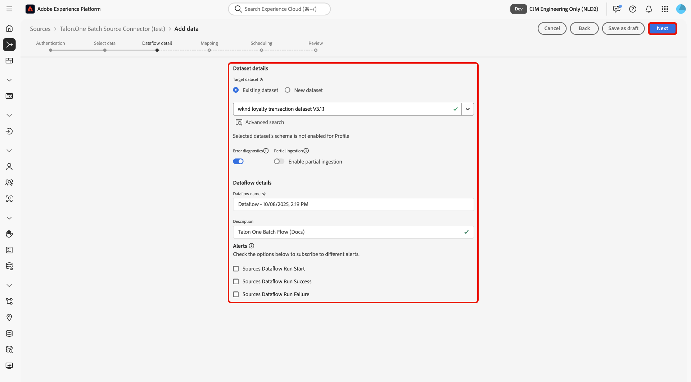
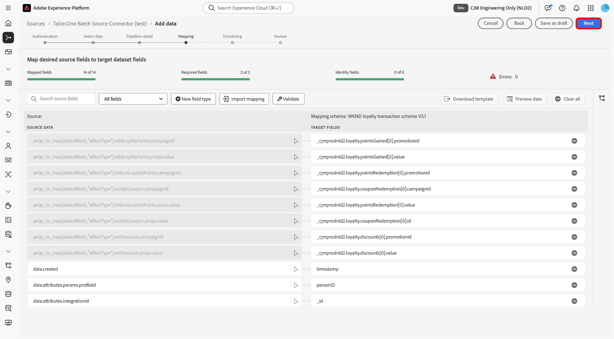
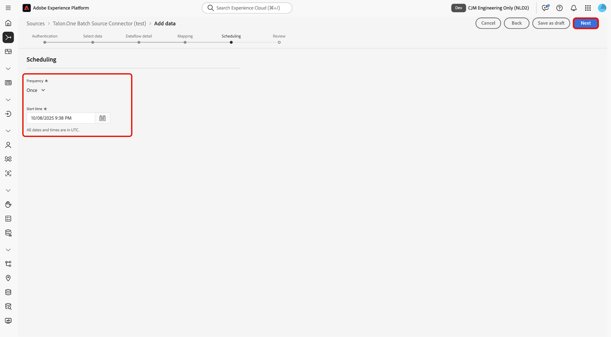
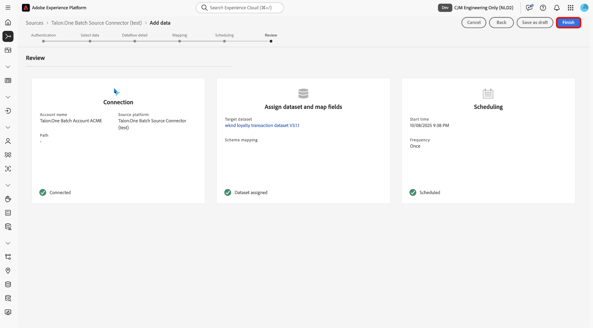

# Ingest batch data from [!DNL Talon.One] into Experience Platform using the UI

>[!AVAILABILITY]
>
>The [!DNL Talon.One] source is in beta. Read the [terms and conditions](../../../../home.md#terms-and-conditions) in the sources overview for more information on using beta-labeled sources.

Read this tutorial to learn how to ingest batch data from your [!DNL Talon.One] account into Adobe Experience Platform using the sources workspace in the UI.

## Getting started

This tutorial requires a working understanding of the following components of Experience Platform:

* [[!DNL Experience Data Model (XDM)] System](../../../../../xdm/home.md): The standardized framework by which Experience Platform organizes customer experience data.
  * [Basics of schema composition](../../../../../xdm/schema/composition.md): Learn about the basic building blocks of XDM schemas, including key principles and best practices in schema composition.
  * [Schema Editor tutorial](../../../../../xdm/tutorials/create-schema-ui.md): Learn how to create custom schemas using the Schema Editor UI.
* [[!DNL Real-Time Customer Profile]](../../../../../profile/home.md): Provides a unified, real-time consumer profile based on aggregated data from multiple sources.

>[!IMPORTANT]
>
>Read the [[!DNL Talon.One] overview](../../../../connectors/loyalty/talon-one.md) to learn about prerequisite steps that you need to complete before connecting your account to Experience Platform.

## Navigate the sources catalog

In the Experience Platform UI, select **[!UICONTROL Sources]** from the left navigation to access the *[!UICONTROL Sources]* workspace. Select the appropriate category in the *[!UICONTROL Categories]* panel. Alternatively, use the search bar to navigate to the specific source that you want to use.

To ingest data from [!DNL Talon.One], select the **[!UICONTROL Talon.One Batch Source Connector]** source card under *[!UICONTROL Loyalty]* and then select **[!UICONTROL Add data]**.

>[!TIP]
>
>Sources in the sources catalog display the **[!UICONTROL Set up]** option when a given source does not yet have an authenticated account. Once an authenticated account is created, this option changes to **[!UICONTROL Add data]**.

### Create a new account

To create a new account for your [!DNL Talon.One] source, select **[!UICONTROL New account]** and provide a name and an optional description for your account. Next, provide your [!DNL Talon.One] domain and your [!UICONTROL Talon.One Management API Key]. When finished, select **[!UICONTROL Connect to source]** and allow for a few moments for your connection to establish.

### Use an existing account

To use an existing account, select **[!UICONTROL Existing account]** and select the [!DNL Talon.One] account that you want to use from the accounts interface.

## Select data

Once you have authenticated, provide values for your **applicationId** and **sessionType**. During this step, you can use the preview functionalities to inspect the structure of your data. When finished, select **[!UICONTROL Next]** to proceed.

## Configure dataset and dataflow details

Next, you must provide information regarding your dataset and your dataflow.

### Dataset details

A dataset is a storage and management construct for a collection of data, typically a table, that contains a schema (columns/fields) and records (rows). Data that is successfully ingested into Experience Platform is persisted within the data lake as datasets. 

During this step, you can either use an existing dataset or create a new dataset.

>[!NOTE]
>
>Regardless of whether you use an existing dataset or create a new dataset, you must ensure that your dataset is **enabled for Profile** ingestion.

+++Select for steps to enable Profile ingestion, error diagnostics, and partial ingestion.

If your dataset is enabled for Real-Time Customer Profile, then during this step, you can toggle **[!UICONTROL Profile dataset]** to enable your data for Profile ingestion. You can also use this step to enable **[!UICONTROL Error diagnostics]** and **[!UICONTROL Partial ingestion]**.

* **[!UICONTROL Error diagnostics]**: Select **[!UICONTROL Error diagnostics]** to instruct the source to produce error diagnostics that you can later reference when monitoring your dataset activity and dataflow status.
* **[!UICONTROL Partial ingestion]**: Partial batch ingestion is the ability to ingest data containing errors, up to a certain configurable threshold. This feature allows you to successfully ingest all of your accurate data into Experience Platform, while all of your incorrect data is batched separately with information on why it is invalid.

+++

## Dataflow details

Once your dataset is configured, you must then provide details on your dataflow, including a name, an optional description, and alert configurations.

| Dataflow configurations | Description |
| --- | --- |
| Dataflow name | The name of the dataflow. By default, this will use the name of the file that is being imported. |
| Description | (Optional) A brief description of your dataflow. |
| Alerts | Experience Platform can produce event-based alerts which users can subscribe to, these options allow a running dataflow to trigger these.  For more information, read the [alerts overview](../../alerts.md) <ul><li>**Sources Dataflow Run Start**: Select this alert to receive a notification when your dataflow run begins.</li><li>**Sources Dataflow Run Success**: Select this alert to receive a notification if your dataflow ends without any errors.</li><li>**Sources Dataflow Run Failure**: Select this alert to receive a notification if your dataflow run ends with any errors.</li></ul> |

{style="table-layout:auto"}

## Mapping

With your dataset and dataflow details configured, you can now proceed to map your source data fields to their appropriate target XDM fields. Use the mapping interface to map your source data to the appropriate schema fields before ingesting data to Experience Platform. For more information, read the [mapping guide in the UI](../../../../../data-prep/ui/mapping.md).

>[!IMPORTANT]
>
>For additional guidance on mapping your [!DNL Talon.One] source data, read the [[!DNL Talon.One] overview](../../../../connectors/loyalty/talon-one.md#mapping).

## Schedule your dataflow ingestion

The [!UICONTROL Scheduling] step appears. Use the interface to configure an ingestion schedule to automatically ingest the selected source data using the configured mappings. By default, scheduling is set to `Once`. To adjust your ingestion frequency, select **[!UICONTROL Frequency]** and then select an option from the dropdown menu.

>[!TIP]
>
>Interval and backfill are not visible during a one-time ingestion.

If you set your ingestion frequency to `Minute`, `Hour`, `Day`, or `Week`, then you must set an interval to establish a set time frame between every ingestion. For example, an ingestion frequency set to `Day` and an interval set to `15` means that your dataflow is scheduled to ingest data every 15 days.

During this step, you can also enable **backfill** and define a column for the incremental ingestion of data. Backfill is used to ingest historical data, while the column you define for incremental ingestion allows new data to be differentiated from existing data.

See the table below for more information on scheduling configurations.

| Scheduling configuration | Description |
| --- | --- |
| Frequency | Configure frequency to indicate how often the dataflow should run. You can set your frequency to: <ul><li>**Once**: Set your frequency to `once` to create a one-time ingestion. Configurations for interval and backfill are unavailable when creating a one-time ingestion dataflow. By default, the scheduling frequency is set to once.</li><li>**Minute**: Set your frequency to `minute` to schedule your dataflow to ingest data on a per-minute basis.</li><li>**Hour**: Set your frequency to `hour` to schedule your dataflow to ingest data on a per-hour basis.</li><li>**Day**: Set your frequency to `day` to schedule your dataflow to ingest data on a per-day basis.</li><li>**Week**: Set your frequency to `week` to schedule your dataflow to ingest data on a per-week basis.</li></ul> |
| Interval |  Once you select a frequency, you can then configure the interval setting to establish the time frame between every ingestion. For example, if you set your frequency to day and configure the interval to 15, then your dataflow will run every 15 days. You cannot set the interval to zero. The minimum accepted interval value for each frequency is as follows:<ul><li>**Once**: n/a</li><li>**Minute**: 15</li><li>**Hour**: 1</li><li>**Day**: 1</li><li>**Week**: 1</li></ul> |
| Start Time | The timestamp for the projected run, presented in UTC time zone. |
| Backfill | Backfill determines what data is initially ingested. If backfill is enabled, all current files in the specified path will be ingested during the first scheduled ingestion. If backfill is disabled, only the files that are loaded in between the first run of ingestion and the start time will be ingested. Files loaded prior to the start time will not be ingested. |

## Review

The *[!UICONTROL Review]* step appears, allowing you to review the details of your dataflow before it is created. Details are grouped within the following categories:

* **[!UICONTROL Connection]**: Shows the account name, source platform, and the source name.
* **[!UICONTROL Assign dataset and map fields]**: Shows the target dataset and the schema that the dataset adheres to.

After confirming the details are correct, select **[!UICONTROL Finish]**.

## Monitor your dataflow

Once your dataflow has been created, you can monitor the data that is being ingested through it to see information on ingestion rates, success, and errors. For more information on how to monitor dataflow, see the tutorial on [monitoring accounts and dataflows in the UI](../../../../../dataflows/ui/monitor-sources.md).

## Known limitations

When mapping data from [!DNL Talon.One]'s schema to Adobe Experience Platform, it is currently not possible to capture multiple effects of the same type within a single transaction. For example, if a transaction includes multiple `setDiscount` effects (such as discounts from different campaigns), only one of those effects will be retained during mapping, and the others will be overwritten.
